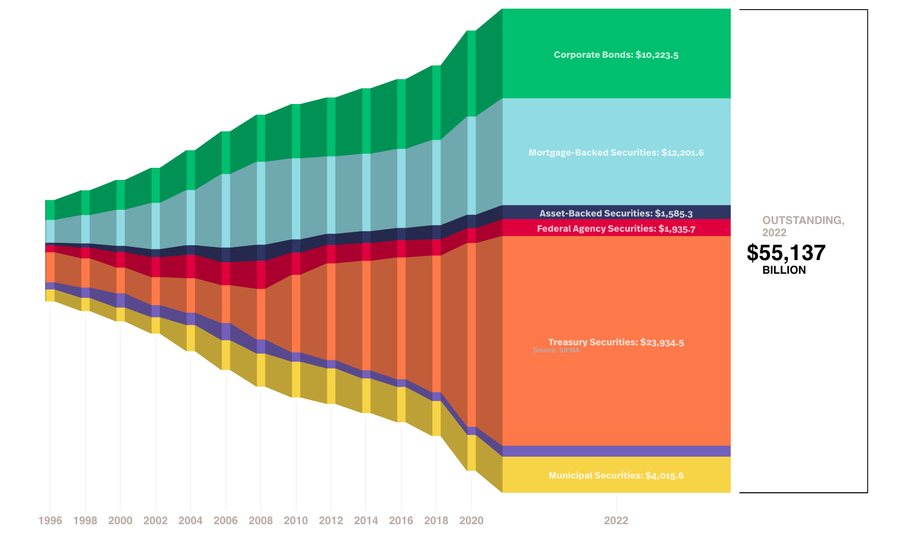

# Introduction to Fixed Income Securities

## What are fixed income securities?

Fixed income securities are financial instruments that provide a **fixed, or predictable, stream of income** to investors. These securities typically take the form of [bonds](https://en.wikipedia.org/wiki/Bond_(finance)), but also include other investment types like [certificates of deposit](https://en.wikipedia.org/wiki/Certificate_of_deposit) and [preferred shares](https://en.wikipedia.org/wiki/Preferred_stock).

Fixed income securities are essentially **loans** made by an investor to an _issuer_. In exchange for the loan, the issuer agrees to pay the investor a specified rate of interest during the life of the bond and to repay the principal when it "matures," or comes due.

!!! example "Types of fixed income securities"

    By the type of issuer, there are

    === "Government bonds"

        !!! info inline end "Risk-free rate"

            When we talk about "risk-free rate", we largely refer to the [yield](../bond-prices-and-yields) of such government bonds.

        Governments issue bonds to borrow money. These bonds are considered among the **safest investments**, as they are backed by the taxing power of the government.

    === "Corporate bonds"

        Companies also issue bonds to finance their operations or projects. Corporate bonds are considered **higher risk** than government bonds, but they also typically pay a higher rate of interest.

    === "Municipal bonds"

        Municipal bonds are issued by cities, states, or other local entities for various public purposes. These bonds often have **tax advantages**, making them attractive to certain investors. (1)
        { .annotate }
        
        1. In the U.S., generally, the interest on municipal bonds is exempt from federal income tax. The interest may also be exempt from state and local taxes if you reside in the state where the bond is issued. See [investor.gov](https://www.investor.gov/introduction-investing/investing-basics/investment-products/bonds-or-fixed-income-products-0)

    In terms of underlying asset, there are

    === "Asset-backed securities (ABS)"

        These are bonds backed by loan receivables other than real estate, such as credit card debt, auto loans, student loans, or even royalties from music. In the case of ABS, a pool of these non-mortgage assets is packaged and sold to investors as securities. The principal and interest payments made by the borrowers on these underlying loans are then passed through to the investors.

    === "Mortgage-backed securities (MBS)"

        These are investment products backed by home and commercial mortgage loans. These loans are packaged into securities and sold to investors. Similar to ABS, the principal and interest payments made by the borrowers are passed through to the investors. However, MBS are directly tied to the mortgage industry and are susceptible to the performance of the housing market.

## Why invest in fixed income securities?

Investors choose fixed income securities for several reasons:

1. **Income**: Fixed income securities provide regular interest payments, which can be an attractive source of income.

2. **Preservation of capital**: When the bond matures, the full principal amount is returned to the investor. This makes bonds appealing for those looking to preserve their capital.

3. **Diversification**: Including fixed income securities in a portfolio can help diversify investments and reduce risk.

## Who invest in fixed income securities?

Investors in fixed income securities come from a broad spectrum and include both individuals and institutions.

=== "Individuals"

    Individual investors, particularly those in or nearing retirement, often invest in fixed-income securities as a way to preserve capital and generate a steady stream of income.

=== "Institutions"

    1. **Pension Funds:** Pension funds invest heavily in fixed-income securities as they provide predictable returns which can be matched against their future payout obligations.

    2. **Insurance Companies:** Like pension funds, insurance companies have long-term, predictable liabilities and thus invest significantly in fixed-income securities to match these liabilities.

    3. **Mutual Funds:** There are many mutual funds, known as bond funds, that specialize in investing in fixed-income securities.

    4. **Banks and Financial Institutions:** Banks and other financial institutions often invest in fixed-income securities as a way to generate a return on their excess capital and to help manage their interest rate risk.

    5. **Endowments and Foundations:** These entities often include fixed-income securities in their portfolios for diversification and income generation.

    6. **Central Banks:** Central banks often hold domestic and foreign fixed-income securities as a part of their reserves and as a tool for implementing monetary policy.

Each type of investor may have different investment objectives and constraints, and therefore might focus on different types of fixed-income securities (e.g., [government bonds](#government-bonds), [corporate bonds](#corporate-bonds), [municipal bonds](#municipal-bonds), etc.) based on their risk tolerance, income requirements, tax situation, and other factors.

## Market size of fixed income securities

_Source of figure: [SIFMA](https://www.sifma.org/resources/research/fixed-income-chart/)_

> "Although they usually attract less attention than equity markets, fixed-income markets are more than three times the size of global equity markets", CFA Institute.
