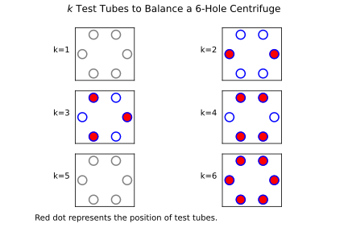
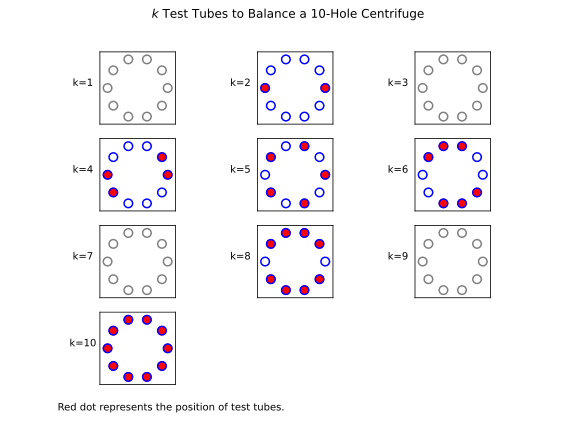
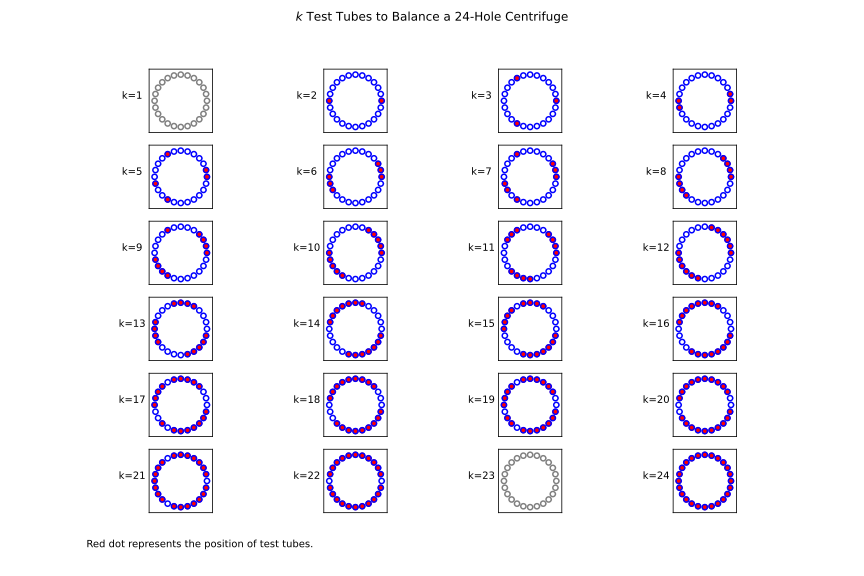

# Centrifuge Problem

!!! question
    Given a centrifuge with $n$ holes, can we balance it with $k$ ($1\le k \le n$) identical test tubes?

This is a simple yet interesting problem, very well illustrated by [Numberphile](https://youtu.be/7DHE8RnsCQ8) and discussed by [Matt Baker's blog](https://mattbaker.blog/2018/06/25/the-balanced-centrifuge-problem/).

The now proved solution is that:

!!! note Solution
    You can balance $k$ identical test tubes, $1\le k\le n$, in an $n$-hole centrifuge if and only if both $k$ and $n-k$ can be expressed as a sum of prime divisors of $n$.

=== "Example: 18-hole centrifuge"

    

=== "Example: 20-hole centrifuge"

    

Below is my attempt to programmatically answer the centrifuge problem.

## Method 1: Naïve DFS

The very first method literally follows the solution. For a given $(n,k)$ pair, check if $k$ and $n-k$ can be written as a linear combination of the prime divisors of $n$ (with non-negative coefficients).

```python
def is_linear_combination(x: int, prime_numbers: list) -> bool:
    """Check if `x` can be written as a linear combination of prime numbers, i.e.,

    x = b1*p1 + b2*p2 + b3*p3 + ... + bn*pn

    where pi represents a prime number in `prime_numbers`, bi is a non-negative integer.
    """
    # very naive and not optimized
    for n in prime_numbers:
        # n divides x 
        if x % n:
            return True
        # n does not divides x, check if the difference between x and multiples of n can be
        # a linear combination of other remaining prime numbers
        for i in range(x//n):
            if is_linear_combination(x - i*n, [p for p in prime_numbers if p!=n]):
                return True
    return False 

def centrifuge_naive(n: int, k: int) -> bool:
    """Check if a `n`-hole centrifuge can be balanced with `k` identical test tubes.

    True if both `k` and `n-k` can be written as a linear combination of the prime divisors of `n`.
    """
    prime_divisors = get_prime_divisors(n) # simple cached function, skipped
    return is_linear_combination(k, prime_divisors) and is_linear_combination(n-k, prime_divisors)
```

### Some Optimizations

The above method works just fine, but very slow if we want to compute the total number of solutions, instead of just checking whether a particular $k$ works.

There can be a few optimizations, for example, we can compute only the lower half of $k$s:

```python
from functools import lru_cache

@lru_cache(maxsize=None)
def centrifuge_naive(n: int, k: int) -> bool:
    prime_divisors = get_prime_divisors(n) # cached
    if k > n//2:
        return centrifuge(n, n-k)
    return is_linear_combination(k, prime_divisors) and is_linear_combination(n-k, prime_divisors)
```

Further, if $n$ is a (large) prime number itself, we understand that all $1\le k\lt n$ will not work. Similarly, if $n$ is a power of prime number, we can bypass many values of $k$ too.

```python
@lru_cache(maxsize=None)
def centrifuge_naive(n, k):
    prime_divisors = get_prime_divisors(n)
    # ...
    # special case when n is power of prime
    if len(prime_divisors) == 1:
        p = prime_divisors[0]
        return (k % p == 0) and ((n - k) % p == 0)
    # ...
```

At certain point, we will realize that it would be faster to simply compute all possible $k$s instead of checking one by one whether a certain $k$ can balance the centrifuge. This leads us to the second approach, which I call "bootstrap".

## Method 2: Bootstrap

The bootstrap method is a variant of DFS, which essentially generates all possible $k$ for a given $n$ by exhausting the values from linear combinations of $n$'s prime divisors. The generated values should be between 2 and $n$. Then we can tell if $k'$ can balance the $n$-hole centrifuge by checking whether $k'$ and $n-k'$ are in the generated values.

```python
def bootstrap(x, n, numbers, result):
    """Compute all linear combinations of the given numbers smaller than n"""
    for p in numbers:
        if p+x > n:
            break
        for i in range((n-x) // p):
            p_ = x + p * i # p_ <= n
            if not result[p_]:
                # x + p*i has not been tested, and is a linear combination of given numbers 
                result[p_] = True
                # check whether we can add multiples of remaining numbers
                bootstrap(p_, n, [n2 for n2 in numbers if n2 != p], result)

def centrifuge_bootstrap(n: int, k: int) -> bool:
    prime_divisors = get_prime_divisors(n) # cached, `prime_divisors` is sorted
    # result[k] represents whether k is valid, k=0...n
    result = [True] + [False] * (n-1) + [True]
    bootstrap(0, n, prime_divisors, result) # TODO: bootstrap only once for a given `n`
    return result[k] and result[n-k]
```

This method invests some time in pre-computing all possible linear combinations of the prime divisors of $n$. If we are only interested to see a particular $(n,k)$ pair, we can break out when we have done `result[k]` and `result[n-k]` in `bootstrap()`.

## Method 3: Dynamic Programming

The last method uses dynamic programming. We can use $f[k]$=`True` to represent that $k$ is a linear combination of $n$'s prime divisors. A value $i$ is either itself a prime divisor of $n$ (and thus a linear combination of the prime divisors), or the sum of a $n$'s prime divisor $p$ and $(i-p)$. In the latter case, if $(i-p)$ is a linear combination of $n$'s prime divisors, so is $p+(i-p)=i$. 

!!! hint
    If $(i-p)$ is a linear combination of $n$'s prime divisors, i.e., $i-p=a_1p_1+a_2p_2+...+a_np_n$, where $\{p_i\}$ are the prime divisors of $n$ and $\{a_i\}$ are non-negative integers, then $i-p+p$ is definitely a linear combination too: $p$'s coefficient becomes $a+1\ge0$.

Hence,

- $f[i] = f[i] \text{ or } f[i-p]$

The boundary condition is $f[0]$ = `True`, i.e., an empty centrifuge is balanced.

The whole function is extremely short:

```python
def centrifuge_dp(n: int, k: int) -> bool:
    prime_divisors = get_prime_divisors(n) # cached, `prime_divisors` is sorted
    f = [True] + [False] * n
    for p in prime_divisors: # TODO: DP only once for a given `n`
        for i in range(p, n+1):
            f[i] = f[i] or f[i-p]
    return f[k] and f[n-k]
```

## Performance Comparison

Obviously, the Method 2 and 3 are _much_ faster than the naïve Method 1. Method 3 does not even use recursion and is the fastest.

!!! note
    A note there is that if we are to check all $1\le k\le n$, e.g., `[i for i in range(1, n+1) if centrifuge(n,i)]`, we need to make some adjustment to the functions above so as to bootstrap or perform DP only once for each $n$. This is trivial.

## Visualization

Below are some plots of balanced centrifuges. Note that for a particular value of $k$, there can be more than one way to balance the centrifuge. Here, I illustrate only one.

=== "6-hole"

    ```python
    plot_centrifuge(6, "6-hole-centrifuge.svg")
    ```
    

=== "10-hole"

    ```python
    plot_centrifuge(10, "10-hole-centrifuge.svg")
    ```
    

=== "12-hole"

    ```python
    plot_centrifuge(12, "12-hole-centrifuge.svg")
    ```
    

=== "12-hole"

    ```python
    plot_centrifuge(18, "18-hole-centrifuge.svg")
    ```
    

=== "20-hole"

    ```python
    plot_centrifuge(20, "20-hole-centrifuge.svg")
    ```
    

=== "24-hole"

    ```python
    plot_centrifuge(24, "24-hole-centrifuge.svg")
    ```
    

=== "33-hole"

    ```python
    plot_centrifuge(33, "33-hole-centrifuge.svg")
    ```
    

### Python code

The code to generate the plots above:

```python
from functools import lru_cache
import numpy as np
import matplotlib.pyplot as plt


@lru_cache(maxsize=None)
def prime_divisors(n):
    """Return list of n's prime divisors"""
    primes = []
    p = 2
    while p**2 <= n:
        if n % p == 0:
            primes.append(p)
            n //= p
        else:
            p += 1 if p % 2 == 0 else 2
    if n > 1:
        primes.append(n)
    return primes


def centrifuge(n):
    """Return a list of which the k-th element represents if k tubes can balance the n-hole centrifuge"""
    F = [True] + [False] * n
    for p in prime_divisors(n):
        for i in range(p, n + 1):
            F[i] = F[i] or F[i - p]
    return [F[k] and F[n - k] for k in range(n + 1)]


def factorize(k: int, nums: list) -> list:
    """Given k, return the list of numbers from the given numbers which add up to k.
    The given numbers are guaranteed to be able to generate k via a linear combination.

    Examples:
        >>> factorize(5, [2, 3])
        [2, 3]
        >>> factorize(6, [2, 3])
        [2, 2, 2]
        >>> factorize(7, [2, 3])
        [2, 2, 3]
    """

    def _factorize(k, nums, res: list):
        for p in nums:
            if k % p == 0:
                res.extend([p] * (k // p))
                return True
            else:
                for i in range(1, k // p):
                    if _factorize(k - p * i, [n for n in nums if n != p], res):
                        res.extend([p] * i)
                        return True
        return False

    res = []
    _factorize(k, nums, res)
    return res


@lru_cache(maxsize=None)
def centrifuge_k(n, k):
    """Given (n, k) and that k balances a n-hole centrifuge, find the positions of k tubes"""
    if n == k:
        return [True] * n
    factors = factorize(k, prime_divisors(n))
    pos = [False] * n

    def c(factors: list, pos: list) -> bool:
        if sum(pos) == k:
            return True
        if not factors:
            return False
        p = factors.pop(0)
        pos_wanted = [n // p * i for i in range(p)]
        for offset in range(n):
            pos_rotated = [(i + offset) % n for i in pos_wanted]
            # the intended positions of the p tubes are all available
            if not any(pos[i] for i in pos_rotated):
                # claim the positions
                for i in pos_rotated:
                    pos[i] = True
                if not c(factors, pos):
                    # unclaim the positions
                    for i in pos_rotated:
                        pos[i] = False
                else:
                    return True
        # all rotated positions failed, add p back to factors to place later
        factors.append(p)

    c(factors, pos)
    return pos


def plot_centrifuge(n, figname="centrifuge.svg"):
    ncols = max(int(n**0.5), 1)  # minimum 1 column
    nrows = n // ncols if n % ncols == 0 else n // ncols + 1
    height = 3 if nrows == ncols else 2
    width = 2
    fig, axes = plt.subplots(nrows, ncols, figsize=(height * nrows, width * ncols))
    z = np.exp(2 * np.pi * 1j / n)

    theta = np.linspace(0, 2 * np.pi, 20)
    radius = 1 / (ncols + nrows)
    a = radius * np.cos(theta)
    b = radius * np.sin(theta)

    cent = centrifuge(n)
    for nr in range(nrows):
        for nc in range(ncols):
            k = nr * ncols + nc + 1
            axis = axes[nr, nc] if ncols > 1 else axes[nr]
            if k > n:
                axis.axis("off")
                continue
            # draw the n-holes
            for i in [z**i for i in range(n)]:
                axis.plot(a + i.real, b + i.imag, color="b" if cent[k] else "gray")
            # draw the k tubes
            if cent[k]:
                if k > n // 2:
                    pos = [not b for b in centrifuge_k(n, n - k)]
                else:
                    pos = centrifuge_k(n, k)
                for i, ok in enumerate(pos):
                    i = z**i
                    if ok:
                        axis.fill(a + i.real, b + i.imag, color="r")

            axis.set_aspect(1)
            axis.set(xticklabels=[], yticklabels=[])
            axis.set(xlabel=None)
            axis.set_ylabel(f"k={k}", rotation=0, labelpad=10)
            axis.tick_params(bottom=False, left=False)

    fig.suptitle(f"$k$ Test Tubes to Balance a {n}-Hole Centrifuge")
    fig.text(0.1, 0.05, "Red dot represents the position of test tubes.")
    plt.savefig(figname)
    plt.close(fig)


if __name__ == "__main__":
    for n in range(6, 51):
        print(f"Balancing {n}-hole centrifuge...")
        plot_centrifuge(n, f"{n}-hole-centrifuge.png")
```

### Download plots of balanced centrifuges

!!! success More plots
    You can [download the Python code and all plots of balanced $n$-hole centrifuge](./centrifuge-problem.zip), $6\le n\le50$, which I calculated using the code above.
