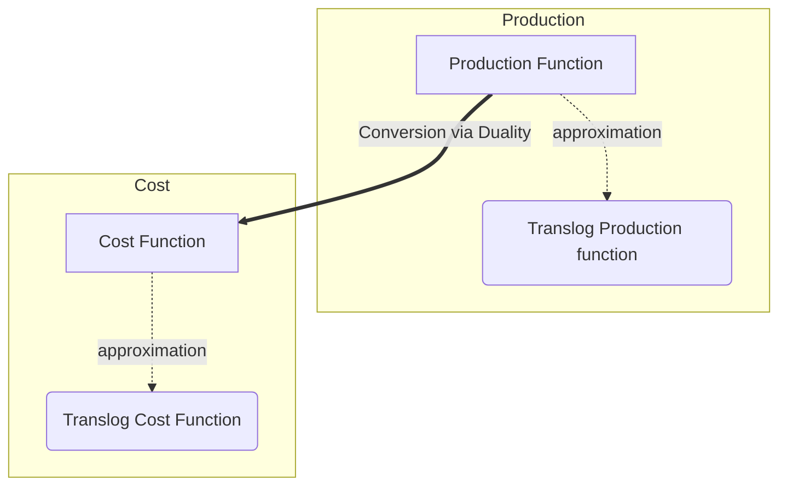

# Translog Production and Cost Functions

In this post, I'll carefully explain the derivation of cost function from a CES 
production function, as well as the derivation of translog (transcendental logarithmic) production and cost functions.



Before I start, the graph above illustrate the relations. Specifically, we can derive the 
cost function from a CES production function via the duality theorem. Translog production
and translog cost functions are approximations to the production and corresponding cost function, respectively, via Taylor expansion.

<!-- more -->

## CES Production Function

Let's start from the a general production function, CES (Constant Elasticity of Substitution).

The **standard CES production function** with two factors \(X_1\) and \(X_2\) is given by:

\[
\begin{equation}
\label{eq:ces-production}
Q = A \left( \alpha_1 X_1^{\rho} + \alpha_2 X_2^{\rho} \right)^{\frac{1}{\rho}}
\end{equation}
\]

where \(\alpha_1+\alpha_2=1\), \(A\) is a scale parameter, \(\alpha\) is the distribution parameter, and \(\rho\) is the substitution parameter.

!!! note
    The **Cobb-Douglas production function** is a special case of the CES function when \(\rho \to 0\):

    \[
    Q = A X_1^{\alpha} X_2^{1-\alpha}
    \]

## Translog Production Function 

Taking the natural logarithm of both sides of Equation $\eqref{eq:ces-production}$, we get:

\[
\begin{equation}
\label{eq:log-form-ces-production}
\ln Q = \ln A + \frac{1}{\rho} \ln \left[ \alpha X_1^{\rho} + (1-\alpha) X_2^{\rho} \right]
\end{equation}
\]

The Taylor expansion of \( \frac{1}{\rho} \ln \left[ \alpha X_1^{\rho} + (1-\alpha) X_2^{\rho} \right] \) around \(\rho=0\) is [^3]

[^3]: This is computed in Mathematica via
      ```mathematica
      expr = Series[1/rho * Log[alpha*X1^rho + (1 - alpha)*X2^rho], {rho, 0, 1}];
      simplifiedExpr = FullSimplify[expr];
      TeXForm[simplifiedExpr]
      ```

\[
\begin{equation}
\label{eq:taylor-expansion-of-ces}
\alpha  \ln X_1 + (1-\alpha)  \ln X_2-\frac{1}{2} \rho
    \left[(\alpha -1) \alpha  (\ln X_1-\ln X_2)^2\right]+O\left(\rho ^2\right) 
\end{equation}
\]

Omitting \(O\left(\rho ^2\right) \) and substituting the Taylor expansion into Equation $\eqref{eq:log-form-ces-production}$, we have

\[
\begin{align}
\label{eq:log-production-with-taylor}
\ln Q &= \ln A \\
 &+ \alpha  \ln X_1 + (1-\alpha)  \ln X_2-\frac{1}{2} \rho \left[(\alpha -1) \alpha  (\ln X_1-\ln X_2)^2\right] \nonumber
\end{align}
\]

which ==clearly is a function of \(\ln X_1\), \(\ln X_2\) and their interaction terms==.

We can therefore reparameterize Equation $\eqref{eq:log-production-with-taylor}$ and get the **Translog  production function**:

\[
\begin{align}
\ln Q &= a_0 + a_1 \ln X_1 + a_2 \ln X_2 \\
&+ b_{11} (\ln X_1)^2 + b_{22} (\ln X_2)^2 + b_{12} \ln X_1 \ln X_2 \nonumber
\end{align}
\]

Here, \(a_1\) and \(a_2\) are coefficients that capture the first-order effects, and \(b_{11}\), \(b_{22}\), and \(b_{12}\) are coefficients that capture the second-order effects.

!!! note
    If we use fist-order Taylor expansion in Equation $\eqref{eq:taylor-expansion-of-ces}$ instead,
    we will end up with a log-linear production function.

## Derive Cost Function From Production Function

Given the CES production function $\eqref{eq:ces-production}$, we can
derive the cost function via the duality theorem.

!!! tip "Duality in a nutshell"

    1. The production function describes the maximum output $Q$ that can be produced given the input factors.
    1. Given a production function and input prices, the firm aims to minimize its costs subject to the constraint of producing a given output level $Q$. This leads to a cost minimization problem.

    Cost minimization and the production maximization are essentially "dual" to each other. The conditions that solve one problem can be used to solve the other. This is a manifestation of the more general concept of duality in optimization theory.

Recall that the CES production function is

\[
Q = A \left( \alpha_1 X_1^{\rho} + \alpha_2 X_2^{\rho} \right)^{\frac{1}{\rho}}
\]

The firm's cost function is

\[
\begin{equation}
\label{eq:cost-function}
C = w_1 X_1 + w_2 X_2
\end{equation}
\]

where \(w_1\) and \(w_2\) are the factor prices.

### Cost minimization problem

To derive the cost function from the given CES production function, we need to find the minimum cost of producing a given level of output \( Q \) given input prices \( w_1 \) and \( w_2 \).

The cost minimization problem is:

\[
\begin{equation}
\min_{X_1, X_2} \quad C=w_1 X_1 + w_2 X_2
\end{equation}
\]

Subject to:

\[
\begin{equation}
A \left( \alpha_1 X_1^{\rho} + \alpha_2 X_2^{\rho} \right)^{\frac{1}{\rho}} = Q
\end{equation}
\]

### Solving the problem

!!! tip
    This part is math-heavy. The derived cost function is given by Equation $\eqref{eq:derived-cost-function}$.

The Lagrangian for this problem is:

\[
\begin{equation}
\mathcal{L} = w_1 X_1 + w_2 X_2 + \lambda \left[ Q - A \left( \alpha_1 X_1^{\rho} + \alpha_2 X_2^{\rho} \right)^{\frac{1}{\rho}} \right]
\end{equation}
\]

Take the first-order conditions:

\[
\begin{align}
\frac{\partial \mathcal{L}}{\partial X_1} &= w_1 - \lambda A \alpha_1 \rho X_1^{\rho-1} \left( \alpha_1 X_1^{\rho} + \alpha_2 X_2^{\rho} \right)^{\frac{1}{\rho}-1} = 0 \\
\frac{\partial \mathcal{L}}{\partial X_2} &= w_2 - \lambda A \alpha_2 \rho X_2^{\rho-1} \left( \alpha_1 X_1^{\rho} + \alpha_2 X_2^{\rho} \right)^{\frac{1}{\rho}-1} = 0 \\
\frac{\partial \mathcal{L}}{\partial \lambda} &= Q - A \left( \alpha_1 X_1^{\rho} + \alpha_2 X_2^{\rho} \right)^{\frac{1}{\rho}} = 0
\end{align}
\]

Solve the first two equations for \( \lambda \):

\[
\begin{equation}
\label{eq:lambda}
\lambda = \frac{w_1}{A \alpha_1 \rho X_1^{\rho-1} \left( \alpha_1 X_1^{\rho} + \alpha_2 X_2^{\rho} \right)^{\frac{1}{\rho}-1}} = \frac{w_2}{A \alpha_2 \rho X_2^{\rho-1} \left( \alpha_1 X_1^{\rho} + \alpha_2 X_2^{\rho} \right)^{\frac{1}{\rho}-1}}
\end{equation}
\]

Simplifying $\eqref{eq:lambda}$, we get:

\[
\begin{equation}
\label{eq:lambda-equal}
w_1 X_2^{\rho-1} \alpha_2 = w_2 X_1^{\rho-1} \alpha_1
\end{equation}
\]

Manipulating $\eqref{eq:lambda-equal}$, we have:

\[
\begin{equation}
\frac{X_1}{X_2} = \left(\frac{\alpha_2 w_1}{\alpha_1 w_2}\right)^{\frac{1}{\rho-1}}
\end{equation}
\]

so that

\[
\begin{align}
(\alpha_2 w_1)^{\frac{\rho}{\rho-1}} X_2^{\rho} &= (\alpha_1 w_2)^{\frac{\rho}{\rho-1}} X_1^{\rho} \\
\left(w_1^{\frac{\rho}{\rho-1}} \alpha_1^{\frac{-1}{\rho-1}}\right) \alpha_2 X_2^{\rho} &= \left(w_2^{\frac{\rho}{\rho-1}} \alpha_2^{\frac{-1}{\rho-1}}\right) \alpha_1 X_1^{\rho}
\end{align}
\]

Adding \(\left(w_2^{\frac{\rho}{\rho-1}} \alpha_2^{\frac{-1}{\rho-1}}\right) \alpha_2 X_2^{\rho}
\) to both sides, we have

\[
\begin{align}
\left(w_1^{\frac{\rho}{\rho-1}} \alpha_1^{\frac{-1}{\rho-1}}\right) \alpha_2 X_2^{\rho} + \left(w_2^{\frac{\rho}{\rho-1}} \alpha_2^{\frac{-1}{\rho-1}}\right) \alpha_2 X_2^{\rho}
 &= \left(w_2^{\frac{\rho}{\rho-1}} \alpha_2^{\frac{-1}{\rho-1}}\right) \alpha_1 X_1^{\rho} + \left(w_2^{\frac{\rho}{\rho-1}} \alpha_2^{\frac{-1}{\rho-1}}\right) \alpha_2 X_2^{\rho} \nonumber \\
\left(w_1^{\frac{\rho}{\rho-1}} \alpha_1^{\frac{-1}{\rho-1}} + w_2^{\frac{\rho}{\rho-1}} \alpha_2^{\frac{-1}{\rho-1}}\right) \alpha_2 X_2^{\rho}
 &= \left(w_2^{\frac{\rho}{\rho-1}} \alpha_2^{\frac{-1}{\rho-1}}\right) \left(\alpha_1 X_1^{\rho} + \alpha_2 X_2^{\rho}\right) 
\end{align}
\]

Raise both sides to the power of $\frac{1}{\rho}$, we have

\[
\begin{equation}
\label{eq:x2_before_simplification}
\left(w_1^{\frac{\rho}{\rho-1}} \alpha_1^{\frac{-1}{\rho-1}} + w_2^{\frac{\rho}{\rho-1}} \alpha_2^{\frac{-1}{\rho-1}} \right)^{\frac{1}{\rho}} \alpha_2^{\frac{1}{\rho}} X_2
 = \left(w_2^{\frac{\rho}{\rho-1}} \alpha_2^{\frac{-1}{\rho-1}}\right)^{\frac{1}{\rho}} \left(\alpha_1 X_1^{\rho} + \alpha_2 X_2^{\rho}\right)^{\frac{1}{\rho}} 
\end{equation}
\]

Let \(K = \left(w_1^{\frac{\rho}{\rho-1}} \alpha_1^{\frac{-1}{\rho-1}} + w_2^{\frac{\rho}{\rho-1}} \alpha_2^{\frac{-1}{\rho-1}} \right)^{\frac{1}{\rho}}\),
observe that \(\frac{Q}{A} = \left(\alpha_1 X_1^{\rho} + \alpha_2 X_2^{\rho}\right)^{\frac{1}{\rho}} \), we can simplify $\eqref{eq:x2_before_simplification}$ to

\[
\begin{equation}
K \alpha_2^{\frac{1}{\rho}} X_2 = \left(w_2^{\frac{\rho}{\rho-1}} \alpha_2^{\frac{-1}{\rho-1}}\right)^{\frac{1}{\rho}} \frac{Q}{A}
\end{equation}
\]

Therefore, $X_2$ is given by

\[
\begin{equation}
\label{eq:x2}
X_2 = K^{-1} w_2^{\frac{1}{\rho-1}} \alpha_2^{\frac{-1}{\rho-1}} \frac{Q}{A}
\end{equation}
\]

We can similarly get $X_1$

\[
\begin{equation}
\label{eq:x1}
X_1 = K^{-1} w_1^{\frac{1}{\rho-1}} \alpha_1^{\frac{-1}{\rho-1}} \frac{Q}{A}
\end{equation}
\]

Substituting $\eqref{eq:x1}$ and $\eqref{eq:x2}$ into the cost function $\eqref{eq:cost-function}$, we have

\[
\begin{align}
C &= w_1 X_1 + w_2 X_2 \nonumber \\
&= K^{-1} w_1^{\frac{\rho}{\rho-1}} \alpha_1^{\frac{-1}{\rho-1}} \frac{Q}{A} + K^{-1} w_2^{\frac{\rho}{\rho-1}} \alpha_2^{\frac{-1}{\rho-1}} \frac{Q}{A} \\
&= \frac{Q}{A} K^{-1} \left(w_1^{\frac{\rho}{\rho-1}} \alpha_1^{\frac{-1}{\rho-1}} + w_2^{\frac{\rho}{\rho-1}} \alpha_2^{\frac{-1}{\rho-1}}\right)
\end{align}
\]

Since \(K = \left(w_1^{\frac{\rho}{\rho-1}} \alpha_1^{\frac{-1}{\rho-1}} + w_2^{\frac{\rho}{\rho-1}} \alpha_2^{\frac{-1}{\rho-1}} \right)^{\frac{1}{\rho}}\), we have the derived cost function:

!!! success "Cost function derived from CES production function"
    \[
    \begin{equation}
    \label{eq:derived-cost-function}
    C = \frac{Q}{A} \left(w_1^{\frac{\rho}{\rho-1}} \alpha_1^{\frac{-1}{\rho-1}} + w_2^{\frac{\rho}{\rho-1}} \alpha_2^{\frac{-1}{\rho-1}}\right)^{\frac{\rho-1}{\rho}}
    \end{equation}
    \]

## Translog Cost Function

Taking the natural logarithm of both sides of Equation $\eqref{eq:derived-cost-function}$, we get:

\[
\begin{equation}
\label{eq:log-cost-function}
\ln(C) = \ln \left( \frac{Q}{A} \right) + \frac{\rho-1}{\rho} \ln \left( w_1^{\frac{\rho}{\rho-1}} \alpha_1^{\frac{-1}{\rho-1}} + w_2^{\frac{\rho}{\rho-1}} \alpha_2^{\frac{-1}{\rho-1}} \right)
\end{equation}
\]

The Taylor expansion of \( \frac{\rho-1}{\rho} \ln \left( w_1^{\frac{\rho}{\rho-1}} \alpha_1^{\frac{-1}{\rho-1}} + w_2^{\frac{\rho}{\rho-1}} \alpha_2^{\frac{-1}{\rho-1}} \right) \) around \(\rho=0\) is [^4]

[^4]: This is computed in Mathematica, too.

\[
\begin{align}
\label{eq:taylor-expansion-of-log-cost}
&((\alpha_2-1)\ln\alpha_1-\alpha_2(\ln\alpha_2+\ln w_1-\ln w_2)+\ln w_1)\nonumber\\
&+\frac{1}{2}(\alpha_2-1)\alpha_2\rho(\ln \alpha_1-\ln \alpha_2-\ln w_1+\ln w_2)^2+O\left(\rho^2\right)
\end{align}
\]

Omitting \(O\left(\rho ^2\right) \) and substituting the Taylor expansion into Equation $\eqref{eq:log-cost-function}$, we have

\[
\begin{align} 
\ln C &= -\ln A + \ln Q \nonumber\\
&+((\alpha_2-1)\ln\alpha_1-\alpha_2(\ln\alpha_2+\ln w_1-\ln w_2)+\ln w_1)\nonumber\\
&+\frac{1}{2}(\alpha_2-1)\alpha_2\rho(\ln \alpha_1-\ln \alpha_2-\ln w_1+\ln w_2)^2
\label{eq:log-cost-taylor}
\end{align}
\]

which ==clearly is a function of \(\ln Q\); \(\ln w_1\), \(\ln w_2\) and their interaction terms==.

We can therefore reparameterize Equation $\eqref{eq:log-cost-taylor}$ and get the **Translog cost function**:

\[
\begin{align} \label{eq:translog-cost}
\ln C &= a_0 + a_1 \ln Q \\
&+ b_{11} \ln w_1 + b_{22} \ln w_2 + b_{12} \ln w_1 \ln w_2 \nonumber
\end{align}
\]

!!! question "Why there is no interaction between \(\ln Q\) and \(\ln w\)?"

    This is NOT an error! It is because we started from a **standarded CES production function**,
    which doesn't include interaction terms.

    A more general form of translog cost function includes interaction terms \(\ln Q \ln w\)
    because the underlying production function is even more flexible than the standard CES production function. This is the beauty of translog.

In a general form, the translog cost function \( \ln C(Q, W) \) as a function of output \( Q \) and a vector of $n$ input prices \( W \) is represented as

\[
\begin{align} 
\ln C(Q, W) &= \beta_0 + \beta_1 \ln Q + \frac{1}{2} \beta_2 (\ln Q)^2 \\
&+ \sum_{i=1}^{n} \gamma_i \ln W_i + \frac{1}{2} \sum_{i=1}^{n} \sum_{j=1}^{n} \theta_{ij} \ln W_i \ln W_j \nonumber \\
&+ \sum_{i=1}^{n} \phi_i \ln Q \ln W_i \nonumber
\label{eq:translog-cost-general}
\end{align}
\]

Note that here it includes a quadratic term for $\ln Q$ and interactions between $\ln Q$ and $\ln W$. ==As a result, it can approximate a wide range of very complex cost functions (hence complex underlying production function, via duality)==.
