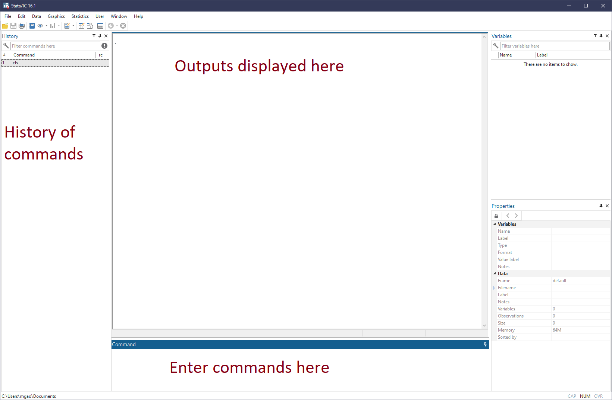
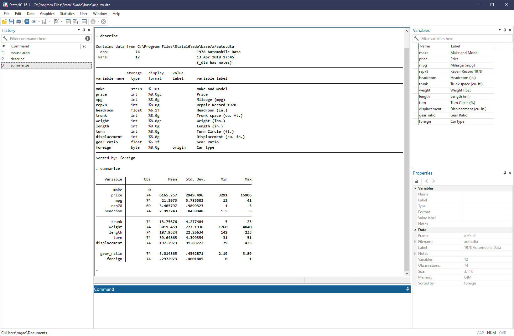

# Stata - Introduction

[Stata](https://www.stata.com) is a powerful statistical analysis software that we often use in empirical researches. This series of posts aims to provide some basic knowledge for junior researchers to get started with Stata, as well as some personal tips on more efficiently using Stata in research projects.[^1]

[^1]: I prepare this series of introductory course notes for the BUSS7902 Quantitative Business Research Methods for PhD students at the University of Sydney Business School in Semester 1, 2023.

## Stata GUI

The Graphical User Interface (GUI) of Stata looks like this:



This is the default layout of Stata 16. Some preset preferences can be found via menu option `Edit>Preferences>Load preference set`. You can also save your personal preferences (color theme, layout, etc.) in the `Edit>Preference` menu.

Of the many windows of the GUI, we are mostly interested in the __Results__ window (`Ctrl+2`) where outputs are displayed. While all other windows can be hidden or closed, the __Results__ window always remains center of the GUI.

The __Command__ window (`Ctrl+1`) is where we mostly interact with Stata by entering Stata commands. Since usually we need a group of commands to complete a task, it is a good idea to place them together in a __do file__ (with the extension `.do`), which is the file type native to Stata, just like `.py` file to Python. Later, we will introduce the Stata's __Do Editor__ (`Ctrl+9`) as a nice editor for `.do` files.

!!! tip
    As a researcher, keeping good record of the programs and codes used is a merit. For oneself, it boosts productivity as more codes are accumulated. Beyond that, it ensures all results can be replicated even years later. Nowadays, more and more top journals also require submission of the codes used in the paper.

## Basic demonstration

Now let's start tying our first Stata command in the __Command__ window.

### Working directory

First, let's type [`pwd`](https://www.stata.com/manuals/dcd.pdf) (and hit `Eneter`), which is a command to display the current working directory. Knowing the current working directory, for example, allows you to use [relative path](https://en.wikipedia.org/wiki/Path_(computing)#Absolute_and_relative_paths) correctly.

Throughout this series, I'll follow the tradition and prefix all Stata commands with `. `, hence `. pwd` meaning "enter the `pwd` command in the Command window":

```stata
. pwd
```

From the __Results__ window, we can see a line of text like "C:\Users\mgao\Documents", which is the output of executing the `pwd` command, i.e., the current working directory of Stata on my PC.

We can change the current working directory to another directory on the computer via the command [`cd`](https://www.stata.com/manuals/dcd.pdf), for example:

```stata
. cd "C:\Users\mgao\Dropbox (Sydney Uni)\BUSS7902 Stata"
```

Then we can verify that it's indeed changed by `pwd` again.

### Structure of a Stata command

The above two examples (`pwd` and `cd`) already showcase the basic syntax structure of Stata commands. With a few exceptions, a Stata command is like:

```stata
. _commmand_ _parameter1_ _parameter2_ ... , _options_
```

or technically,

> cmd [varlist | namelist | anything]
               [if]
               [in]
               [using filename]
               [= exp]
               [weight]
               [, options]

where `cmd` is the name of a command and everything in `[ ]` is optional.

<Aside type="tip">
  You can use `. help syntax` to see more detailed explanation.

  In fact, Stata's help files are _so_ comprehensive that 99.99% of the time you should simply refer to the help files instead of Googling around...
</Aside>

### Some other quick examples

[`display`](https://www.stata.com/manuals/pdisplay.pdf) prints a message to the __Results__ window:

```stata
. display "hello world!"
```

[`cls`](https://www.stata.com/manuals/rcls.pdf) clears the __Results__ window:

```stata
. cls
```

[`clear`](https://www.stata.com/manuals/dclear.pdf) clears memory, removing the dataset loaded, if any:

```stata
. clear
```

[`log`](https://www.stata.com/manuals/rlog.pdf) echos a copy of the session to file:

Create a log file name `stata101.log` in the current working directory. The `replace` option asks Stata to replace the log file if it already exists. Untill `. log close`, everything displayed in __Results__ will be saved in the log file.

```stata
. log using "stata101.log", replace
. display "hello from Mingze"
. log close
```

`cmdlog` is similar to `log` but records only the commands but no results.

## What about regression?

Of course, Stata is famous for its superior statistical analysis. Let's see how regressions can be easily done in Stata.

### Load dataset

We start by loading an example dataset that comes with Stata installation. This can be done via [`sysuse`](https://www.stata.com/manuals/dsysuse.pdf) command. We use the dataset named "auto":

```stata
. sysuse auto
```

!!! tip
    Stata comes with several builtin datasets. Use `. sysuse dir` to have a look.

    More generally, we can [`use`](https://www.stata.com/manuals/duse.pdf) our own datasets. We'll see more on this later.

We can now ask Stata to [`describe`](https://www.stata.com/manuals/ddescribe.pdf) the meta information of the dataset and [`summarize`](https://www.stata.com/manuals/rsummarize.pdf) the variables in terms of number of observations, mean, standard deviation, etc.

The screenshot below shows the output:



Enlarge the output of `describe`:

```text
. describe

Contains data from C:\Program Files\Stata16\ado\base/a/auto.dta
  obs:            74                          1978 Automobile Data
 vars:            12                          13 Apr 2018 17:45
                                              (_dta has notes)
--------------------------------------------------------------------------------
              storage   display    value
variable name   type    format     label      variable label
--------------------------------------------------------------------------------
make            str18   %-18s                 Make and Model
price           int     %8.0gc                Price
mpg             int     %8.0g                 Mileage (mpg)
rep78           int     %8.0g                 Repair Record 1978
headroom        float   %6.1f                 Headroom (in.)
trunk           int     %8.0g                 Trunk space (cu. ft.)
weight          int     %8.0gc                Weight (lbs.)
length          int     %8.0g                 Length (in.)
turn            int     %8.0g                 Turn Circle (ft.)
displacement    int     %8.0g                 Displacement (cu. in.)
gear_ratio      float   %6.2f                 Gear Ratio
foreign         byte    %8.0g      origin     Car type
--------------------------------------------------------------------------------
Sorted by: foreign
```

### Run regression

Suppose we'd like to estimate a simple liner regression to study the relation between car price and mileage, headroom and weight:

$$
price = \alpha + \beta_1 mpg + \beta_2 headroom + \beta_3 weight + \varepsilon
$$

All we need to do is a simple line of code,

```stata
. regress price mpg headroom weight
```

which would generate the following estimation results:


### Save results

One of the coolest things Stata can do is to export the tabulated regression results to Microsoft Word, PDF, LaTeX and more. 

#### Save to Word

For example, we can save the previous results (as shown in the screenshot above) to a Word document named "table1" (`table1.docx`) easily with the following three lines of codes.

```stata
. putdocx begin
. putdocx table mytable = etable
. putdocx save table1.docx, replace
```

Behind the scene, Stata creates a `.docx` to work with. `putdocx table` command creates a new table (mytable) in the `.docx` file containing estimation results (`etable` tells it to tabulates the coefficients from previous estimation). Lastly, Stata saves the `.docx` file as "table1.docx" in the current working directory.


#### Save to LaTeX

If working with LaTeX,  you can export results as TeX files conveniently too.

For this purpose, though, an additional Stata package [`estout`](http://repec.sowi.unibe.ch/stata/estout/index.html) is required. Personally I'd say this is gold. You can install `estout` package via a single command in Stata:

```stata
. ssc install estout, replace
```

Now, you can use the following two lines of codes: 

```stata
. eststo: regress price mpg headroom weight
. esttab using "table1.tex", tex replace label star(* 0.10 ** 0.05 *** 0.01) nogaps compress
```

to produce a TeX file ("table1.tex") with the following content:

```tex
{
\def\sym#1{\ifmmode^{#1}\else\(^{#1}\)\fi}
\begin{tabular}{l*{1}{c}}
\hline\hline
                &\multicolumn{1}{c}{(1)}\\
                &\multicolumn{1}{c}{Price}\\
\hline
Mileage (mpg)   &   -56.19         \\
                &  (-0.66)         \\
Headroom (in.)  &   -675.6\sym{*}  \\
                &  (-1.72)         \\
Weight (lbs.)   &    2.062\sym{***}\\
                &   (3.13)         \\
Constant        &   3158.3         \\
                &   (0.87)         \\
\hline
Observations    &       74         \\
\hline\hline
\multicolumn{2}{l}{\footnotesize \textit{t} statistics in parentheses}\\
\multicolumn{2}{l}{\footnotesize \sym{*} \(p<0.10\), \sym{**} \(p<0.05\), \sym{***} \(p<0.01\)}\\
\end{tabular}
}
```

You can check the PDF compiled from the above TeX code at this [Overleaf link](https://www.overleaf.com/read/synvdxtkrjfk).

!!! note
    We will revisit and elaborate on these topics later.
    I deliberately make them oversimplified only to show you what Stata can do in making our lives much easier.
