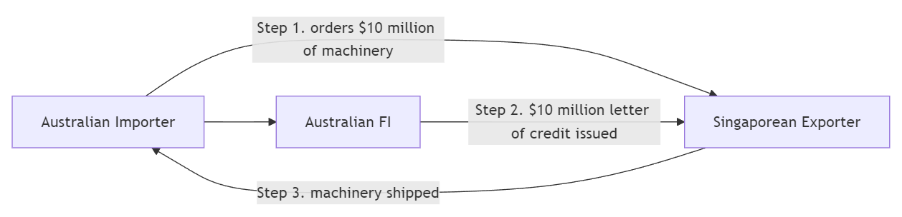

# Sovereign Risk, Foreign Exchange Risk, and Off-Balance-Sheet Risk

## Introduction

Three risks that can sink a bank without a single domestic borrower missing a payment:

- **Foreign Exchange (FX) Risk** — currency risk. The potential for losses when exchange rates move against the FI's foreign-denominated assets, liabilities, or revenues. *In 1992, George Soros famously made $1 billion in a single day shorting the British pound. The Bank of England was on the other side of that trade.*

- **Sovereign Risk** — the risk that a government defaults on its debt or blocks its residents from servicing foreign obligations. Even a perfectly creditworthy Greek company could not repay its foreign lenders if Athens imposed capital controls — and in 2015, Greece did exactly that.

- **Off-Balance-Sheet (OBS) Risk** — risks from contingent liabilities that sit in the footnotes, not on the balance sheet: guarantees, derivatives, letters of credit, loan commitments. *AIG had $440 billion of off-balance-sheet credit default swaps in 2008 — exposures that did not appear on its balance sheet until they triggered a $182 billion taxpayer bailout.*

# Foreign exchange risk

## Foreign exchange rates

A foreign exchange (FX) rate is the price at which one currency (e.g., the U.S. dollar) can be exchanged for another currency (e.g., the Australian dollar).

Two basic types of FX transactions:

1. __Spot FX transactions__ involve the immediate settlement, or exchange, of currencies at the current (spot) exchange rate.
2. __Forward FX transactions__ involve the exchange of currencies at a specified exchange rate (i.e., the forward exchange rate) which is settled at some specified date in the future.

## Source of FX risk exposure

Assets and liabilities denominated in foreign currencies

- making foreign currency loans
- issuing foreign currency-denominated debt

The trading of foreign currencies involves

- purchase and sale of currencies to complete international transactions
- facilitating positions in foreign real and financial investments
- accommodating hedging activities
- speculation

Substantial risk arises via open positions (unhedged positions).

## FX exposure

An FI’s overall FX exposure in any given currency can be measured by the net position exposure, which is measured in local currency as

$$
\begin{aligned}
\text{Net exposure}_i &= (\text{FX assets}_i - \text{FX liabilities}_i) + (\text{FX bought}_i - \text{FX sold}_i) \\
&=\text{Net foreign assets}_i + \text{Net FX bought}_i
\end{aligned}
$$

where $i$ represents the $i$th currency.

::: {.fragment}
FI could match its foreign currency assets to its liabilities in a given currency and match buys and sells in its trading book in that foreign currency

- reduce its foreign exchange net exposure to zero and thus avoid FX risk.

Financial holding companies can aggregate their foreign exchange exposure through their banking, insurance and funds management businesses under one umbrella

- allows them to reduce their net foreign exchange exposure across all units.
:::

## FX rate volatility and FX exposure

We can measure the potential size of an FI’s FX exposure as:

$$
\begin{aligned}
\text{Dollar loss/gains in currency } i &= \text{Net exposure in foreign currency } i \text{ measured in local currency} \\
&\times \text{Shock (volatility) to the exchange rate of local currency to foreign currency } i
\end{aligned}
$$

- Greater exposure to a foreign currency combined with greater volatility of the foreign currency implies greater _daily earnings at risk (DEAR)_.
- Reason for FX volatility: fluctuations in the demand for and supply of a country's currency

::: {.content-hidden when-format="pdf"}
## FX rate volatility and FX exposure (cont'd)
:::

::: {.content-hidden when-format="pdf"}
$$
\begin{aligned}
\text{Dollar loss/gains in currency } i &= \text{Net exposure in foreign currency } i \text{ measured in local currency} \\
&\times \text{Shock (volatility) to the exchange rate of local currency to foreign currency } i
\end{aligned}
$$
:::

::: {.callout-note title="Example"}
On September 8, 2024, an Australian FI has a net **long** position in New Zealand dollars (NZD) of NZD\$1,000,000. The exchange rate is 0.92 AUD/NZD — i.e., NZ\$1 buys A\$0.92.

It is now October 8, 2024, and the exchange rate becomes 0.94 AUD/NZD. The AUD has _depreciated_ relative to the NZD. Calculate the FI's dollar loss/gain for this shock.

- The AUD value of the NZD position on September 8 is $\text{NZD}\$1{,}000{,}000\times 0.92=\text{AUD}\$920{,}000$.
- The AUD value of the NZD position on October 8 is $\text{NZD}\$1{,}000{,}000\times 0.94=\text{AUD}\$940{,}000$.
- The gain on the net long position in NZD is $\$940{,}000-\$920{,}000=\text{AUD}\$20{,}000$.

Or, more directly:

$\text{NZD}\$1{,}000{,}000 \times (0.94 - 0.92) = \text{AUD}\$20{,}000$.

**Intuition:** a long FX position gains when the foreign currency appreciates. If the FI had been *short* NZD, this same move would have been a A\$20,000 loss.
:::

::: {.content-hidden when-format="pdf"}
## FX rate volatility and FX exposure (cont'd)
:::

The FI has a €2.0 million long trading position in spot euros at the close of business on a particular day. The exchange rate is €0.80/\$1, or \$1.25/€, at the daily close. Looking back at the daily changes in the exchange rate of the euro to dollars for the past year, the FI finds that the volatility or standard deviation ($\sigma$) of the spot exchange rate was 50 basis points (bp). What is the DEAR?

::: {.fragment}
$$
\text{DEAR} = \text{Dollar value of position} \times \text{FX volatility}
$$

- Dollar value of position = €2.0 x 1.25 $/€ = $2.5 million
- FX volatility = 2.33$\sigma$ = 2.33 x 0.005 = 0.01165
- DEAR = $2,500,000 x 0.01165 = $29,125
:::

## Interaction of interest rate, inflation, and exchange rates

- Global financial markets are increasingly interconnected, so are interest rates, inflation, and foreign exchange rates.
- We now explore how inflation in one country affects its foreign currency exchange rates, focusing on __purchasing power parity (PPP)__.
- Next, we examine the relationship between domestic/foreign interest rates and spot/forward foreign exchange rates, known as __interest rate parity (IRP)__.

## Purchasing Power Parity

By the **Fisher equation**, the nominal interest rate $R$ equals the real rate $r$ plus the inflation rate $\pi$:

$$R = r + \pi.$$

For two countries — say Australia (AU) and the United States (US):

$$
R_{AU} = r_{AU} + \pi_{AU}, \qquad R_{US} = r_{US} + \pi_{US}.
$$

If real interest rates are equal across countries ($r_{AU}=r_{US}$), then the **nominal interest-rate spread equals the inflation differential**:

$$R_{AU} - R_{US} = \pi_{AU} - \pi_{US}.$$

::: {.callout-note title="Why assume equal real rates across countries?"}
With free capital mobility, investors arbitrage real-return differences: capital flows toward the country with the higher real rate, bidding up asset prices there until real returns equalise. This is **real interest rate parity** — the cross-country counterpart of the **International Fisher Effect**. In practice, frictions (capital controls, taxes, risk premia) keep real rates only *approximately* equal, which is why the relation should be read as a long-run benchmark rather than a daily identity.
:::

::: {.callout-important}
Under a floating exchange-rate regime, when inflation rates diverge across countries, the nominal exchange rate must adjust so that purchasing power stays comparable.
:::

**Purchasing Power Parity (PPP)** is one theory explaining how this adjustment takes place.

::: {.content-hidden when-format="pdf"}
## Purchasing Power Parity (cont'd)
:::

PPP is built on the __law of one price__: in an efficient market with no trade barriers, an identical good must sell at the same price across countries once expressed in a common currency.

**A quick illustration.**

- A candy costs US\$1 in the U.S. and ¥100 in Japan.
- If US\$1 = ¥100, the two prices are equivalent — *parity*.
- Now Japan experiences inflation: the candy rises to ¥150, while the U.S. price is unchanged.
- At the old rate (¥100/\$), one U.S. dollar buys only two-thirds of a candy in Japan — the same money no longer buys the same good.
- For the law of one price to be restored, the **yen must depreciate** to ¥150/\$.

In short, PPP says the same money should buy the same goods anywhere. When relative prices diverge, the exchange rate must adjust to bring purchasing power back into line.

::: {.content-hidden when-format="pdf"}
## Purchasing Power Parity (cont'd)
:::

::: {.callout-tip}
PPP's core idea: price differences drive trade flows, which drive the demand for and supply of currencies — and so the exchange rate.
:::

In its **relative form**, PPP says the percentage change in the exchange rate equals the inflation differential between the two countries:

$$
\pi_{domestic} - \pi_{foreign} = \frac{\Delta S_{domestic/foreign}}{S_{domestic/foreign}},
$$

where

- $S_{domestic/foreign}$ is the spot exchange rate, expressed as units of domestic currency per unit of foreign currency
- $\Delta S_{domestic/foreign}$ is the one-period change in that rate.

::: {.content-hidden when-format="pdf"}
## Purchasing Power Parity (cont'd)
:::

Suppose the current spot rate is $S_{AUD/CNY} = 0.17$ (i.e., 1 CNY = A\$0.17). Chinese inflation is $\pi_C = 10\%$ and Australian inflation is $\pi_{AUS} = 4\%$. What does PPP predict for the new exchange rate?

Applying relative PPP:

$$
\pi_{AUS} - \pi_{C} = \frac{\Delta S_{AUD/CNY}}{S_{AUD/CNY}}
\;\;\Longrightarrow\;\;
0.04 - 0.10 = \frac{\Delta S_{AUD/CNY}}{0.17}.
$$

Solving gives $\Delta S_{AUD/CNY} = -0.0102$. The new rate is $0.17 - 0.0102 = 0.1598$, so 1 CNY now buys only A\$0.1598 — a **6% depreciation of the yuan** against the AUD, driven entirely by China's higher inflation rate.


::: {.content-hidden when-format="pdf"}
## Purchasing Power Parity (cont'd)
:::

**Does PPP hold in practice?** Not exactly, and not quickly. Tradable goods come closest; non-tradables (housing, haircuts, healthcare) can diverge for decades.

::: {.callout-tip title="The Big Mac Index"}
*The Economist* has tracked PPP since 1986 using the price of a Big Mac across countries. If a Big Mac costs A\$8 in Sydney and US\$5 in New York, PPP implies AUD/USD = 0.625. The index is routinely off by 30–50%, which tells you something about how slowly real exchange rates converge — even for an *identical* burger.
:::


## Interest Rate Parity

**Covered Interest Rate Parity (CIRP)** is a no-arbitrage condition: two riskless strategies for investing \$1 of domestic currency over one period must deliver the same payoff.

```{mermaid}
flowchart LR
    classDef start fill:#fef3c7,stroke:#92400e,stroke-width:2px,color:#000;
    classDef dom fill:#dbeafe,stroke:#1e3a8a,stroke-width:1.5px,color:#000;
    classDef fgn fill:#fce7f3,stroke:#9d174d,stroke-width:1.5px,color:#000;

    A["$1<br/>today"]:::start

    A -->|"Strategy 1<br/>deposit at r<sub>d</sub>"| B["1 + r<sub>d</sub><br/>domestic"]:::dom

    A -->|"Strategy 2 — step 1<br/>buy foreign at spot S"| C["1/S<br/>foreign"]:::fgn
    C -->|"step 2<br/>deposit at r<sub>f</sub>"| D["(1/S)(1 + r<sub>f</sub>)<br/>foreign"]:::fgn
    D -->|"step 3<br/>sell at forward F"| E["(1/S)(1 + r<sub>f</sub>)·F<br/>domestic"]:::dom

    B -.->|"no-arbitrage ⇒ equal"| E
```

Blue boxes are domestic-currency amounts; pink boxes are foreign-currency amounts. Strategy 1 is one hop; Strategy 2 is three hops through the foreign currency, with the forward locked in *today* so the round trip is risk-free.

::: {.content-hidden when-format="pdf"}
## Interest Rate Parity (cont'd)
:::

Setting the two end-of-period payoffs equal gives the **CIRP condition**:

$$
1 + r_d = \frac{(1 + r_f) \cdot F}{S}
\quad\Longleftrightarrow\quad
F = S \cdot \frac{1 + r_d}{1 + r_f}.
$$

**Intuition:** if the domestic rate exceeds the foreign rate ($r_d > r_f$), the forward trades at a *premium* to the spot ($F > S$) — the forward compensates the foreign investor for the lower interest income earned abroad. Equivalently, the *high*-rate currency is expected to depreciate in forward terms.


::: {.content-hidden when-format="pdf"}
## Interest Rate Parity (cont'd)
:::

Suppose the AUD interest rate is $r_d = 5\%$, the EUR interest rate is $r_f = 10\%$, and the initial spot rate is $S_t = \$0.60/\text{€}$. Assume CIRP holds. What is the one-year forward rate? If the spot rate then rises to $S'_t = \$0.65/\text{€}$, what is the change in the forward rate?

::: {.fragment}
::: {.columns}
:::: {.column}
**Given:**

- Domestic (AUD) interest rate, $r_d = 0.05$
- Foreign (EUR) interest rate, $r_f = 0.10$
- Initial spot rate, $S_t = 0.60$ AUD/EUR
- New spot rate, $S'_t = 0.65$ AUD/EUR

Apply CIRP at both spot rates:

$$F = S \cdot \frac{1 + r_d}{1 + r_f}.$$
::::
:::: {.column}
**Step 1 — Initial forward rate $F_t$:**

$$
F_t = 0.60 \cdot \frac{1.05}{1.10} \approx 0.5727 \text{ AUD/EUR.}
$$

**Step 2 — New forward rate $F'_t$:**

$$
F'_t = 0.65 \cdot \frac{1.05}{1.10} \approx 0.6205 \text{ AUD/EUR.}
$$

**Step 3 — Change in the forward rate:**

$$
\Delta F_t = F'_t - F_t \approx 0.0477 \text{ AUD/EUR.}
$$

Equivalently, $\Delta F_t = \Delta S_t \cdot (1+r_d)/(1+r_f) = 0.05 \times 1.05/1.10 \approx 0.0477$: under CIRP, the forward rate moves *one-for-one* (scaled by the interest-rate factor) with the spot rate.
::::
:::
:::

## Managing FX risk

On-balance-sheet hedging

- Match foreign assets to foreign liabilities in the *same* currency and similar duration
- Requires duration matching to control exposure to foreign interest rate risk
- A direct match can still earn positive profits via the spread on matched books

Off-balance-sheet hedging

- Uses forwards, futures, options and swaps — cheaper, faster, and more flexible than restructuring the balance sheet
- Example: an FI expecting a US\$10M payment in 90 days locks in today's forward rate, eliminating uncertainty about the future spot rate

::: {.callout-warning title="Hedging is not free insurance"}
On 15 January 2015, the Swiss National Bank suddenly abandoned its 1.20 EUR/CHF floor. The franc surged 20% in minutes. Several FX brokers and hedge funds — many of whom thought they were *hedged* — went bankrupt before lunch. Hedges are only as good as the counterparties and assumptions behind them.
:::


# Sovereign risk

## Introduction to sovereign risk

- Mismatches in the size and maturities of foreign assets and liabilities expose FIs to FX risk.
- Beyond FX risk, holding assets in a foreign country also exposes FIs to country or __sovereign risk__.
    - e.g., a foreign corporation may *want* to repay but be physically prevented by its government
    - the government of the borrower's country may prohibit or limit debt payments
        - foreign currency shortages, adverse political decisions, capital controls, sanctions

::: {.callout-important title="Argentina: nine defaults and counting"}
Argentina has defaulted on its sovereign debt **nine times** since independence (1816, 1890, 1915, 1930, 1982, 1989, 2001, 2014, 2020). The 2001 default — US\$132 billion, the largest in history at the time — wiped out years of profits for European banks holding Argentine bonds. The borrowers' creditworthiness was almost irrelevant: when the government devalued the peso and froze bank accounts (*el corralito*), nobody could pay.
:::

## Credit risk vs sovereign risk

- **Credit Risk**: This is the risk that a borrower (like a domestic firm) might refuse or be unable to repay its debt. If this happens, lenders can negotiate loan restructuring or, ultimately, pursue bankruptcy proceedings to recover assets. This type of risk is typically manageable through legal proceedings within the borrower’s own country.

- **Sovereign Risk**: This arises when a government (such as the Greek government) intervenes, restricting a domestic corporation from repaying its foreign debts, regardless of the corporation’s financial health. Unlike credit risk, sovereign risk is largely out of the borrower’s control and independent of the borrower’s creditworthiness. In cases of sovereign risk, international lenders have limited legal options, as there’s no global court to enforce debt repayment or asset liquidation against a sovereign state.

::: {.fragment}
Therefore, lending decisions to parties in foreign countries require two steps:

1. credit quality assessment of borrower
2. sovereign risk quality assessment of country
:::

## Forms of sovereign risk

A sovereign country’s (negative) decisions on its debt obligations or the obligations of its public and private organizations may take two forms: __repudiation__ and __restructuring__.

1. Debt repudiation
    - An outright cancellation of all a borrower's current and future foreign debt and equity obligations
    - In 1996, the World Bank, IMF, and major governments launched the **Heavily Indebted Poor Countries (HIPC) Initiative**, forgiving sovereign debt of the world's poorest economies
    - By 2024, 37 countries had received debt relief under the HIPC initiative (Somalia being the most recent in 2023), 31 of them in Africa, totaling roughly US\$76 billion in NPV terms
2. Debt restructuring
    - Change the contractual terms of a loan — maturity, coupon, principal
        - Delay payment (extend maturity)
        - Reduce interest (coupon haircut)
        - Reduce principal (face-value haircut)
    - **The most common form of sovereign risk.** Greece's 2012 restructuring imposed a 53.5% haircut on private bondholders — the largest sovereign restructuring in history at roughly €100 billion.

## Repudiation vs restructuring

Repudiation was more common before World War II, while post World War II, restructuring is more likely.

- One reason is that most postwar international debt has been __bank loans__, while before the war it was mostly __foreign bonds__.
- Bondholders are diverse - hard to reach an agreement to changes in the contractual terms on a bond.
- Fewer FIs involved in international lending syndicates.
- Many international loan contracts contain "cross-default" provisions: one loan default automatically triggers all loans' default to prevent a country from selectively defaulting.
- Bank bailouts for large banks create (mis)incentives.

## Country risk evaluation

An FI can rely on both outside evaluation services or develop its internal evaluation models for sovereign risk.

- Outside Evaluation Models
    - The Euromoney Country Risk Index
    - The Institutional Investor Credit Ratings
    - OECD Country Risk Classifications
- Internal Evaluation Models
    - Statistical models


## Statistical models for country risk evaluation

Most common form of country risk assessment scoring models based on economical factors

1. pick a set of variables that may be important in explaining restructuring probabilities
2. develop the scoring model

Commonly used economic ratios:

1. Total debt service ratio (TDSR)

$$
\begin{aligned}
TDSR &= \frac{\text{Total debt service}}{\text{Exports}} \\
     &= \frac{\text{Interest} + \text{amortisation on debt}}{\text{Exports}} \\
\end{aligned}
$$

A country’s exports are its primary way of generating dollars and other currencies.

- The higher the ratio, the higher sovereign risk.

::: {.callout-note}
Check data at [World Bank's DataBank](https://databank.worldbank.org/source/world-development-indicators#).
:::

::: {.content-hidden when-format="pdf"}
## Statistical models for country risk evaluation (cont'd)
:::

2. Import ratio (IR)

$$
IR = \frac{\text{Total imports}}{\text{Total FX reserves}}
$$

Imports to meet demands - sometimes even food is a vital import - requires FX reserves.

- The higher the ratio, the higher sovereign risk.

::: {.callout-note}
In 2020, Greece's IR was approximately 626%, while China's was around 70%. Greece imported far more goods and services than its FX reserves could cover — an early warning sign for sovereign risk.
:::


::: {.content-hidden when-format="pdf"}
## Statistical models for country risk evaluation (cont'd)
:::

3. Investment ratio (INVR)

$$
INVR = \frac{\text{Real investment}}{\text{GDP}}
$$

- The higher the ratio, the lower sovereign risk (arguable).

::: {.content-hidden when-format="pdf"}
## Statistical models for country risk evaluation (cont'd)
:::

4. Variance of export revenue (VAREX)

$$
VAREX = \sigma^2_{ER}
$$

- The higher the variance, the higher sovereign risk.

::: {.content-hidden when-format="pdf"}
## Statistical models for country risk evaluation (cont'd)
:::

5. Domestic money supply growth (MG)

$$
MG = \frac{\Delta M}{M}
$$

- Weaken local currency by pushing up inflation rate.
- The higher the growth, the higher sovereign risk.

::: {.content-hidden when-format="pdf"}
## Statistical models for country risk evaluation (cont'd)
:::

Develop a scoring model $f$ as a function of the chosen economic variables:

$$
p = f(TDSR, IR, INVR, VAREX, MG, \dots)
$$

where $p$ can be the probability of restructuring.


# Off-balance-sheet risk

## Off-balance-sheet (OBS) activities

OBS items live in the **footnotes**, not on the balance sheet — until they don't.

In economic terms, OBS items are __contingent assets and liabilities__ that affect the future shape of an FI's balance sheet. They potentially produce positive or negative future cash flows for the FI.

- The true picture of net worth should include the market value of on- *and* off-balance-sheet activities.

Incentives to increase OBS activities:

- Generate additional fee income
- Avoid regulatory costs or taxes
    - Reserve requirements
    - Deposit insurance premiums
    - Capital adequacy requirements

::: {.callout-warning title="Enron: when footnotes hide a company"}
Enron used hundreds of off-balance-sheet special purpose entities to keep US\$30+ billion of debt out of its accounts. When the structures unwound in 2001, the company collapsed in weeks — at the time, the largest bankruptcy in US history. The lesson: footnotes can hide a company.
:::

## Major types of OBS activities

- Loan commitment: Contractual commitment to make a loan up to a stated amount at a given interest rate in the future.
- Letters of credit: Contingent guarantees sold by an FI to underwrite the performance of the buyer of the guaranty.
- Derivative contract: Agreement between two parties to exchange a standard quantity of an asset at a predetermined price at a specified date in the future.
- When-issued trading: Trading in securities prior to their actual issue.
- Loans sold: Loans originated by an FI and then sold to other investors that (in some cases) can be returned to the originating institution in the future if the credit quality of the loans deteriorates.

## Loan commitments

- Commitment to make a loan up to a stated amount at a given interest rate in the future
- Nowadays very popular, sometimes more so than spot loans
- Charge up-front fee and back-end fee

The __upfront fee__ applies on the whole commitment size and the __back-end fee__ applies on any unused balances at the end of the period.

::: {.callout-note title="Example of the fees"}
Suppose an FI gives a one-year \$10 million loan commitment to a firm, with an upfront fee of 1/8% and a back-end fee of 1/4%.

**Upfront fee** (charged on the full commitment): $\$10{,}000{,}000 \times 1/8\% = \$12{,}500$.

If the firm draws down only \$8 million over the year, the *unused* portion is \$2 million. The **back-end fee** is charged on this unused balance:

$$
(\$10{,}000{,}000 - \$8{,}000{,}000) \times 1/4\% = \$2{,}000{,}000 \times 0.25\% = \$5{,}000.
$$

The back-end fee compensates the FI for keeping liquidity available that the borrower chose not to use.
:::

::: {.content-hidden when-format="pdf"}
## Loan commitments (cont'd)
:::

::: {.columns}
:::: {.column}
For a one-year loan commitment, let:

- Base rate $BR=12\%$
- Risk premium $\phi=2\%$
- Upfront fee $f_1=1/8\%$
- Back-end fee $f_2=1/4\%$
- Compensating balance $b=10\%$
- Reserve requirements $RR=10\%$
- Average takedown rate $td=75\%$
::::
:::: {.column}
Then, the promised return $1+k$ of the loan commitment is

$$
\begin{aligned}
1+k &= 1+ \frac{f_1+f_2(1-td) + (BR+\phi) td}{td - b\times td (1-RR)} \\
    &= 1+ \frac{0.00125+0.0025(1-0.75) + (0.12+0.02) 0.75}{0.75 - 0.1\times 0.75 (1-0.1)} \\
    &= 1.1566
\end{aligned}
$$

So $k=15.66\%$.
::::
:::

## Risks associated with loan commitments

- Interest rate risk
    - On fixed-rate loan commitments the bank is exposed to interest rate risk
    - On floating-rate commitments, there is still exposure to basis risk
- Draw-down risk
    - Uncertainty of timing of draw-downs exposes bank to risk
    - Back-end fees are intended to reduce this risk
- Credit risk
    - Credit rating of the borrower may deteriorate over the life of the commitment
    - Addressed through 'adverse material change in conditions' clause
- Aggregate funding risk
    - During a credit crunch, bank may find it difficult to meet all of the commitments (compare to externality effect)
    - Bank may need to adjust its risk profile on the balance sheet in order to guard against future draw-downs on loan commitments

## Letter of credit

1. Documentary (Commercial) letters of credit (LCs)
    - Contingent guarantees to underwrite the trade or commercial performance
    - Widely used in both domestic and international trade

{fig-align="center"}

2. Standby letters of credit (SLCs)
    - Cover contingencies potentially more severe and less predictable than those covered by LCs

## Risks associated with letters of credit

The buyer of the LC may fail to perform — at which point the FI must pay.

- During the GFC (2008–09), many US firms could not roll over their maturing commercial paper (CP). The defaults would have triggered the standby letters of credit that liquidity-strapped FIs had written to backstop those CP issues.
- The Federal Reserve responded by launching the **Commercial Paper Funding Facility (CPFF)** in October 2008, directly purchasing CP from issuers.
- Rather than letting FI letters of credit be drawn on, the Fed effectively bailed out the CP market — and the FIs backing it.

**Why this matters:** an FI's *true* risk profile during a crisis includes its OBS guarantees. The balance sheet doesn't show them, but stress hits them first.

## Derivative contract

- FIs can be either
    - users of derivative contracts for hedging and other purposes, or
    - dealers that act as counterparties in trades with customers for a fee
- In Australia, most banks act in both capacities
- Futures, forwards, swaps and options
    - Forward contracts involve substantial counterparty risk
    - Other derivatives create far less default risk
    - Market risk

## Sale of when-issued securities

- Commitments to buy and sell securities before they are issued: 'when-issued (WI) trading'
- Example: new issues of Australian Treasury Notes are conducted by the **Australian Office of Financial Management (AOFM)**, with the RBA acting as fiscal/settlement agent.
- Banks bidding in the T-Note tender can pre-sell expected allocations through forward sales before the auction settles.
- FIs may sell the yet-to-be-issued Treasury securities for forward delivery to customers at a margin above the price they expect to pay at the tender.
- **Risk:** "over-commitment" — if the FI's actual allocation is smaller than the volume already sold forward, it must buy the difference in the secondary market, potentially at a loss.

## Loans sold

- FI originates loans and sells them to outside investors
- Potential outside investors
    - Other banks
    - Insurance companies
    - Unit trusts
    - Corporations
- Loans sold are an indication of FIs moving from asset-transformers to brokers
- Recourse:the ability to put an asset or loan back to the seller should the credit quality of that asset deteriorate
    - 'No recourse': loan buyer bears all default risk if loan goes bad
    - With recourse: long-term contingent credit risk for loan seller

## Role of OBS activities in reducing risk

OBS activities are not *always* the villain.

- Many are **hedges** — designed to mitigate exposure to interest rate, FX, or credit risk
- Properly used, OBS activities can *decrease* an FI's insolvency risk
- They are a major source of fee income, especially for the largest, most credit-worthy banks
- The danger is asymmetry: small premiums collected in good times can be dwarfed by contingent payouts in bad times (cf. AIG, 2008)

::: {.callout-tip title="One sentence to remember"}
On-balance-sheet items determine what an FI looks like *today*. Off-balance-sheet items determine what it will look like *tomorrow* — especially in a crisis.
:::

# Finally...

## Key takeaways

1. **FX risk** comes from a *net* position, not gross exposure. Matching foreign assets and liabilities — or hedging with forwards/futures/options/swaps — neutralises it.
2. **PPP and IRP** are the two parities that link inflation, interest rates, and exchange rates. They hold *on average* and in the long run; in the short run, large deviations create both risk and opportunity.
3. **Sovereign risk ≠ credit risk.** A borrower can be perfectly solvent and still default because its government blocks foreign-currency payments. There is no global bankruptcy court for sovereigns — only negotiation.
4. **OBS items hide in the footnotes** until they don't. Loan commitments, letters of credit, derivatives, when-issued trades, and recourse-loan sales all create contingent exposures that can dominate an FI's risk profile in stress.
5. **Stress is when OBS bites.** Quiet markets pay fees; crises trigger commitments.

