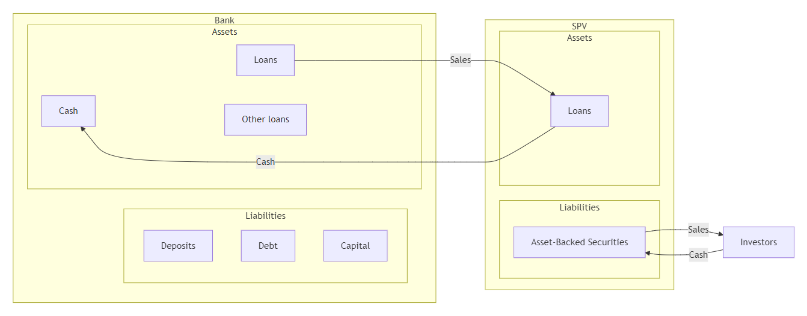
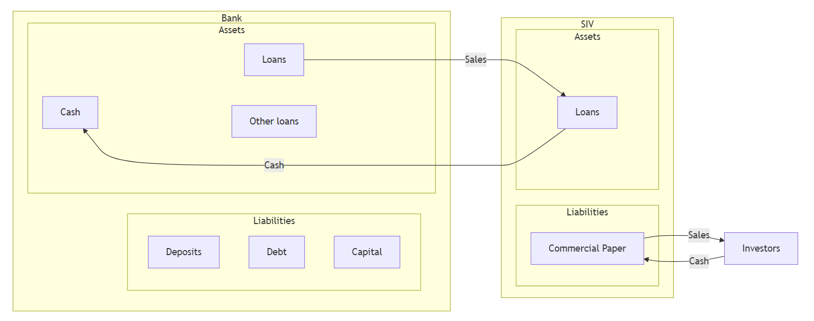

# Loan Sales and Securitisation

## Introduction

For most of the 20th century, banking followed a simple model: **originate-to-hold**. A bank made a loan, kept it on its books, and collected interest until maturity. The bank's fate was tied to its borrowers.

Today, that model is largely dead. Banks now operate under the **originate-to-distribute** model:

1. Make loans.
2. Sell them (loan sales) or repackage them (securitisation).
3. Use the proceeds to originate new loans.

::: {.callout-note}
This shift is not innocent. The originate-to-distribute model fuelled the **2008 global financial crisis** — once banks no longer held the loans they originated, their incentive to screen borrowers collapsed. Subprime mortgages were originated, securitised, sold, and the risk landed everywhere except on the originator's balance sheet.
:::

This week we examine the two mechanisms that made this transformation possible:

- **Loan sales** — transfer ownership (and credit risk) to an outside buyer.
- **Securitisation** — convert illiquid loans into tradable securities.

Both enhance liquidity, free up capital, and provide funding. Both have also, at various points, broken the financial system.

# Loan sales

## Introduction

Central to bank risk management is credit risk, as discussed in [Week 6](https://mingze-gao.com/teaching/AFIN8003/2026S1/Week6) and [Week 7](https://mingze-gao.com/teaching/AFIN8003/2026S1/Week7).

Traditionally, banks adopt several mechanisms to manage credit risk:

1. charging higher interest rates and fees for loans extended to more risky borrowers
2. rationing credits (limit the amount) to more risky borrowers
3. requiring (more) collateral for loans to more risky borrowers
4. implementing more restrictive loan covenants
5. diversification
6. ...

In addition, FIs can use derivatives (e.g., forward, options, swaps) to manage their credit risk.

However, FIs now increasingly use **loan sales** and **securitisation** to control credit risk — and they do so on a massive scale.

## Loan sales

- The use of **credit derivatives** allows an FI to reduce credit risk *without* removing assets from its balance sheet.
- With **loan sales**, a loan is originated by an FI and then sold to an outside buyer — and is removed from the FI's balance sheet.
    - There is a transfer of *ownership* from the seller to the buyer.
    - If a loan is sold **without recourse**, the FI has no explicit liability even if the loan defaults.
    - If a loan is sold **with recourse**, the buyer may put the loan back to the selling FI under certain conditions.
    - In practice, most loans are sold without recourse.
- Loan sales do *not* create new types of securities such as pass-throughs, CMOs, or MBBs — those are products of *securitisation*.

::: {.callout-tip title="A market hiding in plain sight"}
The U.S. secondary loan trading market has grown to around **US\$800 billion in annual trading volume** in recent years, according to the Loan Syndications and Trading Association (LSTA). This market barely existed in 1990.
:::

## Types of loan sales

::: {.columns}
:::: {.column}
__Traditional short-term loan sales__

- secured by assets of the borrowing firm.
- made to investment-grade borrowers or better.
- issued for a short term (90 days or less).
- have yields closely tied to the commercial paper rate.
- sold in units of \$1 million and up.
::::
:::: {.column}
__Leveraged loan sales__

- term loans (TLs).
- secured by assets of the borrowing firm (usually given senior secured status).
- a long maturity (often three- to six-year maturities).
- have floating rates tied to a benchmark — historically LIBOR; since LIBOR's cessation in 2023, predominantly **SOFR** (Secured Overnight Financing Rate) in the U.S. and risk-free rates such as **SONIA** in the U.K.
- have strong covenant protection (in theory — see "covenant-lite" later).

::: {.callout-note}
The definition of "leveraged loan" is ambiguous: some use spreads (e.g., +125 bps over the benchmark) and others use rating criteria (e.g., BB- or lower).
:::

::: {.callout-note}
Leveraged loans can be:

- **nondistressed** — bid price exceeds 90 cents per \$1 of par, or
- **distressed** — bid price is less than 90 cents per \$1 of par, or the borrower is in default.
:::
::::
:::

## Types of loan sales contracts

Two basic forms by which loans can be transferred from seller to buyer.

::: {.columns}
:::: {.column}
__Participation__

- The buyer is **not a party** to the underlying credit agreement, so the initial contract between loan seller and borrower remains in place after the sale.
- The buyer can exercise only *partial* control over changes in the loan contract's terms.
- The buyer has a **double risk exposure**: to the underlying borrower *and* to the selling FI.
::::
:::: {.column}
__Assignment__

- The most common type.
- All rights are transferred on sale — the buyer holds a **direct claim** on the borrower.
- Genuine transfer of ownership.
::::
:::

::: {.callout-warning title="Why does this distinction matter?"}
If the selling FI goes bankrupt, a participation buyer is just another unsecured creditor of that FI. An assignment buyer still owns the loan. **Lehman Brothers (2008)** held large participation interests in syndicated loans — when Lehman failed, many participants discovered their claims were stuck in bankruptcy court alongside everyone else's.
:::

## The bank loan sales market

- @irani_rise_2021 shows that **post-crisis capital regulation** caused banks to sell more risky loans to *nonbanks* (hedge funds, CLOs, business development companies). The result: credit risk did not disappear — it migrated into the shadow banking system.

## The buyers and sellers

::: {.columns}
:::: {.column}
__Buyers__

- Investment banks
- **Vulture funds** (specialised funds that invest in distressed loans — they bought billions of dollars of distressed debt from Argentina and Greece)
- Other domestic banks and foreign banks
- Insurance companies and pension funds
- Bank loan mutual funds
- **CLO managers** (the dominant buyers of leveraged loans today)
::::
:::: {.column}
__Sellers__

- Major money centre banks
- Government and government agencies
- Investment banks
- Foreign banks
- _"Good bank-bad bank"_ structures
    - Special-purpose vehicles established to absorb distressed assets from "good" banks, then sell them off over time.
    - Two famous post-2008 examples: **UKAR** and **Citi Holdings** (see next slide).
::::
:::

::: {.content-hidden when-format="pdf"}
## "Good bank-bad bank": UKAR and Citi Holdings
:::

::: {.callout-note title="UKAR — UK Asset Resolution (2010–2021)"}
After the U.K. nationalised **Northern Rock** (2008) and **Bradford & Bingley** (2008), HM Treasury folded their toxic mortgage books into **UKAR** in 2010. At its peak, UKAR managed roughly **£116 billion** of distressed mortgages — making it temporarily one of the largest mortgage holders in the U.K.

UKAR's job was *not* to lend, but to **sell**. It auctioned loan portfolios to private investors over a decade — e.g., **Cerberus Capital Management** paid roughly £13 billion in 2015 for a chunk of the Northern Rock book. By the time UKAR was wound up in 2021, taxpayers had recovered most of the original £48 billion bailout.
:::

::: {.callout-note title="Citi Holdings (2009–2015)"}
In January 2009, Citigroup carved out its problem assets into **Citi Holdings** — a "bad bank" inside the parent company holding roughly **US\$800 billion** of non-core assets: U.S. subprime mortgages, consumer finance businesses, Smith Barney brokerage, and a long tail of structured-credit positions.

Over six years, Citi Holdings *sold* these assets into the secondary loan market and to private-equity / hedge-fund buyers — shrinking the book by more than 90% before being absorbed back into Citigroup's core operations in 2015. It is the canonical example of a bank using a *good bank-bad bank* split to clean up *without* requiring a separate legal entity or government takeover.
:::

::: {.callout-tip title="Why both ended up as massive sellers"}
A "bad bank" is, by design, **the largest seller in a distressed loan market**. It has no relationship to preserve with the borrower, no need to roll loans forward, and a political or commercial mandate to wind down quickly. This makes them ideal counterparties for the vulture funds, hedge funds, and PE firms listed on the *buyers* side of this slide.
:::

## Why loan sales?

Apart from credit risk management, there are several reasons FIs sell loans:

1. **Reserve requirements** (becoming less important — many jurisdictions have abolished reserve requirements; the Fed set them to zero in March 2020).
2. **Fee income** — origination fees, servicing fees, arranger fees.
3. **Capital costs** — by reducing risk-weighted assets, the bank frees up regulatory capital under Basel III/IV.
4. **Liquidity risk** — by improving asset-side liquidity.

::: {.callout-tip title="The capital arbitrage angle"}
Under Basel III, a B-rated leveraged loan attracts a much higher risk weight than an AAA tranche of a CLO that holds the *same loan*. So a bank can originate a loan, sell it into a CLO, then buy back the AAA tranche — and end up holding the same credit exposure at a fraction of the capital cost. This is exactly the kind of regulatory arbitrage that @irani_rise_2021 documents.
:::

## Factors affecting loan sales growth

1. Access to the commercial paper market
2. Customer relationship (will the borrower object if their bank sells the loan?)
3. Legal concerns
4. BIS capital requirements
5. Market value accounting
6. Asset brokerage and loan trading infrastructure (electronic platforms)
7. Government loan sales
8. Credit ratings
9. Purchase and sale of foreign bank loans
10. ...

# Securitisation

## Introduction

__Asset securitisation__ is another mechanism to manage credit risk, interest rate risk, liquidity and more.

- It is the process of packaging loans or other assets into newly created securities and selling these **asset-backed securities (ABS)** to investors.
- Two basic mechanisms, both involving the creation of **off-balance-sheet subsidiaries**:
    - **Special-purpose vehicle (SPV)**, also known as a special-purpose entity (SPE)
    - **Structured investment vehicle (SIV)**

The mechanism in three steps:

1. The loans are transferred from the originating FI to the SPV or SIV.
2. The SPV or SIV securitises the loans (either directly or through the issuance of asset-backed commercial paper) and sells the resulting asset-backed securities to investors.
3. The proceeds of the asset-backed security sale are paid to the FI that originated the loans.

::: {.callout-important title="Why the off-balance-sheet structure?"}
The whole point of using a separate SPV/SIV is **bankruptcy remoteness**: if the originating bank fails, the assets inside the SPV are *not* part of the bank's bankruptcy estate. Investors in the ABS keep getting paid. This is also why off-balance-sheet treatment historically allowed banks to *not* hold regulatory capital against these exposures — a loophole that Enron exploited spectacularly in 2001, and that Basel III tightened after 2008.
:::

## Securitisation via SPV

1. Bank pools loans and sells them to an SPV.
2. SPV packages the loans, creates new securities backed by cash flows from the underlying pool, and sells them to investors.
3. SPV earns fees from the creation and servicing of these securities.
4. **SPV ceases to exist** when the underlying loans mature.

::: {.callout-note}
The underlying loans belong to the ultimate investors in these ABS — not to the bank, and not to the SPV.
:::

::: {.content-hidden when-format="pdf"}
## Securitisation via SPV (cont'd)
:::

{fig-align="center"}

## Securitisation via SIV

1. Bank pools loans and sells them to a SIV.
2. SIV manages the loans and sells **commercial paper** (or bonds) to investors.
3. SIV earns fees and the expected spreads between loan returns and the cost of the commercial paper (or bonds).
4. **SIV continues to exist!**

::: {.callout-note}
The underlying loans belong to the SIV.
:::

__The SIV acts like a traditional bank__: it holds loans until maturity and issues **short-term** debt instruments.

- SIV cannot take deposits.
- SIV faces **run risk** — and there is no deposit insurance or central bank lender of last resort.

::: {.callout-caution title="The SIV crisis of 2007"}
In summer 2007, investors lost confidence in the value of subprime-backed assets held by SIVs. Asset-backed commercial paper buyers refused to roll over their lending. The SIVs could not sell their long-term assets fast enough to repay short-term debt — a classic *bank run*, just without any actual deposits. Citigroup alone had to bring **roughly US\$58 billion** of SIV assets back onto its balance sheet in December 2007. The entire SIV sector essentially ceased to exist by 2009.
:::

::: {.content-hidden when-format="pdf"}
## Securitisation via SIV (cont'd)
:::

{fig-align="center"}

## Three major forms of securitisation

The major forms of asset securitisation are:

1. the **pass-through security**,
2. the **collateralized mortgage obligation (CMO)**, and
3. the **mortgage-backed bond (MBB)**.

## Pass-through security

Pass-through securities "pass through" payments by underlying borrowers (e.g., households repaying mortgages) to secondary-market investors holding an interest in the mortgage pool.

- Each pass-through security represents a **fractional ownership share** in a mortgage pool.
- A 1% ownership share is entitled to 1% of the principal and interest payments made over the life of the mortgages underlying the pool.
- **Prepayment risk** — if rates fall, borrowers refinance and you get your principal back early, exactly when reinvestment yields are lowest.

::: {.callout-note}
Pass-throughs are the primary mechanism for securitisation. The U.S. agency MBS market — issued by Fannie Mae, Freddie Mac, and Ginnie Mae — exceeds **US\$9 trillion outstanding**, making it the second-largest fixed-income market in the world after U.S. Treasuries.
:::

## Collateralized Mortgage Obligation (CMO)

CMOs are a second and still-growing securitisation mechanism.

- A CMO **repackages** the cash flows from mortgages into multiple classes — a *multi-class pass-through*.
- Each bond class (**tranche**) has a different guaranteed coupon.
- Early cash flows from mortgage prepayments are allocated in a **pre-specified order**, thereby mitigating prepayment risk for some tranches at the expense of others.

::: {.callout-tip title="The waterfall logic"}
Think of the CMO as a pyramid of buckets. Cash flowing in from borrowers fills the top bucket (the senior tranche) first. Only when the top bucket overflows does the next tranche down get paid. Losses, conversely, hit from the bottom up — the *equity* tranche absorbs the first defaults. This is the same logic that powers CDOs, CLOs, and almost every structured-credit product.
:::

::: {.content-hidden when-format="pdf"}
## Collateralized Mortgage Obligation (CMO) (cont'd) {.smaller}
:::

| CMO tranche |    Principal payment priority | Prepayment exposure / protection                | Expected average life              | Typical buyers                                                                                        |
|-------------|------------------------------:|-------------------------------------------------|------------------------------------|-------------------------------------------------------------------------------------------------------|
| **Class A** |                    Paid first | Highest prepayment exposure; minimum protection | Shortest                           | Depository institutions, banks, thrifts                                                               |
| **Class B** | Paid after Class A is retired | Some prepayment protection                      | Medium; often around **5–7 years** | Pension funds, life insurance companies                                                               |
| **Class C** | Paid after Class B is retired | Greatest prepayment protection among A/B/C      | Longest                            | Insurance companies and pension funds seeking long-duration assets to match long-duration liabilities |

## Mortgage-Backed Bond (MBB) and Covered Bond

MBBs (and the closely related **covered bonds** common in Europe and Australia) are the third securitisation vehicle.

They differ from pass-throughs and CMOs in two main aspects:

1. MBBs normally **remain on the balance sheet** of the issuing FI.
2. **No direct link** between cash flows on the underlying assets and the cash flows on the bond.

::: {.callout-note}
Underlying mortgages are more of *collateral* for the MBBs — the bond pays a fixed coupon regardless of what the mortgages do, as long as the issuer is solvent.
:::

::: {.callout-tip title="An Australian angle"}
Australian banks are major issuers of **covered bonds** — APRA allows ADIs to issue covered bonds backed by a segregated pool of high-quality mortgages, capped at 8% of Australian assets. Combined with the **Committed Liquidity Facility's** wind-down (completed in 2023), covered bonds have become a core funding tool for the Big Four.
:::

::: {.content-hidden when-format="pdf"}
## Mortgage-Backed Bond (MBB) and Covered Bond (cont'd)
:::

The process involved:

1. The FI segregates a group of mortgage assets on its balance sheet and pledges (covers) this group as collateral against the MBB issue.
2. A trustee normally monitors the segregation of assets and ensures that the market value of the collateral exceeds the principal owed to MBB holders.
3. As a result, FIs back most MBB issues by **excess collateral**.
4. This excess collateral ensures the bonds can be sold with a high credit rating — potentially *higher than the FI itself*.

## The goods and bads about MBB and covered bond

However, MBBs are *less* appealing to FIs for several reasons:

1. The underlying mortgages **remain on the FI's balance sheet**.
2. **Excess collateral** exacerbates the size of mortgages tied up on the FI's balance sheet.
3. The FI remains liable for capital adequacy and reserve requirement taxes due to these mortgages staying on balance sheet.

::: {.content-hidden when-format="pdf"}
## The goods and bads about MBB and covered bond (cont'd)
:::

::: {.callout-caution title="Hidden subsidy: covered bonds vs. deposit insurance"}
FIs issuing MBBs can gain at the cost of **taxpayers' money** through the deposit insurance system. Let's see how.
:::

Consider an FI with \$20 million in long-term mortgages as assets, financed with \$10 million in short-term *uninsured* deposits and \$10 million in *insured* deposits.

|       Assets         |        |     Liabilities      |        |
|----------------------|--------|----------------------|--------|
| Long-term mortgages  | \$20   | Insured deposits     | \$10   |
|                      |        | Uninsured deposits   | \$10   |
|                      | \$20   |                      | \$20   |

- A **positive duration gap**: interest rate risk and more.
- Uninsured depositors are likely to demand a higher interest rate for their deposits.
- Insured depositors may demand an interest rate only marginally above the risk-free rate (since their deposits are fully insured).

::: {.content-hidden when-format="pdf"}
## The goods and bads about MBB and covered bond (cont'd)
:::

To lower the duration gap and funding cost, the FI may choose securitisation via an MBB issue.

- Pledge \$12 million of mortgages as collateral backing a \$10 million long-term MBB issue.
- This **excess collateralisation** reduces the required yield on the MBB — perhaps even lower than the rate paid on uninsured deposits.
- The FI uses the proceeds to retire the \$10 million of uninsured deposits.

| Assets                                            |      | Liabilities      |      |
|---------------------------------------------------|------|------------------|------|
| Collateral (market value of segregated mortgages) | \$12 | MBB issue        | \$10 |
| Other mortgages                                   | 8    | Insured deposits | \$10 |
|                                                   | \$20 |                  | \$20 |

::: {.callout-important}
The \$10 million in *insured* deposits is now backed only by \$8 million in *unpledged* assets!
If the FI fails, MBB holders are paid first (their \$12 million collateral is ring-fenced). The deposit insurer is left footing the bill for the shortfall. **The taxpayer subsidises the spread the bank just pocketed.** This is the asset encumbrance problem that has made regulators wary of how much covered bond issuance to permit.
:::

## Securitisation of non-mortgage assets

The major use of the three securitisation vehicles (pass-throughs, CMOs, and MBBs) is packaging fixed-rate mortgages. But securitisation can also be applied to other assets:

- **Automobile loans** (auto ABS — major issuers include Ford, GM Financial, Tesla)
- **Credit card receivables** (certificates of amortising revolving debts — Amex, Capital One)
- **Small business loans** guaranteed by the Small Business Administration
- **Junk bonds**
- **Adjustable rate mortgages**
- **Commercial and industrial loans** → collateralized loan obligations (CLOs)
- **Leveraged loans (CLOs)** — the dominant non-mortgage securitisation today
- **Royalty streams** (David Bowie famously issued "Bowie Bonds" in 1997 backed by his music royalties)
- **Buy now, pay later receivables** (a recent and untested asset class)

## Leveraged loans via CLOs

::: {.callout-warning title="The market that won't quit"}
Regulators have warned about leveraged loans for nearly a decade. The market kept growing anyway.
:::

- In **September 2018**, the Federal Reserve flagged leveraged loans as a financial stability risk, with similar warnings from the **Bank of England, IMF, and BIS**.
- The U.S. leveraged loan market roughly doubled in the six years to 2018, with **highly leveraged borrowers** (debt above 5× EBITDA) accounting for roughly half of new institutional issuance — surpassing the pre-2008 share.
- The U.S. leveraged loan market is now approximately **US\$1.4–1.5 trillion**, and the **U.S. CLO market exceeds US\$1 trillion outstanding** — comparable in scale to the 2007 subprime mortgage market.
- Investor demand has weakened protections on loans to junk-rated companies: roughly **90% are now "covenant-lite"**, compared to less than 25% in 2006–2007 [@berlin_concentration_2020].
- The rating quality has declined — over 60% of leveraged loans are rated B2 or lower — yet CLOs continue to absorb **60–70%** of new syndicated leveraged loan issuance.

::: {.callout-tip title="Did the CLO market blow up in 2020?"}
Despite a sharp Q1 2020 sell-off when COVID-19 hit, CLOs **survived remarkably well** — defaults peaked far below the doomsday scenarios sketched by 2018–2019 warnings, partly because the Fed's emergency facilities supported credit broadly. Whether that signals genuine resilience or just one rescue away from the next crisis is one of the open questions in current banking research.
:::

# Finally...

## Key takeaways

1. **Originate-to-distribute** transformed banking — and helped break it in 2008.
2. **Loan sales** transfer ownership; **securitisation** repackages cash flows into tradable securities.
3. **SPVs disappear** when assets mature; **SIVs are zombie banks** with no deposit insurance and run risk.
4. Pass-throughs, CMOs, and MBBs each handle prepayment and balance-sheet treatment differently.
5. **CLOs are the new subprime** — same scale, same regulatory worry, but (so far) better borrower protections at the structure level.

## Suggested readings

- [Loan Syndications and Trading Association (LSTA)](https://www.lsta.org/) — the trade body for the U.S. secondary loan market.
- Berlin, M., Nini, G., & Yu, E. G. (2020). [Concentration of control rights in leveraged loan syndicates](https://doi.org/10.1016/j.jfineco.2020.02.002). *Journal of Financial Economics*, 137, 249–271.
- Irani, R. M., Iyer, R., Meisenzahl, R. R., & Peydró, J.-L. (2021). [The Rise of Shadow Banking: Evidence from Capital Regulation](https://doi.org/10.1093/rfs/hhaa106). *The Review of Financial Studies*, 34, 2181–2235.

## References
