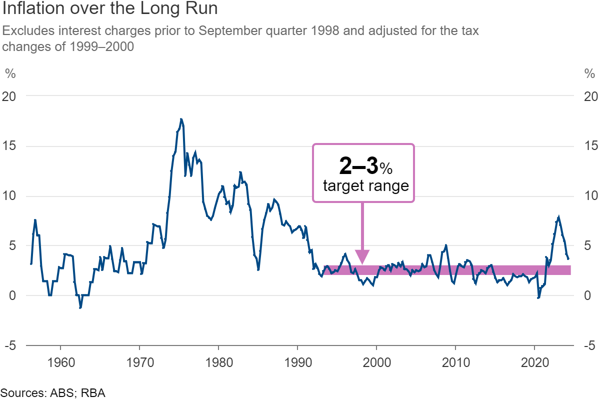
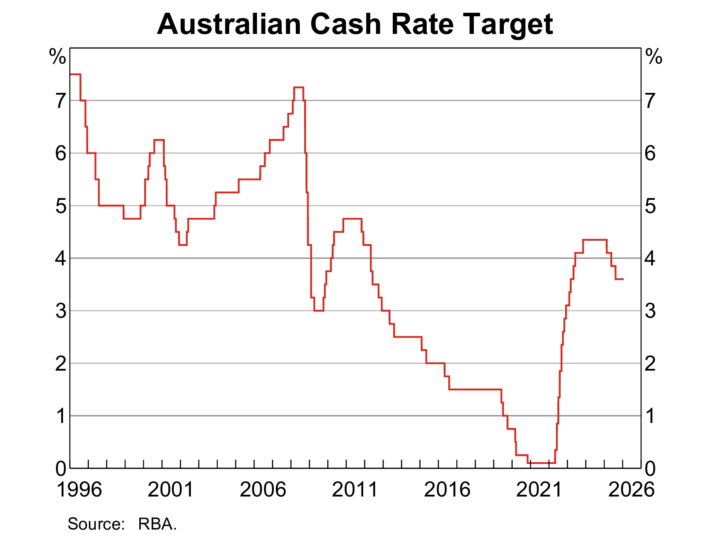
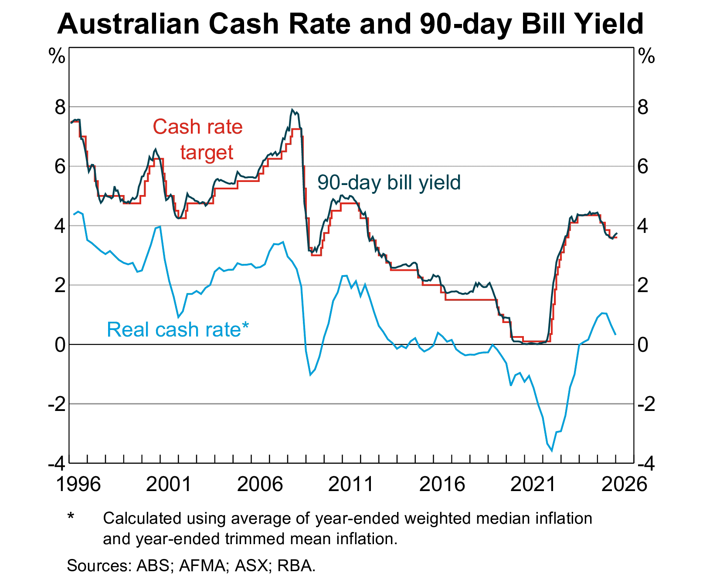
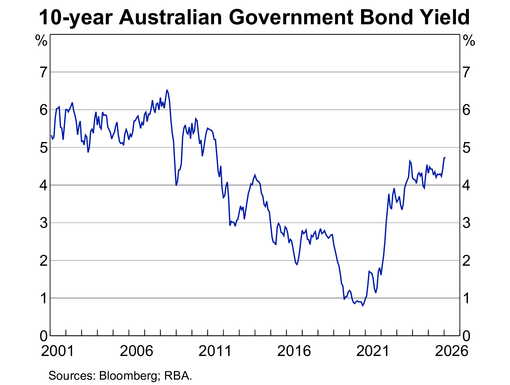
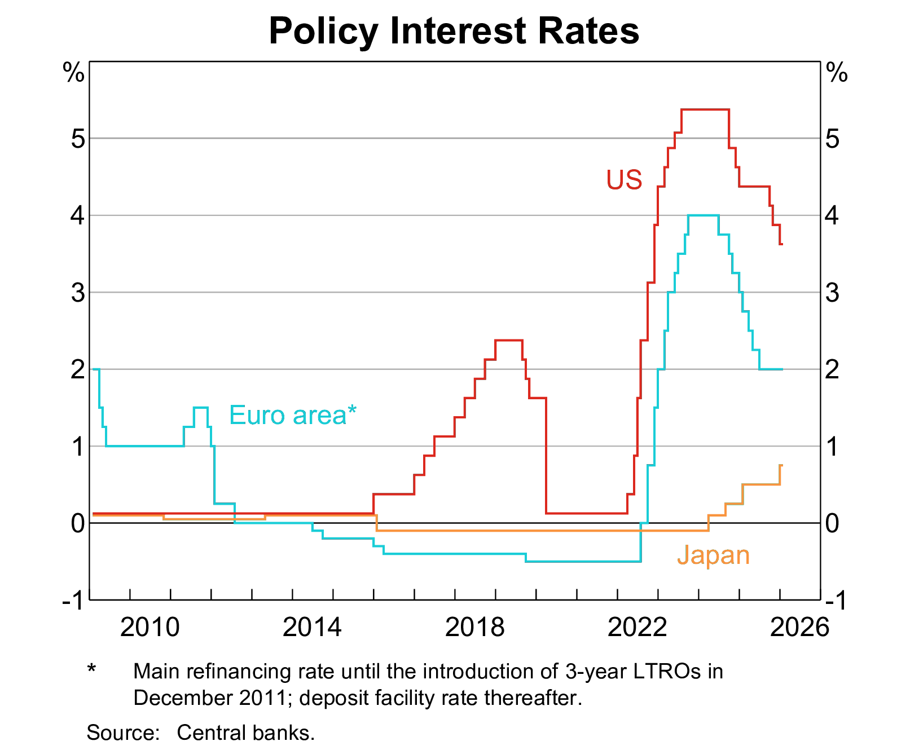
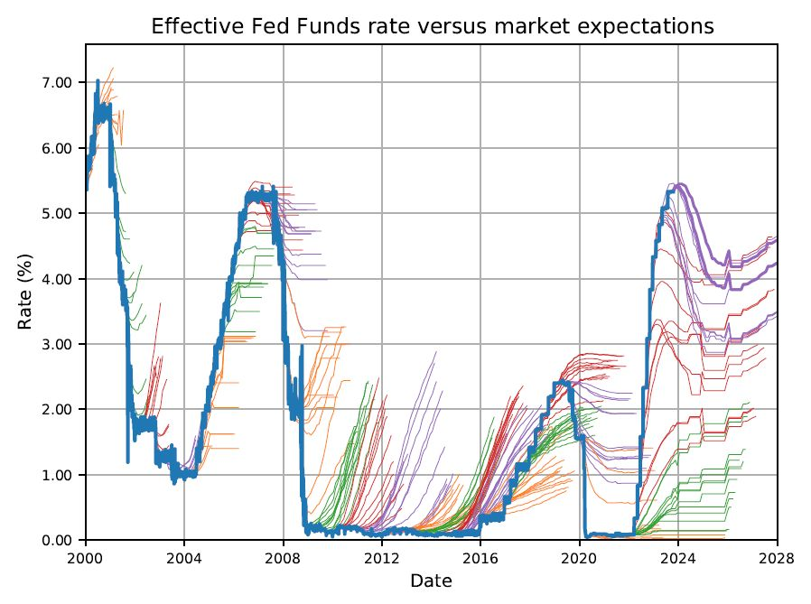

# Interest rate risk

## A $16 billion lesson

::: {.callout-warning title="March 10, 2023 — Silicon Valley Bank collapses"}
In 48 hours, the 16th-largest bank in the United States was seized by regulators. Depositors withdrew **$42 billion in a single day**. The cause? Not fraud. Not bad loans. **Interest rate risk.**
:::

::: {.fragment}
SVB had loaded up on long-duration bonds when rates were near zero. When the Fed raised rates by over 4 percentage points in 2022, the market value of those bonds plummeted — wiping out nearly all of SVB's equity.

We will return to SVB throughout this lecture. By the end, you will be able to quantify exactly how exposed SVB was — and why it collapsed.
:::

## What is interest rate risk?

::: {.callout-note title="Interest Rate Risk"}
__Interest rate risk__ is the possibility of a financial loss due to changes in interest rates.
:::

Recall that in Week 1, we explained one of the key functions performed by financial institutions (especially depositary institutions) is __maturity transformation__. For DIs, they take short-term deposits from depositors and make long-term loans to borrowers.

| Assets                       | Liabilities and Equity           |
|------------------------------|----------------------------------|
| Loans (relatively long-term) | Deposits (relatively short-term) |
| Other assets                 | Other liabilities                |
|                              | Equity                           |

: Typical balance sheet of a DI {#tbl-balance-sheet}

As a result,

1. This maturity transformation means that FIs have __mismatches of maturities__ of their liabilities (e.g., deposits) and assets (e.g., loans).
2. Maturity mismatch exposes FIs to (unexpected) interest rate changes:
   1. refinancing and reinvestment risks
   2. financial instruments have different levels of value sensitivity to interest rate changes
3. Interest rate _is_ volatile and can be unexpected.

## Maturity mismatch: refinancing risk

Consider an example bank that has $2 million of 10-year fixed-rate loans and $1 million of 1-year fixed-rate term deposits now. The bank expects to have the same balance sheet in the future.

What would happen in 1 year from now?

- Term deposits mature. Some deposits may be withdrawn.
- In this case, the bank needs to take additional deposits to maintain the size of balance sheet.
- However, the interest rate (deposit rate) could be higher in the future, which means higher costs for the bank.

This is a typical __refinancing risk__ — the costs of rolling over or re-borrowing funds rise above the returns generated on investments.

::: {.callout-tip}
Think of this like a homeowner on a variable-rate mortgage when the RBA hikes rates: your repayments go up but your income (asset) stays the same.
:::

## Maturity mismatch: reinvestment risk

Consider another example bank that has $2 million of 1-year fixed-rate loans and $1 million of 2-year fixed-rate term deposits now. The bank expects to have the same balance sheet in the future.

What would happen in 1 year from now?

- Loans mature.
- In this case, the bank needs to reinvest into some other assets (e.g., make loans).
- However, the interest rate (on the loan) could be lower in the future, which means reduced returns for the bank.

This is a typical __reinvestment risk__ — the returns on funds to be reinvested fall below the cost of funds.

::: {.callout-tip}
The flip side: imagine a retiree reinvesting maturing term deposits when rates have fallen. Their income drops even though their cost of living hasn't.
:::

## Financial instruments' value sensitivity to interest rate

The value of longer-maturity instruments typically is more sensitive to interest rate.

::: {.columns}
:::: {.column width="50%"}
For example, a bond's price is given by

$$
P = \sum_{t=1}^T\frac{C}{(1+r)^t} + \frac{F}{(1+r)^T}
$${#eq-bond-pv}

where $C$ is coupon payment, $F$ face value, $T$ maturity, and $r$ interest rate.

If a FI is financed by issuing long-term bonds and invests in short-term loans, given a change in interest rate, its liabilities' value would change by more than the change in its assets' value, thereby causing an impact on its net worth.
::::

:::: {.column width="50%"}
::: {.content-hidden when-format="pdf"}
```{ojs}
//| echo: false

viewof maturity4 = Inputs.range(
  [1, 30],
  {value: 15, step: 1, label: "Maturity (years):"}
)
viewof couponRate4 = Inputs.range(
    [0.01, 0.2],
    {value: 0.05, step: 0.01, label:"Coupon rate:"}
)
d = {
  const f = 100;
  let c, m;
  c = couponRate4;
  m = maturity4;
  function pv(c, f, t, r) {
    return c * (1 - (1+r)**(-t)) / r + f / (1+r)**(t)
  }
  const prices = {"YTM": [], "Price": []};
  let coupon = f * c;
  for (let ytm = 0.01; ytm < 20; ytm++) {
    let price = pv(coupon, f, m, ytm/100);
    prices["YTM"].push(ytm);
    prices["Price"].push(price);
  }
  return prices;
}

data4 = transpose(d)
Plot.plot({
  caption: "Assume $100 bond, annual coupons paid in arrears and effective annual discount rate.",
  x: {padding: 0.4, label: "YTM (%)"},
  grid: true,
  marks: [
    Plot.ruleY([0, 100]),
    Plot.ruleX([0]),
    Plot.lineY(data4, {x: "YTM", y: "Price", stroke: "blue"}),
  ]
})
```
:::
::::
:::

## The level and movement of interest rates

::: {.columns}
:::: {.column width="50%"}
The degree of interest rate volatility is directly linked to the monetary policy of the Reserve Bank of Australia (RBA).

- The RBA targets an inflation band of 2–3% per annum (in place since 1993) and uses the **cash rate** as its primary instrument.
- When the economy is running hot, the RBA raises the cash rate — which flows through to every loan and deposit rate in the system.
- Conversely, in downturns (such as COVID), the RBA cuts rates to near zero.

These shifts in the policy stance — particularly when they are large and fast — generate significant interest rate volatility across the financial system.
::::

:::: {.column width="50%"}
{#fig-inflation-target .lightbox}
::::
:::

## The level and movement of interest rates

::: {.columns}
:::: {.column width="50%"}
{.lightbox #fig-cash-rate-target}

[Source: RBA](https://www.rba.gov.au/statistics/cash-rate/)
::::

:::: {.column width="50%"}
{.lightbox #fig-cash-rate-target-90d-bill-yield}
::::
:::

## The level and movement of interest rates

::: {.columns}
:::: {.column width="50%"}
{.lightbox #fig-10yr-gov-bond-yield}
::::

:::: {.column width="50%"}
{.lightbox #fig-policy-interest-rates}
::::
:::

::: {.callout-important}
Notice the 2022–23 hiking cycle: the US Fed raised rates by over 500 basis points in 18 months — the fastest tightening in 40 years. This is the macroeconomic backdrop for the SVB collapse.
:::

## The market is bad at guessing interest rates

{.lightbox #fig-bad-mkt-expections}

Image source: [Steven Desmyter](https://www.linkedin.com/posts/steven-desmyter-a211621_this-is-what-higher-for-longer-looks-like-activity-7123697175565348864-jFyq)

::: {.callout-tip}
SVB's own risk models assumed rates would stay low. So did the market. This is precisely why managing — not just forecasting — interest rate risk matters.
:::

## Interest rate risk and Basel framework

As discussed last week, the three pillars of Basel framework (since Basel II) include:

1. minimum capital requirements
2. supervisory review
3. effective use of disclosure (for market discipline)

The Pillar 1 involves a capital adequacy framework surrounding minimum ratios of various capital (CET1, Tier 1, Total) to RWA.

- The RWA is sum of RWAs for credit risk, market risk, and operational risk.
- There is currently no "RWA for interest rate risk".

The __Interest Rate Risk in the Banking Book (IRRBB)__ is part of the Basel capital framework's Pillar 2 (and Pillar 3).

## Interest rate risk and Basel framework (cont'd)

Basel III guidelines address the issue of interest rate risk primarily through:

**Interest Rate Risk in the Banking Book (IRRBB)**

- Banks are required to identify, measure, monitor, and control IRRBB. This involves regular stress testing, scenario analysis, and the application of appropriate capital charges to cover potential losses from adverse interest rate movements.
- Basel III mandates regular stress testing to evaluate the impact of significant changes in interest rates on a bank's earnings and capital.

**Supervisory Review Process (Pillar 2)**

- Under Pillar 2, banks are required to conduct internal assessments of their capital adequacy in relation to their risk profile, including IRRBB. Supervisors review these assessments to ensure adequate management.

**Disclosure Requirements (Pillar 3)**

- Under Pillar 3, Basel III enhances transparency by requiring banks to disclose their exposure to interest rate risk. This includes detailed reporting on the impact of interest rate changes on earnings and economic value.

::: {.callout-warning}
SVB was exempt from enhanced IRRBB stress testing requirements under US rules — a regulatory gap that regulators have since moved to close.
:::

# Measuring interest rate risk

## An overview

From here, we study specific models and techniques for measuring an FI's interest rate risk. But first, let's establish the general framework.

::: {.fragment}
To measure interest rate risk, we need to specify:

- Which FI characteristic are we concerned about? Income? Net worth? Something else?
- How sensitive is that characteristic to interest rate changes?
- What is the potential size of the rate move?
- Are we using book value or market value?
- What time frame are we considering?
:::

::: {.fragment}
::: {.callout-tip title="Why does the choice of measure matter?"}
A bank can look perfectly healthy on a book-value basis while being technically insolvent on a market-value basis. SVB's held-to-maturity (HTM) portfolio was carried at amortised cost — but its fair value had fallen by $15 billion.
:::
:::

## Interest rate risk models

The rest of this lecture discusses two models for measuring interest rate risk with different focuses.

|                             | Repricing model           | Duration model |
|-----------------------------|---------------------------|----------------|
| Which characteristic?       | Net interest income (NII) | Net worth      |
| Sensitivity measurement?    | By assumption             | Duration       |
| Size of risk?               | Flexible                  | Flexible       |
| Book value or market value? | Book value                | Market value   |
| Time frame?                 | Flexible                  | Flexible       |

: A simple comparison of two interest rate risk models {#tbl-comparison-interest-rate-risk-models}

::: {.callout-note}
The repricing model would have shown SVB as a concern (rising deposit costs). The duration model would have screamed alarm — it accounts for the market value collapse of its long-duration bond portfolio.
:::

# Repricing model

## The repricing model

- Repricing model is also known as the funding gap model.
  - A book value accounting cash flow analysis of the __repricing gap__ between the interest income earned on an FI's assets and the interest paid on its liabilities over some period.
  - Focus on the changes of net interest income (NII).
- A simple model used by small FIs.
- APRA requires smaller ADIs to use the repricing method to estimate interest rate exposures in their _banking book_ for capital adequacy purposes.
  - A revised reporting standard (ARS 117.0) was completed in July 2024 and became effective in 2025.[^reading]

[^reading]: See suggested readings.

## Repricing gap, RSA and RSL

__Repricing gap__ is the difference between rate-sensitive assets (__RSA__) and rate-sensitive liabilities (__RSL__).

- RSA: assets whose interest rates will be repriced or changed over some future period (rate-sensitive assets)
- RSL: liabilities whose interest rates will be repriced or changed over some future period (rate-sensitive liabilities)

An asset (or liability) is "rate-sensitive" if it is repriced at or near current market interest rates within a certain time horizon (or maturity bucket). For example,

- a _variable-rate_ mortgage's interest rate may be reset every quarter based on the prevailing interest rate.
- interest rate of term deposits are also adjusted frequently.[^example]

[^example]: [Historical term deposit rates of Australian banks](https://www.finder.com.au/term-deposits/historical-term-deposit-rates)


## Maturity (Tenor) buckets

Under repricing model, banks report their repricing gaps for various maturity buckets. For example,

1. One day (overnight).
2. More than 1 day to 3 months.
3. More than 3 months to 6 months.
4. More than 6 months to 12 months.
5. More than 1 year to 5 years.
6. More than 5 years.

::: {.callout-tip title="How to determine RSA/RSL for each bucket?"}
Ask a simple question: Will or can this asset or liability have its interest rate changed within the maturity bucket? If yes → rate-sensitive. If no → not rate sensitive.
:::

## Maturity buckets and RSA/RSL

Let's practice. Try to identify the one-year RSA and RSL given the following assets and liabilities of a bank.

- Assets:
  - [ ] 1-year consumer loans
  - [ ] 2-year consumer loans
  - [ ] 3-month Treasury bills
  - [ ] 3-year Treasury bonds
  - [ ] 20-year fixed rate mortgage
  - [ ] 30-year floating rate mortgage (repriced every quarter)
- Liabilities:
  - [ ] demand deposits (non-interest-bearing)
  - [ ] 3-month certificates of deposits (CDs)
  - [ ] 6-month commercial papers
  - [ ] 1-year term deposits
  - [ ] 2-year term deposits


## Repricing gaps

|           |                            | **Assets** | **Liabilities** | **Gaps** | **Cumulative gap** |
|-----------|----------------------------|------------|-----------------|----------|--------------------|
| 1         | One day                    | 20         | 30              | -10      | -10                |
| 2         | One day to three months    | 30         | 40              | -10      | -20                |
| 3         | Three months to six months | 70         | 85              | -15      | -35                |
| 4         | Six months to 12 months    | 90         | 70              | +20      | -15                |
| 5         | One year to five years     | 40         | 30              | +10      | -5                 |
| 6         | Over five years            | 10         | 5               | +5       | 0                  |
| **Total** |                            | $260       | $260            |          |                    |

: Repricing gaps (\$ millions) {#tbl-repricing-gaps}

For example, a negative $10 million difference between RSA and RSL repriced in one day.
A rise in the overnight rate would lower the FI's __net interest income__ since the FI has more rate-sensitive liabilities than assets in this bucket.

## The repricing model

The repricing model estimates the change in the FI's __net interest income__ in a particular repricing bucket if interest rates change.

$$
\Delta NII_i = (GAP_i) \times \Delta R_i = (RSA_i - RSL_i) \times \Delta R_i
$$

where:

- $\Delta NII_i$ is the change in net interest income in the $i$th bucket.
- $GAP_i$ is the dollar size of the gap between the book value of RSA and RSL in maturity bucket $i$.
- $\Delta R_i$ is the change in the level of interest rates impacting assets and liabilities in the $i$th bucket.

## The repricing model: examples

::: {.callout-note title="One-day repricing gap"}
In the first bucket of @tbl-repricing-gaps, if the gap is negative $10 million and overnight interest rate rises by 1 percent, the annualised change in the FI's future NII is:

$$
\Delta NII_i = GAP_i \times \Delta R_i = -\$10M \times 0.01 = -\$100,000
$$

So, the repricing model suggests a loss of $100,000 in net interest income for the FI.
:::

::: {.callout-note title="One-year (cumulative) repricing gap"}
The one-year cumulative repricing gap is −$15 million from @tbl-repricing-gaps.

$$
\Delta NII = CGAP \times \Delta R = -\$15M \times 0.01 = -\$150,000
$$

If the average interest rate rises by 1 percent, the model suggests a loss of $150,000 in net interest income.
:::

## The repricing model: examples

Assume both RSAs and RSLs equal $155 million. Suppose that there is a general interest rate rise and that the rates on RSAs rise by 1.2 percent and rates on RSLs rise by only 1 percent. What is the resulting change in NII?

::: {.fragment}
$$
\Delta NII = RSA \times \Delta R^A - RSL \times \Delta R^L = (\$155M \times 0.012) - (\$155M \times 0.01) = \$310,000
$$
:::

Suppose the RSA is $155 million and the RSL is $140 million. Interest rates rise by 1.2% on RSAs and 1% on RSLs. What is the change in NII?

::: {.fragment}
$$
\Delta NII = RSA \times \Delta R^A - RSL \times \Delta R^L = (\$155M \times 0.012) - (\$140M \times 0.01) = \$460,000
$$
:::

## Real-world application of repricing model

Let's look at a real-world application by [Texas Capital Bank](https://investors.texascapitalbank.com/overview/default.aspx), a commercial bank headquartered in Dallas, Texas.

We can find its annual reports from SEC's [EDGAR](https://www.sec.gov/edgar/search/) system, which allows us to search for any corporate filings.

- Its [most recent annual report](https://www.sec.gov/Archives/edgar/data/1077428/000107742825000036/tcbi-20241231.htm) is filed on 2025-02-11.
- Check _Item 7A. Quantitative and qualitative disclosure about market risk_.

## The repricing model: problems

The repricing model is simple and intuitive, but is NOT an accurate measure of interest rate risk.

Major shortcomings:

- It is over-aggregative.
- It ignores the market value effects of interest rate changes: it focuses on income and ignores capital gains/losses.
- It uses the banking book and hence book values of assets and liabilities.
- It fails to deal with the problem of rate-insensitive asset and liability runoffs and prepayments.
- It ignores cash flows from off-balance-sheet activities.

::: {.callout-warning}
SVB reported a manageable repricing gap for its short-term NII. But the repricing model completely missed the $15 billion hole in the market value of its bond portfolio. This is exactly why regulators push larger banks towards market-value-based models.
:::


# Duration model

## Motivation

In the early 2000s, the BIS issued a consultative document suggesting a standardised model be used by regulators to evaluate a bank's interest rate risk exposure. The approach suggested is firmly based on market value accounting and the __duration gap model__.

The duration gap model:

- considers market values and the maturity distributions of an FI's assets and liabilities.
- considers the degree of leverage on an FI's balance sheet.
- considers the timing of the payment or arrival of cash flows on assets and liabilities.
- is a more comprehensive measure of an FI's interest rate risk.

Bigger banks have adopted the duration model as their primary measure of interest rate risk.[^bigbank]

[^bigbank]: Biggest banks may be allowed to use their internal models subject to regulatory approval.

## Duration

The essence of the duration gap model is the concept of __duration__, which is covered in introductory finance courses.

Simply put, duration is the weighted-average time to maturity on the loan using the relative present values of the cash flows as weights.

$$
D = \sum_{t=1}^{N} w_t \times t
$$

where $D$ is the duration, and

$$
w_t = \frac{\text{PV of the cash flow at time } t}{\text{Total PV of all cash flows}}
$$

::: {.callout-tip}
Intuition: duration is the "centre of gravity" of a bond's cash flows. A long-maturity bond has a high duration — its cash flows sit far in the future, so their present value is very sensitive to the discount rate.
:::

## Duration: example

Consider the duration of a 3-year coupon bond with a face value of $1,000, a coupon rate of 5%, and a yield to maturity of 4%. The bond pays annual coupons.

```{python}
# | label: tbl-duration-example
# | tbl-cap: Calculating the duration of a 3-year bond
import pandas as pd

# Parameters
face_value, coupon_rate, yield_to_maturity, years = 1000, 0.05, 0.04, 3
annual_coupon_payment = face_value * coupon_rate

# Initialize and calculate values
data = [
    (t, annual_coupon_payment if t < years else annual_coupon_payment + face_value)
    for t in range(1, years + 1)
]
total_pv = sum(payment / (1 + yield_to_maturity) ** t for t, payment in data)
table = [
    (
        t,
        payment,
        pv := payment / (1 + yield_to_maturity) ** t,
        weight := pv / total_pv,
        t * weight,
    )
    for t, payment in data
]

# Create DataFrame
df = pd.DataFrame(
    table,
    columns=[
        "Time (Years)",
        "Payment ($)",
        "PV of Payment ($)",
        "Weight (PV/Total PV)",
        "Weighted Time",
    ],
)

# Add totals row
totals = df.sum(numeric_only=True)
totals = pd.DataFrame(totals).T
totals["Time (Years)"] = "Total"
df = pd.concat([df, totals], ignore_index=True)

df.style.highlight_max(["Weighted Time"]).format(precision=2).hide()
```

The bond's duration is 2.86 years.

## Duration: another example

Consider the duration of a 5-year coupon bond with a face value of $1,000, a coupon rate of 4%, and a yield to maturity of 6%. The bond pays annual coupons.

```{python}
# | label: tbl-duration-example-2
# | tbl-cap: Calculating the duration of a 5-year bond
import pandas as pd

# Parameters
face_value, coupon_rate, yield_to_maturity, years = 1000, 0.04, 0.06, 5
annual_coupon_payment = face_value * coupon_rate

# Initialize and calculate values
data = [
    (t, annual_coupon_payment if t < years else annual_coupon_payment + face_value)
    for t in range(1, years + 1)
]
total_pv = sum(payment / (1 + yield_to_maturity) ** t for t, payment in data)
table = [
    (
        t,
        payment,
        pv := payment / (1 + yield_to_maturity) ** t,
        weight := pv / total_pv,
        t * weight,
    )
    for t, payment in data
]

# Create DataFrame
df = pd.DataFrame(
    table,
    columns=[
        "Time (Years)",
        "Payment ($)",
        "PV of Payment ($)",
        "Weight (PV/Total PV)",
        "Weighted Time",
    ],
)

# Add totals row
totals = df.sum(numeric_only=True)
totals = pd.DataFrame(totals).T
totals["Time (Years)"] = "Total"
df = pd.concat([df, totals], ignore_index=True)

df.style.highlight_max(["Weighted Time"]).format(precision=2).hide()
```

The bond's duration is 4.61 years. Note: coupon < YTM, so the bond trades at a **discount** — market price ≈ **$915.73**, not $1,000.


## The economic meaning of duration

We are interested in the sensitivity of bond price to interest rate.

- That is, how much the price of a bond changes when the interest changes.

Duration directly measures the interest rate sensitivity of an asset or liability:

$$
\frac{\Delta P}{P} = - D \times \frac{\Delta R}{1+R} = - MD \times \Delta R
$$ {#eq-duration-and-price}

where

- $\Delta P$ is the price change of assets or liabilities
- $\Delta R$ is the change of interest rate
- $MD$ is the __modified duration__ that equals to $\frac{D}{1+R}$

The larger the numerical value of $D$, the more sensitive is the price of that asset or liability to changes or shocks in interest rates.

::: {.callout-important}
The relationship is only true for small changes in the yield.
:::

## The economic meaning of duration

Why does it work?

$$
\frac{\Delta P}{P} = - D \times \frac{\Delta R}{1+R} = - MD \times \Delta R
$$

- We can write out the price formula of a bond and take its partial derivative with respect to yield.
- See my [detailed explanation here](https://mingze-gao.com/posts/fixed-income/bond-price-volatility/#measure-of-price-yield-sensitivity-duration).

Why is it only true for small changes in the yield?

- Because duration also changes as yield changes.
- We assumed the duration is constant given a small $\Delta R$.

## Duration and price changes: example

Consider the previous example of a 5-year annual-coupon bond in @tbl-duration-example-2 with a 4% coupon rate and 6% yield. It has a duration of 4.61 years and a market price of **$915.73**.

What is the price change if the interest rate (yield) decreases by 1 percent ($\Delta R=-0.01$)?

::: {.callout-note}
Recall @eq-duration-and-price that $\frac{\Delta P}{P} = - D \times \frac{\Delta R}{1+R} = - MD \times \Delta R$.

$$
\text{Modified duration} = MD = \frac{D}{1+R} = \frac{4.61}{1+0.06} = 4.349
$$

Using the bond's **current market price** of $915.73:

$$
\Delta P = - MD \times P \times \Delta R = - 4.349 \times \$915.73 \times (-0.01) \approx +\$39.82
$$

That is, a one percentage point (100 basis points) decrease in yield would increase bond price by approximately **$39.82**.

Note that $MD\times P$ is also called "dollar duration" — the dollar sensitivity per unit change in yield.
:::

## Features of duration

- Duration increases with the maturity of a fixed-income security, but at a decreasing rate.
- Duration decreases as the yield on a security increases.
- Duration decreases as the coupon or interest payment increases.


## Duration and interest rate risk management

Now that we have refreshed our knowledge of duration, how is duration relevant in FI's interest rate risk management?

Let's consider two cases.

1. A single security.
2. A portfolio of securities (e.g., the balance sheet).

## Duration and interest rate risk management: single security

Superannuation funds or insurers often have to make a specific amount of payment to their policyholders at a given future date. How to guarantee it? Investments may decrease in value if interest rate changes over the period.

There are two options:

1. Buy a zero-coupon bond which matures exactly when the payment is made in the future.
2. Buy bond(s) with a _duration_ that matches the payment date.[^itworks]

[^itworks]: We can show that its value at payment date is unaffected by interest rate changes.

However,

1. Option 1 is very difficult because there simply may not be any such zero-coupon bonds with desirable maturities.
2. Option 2 is manageable and practical!

## Duration and interest rate risk management: balance sheet

Duration can be used to measure a financial institution's __duration gap__ to evaluate the FI's overall interest rate exposure.
It is possible to calculate the duration of the asset portfolio and of the liability portfolio.

- Duration of a portfolio is the weighted average duration of its components.

::: {.columns}
:::: {.column}
Duration of assets portfolio:

$$
D_A = \sum_{i=1}^{N_A} w_{iA} \times D^A_i
$$

where $N_A$ is the total number of assets, $w_{iA}$ is the market value weight of asset $i$, $D^A_i$ is the duration of asset $i$.

So, change of assets value for a given change in interest rate is

$$
\Delta A = - D_A \times A \times \frac{\Delta R}{1+R}
$$ {#eq-duration-and-assets-value}
::::

:::: {.column}
Duration of liabilities portfolio:

$$
D_L = \sum_{i=1}^{N_L} w_{iL} \times D^L_i
$$

where $N_L$ is the total number of liabilities, $w_{iL}$ is the market value weight of liability $i$, $D^L_i$ is the duration of liability $i$.

So, change of liabilities for a given change in interest rate is

$$
\Delta L = - D_L \times L \times \frac{\Delta R}{1+R}
$$ {#eq-duration-and-liabilities-value}
::::
:::


## The duration model

We know that total assets ($A$) is the sum of liabilities ($L$) and equity ($E$): $A=E+L$.

Therefore, $E = A - L$, and $\Delta E = \Delta A - \Delta L$.

Making use of the previous results @eq-duration-and-assets-value and @eq-duration-and-liabilities-value, we have

$$
\Delta E = \left[- D_A \times A \times \frac{\Delta R}{1+R}\right] -  \left[- D_L \times L \times \frac{\Delta R}{1+R}\right]
$$ {#eq-duration-model}

If the level of interest and expected shock to interest rates are the same for both assets and liabilities, then:

$$
\Delta E = - (D_A - D_L k) \times A \times \frac{\Delta R}{1+R}
$$ {#eq-duration-model-lev}

where $k=\frac{L}{A}$ measures the FI's leverage.

## The duration model

Let's examine the duration model @eq-duration-model-lev:

$$
\Delta E = - (D_A - D_L k) \times A \times \frac{\Delta R}{1+R}
$$

The effect of interest rate changes on the market value of an FI's net worth breaks down into three effects:

1. The __leverage-adjusted duration gap__: $(D_A-D_L k)$
2. The size of the FI: $A$
3. The size of the interest rate shock: $\frac{\Delta R}{1+R}$

## The duration model: example

Suppose a FI has total assets of $100 million and total liabilities of $90 million.

Assume that the average duration of assets is 5 years, while the average duration of liabilities is 3 years. The current interest rate is 10%, but is expected to increase to 11% in the future.

We can calculate the expected change in the FI's net worth as follows:

$$
\Delta E = - (D_A - D_L k) \times A \times \frac{\Delta R}{1+R} = -(5 - 3\times 0.9) \times \$100M \times \frac{0.01}{1.1} = -\$2.09M
$$

This means that the FI could lose $2.09 million in net worth if interest rates rose by 1 per cent.

How can the FI manage the interest rate exposure?

- Reduce $D_A$, and/or
- Increase $D_L$, and/or
- Increase leverage $k$, and/or
- ...

## Case study: applying the duration model to SVB

Let's return to Silicon Valley Bank. Here is a stylised version of its end-2022 balance sheet:

| Item | Amount | Approx. Duration |
|------|--------|-----------------|
| HTM investment securities (MBS & Treasuries) | $91.3B | ~5.6 years |
| AFS investment securities | $26.1B | ~3.6 years |
| Loans and other assets | $94.4B | ~2.0 years |
| **Total assets** | **$211.8B** | |
| Deposits (mostly demand) | $173.1B | ~0.2 years |
| Other liabilities | $22.7B | ~1.0 years |
| **Equity** | **$16.0B** | |

: Stylised SVB balance sheet, end of 2022

::: {.callout-important title="The duration gap was enormous"}
Estimated $D_A \approx 3.6$ years, $D_L \approx 0.3$ years, $k = L/A \approx 0.92$.

Leverage-adjusted duration gap $= D_A - D_L \times k \approx 3.6 - 0.3 \times 0.92 \approx 3.3$ years.

With a 3% rise in rates: $\Delta E \approx -(3.3) \times \$211.8B \times \frac{0.03}{1.01} \approx -\$20.8B$.

SVB had only $16B in equity. **The model predicted insolvency.**
:::

## SVB: what regulators missed — and what the model revealed

::: {.columns}
:::: {.column width="55%"}
The repricing model showed manageable NII effects (deposits were largely non-interest-bearing demand deposits — not rate-sensitive in the short run).

But the duration model told a very different story:

- $D_A \gg D_L$: assets were long-duration bonds, liabilities were short-duration deposits.
- A massive positive duration gap meant that rising rates would destroy equity value.
- By end of 2022, the HTM portfolio alone had $15.1B in unrealised losses — equivalent to 94% of SVB's equity.

SVB's management chose to hold bonds as HTM (avoiding mark-to-market losses on paper). But the economic loss was real.
::::

:::: {.column width="45%"}
::: {.callout-tip title="Key lesson"}
Book-value accounting can hide market-value insolvency. The duration gap model, based on market values, would have sounded the alarm years earlier.
:::

::: {.callout-warning title="Regulatory gap"}
SVB was exempted from enhanced stress testing for IRRBB under US rules for banks with assets below $250B. Following the collapse, US regulators have proposed extending these requirements to banks above $100B.
:::
::::
:::

## Immunization and regulatory considerations

Regulators, like APRA in Australia, require banks to hold a minimum amount of capital against their (risk-weighted) assets.

- We have discussed [capital management and adequacy](https://mingze-gao.com/teaching/AFIN8003/2026S1/Week3/) last week.
- The simplest ratio is: $\frac{E}{A}$.

Thus, in order to comply with regulations, the aim of risk management should not be $\Delta E=0$ but $\Delta \left(\frac{E}{A}\right) = 0$.

Instead of setting $D_A-D_L k=0$, the bank now needs to target $D_A-D_L=0$.

## Difficulties in applying duration model

- Duration matching can be costly.
- Immunization is a dynamic problem — duration changes as time passes and as rates change, so a bank must continuously rebalance.
- Large interest rate changes can happen (and the linear approximation breaks down).
- [Convexity](https://mingze-gao.com/posts/fixed-income/bond-price-volatility/#adjusting-for-convexity) — a second-order correction that matters for large rate moves.

::: {.callout-note}
Had SVB actively managed its duration gap — for example, by using interest rate swaps to pay fixed / receive floating — it could have hedged much of its exposure without selling the bonds. This is what most large banks do.
:::


# Finally...

## Suggested readings

- [RBA Financial Stability Review October 2023 - Focus Topic: Interest Rate Risk](https://www.rba.gov.au/publications/fsr/2023/oct/focus-topic-interest-rate-risk.html).
- [BIS Standards IRRBB](https://www.bis.org/bcbs/publ/d368.pdf).
- [Reporting Standard ARS 117.0 Repricing Analysis](https://www.apra.gov.au/sites/default/files/2024-07/Reporting%20Standard%20ARS%20117.0%20Repricing%20Analysis%20-%20Clean.pdf).
- Repricing model's application — page 31 of the Westpac NZ Banking Group's [interim report March 2024](https://www.westpac.co.nz/assets/About-us/disclosure-statements/Documents/Westpac-NZ-Disclosure-Statement-March-2024.pdf).
- Duration model's application — Table 25 of the FreddieMac's [quarterly report June 2023](https://www.sec.gov/Archives/edgar/data/1026214/000102621423000075/fmcc-20230630.htm).
- SVB's 2022 annual report (10-K), filed with the SEC — see the interest rate risk disclosures in Item 7A.
- If you need to read more on fixed income securities, feel free to read some of my posts:
  - [Introduction to fixed income securities](https://mingze-gao.com/posts/fixed-income/introduction/)
  - [Bond price and yields](https://mingze-gao.com/posts/fixed-income/bond-prices-and-yields/)
  - [Bond price volatility (sensitivity)](https://mingze-gao.com/posts/fixed-income/bond-price-volatility/)
  - [Yield curve and term structure of interest rates](https://mingze-gao.com/posts/fixed-income/yield-curve/)

## References
