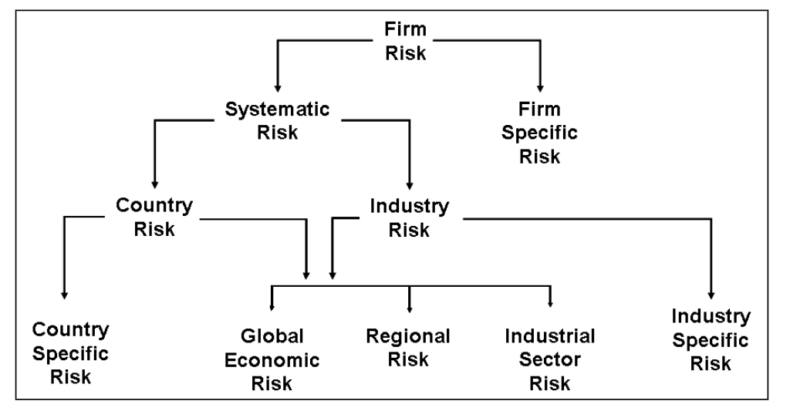
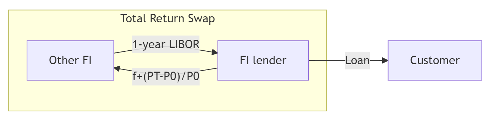
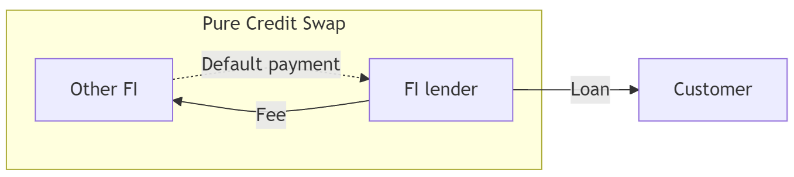

# Credit Risk II: Loan Portfolio and Concentration Risk

## Why this week matters

::: {.callout-important title="A cautionary tale"}
In March 2023, **Silicon Valley Bank** collapsed in 36 hours. Every one of its loans was performing. What killed it? **Concentration.** Its depositors were almost all Bay-Area tech startups, and its asset book was loaded with long-duration Treasuries. When one sector caught cold, the whole bank got pneumonia.
:::

- In the last couple of years, three of the four largest bank failures in U.S. history (SVB, Signature, and First Republic) were concentration stories, not one-loan stories.
- Individual due diligence is not enough. **Portfolio risk ≠ sum of loan risks.**
- This week: how to measure concentration, diversify it away, or sell it off with derivatives.

## Roadmap

- In [Week 6](https://mingze-gao.com/teaching/AFIN8003/2026S1/Week6/), we measured default risk on _individual_ loans.
- FIs hold _portfolios_ of loans — so credit risk must be measured and managed in a portfolio context.
- This week we cover:
    1. Simple models of concentration risk (migration analysis, concentration limits)
    2. Modern Portfolio Theory applied to loans (Moody's RiskFrontier)
    3. Regulatory approaches to concentration
    4. Credit derivatives (forwards, options, CDS) — how FIs separate credit risk from the lending relationship

# Simple models of loan concentration risk

## Simple models

::: {.callout-caution}
A large credit risk exposure to a single borrower — or a group of borrowers exposed to the **same risk factor** — poses a potential threat to a bank's safety and soundness.
:::

- Regulations limit such exposure, so individual loans rarely cause bank failures outright.
- The real danger: pools of loans that **look different but share the same risk driver** behave identically in a downturn.
- Think of the 2008 GFC — mortgages, CDOs, structured credit, MBS, and derivatives were marketed as _different products_ but were all bets on U.S. house prices. When the one underlying factor turned, everything turned.

::: {.callout-tip title="The hidden-correlation trap"}
Products with different names, sold by different business units, can still share the same underlying risk. A bank's "diversified" book may be one bet in disguise.
:::

Two simple models widely used to measure concentration risk:

1. Migration analysis
2. Concentration limits

## Simple model: migration analysis

- Track credit ratings of certain types of loans or certain sectors, either externally from credit rating agencies or internally. 
- If actual rating deteriorates faster than historical experience, limit lending to that loan class or sector.
- Historical credit migration measured through __loan migration matrix__ (or transition matrix).

|       | AAA-A | BBB-B | CCC-C | Default |
|-------|-------|-------|-------|---------|
| AAA-A | 0.85  | 0.10  | 0.04  | 0.01    |
| BBB-B | 0.12  | 0.83  | 0.03  | 0.02    |
| CCC-C | 0.03  | 0.13  | 0.80  | 0.04    |

: Example loan migration matrix {#tbl-migration-matrix}

@tbl-migration-matrix, for example, shows the _transition probabilities_ of loans that began the year with a certain credit rating being upgraded/downgraded to a certain rating, or default.

::: {.fragment}
- The probability of AAA-rated loan at the start of a year being downgraded to BBB to B by the year's end is 0.10.
- The probability of AAA-rated loan at the start of a year being downgraded to CCC to C by the year's end is 0.04.
- The probability of AAA-rated loan at the start of a year defaults by the year's end is 0.01.
:::

## Simple model: migration analysis (cont'd)

In practice, FIs use migration matrices with many more rating classes (S&P uses 20+).

Migration analysis is also applied to credit card and consumer loan portfolios.

::: {.callout-warning title="Where migration analysis can mislead you"}
- **Historical data only** — "last war" risk. Matrices built on 2010s data missed COVID-era dislocations.
- **Rating agencies lag** — downgrades typically arrive _after_ trouble is visible. By the time Moody's cuts, the market has already repriced.
- **Point-in-time vs through-the-cycle** — the same rating can mean different things across agencies and time.
:::

::: {.callout-note title="Discussion"}
Lehman Brothers was rated A by S&P five days before its September 2008 bankruptcy. What does that tell you about relying on migration analysis alone?
:::

## Simple model: concentration limits

- Caps the maximum loan size to an individual borrower, sector, or geographic area.
- Used to reduce exposure to some industries and increase it in others.
- Aggregate limits applied to industries whose performance is highly correlated.
- **Regulatory floors:**
    - **US (OCC):** loans to a single borrower capped at 15% of bank's capital (25% if fully secured).
    - **Australia (APRA APS 221):** large exposures to a single counterparty (or group) generally capped at 25% of Tier 1 capital; tighter 15% limit applies between domestic G-SIBs.

$$
\text{Concentration limit} = \text{Maximum loss as a percentage of capital} \times \frac{1}{\text{Loss rate}}
$$

::: {.callout-note title="Example"}
If an FI's manager is unwilling to permit losses exceeding 15% of the FI's capital, with an estimated loss rate in a particular industry of 40 per cent, then the manager should set a concentration limit on the exposure to that industry as $15\%\times \frac{1}{0.4}=37.5\%$.
:::

## Simple model: concentration limits (cont'd)

Let's look at a real Australian bank. BOQ's FY2023 credit exposure — notice anything?

| Sector                        | $m     | % of Total Exposure |
|--------------------------------|--------|---------------------|
| Residential mortgages          | 62,738 | 77.8                |
| Property and construction      | 6,887  | 8.5                 |
| Healthcare                     | 2,763  | 3.4                 |
| Professional services          | 2,431  | 3.0                 |
| Agriculture                    | 1,232  | 1.5                 |
| Transportation                 | 606    | 0.8                 |
| Manufacturing and mining       | 682    | 0.8                 |
| Hospitality and accommodation  | 841    | 1.0                 |
| Other                          | 2,453  | 3.0                 |
| **Total**                      | 80,633 | 100.0               |

: Proportionate credit exposures of lending activities of BOQ FY23 {#tbl-boq-credit-exposure-by-sector-2023}

::: {.callout-note title="Discussion"}
**77.8% in residential mortgages.** Is BOQ "diversified" across 9 sectors — or is it essentially one big bet on Australian house prices? Compare this to the Big Four. This pattern is typical of Australian banks and is one reason APRA stress-tests them on a property-market downturn.
:::

# Loan portfolio diversification and Modern Portfolio Theory (MPT)

## Loan portfolio diversification and MPT

MPT can be used to measure and control an FI's aggregate credit risk exposure.

Any model that seeks to estimate an efficient frontier for loans needs to determine and measure three things:

- The expected return on individual loans
- The risk of individual loans
- The correlation of default risks between loans

Expected return $R_p$ of a portfolio of $N$ assets:

$$
R_p = \sum_{i=1}^N X_i R_i
$$

where

- $R_i$ is the expected return on the $i$th asset
- $X_i$ is the proportion of the asset portfolio invested in the $i$th asset (the desired concentration amount)

## Loan portfolio diversification and MPT (cont'd)

Variance of returns (or risk) of the portfolio $\sigma_p^2$ can be calculated as

$$
\begin{aligned}
\sigma_i^2 &= \sum_{i=1}^N X_i^2 \sigma^2_i + \sum_{i=1}^N \sum_{j=1}^N X_i X_j \sigma_{ij} \\
           &= \sum_{i=1}^N X_i^2 \sigma^2_i + \sum_{i=1}^N \sum_{j=1}^N X_i X_j \rho_{ij} \sigma_i \sigma_j
\end{aligned}
$$

where

- $\rho_{ij}$ is the correlation between the returns on the $i$th asset $j$th asset
- $\sigma_i^2$ is the variance of returns on the $i$th asset
- $\sigma_{ij}^2$ is the covariance of returns between the $i$th asset and $j$th asset

## Loan portfolio diversification and MPT (cont'd)

The fundamental lesson of MPT is that by taking advantage of its size, an FI can diversify considerable amounts of credit risk as long as the returns on different assets are imperfectly correlated with respect to their default risk adjusted returns. 

```{python}
# | label: fig-efficient-frontier
# | fig-cap: "MPT and efficient frontier"
# | fig-location: center
import numpy as np
import matplotlib.pyplot as plt

# Define annualized returns and covariance matrix for two assets
mean_returns = np.array([0.04, 0.1])  # Expected annual returns for two assets
cov_matrix = np.array([[0.06, 0.02], [0.02, 0.10]])  # Covariance matrix of returns
individual_volatility = np.sqrt(np.diag(cov_matrix))  # Volatility of individual assets

# Define the number of portfolios to simulate
num_portfolios = 10000

# Initialize empty lists to store portfolio returns, volatilities, and weights
results = np.zeros((3, num_portfolios))

# Simulate random portfolios
for i in range(num_portfolios):
    # Generate random weights for the two assets
    weights = np.random.random(2)
    weights /= np.sum(weights)  # Ensure weights sum to 1

    # Calculate portfolio return and volatility (risk)
    portfolio_return = np.dot(weights, mean_returns)
    portfolio_volatility = np.sqrt(np.dot(weights.T, np.dot(cov_matrix, weights)))

    # Store the results
    results[0, i] = portfolio_volatility
    results[1, i] = portfolio_return
    results[2, i] = portfolio_return / portfolio_volatility  # Sharpe ratio

# Calculate the Global Minimum Variance Portfolio (GMVP)
inv_cov_matrix = np.linalg.inv(cov_matrix)
ones = np.ones(len(mean_returns))
weights_gmvp = inv_cov_matrix.dot(ones) / ones.T.dot(inv_cov_matrix).dot(ones)
gmvp_return = weights_gmvp.dot(mean_returns)
gmvp_volatility = np.sqrt(weights_gmvp.T.dot(cov_matrix).dot(weights_gmvp))

# Plot the efficient frontier
plt.figure(figsize=(10, 6))
plt.scatter(
    results[0, :], results[1, :], c=results[2, :], cmap="Blues", marker="o", alpha=1
)
plt.colorbar(label="Sharpe Ratio")

# Plot individual assets as red dots
plt.scatter(
    individual_volatility[0],
    mean_returns[0],
    # color="red",
    marker="o",
    s=100,
    label="Asset 1",
)
plt.scatter(
    individual_volatility[1],
    mean_returns[1],
    # color="blue",
    marker="o",
    s=100,
    label="Asset 2",
)
# Plot GMVP
plt.scatter(gmvp_volatility, gmvp_return, color="red", marker="X", s=100, label="GMVP")

# Set axis limits to start from 0
plt.xlim(0, np.max(results[0, :]) + 0.02)  # Add a small margin on the right
plt.ylim(0, np.max(results[1, :]) + 0.02)  # Add a small margin on the top

# Annotate the plot
plt.title("Efficient Frontier with Two Assets")
plt.xlabel("Volatility (Risk)")
plt.ylabel("Expected Return")
plt.legend(loc="upper left")
plt.show()
```

Minimum risk portfolio (Global Minimum Variance Portfolio, GMVP)

- Combination of assets that reduces the variance of portfolio returns on the lowest feasible level.

## Moody's RiskFrontier: the big picture

The problem: MPT needs **three inputs** — but for a loan portfolio, none of them are directly observable.

```{mermaid}
%%| fig-align: center
flowchart LR
    A[Borrower<br/>financials] --> B[<b>Credit Monitor</b><br/>estimates EDF]
    B --> C[<b>RiskFrontier</b><br/>portfolio engine]
    D[~1,000 systematic<br/>factors via <b>GCORR</b>] --> C
    E[Loan terms:<br/>spread, fees, LGD] --> C
    C --> F[Portfolio<br/>R<sub>p</sub> and σ<sub>p</sub>]
    style B fill:#D6D2C4,stroke:#333
    style C fill:#A6192E,color:#fff,stroke:#333
    style D fill:#D6D2C4,stroke:#333
```

**Two Moody's models in sequence:**

1. **Credit Monitor** → produces EDF (Expected Default Frequency) for each borrower
2. **RiskFrontier** → plugs EDFs, LGDs, and correlations into MPT to get portfolio R and σ

::: {.callout-tip title="Why not just use historical correlations?"}
Most loans never trade. There is no daily price series to correlate. RiskFrontier works around this by computing correlations from **shared exposure to ~1,000 systematic factors** (country, industry, region) rather than from return history.
:::

## RiskFrontier: the three MPT inputs

The whole model is just **three numbers per loan**, fed into standard MPT formulas.

:::: {.columns}

::: {.column width="55%"}
```{mermaid}
%%| fig-align: center
flowchart TB
    subgraph inputs [Inputs per loan i]
        R["<b>R<sub>i</sub></b> — Expected return<br/>= AIS<sub>i</sub> − EDF<sub>i</sub> × LGD<sub>i</sub>"]
        S["<b>σ<sub>i</sub></b> — Unexpected loss<br/>= √[EDF<sub>i</sub>(1−EDF<sub>i</sub>)] × LGD<sub>i</sub>"]
        P["<b>ρ<sub>ij</sub></b> — Default correlation<br/>from GCORR factor model"]
    end
    inputs --> MPT["Standard MPT:<br/>R<sub>p</sub> = Σ X<sub>i</sub>R<sub>i</sub><br/>σ<sub>p</sub><sup>2</sup> = ΣΣ X<sub>i</sub>X<sub>j</sub>ρ<sub>ij</sub>σ<sub>i</sub>σ<sub>j</sub>"]
```
:::

::: {.column width="45%"}
| Symbol | Meaning | Source |
|--------|---------|--------|
| **AIS** | All-in-drawn spread (loan rate − cost of funds + fees) | Loan contract |
| **EDF** | Prob. of default in the next year | Credit Monitor |
| **LGD** | Fraction lost if default occurs | Basel floors or bank estimate[^lgd] |
| **ρ** | Default correlation | GCORR factor model |
:::

::::

[^lgd]: Basel Foundation IRB (CRE32): senior unsecured = **45%**, secured by other physical collateral = **40%**, secured by receivables or CRE/RRE = **35%**, subordinated = **75%**.

## RiskFrontier: expected return and risk

**Expected return — earn the spread, lose the expected loss:**[^error]

$$
\underbrace{R_i}_{\text{net return}} = \underbrace{AIS_i}_{\text{spread + fees}} - \underbrace{EDF_i \times LGD_i}_{E(L_i),\text{ expected loss}}
$$

[^error]: In @saunders_financial_2023, this equation has a typo: $E(L_i)$ is written as $R(L_i)$.

**Unexpected loss — default is binomial, so σ has a closed form:**[^error2]

$$
\sigma_i = UL_i = \underbrace{\sqrt{EDF_i(1-EDF_i)}}_{\sigma \text{ of a 0/1 default event}} \times \underbrace{LGD_i}_{\text{loss if default}}
$$

[^error2]: In @saunders_financial_2023, this equation is incorrectly written.

::: {.callout-note title="Intuition"}
- **Expected loss** (EDF × LGD) is already _priced into_ the spread — it's the cost of doing business.
- **Unexpected loss** (σ) is what you hold capital against — the surprise.
:::

## RiskFrontier: where correlations come from (GCORR)

Default correlations between two loans cannot be directly observed. GCORR computes them via a **factor model**: two borrowers are correlated to the extent they share exposure to the _same underlying risk factors_.

{#fig-gcorr fig-align="center" width="85%"}

::: {.callout-tip title="Read @fig-gcorr this way"}
Each borrower's asset return = **global economy** + **region/country** + **industry** + **firm-specific noise**. Two borrowers are correlated only through the **shared** branches of the tree. A Sydney miner and a Perth miner share the "Australia + Materials" branches — high ρ. A Sydney miner and a Berlin software firm share almost nothing — ρ near zero.
:::

## Moody's Analytics RiskFrontier Model (example)

Suppose that an FI holds two loans with the following characteristics. Assume that the correlation $\rho_{12}=-0.25$, what are the return and risk of the portfolio?

| Loan $i$ | $X_i$ | Spread between loan rate and FI’s cost of funds | Fees | LGD | EDF |
|----------|-------|-------------------------------------------------|------|-----|-----|
| 1        | 0.6   | 5%                                              | 2%   | 25% | 3%  |
| 2        | 0.4   | 4.5%                                            | 1.5% | 20% | 2%  |

The return and risk on loan 1 are:

::: {.fragment}
$$
\begin{aligned}
R_1 &= (0.05+0.02) - (0.03\times0.25) = 0.0625 \\
\sigma_1 &= \sqrt{0.03\times0.97} \times 0.25 = 0.04265 
\end{aligned}
$$
:::

The return and risk on loan 2 are:

::: {.fragment}
$$
\begin{aligned}
R_2 &= (0.045+0.015) - (0.02\times0.2) = 0.056 \\
\sigma_2 &= \sqrt{0.02\times0.98} \times 0.2 = 0.028
\end{aligned}
$$
:::

The return and risk of the portfolio are then:

::: {.fragment}
$$
\begin{aligned}
R_p &= 0.6\times 0.0625 + 0.4\times 0.056 = 0.0599 \text{ or } 5.99\%  \\
\sigma_p^2 &= (0.6)^2(0.04265)^2 + (0.4)^2(0.028)^2 + 2(0.6)(0.4)(-0.25)(0.04265)(0.028) = 0.0006369 \\
\sigma_p &= \sqrt{0.0006369} = 0.0252 = 2.52\%
\end{aligned}
$$
:::


<!-- 

## Partial application of portfolio theory

1. Loan volume-based models
2. Loan loss ratio-based models

::: {.callout-note}
These are not examinable.
:::

## Partial application of portfolio theory: Loan volume-based models

Direct application of MPT is often difficult for FIs lacking information on market prices because many of the loans are not always able to be bought and sold in established markets.

Data can be gathered from:

- Reports to the central bank
- Data on shared national credit
- Commercial databases

Data provides market benchmarks against which FIs can compare their loan portfolios.

|               | (1) National | (2) Bank A | (3) Bank B |
|---------------|--------------|------------|------------|
| Real estate   | 45%          | 65%        | 10%        |
| C&I           | 30           | 20         | 25         |
| Individual    | 15           | 10         | 55         |
| Others        | 10           | 5          | 10         |
| **Total**     | **100**      | **100**    | **100**    |

: Allocation of the Loan Portfolio to Different Sectors (in percentages) {#tbl-loan-allocation}

## Partial application of portfolio theory: Loan volume-based models (cont'd)

- Deviations from the market portfolio benchmark indicate the relative degree of loan concentration.
- Relative measure of loan allocation deviation:

$$
\sigma_j = \sqrt{\frac{\sum_{i=1}^N (X_{ij}-X{i})^2}{N}}
$$

where

- $\sigma_j$ is the standard deviation of bank $j$'s asset allocation proportions from the national benchmark
- $X_i$ is the national asset allocations
- $X_{ij}$ is the asset allocation proportions of the $j$th bank
- $N$ is the number of observations or loan categories

## Partial application of portfolio theory: Loan volume-based models (cont'd)

Refer to @tbl-loan-allocation. We get the deviation of Bank A's loan portfolio allocation as follows:

$$
\begin{aligned}
(X_{1A}-X_1)^2 &= (0.65-0.45)^2 = 0.04 \\
(X_{2A}-X_2)^2 &= (0.20-0.30)^2 = 0.01 \\
(X_{3A}-X_3)^2 &= (0.10-0.15)^2 = 0.0025 \\
(X_{4A}-X_4)^2 &= (0.05-0.10)^2 = 0.0025
\end{aligned}
$$
and therefore
$$
\sigma_A = \sqrt{\frac{0.04+0.01+0.0025+0.0025}{4}} = 11.73\%
$$

## Partial application of portfolio theory: Loan loss ratio-based models

Estimates systematic loan loss risk of a particular sector or industry to the loan loss risk of an FI’s total loan portfolio

Use of time-series regression of quarterly losses:

$$
\frac{\text{Sectoral losses in the } i\text{th sector}}{\text{Loans to the } i\text{th sector}} = \alpha + \beta \frac{\text{Total loan losses}}{\text{Total loans}}
$$

where

- $\alpha$ measures the loan loss rate for a sector that has no sensitivity to losses on the aggregate loan portfolio
- $\beta$ measures the systematic loss sensitivity of the $i$th sector loans to total loan losses

The implication of this model is that sectors with lower $\beta$s could have higher concentration limits than high $\beta$ sectors—since low $\beta$ loan sector risks (loan losses) are less systematic (that is, are more diversifiable in a portfolio sense). 

-->

## Regulatory models

- **Fed's 1994 Ruling on Credit Concentration Risk**
    - Subjective approach based on examiner discretion.
    - Rejected technical models — data and methods were too undeveloped at the time.
- **2006 regulatory tightening**
    - **BIS:** 10 principles on credit risk assessment and supervisory evaluation.
    - **OCC:** guidance on sound risk management for commercial real estate (CRE) lending.
- **OCC/Fed Joint Study (April 2013) — the numbers are striking:**

| Bank profile during GFC                                  | Failure rate |
|----------------------------------------------------------|--------------|
| Construction loans > 100% of capital                     | **13%**      |
| Exceeded BOTH construction AND total CRE criteria        | **23%**      |
| Did not exceed either criterion                          | 0.5%         |

::: {.callout-note title="Takeaway"}
Banks that ignored the 2006 CRE concentration guidance were **~45× more likely to fail** during the GFC than compliant banks. Concentration guidance is advisory — but the statistical case for it is overwhelming.
:::

# Use of derivatives to manage credit risk

## Credit derivatives

- Diversification is the first line of defence. Derivatives are the second.
- The key insight: **credit derivatives separate the credit risk from the lending relationship**. A bank can keep the client, service the loan, and still offload the default risk to someone else.
- Three main instruments: credit **forwards**, credit **options**, credit **swaps** (including CDS).

::: {.callout-tip title="Why this innovation matters"}
Before credit derivatives (pre-1990s), the only way a bank could reduce credit exposure to a big client was to **refuse the loan** or **sell it** — both of which damage the relationship. Credit derivatives let the bank say "yes" and still cap its downside.
:::

## Credit forward contracts and credit risk hedging

- A credit forward is a forward agreement that hedges against an increase in default risk of a firm (borrower).[^note-on-credit-spread-forwards]
- Specifies a credit spread on a benchmark bond issued by the borrower.
- Used to **hedge against credit deterioration** (spread widening)  
- Spread is measured vs. a risk-free Treasury  
- Example: BBB bond trades at 2% spread over Treasury  

[^note-on-credit-spread-forwards]: See [A Note on Credit Spread Forwards](https://papers.ssrn.com/sol3/papers.cfm?abstract_id=2596878) for some discussion on the potential confusion due to different definitions.

## Credit forward contracts and credit risk hedging (cont'd)

| Market outcome                    | Long position (hedger)                | Short position                      |
|-----------------------------------|---------------------------------------|-------------------------------------|
| Spread widens → credit quality worsens | Gains (receives payment)              | Loses (makes payment)               |
| Spread tightens → credit quality improves | Loses (makes payment)                 | Gains (receives payment)            |

- If $\phi_T > \phi_F$: Long receives $(\phi_T - \phi_F) \times MD \times A$  
- If $\phi_T < \phi_F$: Long pays $(\phi_F - \phi_T) \times MD \times A$  

where  

- $\phi_F$ is the credit spread on which the credit forward contract is written
- $\phi_T$ is the actual credit spread on the bond when the credit forward matures
- $MD$ is the modified duration on the benchmark bond
- $A$ is the principal amount of the forward agreement

- **Long position** protects against borrower credit quality getting worse  
- **Short position** benefits if borrower credit improves  
- Acts like a **put-style hedge** for lenders  


## Credit options

Use of options to hedge credit risk is a relatively new phenomenon. In September 2021, commercial bank holdings of credit options totaled $233 billion, which represented 6.05% of all credit derivatives outstanding.

- A __credit spread call option__ is a call option whose payoff increases as the (default) risk premium or yield spread on a specified benchmark bond of the borrower increases above some exercise spread.
- A __digital default option__ is an option that pays a stated amount in the event of a loan default (the extreme case of increased credit risk).

## Credit (default) swaps (CDS)

The most important — and most controversial — credit derivative.

**Explosive growth, then regulatory pushback:**

| Date           | US bank credit-derivative notional | Note                              |
|----------------|------------------------------------|-----------------------------------|
| 2000           | $426 billion                       | Nascent market                    |
| March 2008     | $16.44 trillion                    | Pre-GFC peak                      |
| 2009           | $13.44 trillion                    | Post-Lehman retrenchment          |
| September 2011 | $15.66 trillion ($15.31tn CDS)     | CDS dominance                     |
| September 2021 | $3.9 trillion ($3.4tn CDS)         | Post-Dodd-Frank, central clearing |

::: {.callout-important title="What caused the collapse?"}
Dodd-Frank (2010) pushed most standardized CDS onto **central clearinghouses** (CCPs), with initial-margin and variation-margin requirements that made speculative CDS much more expensive. Bilateral inter-dealer books shrank dramatically.
:::

Why CDS exist:

1. Credit risk is still the #1 cause of FI failure — more than interest-rate or FX risk.
2. CDS let FIs keep **long-term customer relationships** while offloading default risk.

## Basics of CDS

- **CDS Payments**: The buyer makes periodic payments to the seller (quarterly, semi-annually, or annually) until the end of the swap or a credit event (e.g., default) occurs.
- **Settlement**: Upon default, settlement involves either physical delivery of bonds (loans) or a cash payment.
    - The protection buyer receives a payment upon the occurrence of a credit event trigger, but the swap “expires worthless” if no trigger occurs.
- No requirement that the CDS buyer actually owns the underlying reference securities.
- The CDS buyer hedges its exposure to default risk, but there is still counterparty credit risk in the event that the seller fails to perform their obligations under the terms of the contract.[^AIG]

We examine two types of credit swaps:

1. total return swap
2. pure credit swap

[^AIG]: In September 2008, **AIG** had written roughly **$440 billion of CDS protection** — much of it on subprime MBS — with insufficient collateral posted. When spreads blew out, AIG faced margin calls it could not meet. The US Treasury/Fed extended $182 billion in rescue financing. The lesson: CDS protection is only as good as the counterparty. This episode is why **central clearing** is now mandatory for standardized CDS.

## Credit swaps: total return swaps

A __total return swap__ involves _swapping_ an obligation to pay interest at a specified fixed or floating rate _for_ payments representing the total return on a loan or a bond (interest and principal value changes) of a specified amount.

The figure below illustrates a total return swap.[^error3]

[^error3]: In the textbook @saunders_financial_2023, Figure 25-4 incorrectly has $f-\frac{P_t-P_0}{P_0}$.

{fig-align="center"}

The FI lender pays a fixed annual rate $f$ plus changes in the market value of the loan and receives a variable rate payment (historically **1-year LIBOR**; post-2023 **SOFR** in USD, **AONIA/BBSW** in AUD since LIBOR's cessation in June 2023).

- Interest rate risk remains — the TRS transfers credit _and_ market risk of the asset, but the fixed vs floating mismatch is still an interest-rate exposure.

## Credit swaps: total return swaps (cont'd)

```{python}
# | label: fig-trs
# | fig-cap: "Total Return Swap Payments Example"
# | fig-location: center
import numpy as np
import matplotlib.pyplot as plt

np.random.seed(8003)
# Parameters for the TRS
notional = 1_000_000  # Notional amount (1 million)
fixed_rate = 0.03  # Fixed annual rate paid by the TRS receiver (3%)
asset_volatility = 0.1  # Volatility of the asset's return (10%)
years = 5  # Time period of the TRS (5 years)
periods_per_year = 4  # Payments per year (quarterly)


# Generate the timeline for TRS payments
def generate_trs_timeline(
    notional, fixed_rate, asset_volatility, years, periods_per_year=4
):
    # Set up the timeline with quarterly periods
    total_periods = periods_per_year * years
    time_points = np.arange(1, total_periods + 1) / periods_per_year

    # Calculate the periodic fixed payment amount (quarterly)
    periodic_fixed_payment = (
        -notional * fixed_rate / periods_per_year
    )  # Fixed payment made by TRS receiver

    # Simulate random returns on the asset
    asset_returns = np.random.normal(loc=0, scale=asset_volatility, size=total_periods)

    # Initialize lists to store the results
    total_returns = np.zeros(total_periods)
    payments = np.zeros(total_periods)

    for period in range(total_periods):
        # Total return on the asset (positive or negative)
        total_return = notional * asset_returns[period]
        total_returns[period] = total_return

        # Net payment for the TRS receiver (positive if receiving total return, minus fixed payment)
        payments[period] = total_return + periodic_fixed_payment

    return time_points, payments, total_returns


# Simulate TRS payments with different asset volatilities
volatilities = [0.05]  # Different volatilities to simulate
simulations = {}

for vol in volatilities:
    timeline, payments, total_returns = generate_trs_timeline(
        notional, fixed_rate, vol, years, periods_per_year
    )
    simulations[vol] = payments

# Plot the timelines as bar charts
plt.figure(figsize=(12, 8))
bar_width = 0.2  # Width of each bar

# Generate bar charts for each volatility
for idx, (vol, payments) in enumerate(simulations.items()):
    plt.bar(
        timeline + idx * bar_width * 0.1,
        payments,
        width=bar_width,
        color="#A6192E",
        label=f"Volatility: {vol*100:.0f}%",
    )

# Customize the plot
plt.title(f"{years}-Year Total Return Swap Payments Example")
plt.xlabel("Time (Years)")
plt.ylabel("Net Payment Amount ($)")
plt.axhline(0, color="black", linewidth=1)
plt.grid(True)
plt.legend()

# Show the plot
plt.show()

```

## Credit swaps: pure credit swaps

Interest-rate sensitive element stripped out leaving only the credit risk.

Similar to buying an insurance:

- If default, the counterparty makes the default payment
- If not default, the FI receives nothing from the counterparty.

{fig-align="center"}

## Credit swaps: pure credit swaps (cont'd)

```{python}
# | label: fig-pure-cds
# | fig-cap: "Pure CDS Payments Example"
# | fig-location: center
import numpy as np
import matplotlib.pyplot as plt

np.random.seed(8003)
# Parameters for the CDS
notional = 1_000_000  # Notional amount (1 million)
cds_spread = 0.02  # Annual CDS spread (2%)
recovery_rate = 0.9  # Recovery rate in case of default (10%)
years = 5  # Time period of the CDS (5 years)
periods_per_year = 4  # Payments per year (quarterly)


# Generate the timeline for CDS payments
def generate_cds_timeline(
    notional, cds_spread, default_probability, recovery_rate, years, periods_per_year=4
):
    # Set up the timeline with quarterly periods
    total_periods = periods_per_year * years
    time_points = np.arange(1, total_periods + 1) / periods_per_year

    # Calculate the periodic payment amount (quarterly)
    periodic_payment = (
        -notional * cds_spread / periods_per_year
    )  # Negative for payments

    # Initialize lists to store the results
    payments = np.zeros(total_periods)

    # Simulate payments and default events
    for period in range(total_periods):
        if np.random.rand() < default_probability / periods_per_year:
            # Default occurs at this period
            default_loss = notional * (
                1 - recovery_rate
            )  # Positive for the payment received on default
            payments[period] = default_loss
            payments[period + 1 :] = 0  # No more payments after default
            break
        else:
            # Regular payment
            payments[period] = periodic_payment

    return time_points, payments


# Simulate multiple series with different default probabilities
default_probabilities = [0.02, 0.1]  # Different default probabilities
colors = ["#D6D2C4", "#A6192E"]

simulations = {}

# Generate timelines for each default probability
for prob in default_probabilities:
    timeline, payments = generate_cds_timeline(
        notional, cds_spread, prob, recovery_rate, years, periods_per_year
    )
    simulations[prob] = payments

# Plot the timelines as bar charts
plt.figure(figsize=(12, 8))
bar_width = 0.2  # Width of each bar

# Generate bar charts for each probability
for idx, (prob, payments) in enumerate(simulations.items()):
    plt.bar(
        timeline + idx * bar_width * 0.1,
        payments,
        width=bar_width,
        color=colors[idx],
        label=f"Default Probability: {prob*100:.0f}%",
    )

plt.title(f"{years}-Year Pure CDS Payments Example")
plt.xlabel("Time (Years)")
plt.ylabel("Payment Amount ($)")
plt.axhline(0, color="black", linewidth=1)
plt.grid(True)
plt.legend()
plt.show()
```

# Finally...

## Key takeaways

1. **Concentration, not individual default, is the usual killer.** Loans that "look different" often share one risk factor.
2. **Migration analysis** is useful but backward-looking — rating agencies lag reality.
3. **MPT applies to loans**, with adaptations (RiskFrontier): expected loss = EDF × LGD, risk = √(EDF(1-EDF)) × LGD, correlations come from factor models (GCORR), not history.
4. **Derivatives separate credit risk from the lending relationship.** TRS transfers total return; pure CDS transfers only default risk.
5. **Counterparty risk is real** — AIG 2008 is the cautionary tale. Central clearing is the post-GFC response.

## Suggested readings

- [Moody's Analytics — An Overview of Modelling Credit Portfolios](https://www.moodys.com/web/en/us/insights/resources/overview-of-modeling-credit-portfolios.pdf)
- [BIS CRE32 — IRB approach: risk components](https://www.bis.org/basel_framework/chapter/CRE/32.htm) (for the LGD floors)
- [OCC Quarterly Report on Bank Trading and Derivatives Activities](https://www.occ.gov/publications-and-resources/publications/quarterly-report-on-bank-trading-and-derivatives-activities/index-quarterly-report-on-bank-trading-and-derivatives-activities.html) (for current credit-derivative notionals)

## References
