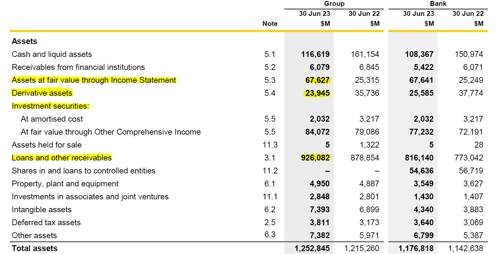
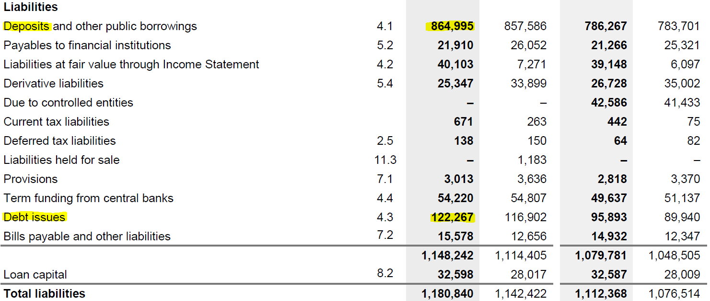

# Liquidity Risk

## Why this week matters

::: {.callout-important title="Two bank deaths in 10 days — March 2023"}
| | **Silicon Valley Bank** | **Credit Suisse** |
|---|---|---|
| Run size | **\$42bn / day** (≈25% of deposits) | **CHF 110bn** in days |
| Time to failure | **36 hours** | One week |
| Trigger | \$1.8bn AFS loss disclosure | Loss of confidence |
| Outcome | FDIC seizure | UBS takeover for **CHF 3bn** |
| Solvent on paper? | **Yes** | **Yes** |
:::

**Both banks died of thirst, not insolvency.** A bank's *funding model* is as much a risk as its *loan book*.

## Roadmap

```{mermaid}
flowchart LR
    A[Where it comes from] --> B[How DIs manage it]
    B --> C[How we measure it]
    C --> D[LCR & NSFR]
    D --> E[Australian regime]
    E --> F[Safety nets]
```

## Two sides of the same risk

| | **Liability side** | **Asset side** |
|---|---|---|
| **Trigger** | Depositors / wholesale funders demand cash | Borrowers draw committed lines; investment portfolio loses value |
| **Symptom** | Net deposit drain | Forced asset sales |
| **Cost** | New funding at higher rates | Fire-sale loss on long-duration assets |
| **Key concept** | Distribution of net deposit drains; core deposits | Loan commitments; HQLA haircuts |
| **March 2023 example** | \$42bn SVB run in one day | \$1.8bn SVB AFS loss |

We focus on **DIs** — the institutions most exposed because they fund long-term assets with short-term, on-demand liabilities.

# Sources of liquidity risk at DIs

## Liability-side liquidity risk

- A DI’s balance sheet typically features a large amount of short-term liabilities funding relatively long-term assets.
    - Short-term liabilities: demand deposits, other transaction accounts, etc.
    - Long-term assets: mortgages, C&I loans, etc.
- Demand deposit accounts, money market deposit accounts (MMDAs), and other transaction accounts allow holders to demand immediate repayment of the face value in cash.
    - For example, a DI with 20% of its liabilities in demand deposits, MMDAs, and other transaction accounts must be ready to liquidate assets to cover that amount on any banking day.


::: {.callout-note title="Scale of the maturity mismatch"}
For U.S. commercial banks, deposits typically make up **70–80% of total liabilities and capital**, while cash assets are a small single-digit-to-low-teens share of total assets. The maturity mismatch is the business model — and the source of the risk.
:::

::: {.content-hidden when-format="pdf"}
## Liability-side liquidity risk (cont'd)
:::

For CBA (FY2023), cash and liquid assets accounted for only **9.3% of total assets** — the rest is largely loans and long-dated securities.

{#fig-cba-balance-sheet fig-align="center"}

::: {.content-hidden when-format="pdf"}
## Liability-side liquidity risk (cont'd)
:::

On the other side, CBA (FY2023) funded **73.25% of total liabilities** with deposits and other public borrowings — most of it short-dated and on demand.

{#fig-cba-balance-sheet-liabilities fig-align="center"}

::: {.content-hidden when-format="pdf"}
## Liability-side liquidity risk (cont'd)
:::

::: {.callout-tip title="It's not that bad."}
- Normally, only a small proportion of its deposits will be withdrawn on any given day.
- Further, deposit withdrawals may in part be offset by the inflow of new deposits[^problem-inflow] (and the DI's income). 
:::

[^problem-inflow]: Large inflow of deposits may also cause issues if the DI cannot find sufficiently attractive investments.

Most demand deposits are relatively "stable", acting as consumer __core deposits__ on a daily basis.

- __Core deposits__ are those deposits that provide a DI with a long-term funding source.

The DI manager must monitor and predict the _net deposit drains_ on any given normal banking day.

- Beyond predictable daily seasonality in deposit flows, other seasonal variations exist.
- Many of these seasonal variations are somewhat predictable.
- Retail DIs often experience above-average deposit outflows around the end of the year and in the summer (due to Christmas and the vacation season).
- Rural DIs may experience a deposit inflow–outflow cycle aligned with the local agricultural cycle.
    - During the planting and growing season, deposits tend to fall.
    - During the harvest season, deposits tend to rise as crops are sold.

## Net deposit drains and how DIs manage them

DI managers monitor the **distribution of net deposit drains** — the daily difference between withdrawals and inflows. Two stylised cases:

::: {.columns}
:::: {.column width="50%"}
```{python}
# | label: fig-net-deposit-drains-positive
# | fig-cap: "Positive expected drain — balance sheet contracts"
# | fig-location: center
import matplotlib.pyplot as plt
import numpy as np

x = np.linspace(-10, 15, 1000)
y = np.exp(-0.5 * ((x - 5) / 4)**2) / (4 * np.sqrt(2 * np.pi))

plt.figure(figsize=(8, 4))
plt.plot(x, y, color='gray')
plt.axvline(x=0, color='black', linestyle='-')
plt.axvline(x=5, color='gray', linestyle='--', label='Mode = +5%')
plt.xlabel("% Net deposit drain (cash outflow)")
plt.legend()
plt.show()
```
*Mode at +5%* ⇒ withdrawals routinely exceed inflows ⇒ liability side **contracting**.
::::
:::: {.column width="50%"}
```{python}
# | label: fig-net-deposit-drains-negative
# | fig-cap: "Negative expected drain — balance sheet expands"
# | fig-location: center
import matplotlib.pyplot as plt
import numpy as np

x = np.linspace(-10, 15, 1000)
y = np.exp(-0.5 * ((x + 2) / 2 )**2) / (4 * np.sqrt(2 * 0.1 * np.pi))

plt.figure(figsize=(8, 4))
plt.plot(x, y, color='gray')
plt.axvline(x=0, color='black', linestyle='-')
plt.axvline(x=-2, color='gray', linestyle='--', label='Mode = −2%')
plt.xlabel("% Net deposit drain (cash outflow)")
plt.legend()
plt.show()
```
*Mode at −2%* ⇒ inflows exceed withdrawals ⇒ balance sheet **expanding**.
::::
:::

When a positive drain materialises, the DI plugs it via either **purchased liquidity** (wholesale borrowing) or **stored liquidity** (run down cash / HQLA). Traditionally DIs leaned on stored liquidity; today most rely on purchased liquidity — examined next.

# Managing liquidity risk

## Purchased vs. stored liquidity: side by side

A **\$5 deposit drain** (deposits 70 → 65). Two ways to plug it:

::: {.columns}
:::: {.column width="50%"}
**(A) Purchased liquidity** — borrow in wholesale markets (interbank, repo, CDs, notes/bonds).

|              | Before | After drain | After fix |
|--------------|-------:|------------:|----------:|
| Assets       |    100 |         100 |       100 |
| Deposits     |     70 |          65 |        65 |
| Borrowed     |     10 |          10 |    **15** |
| Other liab.  |     20 |          20 |        20 |
| **Total**    |    100 |          95 |       100 |

✓ Balance sheet size **preserved**.
✗ Wholesale funding is **costlier** and **flightier** than deposits.
::::
:::: {.column width="50%"}
**(B) Stored liquidity** — run down cash and HQLA buffers.

|              | Before | After drain & fix |
|--------------|-------:|------------------:|
| Cash         |      9 |             **4** |
| Other assets |     91 |                91 |
| Deposits     |     70 |                65 |
| Borrowed     |     10 |                10 |
| Other liab.  |     20 |                20 |
| **Total**    |    100 |                95 |

✓ No new (expensive) funding.
✗ Balance sheet **contracts**; foregone return on the cash buffer.
::::
:::

::: {.callout-note title="Reserve requirements have largely faded"}
The U.S. Fed cut all reserve requirements to **zero on 26 March 2020** and has not reinstated them; the RBA has never imposed a formal reserve ratio. Today, "stored liquidity" mostly means **HQLA** under the LCR, not regulatory cash reserves.
:::

## Asset-side liquidity risk: two channels

So far we have focused on **liability-side** drains. The **asset side** generates liquidity demand through two channels:

::: {.columns}
:::: {.column width="50%"}
**1. Loan-commitment drawdowns**

Borrowers exercise pre-existing committed credit lines — the bank must fund the loan today, even though it priced the commitment yesterday.

::: {.callout-note title="COVID-19 dash for cash"}
In March 2020, U.S. corporates drew on credit lines at unprecedented speed. @acharya_why_2024 link this drawdown channel directly to bank-stock underperformance during the pandemic.
:::
::::
:::: {.column width="50%"}
**2. Investment-portfolio losses**

Rising rates → MTM losses on bond holdings. If the bank must sell to fund withdrawals, paper losses become **realised** losses, eating into equity.

::: {.callout-warning title="SVB, March 2023"}
SVB sold its available-for-sale portfolio at an **\$1.8bn after-tax loss** to raise cash for outflows. The disclosure itself triggered the run that killed the bank within 36 hours.
:::
::::
:::

The mechanics of plugging an asset-side need (a \$5 drawdown or \$5 MTM hit) are **the same as on the liability side**: either *purchase* liquidity (more borrowing) or *store* liquidity (run down cash). The cost trade-offs are identical to the previous slide.

::: {.content-hidden when-format="pdf"}
## Asset-side liquidity risk: combined balance-sheet view
:::

::: {.columns}
:::: {.column width="50%"}
**Loan-commitment exercise (\$5 drawn)**

|              | Before |  Stored |    Purchased |
|--------------|-------:|--------:|-------------:|
| Cash         |     12 | **7**   |          12  |
| Other assets |    138 |    143  |         143  |
| Deposits     |    100 |    100  |         100  |
| Borrowed     |     20 |     20  |       **25** |
| Equity       |     25 |     25  |          25  |
| **Total**    |    150 |    150  |         155  |
::::
:::: {.column width="50%"}
**Investment-portfolio MTM loss (\$5)**

|              | Before |  Stored |    Purchased |
|--------------|-------:|--------:|-------------:|
| Cash         |     12 |    7    |          12  |
| Inv. port.   |     50 |   50    |          50  |
| Other assets |     88 |   88    |          88  |
| Deposits     |    100 |  100    |     **105**  |
| Borrowed     |     20 |   20    |          20  |
| Equity       |     20 |   20    |          20  |
| **Total**    |    150 |  145    |         150  |
::::
:::

In both cases the **stored** route shrinks the balance sheet, and the **purchased** route preserves size at the cost of more wholesale funding.


# Measuring liquidity risk

## Measuring liquidity risk: from textbook to regulation

Liquidity-risk measurement has evolved through three layers. The first two (gap analysis, peer ratios) remain useful **internal** management tools; the **Basel III LCR and NSFR** are the binding regulatory standards.

| Layer | Measure | Question it answers | Status today |
|-------|---------|---------------------|--------------|
| 1. Structural gap | **Financing gap** & financing requirement | How much wholesale funding do I need to plug the loan/deposit mismatch? | Internal ALM tool |
| 2. Peer benchmarking | **Loan-to-deposit ratio**, core deposits / assets, unused commitments / assets | How does my balance-sheet structure compare to peers and history? | Internal + supervisory monitoring |
| 3. Stress-based ratios | **LCR** (30-day), **NSFR** (1-year) | Can I survive 30 days of stress? Is my funding stable over 1 year? | **Binding Basel III minima** |


## Financing gap in practice — the loan-to-deposit ratio

The **financing gap** is the textbook framing; the **loan-to-deposit ratio (LDR)** is the version banks and supervisors actually report.

$$
\text{Financing gap} = \text{Average loans} - \text{Average (core) deposits}
$$

A *positive* gap must be filled by **liquid assets sold** or **wholesale funding raised**:

$$
\underbrace{\text{Financing gap}}_{\text{loans} - \text{deposits}} + \underbrace{\text{Liquid assets}}_{\text{stored}} = \underbrace{\text{Borrowed funds}}_{\text{purchased}}
$$

::: {.callout-tip title="Worked example — and the LDR view"}
A bank reports average loans of \$25bn, deposits of \$20bn, and liquid assets of \$3bn.

- Financing gap = 25 − 20 = **\$5bn** ⇒ requires **\$5bn** of non-deposit funding.
- Of that, \$3bn can come from liquid assets; the remaining **\$2bn must be borrowed**.
- Equivalently, **LDR = 25 / 20 = 125%** — well above the ~70–80% typical for the Australian Big 4. The higher the LDR, the more the bank relies on **wholesale funding** (and, post-2008, the more attention APRA pays).
:::

::: {.content-hidden when-format="pdf"}
## Other peer ratios worth watching
:::

Common peer-comparison ratios:

- **Loans to assets** — overall illiquidity of the asset book.
- **Core deposits to total assets** — share of *sticky*, lower-cost funding.
- **Unused loan commitments to assets** — contingent draw-down exposure (this is the channel that bit banks in March 2020).
- **Wholesale funding to total liabilities** — how much short-term, *flighty* money the bank relies on.

The 2023 SVB autopsy turned all of these into headline metrics: SVB's **uninsured-deposit share was ~94%**, and its **HTM bond book** was ~50% of assets — both extreme outliers among U.S. peers.

# LCR — short-term resilience

## Basel III: two ratios, two horizons

| | **LCR** | **NSFR** |
|---|---|---|
| **Question** | Survive 30 days of acute stress? | Funding stable over 1 year? |
| **Horizon** | 30 days | 1 year |
| **Numerator** | Stock of HQLA | Available stable funding (ASF) |
| **Denominator** | Net cash outflows in stress | Required stable funding (RSF) |
| **Minimum** | ≥ 100% | ≥ 100% |
| **In force** | Phased 1 Jan 2015 → fully 1 Jan 2019 | 1 Jan 2018 |
| **Reporting** | Monthly | Quarterly |

::: {.callout-warning title="Did Basel III prevent SVB?"}
SVB sat just **below the \$250bn U.S. threshold** — the strictest LCR/NSFR rules **did not bind**. The 2018 rollback of post-crisis rules for mid-sized U.S. banks (S.2155) is a recurring theme in post-mortems of March 2023.
:::

## Liquidity Coverage Ratio (LCR): the 30-day question

> *"If a severe liquidity stress hits today, can the bank survive for 30 days using only its own liquid assets?"*

$$
\text{LCR} = \frac{\text{Stock of HQLA}}{\text{Total net cash outflows over the next 30 calendar days}} \ge 100\%
$$

- **Numerator** — high-quality liquid assets the bank can sell, repo, or pledge in stress at little loss of value.
- **Denominator** — modelled net cash outflows under a **prescribed stress scenario** combining an idiosyncratic shock (e.g. a credit-rating downgrade) and a market-wide shock (e.g. GFC-style funding freeze).
- **Reporting** — at least monthly to supervisors, with daily computation capacity required.

::: {.callout-tip title="Read the ratio as a survival horizon"}
LCR = 100% means the bank can survive **exactly 30 days** of the stress scenario on its own liquidity. LCR = 150% buys a bigger margin of safety; LCR < 100% means the bank fails the test and must rebuild its buffer.
:::

::: {.content-hidden when-format="pdf"}
## Building the numerator: the HQLA stack
:::

**Two universal requirements** for any asset to count as HQLA:

1. **Liquid in stress** — convertible to cash at little loss of value and acceptable at the central-bank facility as collateral.
2. **Unencumbered** — free of legal, regulatory, contractual, or other restrictions on the bank to liquidate, sell, transfer, or assign it.

| Tier | Examples | Haircut | Cap |
|------|----------|--------:|-----|
| **Level 1** | Cash, central-bank reserves, sovereign/central-bank/PSE/multilateral debt (e.g. BIS, IMF, ECB, MDBs) | **0%** | none |
| **Level 2A** | Other sovereign/PSE/MDB claims; high-grade corporate debt; covered bonds | **15%** | combined Level 2 ≤ **40% of HQLA** |
| **Level 2B** | RMBS (eligible) | **25%** | of which Level 2B ≤ **15% of HQLA** |
| **Level 2B** | Eligible corporate debt and equities | **50%** | (subject to same Level 2B sub-cap) |

[^more-restrictions]: Each tier carries additional eligibility tests (rating, market depth, repo eligibility, etc.). See [BIS LCR40 — HQLA](https://www.bis.org/basel_framework/chapter/LCR/40.htm).

::: {.callout-warning title="Why the haircuts matter — SVB again"}
SVB held a large portfolio of long-dated **U.S. Treasuries and agency MBS** — Level 1 / Level 2A on paper. The book was technically HQLA-eligible. The problem was that the bank classified much of it as **held-to-maturity (HTM)** at *amortised cost*: the unrealised losses didn't show on the balance sheet, but they crystallised the moment SVB had to sell. The haircut framework prices in expected loss in stress; **HTM accounting hid the loss until it was too late**.
:::

::: {.content-hidden when-format="pdf"}
## Building the denominator: net cash outflows
:::

$$
\text{Net cash outflows} \,=\, \underbrace{\text{Out}}_{\text{outflows}} - \min\!\bigl(\underbrace{\text{In}}_{\text{inflows}},\ 0.75 \times \text{Out}\bigr)
$$

- **Outflows** ($\text{Out}$) — every deposit, wholesale liability and contingent commitment, multiplied by a **stressed run-off factor**.
- **Inflows** ($\text{In}$) — contractual receipts within 30 days from performing assets.
- The **75% cap on inflows** ensures the bank cannot rely *entirely* on incoming cash — it must hold a meaningful HQLA buffer regardless.

::: {.content-hidden when-format="pdf"}
## Run-off factors: pricing the flightiness of funding
:::

The intuition: *the more flighty the funding, the higher the assumed run-off*.

| Liability type | Stressed run-off | Why |
|----------------|-----------------:|-----|
| Stable retail deposits (insured, transactional) | **3–5%** | Sticky; protected by deposit insurance |
| Less-stable retail deposits (e.g. brokered) | **10%+** | Less behavioural attachment |
| Operational corporate deposits | **25%** | Tied to clearing/payments services |
| Non-operational unsecured wholesale (financial) | **100%** | Will leave overnight in a crisis |
| Non-operational unsecured wholesale (corporate) | **40%** | Slower, but still flighty |
| Undrawn committed credit lines (corporate) | **10%** | Drawdowns spike in stress (cf. COVID-19) |

::: {.callout-note title="The hidden assumption: 30 days of *that* deposit base"}
LCR run-offs were calibrated to **GFC-era** deposit behaviour. The March 2023 SVB run **exceeded the assumed retail/SME run-off in a single day**, not 30. Post-2023 reviews by the Basel Committee, FRB, BoE, and APRA are explicitly considering whether run-off factors need to rise for **highly digital, concentrated, or uninsured** deposit bases.
:::

## Liquidity Coverage Ratio (LCR): example

Consider the following balance sheet (in million of dollars) of a bank. Calculate the bank's LCR.

- Assume that the cash inflows over the next 30 days from the bank's assets are $5 million.

| **Assets**                    | \$  | **Liquidity Level** | **Liabilities and Equity**            | \$  | **Run-Off Factor** |
|-------------------------------|-----|---------------------|---------------------------------------|-----|--------------------|
| Cash                          | 5   | Level 1             | Stable retail deposits                | 95  | 3%                 |
| Deposits at the Fed           | 15  | Level 1             | Less Stable retail deposits           | 40  | 10                 |
| Treasury securities           | 100 | Level 1             | Unsecured wholesale funding from:     |     |                    |
| GNMA securities               | 75  | Level 2A            | - Stable small business deposits      | 100 | 5                  |
| Loans to A-rated corporations | 110 | Level 2A            | - Less Stable small business deposits | 80  | 10                 |
| Loans to B-rated corporations | 85  | Level 2B            | - Nonfinancial corporates             | 50  | 75                 |
| Premises                      | 20  |                     | Equity                                | 45  |                    |
| **Total**                     | 410 |                     | **Total**                             | 410 |                    |

::: {.content-hidden when-format="pdf"}
## Liquidity Coverage Ratio (LCR): example (cont'd)
:::

The LCR is calculated as follows:

First, calculate the amount of HQLA.

- Level 1 assets is $5+15+100=120$ million

Before adjustment for caps,

- Level 2A assets is $(75+110)\times (1-15\%) = 157.25$ million[^l2a-haircut]
- Level 2B assets is $85\times (1-50\%)=42.5$ million[^l2b-haircut]

However, Level 2 assets is capped at 40% of HQLA!

- Given that Level 1 assets is 120 million, which should account for at least $1-40\%=60\%$ of HQLA.
- HQLA should be $120/(1-40\%) = 200$ million, which means a maximum of $200-120=80$ million Level 2 assets.
- The Level 2 assets after haircut is larger than the cap - they will not further increase HQLA.

Therefore, the HQLA is 200 million.

[^l2a-haircut]: There is a 15% haircut applied on the value of Level 2A assets.
[^l2b-haircut]: There is a 50% haircut applied on the value of Level 2B assets.

::: {.content-hidden when-format="pdf"}
## Liquidity Coverage Ratio (LCR): example (cont'd)
:::

Next, calculate the total net cash outflows over next 30 days.

Cash outflows are:

- Stable retail deposits: $95\times 0.03 = 2.85$
- Less stable retail deposits: $40\times 0.1 = 4$
- Stable small business deposits: $100\times 0.05 = 5$
- Less stable small business deposits: $80\times 0.1 =8$
- Nonfinancial corporates: $50\times 0.75 = 37.5$

Therefore,

- Total cash outflows over next 30 days is 57.35 million.
- Total cash inflows over next 30 days is 5 million (assumed).
- Total net cash outflows over next 30 days is 57.35 million - min(5, 75\% * 57.35) = 52.35 million.

Lastly, calculate LCR:

$$
\text{LCR} = \frac{\text{Stock of HQLAs}}{\text{Total net cash outflows over next 30 calendar days}} = \frac{200}{52.35} = 382.04\% \ge 100\%
$$

# NSFR — structural funding stability

## Net Stable Funding Ratio (NSFR): the 1-year question

> *"Is the bank's funding model **structurally stable** over a one-year horizon, or is it built on the kindness of overnight wholesale markets?"*

$$
\text{NSFR} = \frac{\text{Available Stable Funding (ASF)}}{\text{Required Stable Funding (RSF)}} \ge 100\%
$$

The LCR addresses **acute stress (30 days)**; the NSFR addresses **structural funding mismatch (1 year)**. Both must be ≥ 100% — they are **complements**, not substitutes.

::: {.callout-tip title="Where it bites"}
The NSFR penalises banks that fund **long-duration assets** (long-term loans, illiquid securities) with **short-term wholesale funding** — exactly the funding model that blew up Northern Rock in 2007 and stressed European banks throughout the GFC.
:::

::: {.content-hidden when-format="pdf"}
## NSFR: ASF and RSF factors
:::

**Available Stable Funding (ASF)** weights *liabilities + equity* by how reliably they will stick around for a year.
**Required Stable Funding (RSF)** weights *assets* by how illiquid / long-dated they are (i.e. how much stable funding they "need").

::: {.columns}
:::: {.column width="50%"}
**ASF factors (selected)**

| Funding source | ASF factor |
|---|---:|
| Capital, liabilities with maturity > 1 year | **100%** |
| "Stable" retail / SME deposits | **95%** |
| "Less stable" retail / SME deposits | **90%** |
| Non-financial corporate, sovereign, PSE funding < 1 year | **50%** |
| Funding from financial institutions < 6 months | **0%** |

*Higher factor ⇒ "this funding is stable, count more of it."*
::::
:::: {.column width="50%"}
**RSF factors (selected)**

| Asset / OBS exposure | RSF factor |
|---|---:|
| Cash, central-bank reserves | **0%** |
| Level 1 HQLA | **5%** |
| Level 2A HQLA | **15%** |
| Performing residential mortgages (≤ 35% risk weight) | **65%** |
| Other performing loans (residual maturity ≥ 1 year) | **85%** |
| Non-performing loans, encumbered assets > 1 year | **100%** |
| Undrawn committed facilities | **5%** of notional |

*Higher factor ⇒ "this asset locks up funding; you need more stable funding to hold it."*
::::
:::

::: {.callout-note title="Reading the formula"}
A bank holding lots of long-term mortgages (high RSF) funded mainly with overnight repos (low ASF) will fail the NSFR — exactly the funding-mismatch the rule is designed to discourage.
:::

# LCR & NSFR in practice — the Big 4

## Liquidity risk of Australian banks (FY2023)

The figures below are drawn from the Big 4 banks' FY2023 Pillar 3 disclosures. Workshop 8 will ask you to look up the latest figures from each bank's most recent Pillar 3 report.

|                                                    |     CBA |     NAB |     ANZ | Westpac |
|----------------------------------------------------|--------:|--------:|--------:|--------:|
| __Cash Outflows__                                  |         |         |         |         |
| Retail And Counterparties   Deposits Outflow       |  37,416 |  29,947 |  25,517 |  29,304 |
| Stable Deposits                                    |  12,700 |   5,843 |   5,879 |   7,969 |
| Less Stable Deposits                               |  24,716 |  24,104 |  19,638 |  21,335 |
| Unsecured Wholesale Funding   Outflow              |  82,444 |  82,299 | 146,698 |  76,953 |
| Operational Deposit Outflow                        |  22,219 |  21,540 |  22,553 |  18,631 |
| Non Operational Deposits   Outflow                 |  49,236 |  47,619 | 111,549 |  47,073 |
| Unsecured Debt Outflow                             |  10,989 |  13,140 |  12,596 |  11,249 |
| Secured Wholesale Funding   Outflow                |   6,839 |  10,701 |   5,405 |   3,891 |
| Additional Outflow   Requirements                  |  26,186 |  38,693 |  70,639 |  30,463 |
| Derivative Expo And Other   Collateral Requirement |   7,557 |   8,154 |  48,206 |  12,462 |
| Loss of Funding on Debt   Products                 |       0 |       0 |       0 |     136 |
| Credit And Liquidity   Facilities                  |  18,629 |  30,539 |  22,433 |  17,865 |
| Other Contractual Funding   Obligation             |       0 |      81 |       0 |   4,515 |
| Other Contingent Funding   Obligation              |  10,373 |   5,219 |   8,024 |   4,082 |
| Total Cash Outflow                                 | 163,258 | 166,940 | 256,283 | 149,208 |

::: {.content-hidden when-format="pdf"}
## Liquidity risk of Australian banks (FY2023)
:::

|                                                    |     CBA |     NAB |     ANZ | Westpac |
|----------------------------------------------------|--------:|--------:|--------:|--------:|
| __Cash Inflows__                                   |         |         |         |         |
| Secured Lending                                    |   2,328 |   3,898 |   1,549 |       0 |
| Inflows From Fully Performing   Exposures          |   9,520 |  11,788 |  17,190 |   5,020 |
| Other Cash Inflows                                 |   6,753 |   1,589 |  36,016 |   7,988 |
| Total Cash Inflow                                  |  18,601 |  17,275 |  54,755 |  13,008 |

::: {.content-hidden when-format="pdf"}
## Liquidity risk of Australian banks (FY2023)
:::

|                                      |     CBA |     NAB |     ANZ | Westpac |
|--------------------------------------|--------:|--------:|--------:|--------:|
| __Liquidity Coverage Ratio (LCR)__   |         |         |         |         |
| Average High Quality Liquid   Assets | 189,419 | 209,561 | 267,905 | 181,882 |
| Average Net Cash Outflows            | 144,657 | 149,665 | 201,528 | 136,200 |
| Average Liquidity Coverage   Ratio   |  131.00 |  140.00 |  132.90 |  134.00 |
| __Net Stable Funding Ratio (NSFR)__  |         |         |         |         |
| Available Stable Funding             | 860,999 | 646,508 | 625,285 | 707,893 |
| Required Stable Funding              | 693,453 | 556,016 | 537,430 | 615,341 |
| Net Stable Funding Ratio             |  124.00 |  116.00 |  116.35 |  115.00 |

::: {.callout-tip title="What to notice"}
- All four banks sit comfortably above the **100% minimum** for both LCR and NSFR.
- The **range is narrow** (LCR ~131–140%, NSFR ~115–124%) — this reflects APRA's tight supervisory benchmarking, not coincidence.
- **CBA's NSFR (124%)** is highest, consistent with its larger share of stable retail deposits.
- **ANZ's outflows (\$256bn)** are roughly 50% larger than the others, driven by a larger non-operational wholesale book.
:::

# Bank runs and safety nets

## Liquidity planning

- **Liquidity planning** is crucial for managing liquidity risk and costs, helping with borrowing priorities and minimizing excess reserves.
- Components of a liquidity plan:
  1. Managerial responsibilities: Assign roles during a liquidity crisis and manage public disclosures.
  2. List of fund providers: Identify likely fund withdrawers and patterns, including sensitivity to funding composition changes.
  3. Withdrawal estimates: Assess potential deposit and fund withdrawals over different time horizons and identify funding sources.
  4. Internal limits and asset disposal: Set borrowing limits for subsidiaries and branches, determine acceptable risk premiums, and sequence asset disposals.
- The plan involves key departments like the money desk and Treasury for daily liability funding.

## Liquidity risk, unexpected deposit drains, and bank runs

Major liquidity problems arise when deposit drains are **abnormally large and unexpected**, for reasons including:

- Concerns about a DI's solvency relative to its peers.
- Failure of a related DI — the **contagion** effect.
- Sudden changes in investor preferences for holding non-bank financial assets (e.g. T-bills, money-market funds) over deposits — particularly when those alternatives offer materially higher yields.

In these cases, unexpected deposit drains can trigger a **bank run** that eventually forces the bank into insolvency. In the worst case, a **bank panic** spreads — a systemic, contagious run across the banking industry.

::: {.callout-tip title="The 2023 run was different"}
Classic bank runs (think 1930s) propagated by **word of mouth** and physical queues. The **March 2023 SVB run** propagated by **Slack, Twitter/X, and WhatsApp** — and depositors moved money out of mobile apps in seconds, not hours. Regulators are now actively rethinking how fast LCR-style buffers can really last when the run velocity is digital.
:::

## Bank runs, the discount window, and deposit insurance

The two major liquidity risk insulation devices are __deposit insurance__ and the __discount window__ (or its central-bank equivalent).

1. **Deposit insurance** — a public guarantee on insured deposits up to a per-depositor cap (US: FDIC; Australia: FCS).
2. **Discount window / lender-of-last-resort facilities** — short-term central-bank lending against eligible collateral, at the "discount rate."
    - In the week ending **15 March 2023**, U.S. banks drew **\$152.85 billion** from the Federal Reserve's discount window — a new record, eclipsing the **\$111 billion** peak of the 2008 GFC.
    - In Switzerland the same week, the **SNB pledged CHF 50 billion** of liquidity to Credit Suisse; when that was insufficient, the eventual support package totalled **CHF 250 billion**.
    - In response to SVB, the Fed also launched the **Bank Term Funding Program (BTFP)**, lending against high-quality securities valued at **par** (no haircut) — an unusually generous LOLR design.

::: {.callout-warning title="Moral hazard"}
Insulation is not free. Insured deposits and easy LOLR access can **encourage DIs to take more liquidity risk**: hold riskier loans, fewer HQLA, more flighty wholesale funding. This is precisely why the Basel III LCR/NSFR rules exist — to put a regulatory floor under the liquidity buffer that protection might otherwise erode.
:::

# Liquidity regulation and depositor protection

## Liquidity regulation in Australia

- In Australia, liquidity requirements are set by **APRA**.
- **Prudential Standard APS 210 — Liquidity** aims to ensure that an ADI has sufficient liquidity to meet obligations as they fall due.

APRA classifies each ADI as either:

- an **LCR ADI** (subject to the Basel III LCR, effective from 1 January 2015), or
- an **MLH ADI** (subject to the Minimum Liquidity Holdings regime, effective from 1 January 2014).

::: {.callout-tip title="What changed in 2025"}
APRA finalised **targeted changes to APS 210** in 2024 in response to the March 2023 banking turmoil. From **1 July 2025**, MLH ADIs must adjust the value of their liquid assets regularly for **mark-to-market** movements (no more carrying at amortised cost — exactly the issue at SVB). All ADIs must also be **operationally ready** to provide key information when requesting **Exceptional Liquidity Assistance (ELA)** from the RBA. The headline 9% MLH minimum is unchanged.
:::

## LCR ADI vs. MLH ADI

APRA splits ADIs into two regulatory tracks under APS 210:

| Feature | **LCR ADI** | **MLH ADI** |
|---------|-------------|-------------|
| **Who** | Larger / internationally active banks (the Big 4 and other significant ADIs) | Smaller ADIs (e.g. mutual banks, building societies, smaller credit unions) |
| **Core requirement** | Basel III **LCR ≥ 100%** *and* **NSFR ≥ 100%** | **Liquid assets ≥ 9%** of liabilities |
| **Liquid asset definition** | HQLA (Level 1 + capped Level 2, with haircuts) | RBA-repo-eligible, unsubordinated debt securities |
| **Stress testing** | Regular scenario analysis (at minimum: LCR scenario + "going concern") | Operational capacity to liquidate liquid assets within **2 business days**; trigger ratio set above 9% |
| **Effective from** | 1 January 2015 (LCR), 1 January 2018 (NSFR) | 1 January 2014 |

In short: **LCR ADIs run the full Basel III stack**; **MLH ADIs run a simpler ratio-based regime** scaled to their size and complexity.

## Depositor protection

- **Deposit insurance** is a public mechanism designed to insulate depositors — and, indirectly, DIs — from liquidity crises.
    - In the U.S., the **Federal Deposit Insurance Corporation (FDIC)** was created in **1933** in the wake of the Great Depression banking panics. The standard deposit insurance limit is **\$250,000 per depositor, per insured bank, per ownership category** (raised from \$100,000 in 2008).
    - Most major economies now operate an explicit deposit insurance scheme.
- In **October 2008**, in response to the GFC, Australia introduced the **Financial Claims Scheme (FCS)** alongside a temporary wholesale funding guarantee.
    - The FCS initially guaranteed deposit balances up to **\$1 million** per depositor per institution.
    - The permanent cap of **\$250,000 per account-holder per ADI** has been in place **since 1 February 2012**.
    - **APRA** administers the FCS, but it is **only activated** if the Treasurer declares an ADI to have failed — it is *not* a continuously running insurance product.

## Other Australian depositor protection mechanisms

- Guarantee scheme for large deposits and wholesale funding
    - Guaranteed deposit balances greater than $1 million and funding instruments with a maturity of 5 years or less
    - Available to branches of foreign-owned banks
    - Closed in March 2010 after the recovery of global funding conditions
- Financial Claims Scheme—Policyholders Compensation Facility
    - Similar as FCS for DIs
    - Available to general insurers authorised by APRA

# Liquidity risk at other types of financial institutions {.unnumbered}

::: {.callout-note title="Optional reading"}
This chapter is **optional reading**. The mechanisms parallel those for DIs (forced asset sales, loss of confidence, run dynamics). Skim for context; not examinable in detail.
:::

## Life insurance companies

- Life insurance companies hold cash reserves and liquid assets to meet policy cancellations (surrenders) and working capital needs.
- Premium income and returns on investments usually cover policyholder surrenders, with government bonds serving as a liquidity buffer.
- If premium income is insufficient, insurers may sell liquid assets to meet demands.
- A loss of confidence in an insurer can lead to a run, with mass policy surrenders forcing asset liquidations at potentially low prices.
- Forced liquidations can push insurers towards insolvency, similar to banks (DIs).

::: {.callout-note title="Case study: Equitable Life"}
[The Equitable Life Assurance Society](https://en.wikipedia.org/wiki/The_Equitable_Life_Assurance_Society) — founded in **1762** and the world's oldest mutual insurer — lost a 2000 House of Lords ruling (the *Hyman* case) on guaranteed annuity rates. The adverse ruling triggered a wave of policy surrenders, and the society **closed to new business in December 2000**. After an 18-year wind-down, its remaining policies were transferred to **Utmost Life and Pensions on 1 January 2020**, ending a 258-year history.
:::

## Property-casualty insurers

- Property–casualty (PC) insurers sell policies insuring against certain contingencies impacting either real property or individuals.
- Large unexpected claims may materialize and exceed the flow of premium income and income returns from assets.
    - For example, natural disasters.

# Finally...

## Key takeaways

::: {.callout-important title="What to remember"}
1. **Liquidity ≠ solvency** — but a liquidity shock can kill a solvent bank in 36 hours (SVB).
2. **Both sides of the balance sheet matter** — deposit runs (liability side) often coincide with fire-sale losses on long-duration securities (asset side).
3. **Buffers come in two flavours** — *purchased* (wholesale market) and *stored* (HQLA, central-bank reserves). Both have costs.
4. **Basel III gave us LCR and NSFR** — short-term (30-day) and structural (1-year) liquidity ratios, both with a 100% minimum.
5. **Australia layers it on** — APRA classifies ADIs as **LCR** (the Big 4 et al.) or **MLH** (smaller ADIs at 9%); 1 July 2025 brought mark-to-market and ELA-readiness tweaks.
6. **Safety nets create moral hazard** — deposit insurance and the discount window protect the system but encourage risk-taking, which is why prudential rules are needed.
:::

## Suggested readings

- [APRA Explains: Liquidity in banking](https://www.apra.gov.au/apra-explains-liquidity-banking).
- [RBA: The Implementation of Monetary Policy: Domestic Market Operations](https://www.rba.gov.au/mkt-operations/resources/implementation-mp.html).
- [BIS: LCR - Liquidity Coverage Ratio](https://www.bis.org/basel_framework/chapter/LCR/40.htm?inforce=20191215&published=20230330).
- [Prudential Standard APS 210 Liquidity](https://www.apra.gov.au/sites/default/files/APS%20210%20FINAL.pdf).
- Acharya, V. V., Engle, R., Jager, M., & Steffen, S. (2024). [Why Did Bank Stocks Crash during COVID-19?](https://doi.org/10.1093/rfs/hhae028) _The Review of Financial Studies_, 37, 2627–2684.

## References
