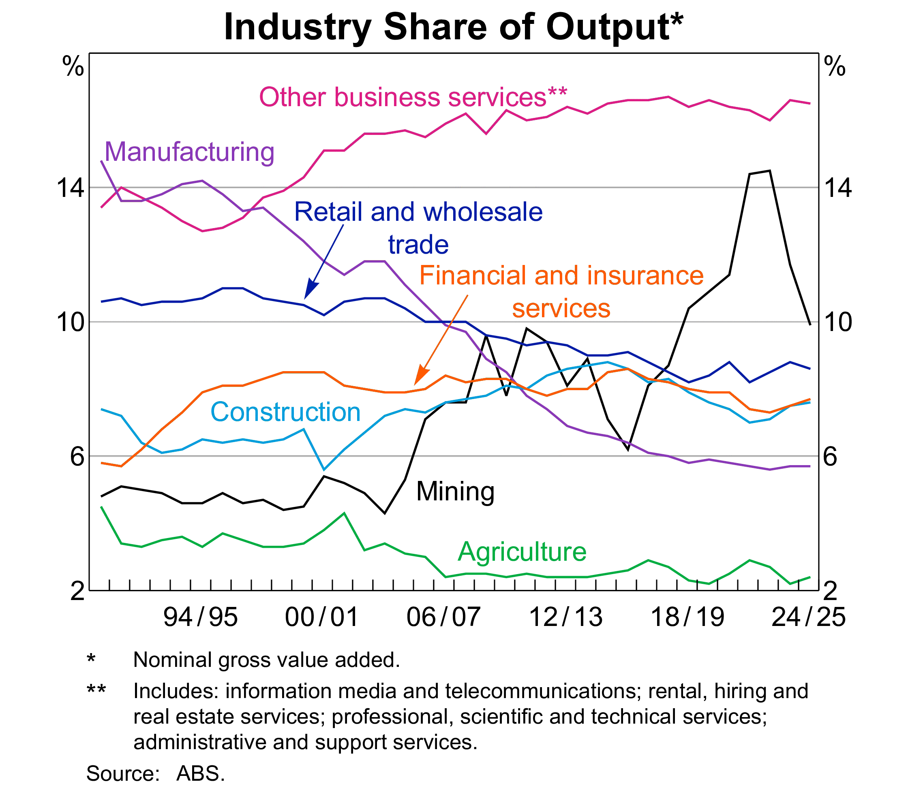
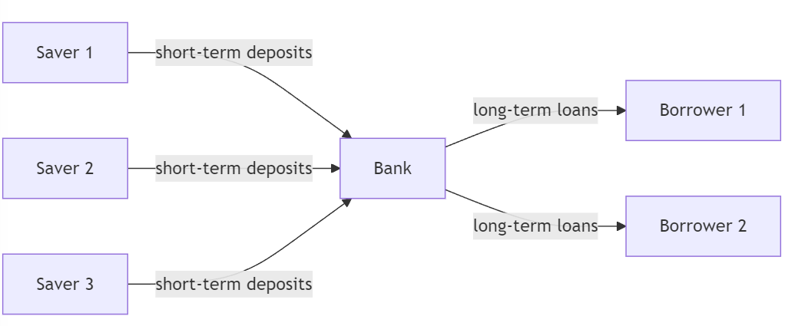
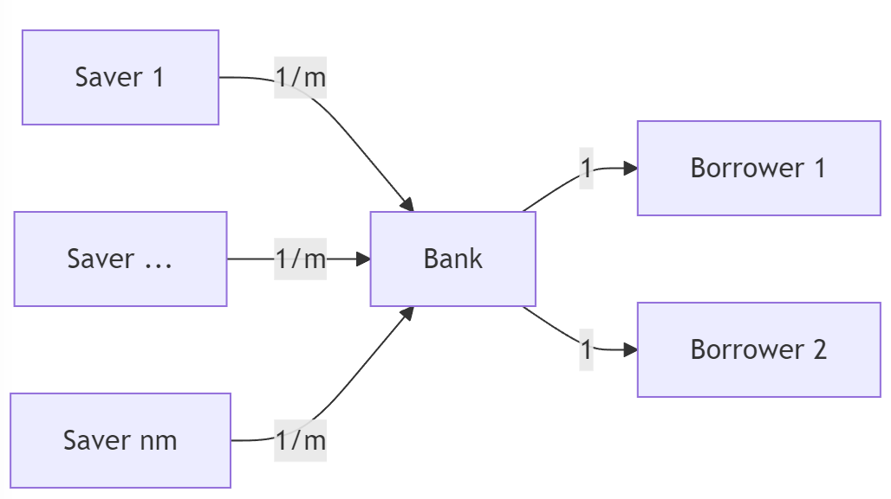
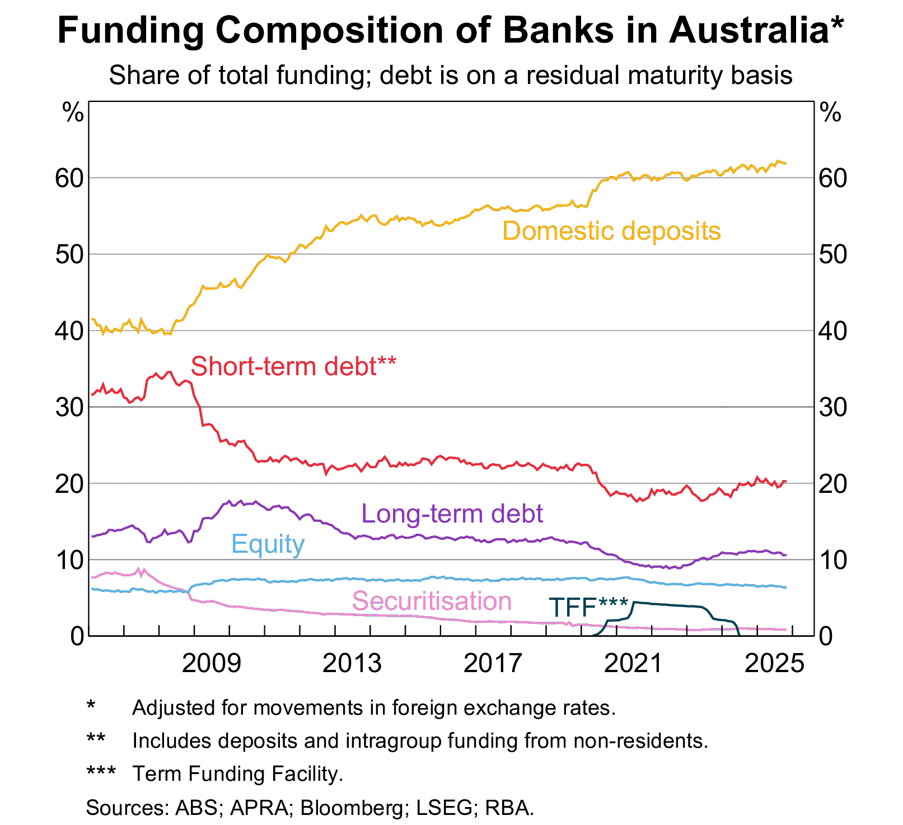
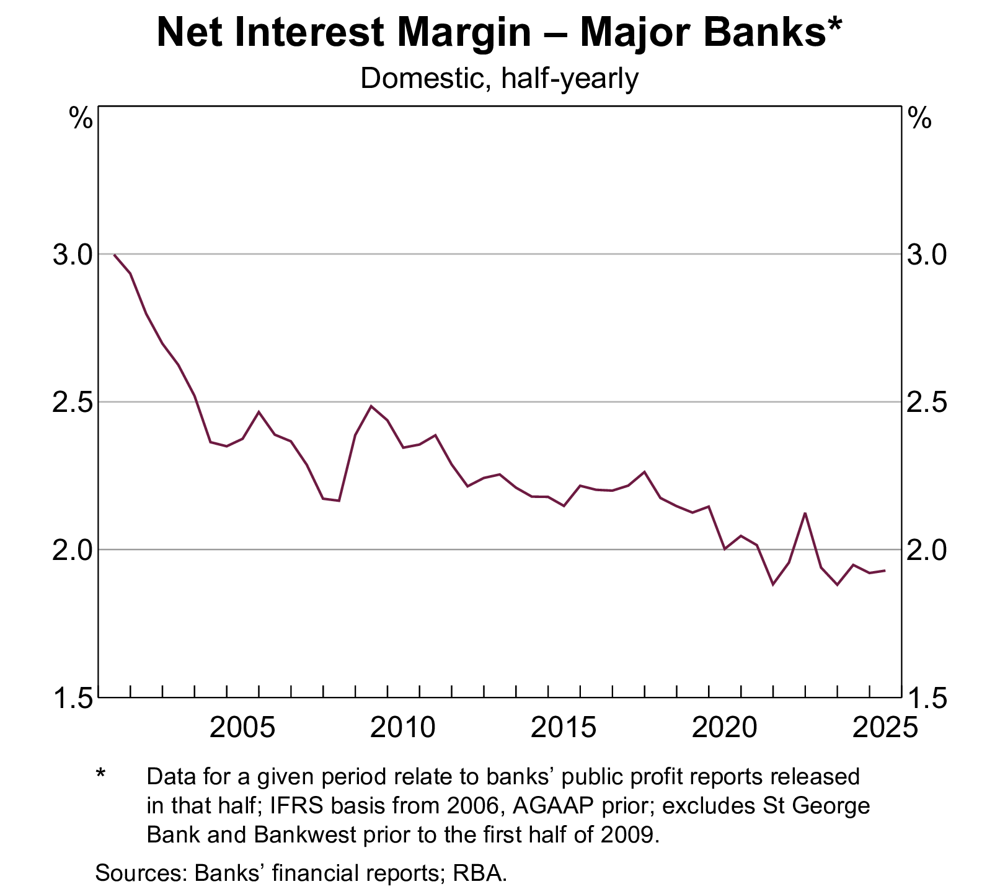
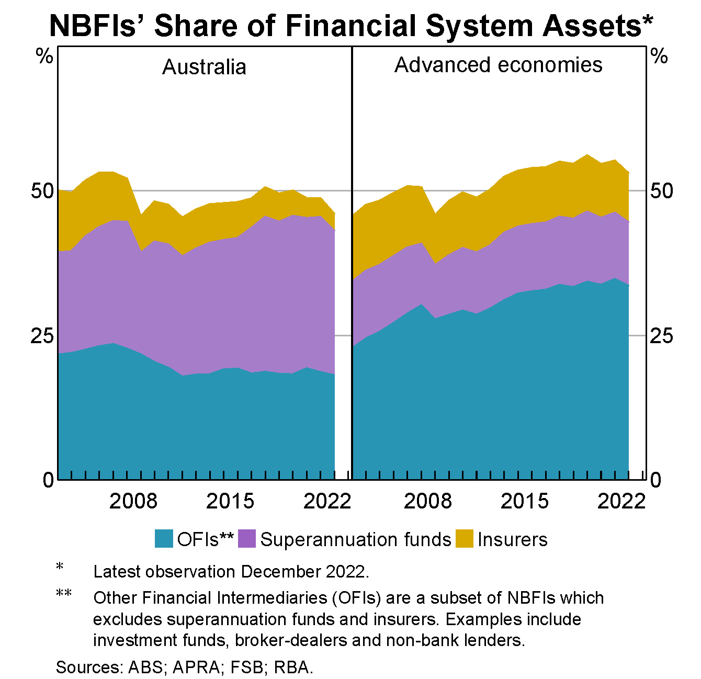

# Course admin

## Unit Convenor

:::: {.columns}

::: {.column width="70%"}

- Dr. Mingze Gao.
- Deputy Director of Macquarie University FinTech and Banking Research Centre.
- Lecturer in Finance, MQBS.
  - PhD in Finance (USyd), 
  - Grad.Cert. in Computing (UNSW), 
  - BCom (Hon) in Finance (USyd), 
  - BCom in Econometrics and Finance (USyd).
- Visiting Fellow (USyd).
- Postdoctoral Research Fellow (USyd), 2021-2023.
- Research in banking and corporate finance.

Contact:

- Room 549, 4ER. 
- Email: [mingze.gao@mq.edu.au](mailto:mingze.gao@mq.edu.au)
- Website: [https://mingze-gao.com](https://mingze-gao.com)
:::

::: {.column width="30%"}

::: {.content-hidden when-format="pdf"}
{width="50%"}
:::

:::

::::

## About this course

Course description:

- This unit applies finance theory to the context of operational decision-making and risk management in banking and financial intermediation. 
- The major decision areas for banking management are covered within a regulatory and corporate responsibility framework. 
- Major risks of banks and financial intermediation are being examined.

Key approaches:

- Research-informed teaching.
- Australian focus with global evidence.
- Priority on bank risk management.

::: {.callout-tip title="What you need (and don't need) for this course"}
- **No banking background assumed.** We build everything from scratch.
- **The hardest math is high-school algebra.** Every model in this course comes with a plain-English story first — if you understand the story, the symbols are just shorthand.
- What you *do* need: curiosity about why banks keep failing in spectacular ways — and how the survivors manage not to.
:::

## Course materials

The course materials are prepared based on several sources. Additional references are provided at the end of each week's slides.

- @saunders_financial_2023
- @freixas_microeconomics_2023

## Weekly topics

1. Introduction to banking and financial intermediation
1. Risks and regulation
1. Capital management and adequacy
1. Interest rate risk
1. Market risk
1. Credit risk I: individual loan risk
1. Credit risk II: loan portfolio and concentration risk
1. Liquidity risk
1. Liability and liquidity management
1. Sovereign risk, foreign exchange risk, and off-balance-sheet risk
1. Loan sales and securitisation
1. Emerging topics in bank risk management

## Assessments

There are three assessments in this course.

| Assessment            | Weight | Hurdle | When                          | Short Extension? | AI Approach |
|-----------------------|--------|--------|-------------------------------|------------------|-------------|
| Individual assignment | 30\%   | No     | Due in Week 7                 | Yes              | Open        |
| Group assignment      | 30\%   | No     | Due in Week 12                | No               | Open        |
| Final exam            | 40\%   | No     | University Examination Period | No               | Observed    |

## Roadmap

This week answers one question: **why do banks exist at all?**

1. The financial system and financial intermediation — the big picture.
2. Why frictionless markets make banks redundant — and why real markets don't.
3. The @Diamond1983 model — banks as providers of liquidity insurance.
4. The @Diamond1984 model — banks as delegated monitors.
5. A tour of the Australian financial services industry — ADIs, non-ADIs, insurers and fund managers.

::: {.callout-note title="Discussion"}
Before we start: you deposit \$1,000 in a bank at ~4% p.a. while the bank lends it out at ~6% p.a. Why don't savers and borrowers just cut out the middleman?
:::

# Background

## You used a bank three times before breakfast

Think about your morning:

::: {.incremental}
- You **tapped your card** for a coffee — a bank cleared that payment in about two seconds.
- Your **rent or mortgage** went out overnight by direct debit — a bank moved it.
- Your **salary** or youth allowance landed last week — through a bank.
- Even your coffee shop only exists because *someone* lent the owner money to fit it out.
:::

::: {.fragment}
Banking is **invisible infrastructure** — like plumbing, nobody thinks about it until it breaks.

This course is about what happens on the *other side* of the tap: where your money goes, what risks it takes on the way, and why the whole system occasionally catches fire.
:::

## Financial system

A __financial system__ encompasses various _financial intermediaries_, markets, regulators, and infrastructure in the generation and distribution of financial resources. 

> A well developed smoothly functioning _financial system_ facilitates the efficient life-cycle allocation of household consumption and the efficient allocation of physical capital to its most productive use in the business sector [@Merton1993].
> 
> Robert Merton, Nobel laureate (1997)

## Financial intermediation

__Financial intermediation__ is part of the financial system.

- It is the process by which financial intermediaries, such as banks, facilitate the flow of funds between savers and borrowers. 
- Banks are a major part of financial intermediation.
    - Banks were essentially the only provider of financial intermediation.
    - Since 1970s, dramatic development of the financial market:
        - Other intermediaries performing similar functions of banks.
        - FinTech, bigtech in money and credit services.
        - Cryptocurrencies, central bank digital currencies.
        - ...

## Why is banking and financial intermediation necessary?

Economists spent a century arguing about whether banks actually *matter*. A debate in three acts:

- **Finance is critical in real economic activities.**
    - Excessive debt levels and liquidity constraints could lead to downward spirals in economic activity, as witnessed during the Great Depression [@Fisher1933][^1]
- **"Finance is a veil", late 50s to early 70s.**
    - In a frictionless market, firm value is not affected by its capital structure so that financial intermediaries can be redundant [@Modigliani1958].
- **Finance is relevant, since 70s.**
    - Market frictions amplify economic cycles, particularly during downturns. Monetary factors alone are insufficient to explain the Great Depression's depth and persistence - it's more because of the collapse of the bank credit [@Bernanke1983, the "financial accelerator"].

[^1]: Nobel prize in economics started in 1969. Irving Fisher died in 1947. He would have won a Nobel prize.

::: {.content-hidden when-format="pdf"}
## Why is banking and financial intermediation necessary?
:::

A banking analogue of the @Modigliani1958 theorem showing that banks are useless with perfect financial markets.

- An economy of firms, households, banks and a bond market.
    - Households consume, and lend through banks or through the bond market.
    - Firms produce, and borrow from banks or from households through the bond market.
    - Banks borrow from households and lend to firms.

In a competitive equilibrium, banks make zero profit and have no impact on other agents' decisions. Firms are indifferent between bank credit and bonds. [@freixas_microeconomics_2023]

- Banks and bond market are perfect substitutes in a market without frictions.

::: {.content-hidden when-format="pdf"}
## Why is banking and financial intermediation necessary?
:::

The existence of banks (and other financial intermediaries) must be justified by their roles in __mitigating market frictions__. 

- Information asymmetry.
- ...

From an industrial organization perspective, the structure and competition of banking sector should have a unique impact on the economy, which warrants for regulation.

- The services provided by banks to borrowers and savers must be costly.
    - Monitoring costs.
    - Liquidity costs.
    - ...

## Empirical evidence

{#fig-industry-share-of-output fig-align="center"}

# The specialness of bank and financial intermediaries

## Importance of banks and financial intermediaries

We start this banking course by studying the importance of banks in improving the efficient allocation of financial resources in the economy.

- Specifically, why market frictions necessitate banks.
- A simple look at the @Diamond1983 model.

## An economy without financial intermediaries

::: {.content-hidden when-format="pdf"}
### The @Diamond1983 model
:::

{#fig-economy-without-fi fig-align="center"}

Some _frictions_ render this setup unappealing.

- Households are uncertain about when they will need their money. They might need it either in the short term or in the long term.
- Firms need long-term capital in production.
- _Banks_[^bank] are best positioned to perform __maturity transformation__.

[^bank]: We later define what is a _bank_. 

## The idea in plain English first

::: {.content-hidden when-format="pdf"}
### The @Diamond1983 model
:::

You have \$10,000. You face an everyday dilemma:

::: {.incremental}
- **Lock it away long-term** (a term deposit, an investment) → it earns more. But if your car dies on Tuesday, you can't touch it — or you break it early at a painful penalty.
- **Keep it in cash** → always available. But it earns nothing.
:::

::: {.fragment}
Here's the trick: **your emergency and your neighbour's emergency probably won't happen in the same week.**

A bank pools thousands of people like you. Since only a few need cash at any moment, the pool can invest long-term *and* still pay whoever knocks on the door. Everyone gets the best of both worlds.

That's **liquidity insurance** — and it won Diamond and Dybvig the 2022 Nobel prize. Now let's say the same thing with symbols.
:::

## Model setup

::: {.content-hidden when-format="pdf"}
### The @Diamond1983 model
:::

Let's see a simplified @Diamond1983 model:[^model]

[^model]: Douglas Diamond and Philip Dybvig won the Nobel prize in 2022, together with Ben Bernanke.

- Three dates, $t=0,1,2.$ *(today, "Tuesday", the long run)*
- Each household has initial goods of 1 unit at $t=0$.
    - They can invest long-term to earn $R>1$ at $t=2$ for consumption *(the reward for patience)*, or
    - store it for consumption at $t=1$ or $t=2$, which remains 1 unit *(cash under the mattress)*.
    - If they choose to liquidate the long-term investment at $t=1$, they get $l<1$ *(the penalty for breaking the piggy bank early)*.
- Households do not know whether they need to consume early at $t=1$.
    - A sudden need for money, e.g., medical bills.[^liquidity-insurance]
    - Key assumption.

[^liquidity-insurance]: Note that we do not introduce insurance here — but banks can provide such liquidity insurance.

## Model implications

::: {.content-hidden when-format="pdf"}
### The @Diamond1983 model
:::

You don't need the math — the implications are what matter:

::: {.incremental}
- We can determine the theoretical optimal allocation.
- Without transactions between agents, the allocation is inefficient.
- With transactions (financial market/bond market), the allocation is still not efficient.
    - Consumption can be transferred between $t=1$ and $t=2$.
    - Liquidation costs avoided.
- __The optimal allocation can be achieved with competitive banks offering deposit contracts and investing in the long-term.__
    - A ___bank___ simultaneously takes deposits from the public and grants loans to borrowers.
    - Transform short-term deposits to long-term assets.
:::

## Maturity transformation by bank

::: {.content-hidden when-format="pdf"}
### The @Diamond1983 model
:::

{#fig-maturity-transformation fig-align="center"}

- This structure, however, gives rise to _bank runs_ where everyone withdraws at $t=1$.
    - The insurance only works if *not everyone* claims at once. If everyone panics and knocks on the door on the same day, the pool collapses — even if the bank did nothing wrong.
    - The Silicon Valley Bank (SVB) failure in March 2023 is a typical bank run — **US\$42 billion walked out in a single day**. We will dissect exactly how it died in Weeks 4 and 8. Consider this the season trailer.
- No other risks considered.

## Beyond maturity transformation

Asset transformation, risk transformation and liquidity transformation.

- Banks make investments in borrowers - primary claims - illiquid and risky.
- Savers deposit in banks - secondary claims - liquid and low risk.

## Information frictions

Banks do more than maturity transformation. 

Banks are also better positioned to mitigate informational frictions in the market due to __economies of scale__.

- The cost advantages by spreading _the costs_ over a large number of customers, transactions, and output.
- The costs arise from all aspects of lending process: screening, monitoring, and auditing; all of which can be costly for individual household lenders.

## Information asymmetry and costs

Think of a landlord and a tenant — the landlord's problem is the lender's problem:

- __Screening__ costs in the context of _adverse selection_ [@Broecker1990].
    - Borrower knows better about its quality than lenders.
    - Occurs before a loan is made. *(Vetting the tenant before signing the lease.)*
- __Monitoring__ costs in the context of _moral hazard_ [@Holmstrom1997].
    - Borrower could engage in opportunistic behaviour with private benefits at the cost of lenders.
    - Occurs after a loan is made. *(The quarterly inspection.)*
- Auditing costs in the context of borrower failing to meet contractual obligations.
    - Renegotiate loan terms, recover loan value, etc.
    - Occurs in case of non-compliance. *(Chasing the unpaid rent.)*

## Banks as delegated monitor

Picture this: **1,000 savers** jointly fund **10 small businesses**. Who makes sure the money isn't being wasted?

- If *everyone* checks → 1,000 people duplicating the same homework. Absurdly wasteful.
- If *no one* checks → borrowers know no one is watching. Also a disaster.
- The fix: appoint **one monitor** to check on everyone's behalf — that's the bank.

@Diamond1984 turned this into a model (again, the symbols are just the story above):

- $n$ large borrowers, each requires $1$ unit of funds and costs $K$ to monitor, and
- $nm$ small savers each with $1/m$ units of funds ($m>1$); a total of $n$ units of funds.
- Total monitoring costs is $nmK$ if savers individually monitor, but
- $nK$ if the bank acts as the monitor on behalf of savers (one monitor per borrower).

{#fig-diamond-1984 fig-align="center"}

::: {.content-hidden when-format="pdf"}
## Banks as delegated monitor
:::

Economies of scale is evident:

- Total monitoring costs reduced from $nmK$ to $nK$.
- Delegated monitoring reduces unnecessary duplication of monitoring costs.
- The more savers per borrower ($m$), the greater the savings from delegation.

A caveat. It must be that the cost of delegation is smaller than the benefits gained from economies of scale. The delegated monitor needs to be monitored, too.

- Requirement is that the bank needs to be sufficiently diversified [@Diamond1984].

## The @Holmstrom1997 model

Key insights:

- Firms with profitable projects will still be _credit rationed_ if they do not have sufficient internal capital - they will not be able to raise capital from the market.
- Banks can alleviate this problem by providing credit to firms and monitoring borrowers.
- Banks improve the market.

## Changing dynamics

### FinTech, bigtech, and more

- Traditional "banks", taking deposits and grant loans, are facing increasing challenges.
- Global competition with other banks.
- Competition with nonbanks or "shadow banks".
    - Many of banks' functions can be now performed by nonbanks.
    - For example, FinTech firms may better reduce information asymmetry through screening and monitoring based on big data and advanced technologies (AI/ML), improved and customized services, and reduced cost of search and match with platform economy.
    - More importantly, nonbanks are unregulated or less regulated than banks.
- Central bank digital currencies (CBDC).
    - Increased funding costs for banks if households hold CBDC instead of bank deposits.
- Technological advancement.
    - Online/mobile banking simplifies transfer of funds.
- Transition from "originate and hold" to "originate and distribute" business model.

# The financial services industry

## Quick show of hands

Before the taxonomy — let's map the room:

- Who banks with one of the **Big 4** (CBA, ANZ, NAB, Westpac)?
- Who uses a **digital bank** — Up, ING, Ubank, Revolut?
- Who has ever set foot inside a **credit union**?
- Who checked their **super** balance in the last month? *(If not — do it this week. It's your money.)*

Whatever you answered — everything you just named fits into one of **three boxes**, defined by the RBA. Let's open them.

## Types of financial institutions

Australia's central bank, the Reserve Bank of Australia (RBA), classifies financial institutions into broadly three categories:[^fi]

[^fi]: [https://www.rba.gov.au/fin-stability/fin-inst/main-types-of-financial-institutions.html](https://www.rba.gov.au/fin-stability/fin-inst/main-types-of-financial-institutions.html)

1. Authorised deposit-taking institutions (ADIs)
2. Non-ADI financial institutions
3. Insurers and fund managers

## Authorised deposit-taking institutions (ADIs)

Financial institutions authorised by the Australian Prudential Regulation Authority (APRA) to carry out financial intermediation are called [authorised deposit-taking institutions (ADIs)](https://www.apra.gov.au/register-of-authorised-deposit-taking-institutions).

- These deposit-taking institutions (DIs) are the focus of this course.
- Three DI groups in Australia: banks, building societies and credit unions.

| Assets       | Liabilities and Equity |
|--------------|------------------------|
| Loans        | Deposits               |
| Other assets | Other liabilities      |
|              | Equity                 |

: Typical balance sheet of a DI {#tbl-balance-sheet}

## Banks

::: {.content-hidden when-format="pdf"}
### Deposit-taking institutions (DIs)
:::

- Banks are the largest depository institutions in terms of size.
- Major difference between banks and credit unions/savings institutions: banks have more varied assets and liabilities.
- Differences in operating characteristics and profitability across size classes - for instance, with regards to the size of the commercial loan portfolio.

## Largest banks globally

Largest banks by total assets in 2025, according to [S&P Global Market Intelligence](https://www.spglobal.com/market-intelligence/en/news-insights/articles/2025/4/the-worlds-largest-banks-by-assets-2025-88424232):

| Rank | Company                                      | Headquarter     | Total assets ($B) |
|------|----------------------------------------------|-----------------|-------------------|
| 1    | Industrial and Commercial Bank of China Ltd. | Mainland China  | 6,688.74          |
| 2    | Agricultural Bank of China Ltd.              | Mainland China  | 5,923.76          |
| 3    | China Construction Bank Corp.                | Mainland China  | 5,558.38          |
| 4    | Bank of China Ltd.                           | Mainland China  | 4,803.51          |
| 5    | JPMorgan Chase & Co.                         | US              | 4,002.81          |
| 6    | Bank of America Corp.                        | US              | 3,261.52          |
| 7    | HSBC Holdings PLC                            | UK              | 2,989.81          |
| 8    | BNP Paribas SA                               | France          | 2,809.83          |
| 9    | Crédit Agricole Group                        | France          | 2,693.58          |
| 10   | Mitsubishi UFJ Financial Group Inc.          | Japan           | 2,628.12          |
|      | ...                                          |                 |                   |
| 45   | Commonwealth Bank of Australia               | Australia       | 809.81            |

::: {.callout-note title="Two things to notice"}
- **Four of the five biggest banks on Earth are Chinese** — a quiet shift most people haven't registered.
- Australia's biggest bank ranks only **#45 globally** — yet at home, the Big 4 dominate the market. Small pond, very big fish. That concentration is a recurring theme in this course.
:::

## Banks in Australia

Four major banks: CBA, ANZ, NAB, and Westpac.

- national focus, "four pillars policy"
- offer corporate and retail banking services in Australia, NZ and Papua New Guinea
- they also operate in Asia, the US and the UK
- focus on lending (around 70 per cent).

Other major banks: Macquarie Bank, Bendigo and Adelaide Bank, Bank of Queensland, Suncorp, AMP Bank, etc.

Regional banks

- regional focus with operations across state borders
- large proportion of assets invested in residential housing loans due to their origins as building societies
- focus on lending

## Banks in Australia: funding composition

{#fig-bank-funding-comp fig-align="center"}

## Banks in Australia: net interest margin

{#fig-bank-nim fig-align="center"}

## Banks in Australia: non-performing assets

{#fig-bank-npa fig-align="center"}

## Credit unions and building societies
::: {.content-hidden when-format="pdf"}
### Deposit-taking institutions (DIs)
:::

Credit Unions

- Mutual cooperative organisations that provide deposit facilities, personal and housing loans and payments services to their members, who are usually linked by way of some common bond
- Primarily provide deposit facilities, personal and housing loans and payments services
- Members are usually linked by a common bond, such as a trade union or locality
- In 2014 there were 84 credit unions in Australia, compared to 348 in 1992

Building Societies

- DIs that traditionally were mutually owned, but are increasingly issuing share capital
- Depositors are members of the society
<!-- - Licensed under Banking Act to undertake the business of banking -->
<!-- - Subject to Corporations Law for corporate governance -->
- In 2014 there were 9 building societies, compared to 31 in 1992

Both credit unions and building societies are subject to the same prudential regulations as banks.

::: {.callout-note title="A disappearing species"}
From **348 credit unions in 1992** to only **36 credit unions and building societies combined in 2023**.

Quick discussion: why do you think they keep merging or converting into banks? *(Hint: think about the fixed costs of regulation and technology — and who can spread them over more customers.)*
:::

## Non-ADI financial institutions

- Money market corporations (broker-dealers)
    - Primarily wholesale credit market.
    - Investing, investment banking, market making, trading.
- Finance companies
    - Loans to households and SMEs.
    - Funding from debentures and unsecured notes.
- Securitisers
    - Special-purpose vehicles (SPVs) that issue securities backed by pools of assets (e.g. residential mortgage-backed securities).

## Insurers and fund managers

- Insurance companies
    - Life insurers: provide life, accident and disability insurance, annuities, investment and superannuation products. 
    - General insurers: provide insurance for property, motor vehicles, employers' liability, etc. 
    - Health insurers: provide insurance for private health costs. 
        - Medibank, Bupa, HCF, etc.
- Superannuation and approved deposit funds
- Public unit trusts
- Cash management trusts
- Common funds
- Friendly societies

## Life insurers in Australia

[Top 10 life insurers by total assets in 2023](https://www.apra.gov.au/life-insurance-institution-level-statistics):

| Company                                           | Total Assets   | Share  |
|---------------------------------------------------|----------------|--------|
| Resolution Life Australasia Limited (former AMP)  | 25,636,094,000 | 21.11% |
| Challenger Life Company Limited                   | 25,025,565,000 | 20.61% |
| AIA Australia Limited                             | 14,999,640,516 | 12.35% |
| TAL Life Limited                                  | 12,451,370,000 | 10.25% |
| Zurich Australia Limited                          | 8,268,873,000  | 6.81%  |
| MLC Limited                                       | 6,775,456,183  | 5.58%  |
| Munich Reinsurance Company of Australasia Limited | 5,401,974,315  | 4.45%  |
| Swiss Re Life & Health Australia Limited          | 3,454,823,000  | 2.85%  |
| TAL Life Insurance Services Limited               | 3,200,477,631  | 2.64%  |
| Hannover Life Re of Australasia Ltd               | 3,053,576,000  | 2.51%  |

## Superannuation funds

Australian governments have encouraged national savings over last decades through:

- taxation incentives,
- legislative requirements, and
- award superannuation.

Sector represents 30% of the assets of all FIs as at December 2021.

Australian pension assets projected to surpass the UK and Canada by 2031, to rise to second in the world.[^super-ref]

[^super-ref]: https://smcaustralia.com/news/australians-super-savings-on-track-to-become-second-largest-globally-by-the-early-2030s/

Managed by: 

- specialist superannuation fund managers, e.g., UniSuper
- self-managed superannuation funds (SMSF)

## Non-bank financial institutions (NBFIs)

{fig-align="center"}

# Finally...

## Key takeaways

1. **Banks exist because markets have frictions.** In a frictionless world, bank credit and bonds are perfect substitutes and banks add nothing [@Modigliani1958; @freixas_microeconomics_2023].
2. **Maturity transformation** [@Diamond1983]: banks turn liquid short-term deposits into illiquid long-term loans — providing liquidity insurance to households, at the cost of run risk.
3. **Delegated monitoring** [@Diamond1984]: one diversified monitor per borrower beats $m$ duplicated monitors — total costs fall from $nmK$ to $nK$.
4. **The Australian landscape**: ADIs (banks, credit unions, building societies) are APRA-regulated and the focus of this course; non-ADI FIs and insurers/fund managers complete the system.
5. **The model is being challenged** — FinTech, BigTech, CBDCs, and the shift from "originate and hold" to "originate and distribute".

## Before next week

One small mission (5 minutes, genuinely useful):

1. **Find out who actually owns your bank.** Up is Bendigo & Adelaide Bank. Ubank is NAB. Bankwest is CBA. St.George is Westpac. Yours?
2. **Find your bank on APRA's [register of ADIs](https://www.apra.gov.au/register-of-authorised-deposit-taking-institutions).** If it's there, your deposits are protected up to \$250,000 — we'll see why that matters in Week 8.

Bring your answer next week — some of you will be surprised.

Next week: **what can go wrong** — a full tour of every risk on a bank's balance sheet, and why regulators watch banks more closely than any other industry.

## Suggested readings

- The [Financial Stability Review](https://www.rba.gov.au/publications/fsr/) published semi-annually by the RBA.
- [Global Pension Rankings](https://smcaustralia.com/app/uploads/2025/02/2025-02-20-SMC-Research-Note-Global-Pension-System-Rankings.pdf) by the Super Members Council.

## References