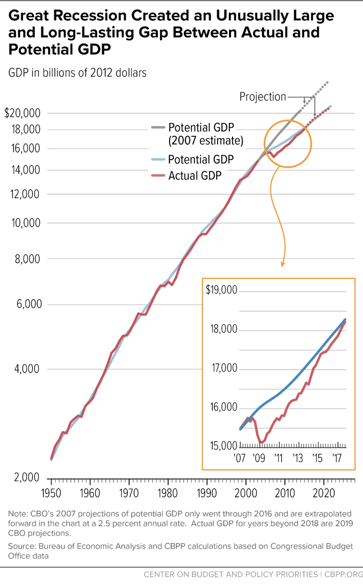
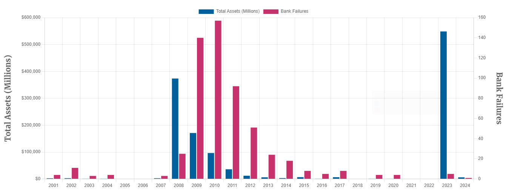
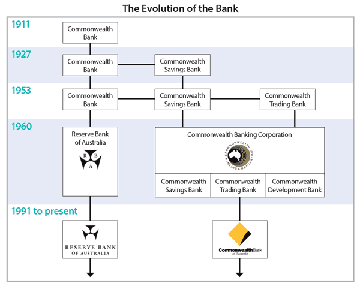

# Introduction

## Banks need regulation

DIs (banks, interchangeably) are financial institutions chartered to take deposits from the public and grant loans simultaneously. They are necessary in an economy achieving efficient allocation of financial resources.

However, we also note that

- the banking structure itself could cause financial fragility [@Diamond1983].
- the collapse of bank credit contributes to economic crisis [@Bernanke1983].[^nobel2022]

Therefore, bank failures have significant _negative externalities_. As a result, banks are heavily regulated.

[^nobel2022]: These two citations are the prize-winning pair: Diamond, Dybvig and Bernanke shared the **2022 Nobel prize** "for research on banks and financial crises". Week 1 gave you the Diamond–Dybvig half; this bullet is Bernanke's half.

## Why regulation, step by step

The logic runs as a chain — each fix creates the next problem:

::: {.incremental}
1. Maturity transformation makes banks **run-prone** [@Diamond1983], and failures damage the real economy [@Bernanke1983].
2. So governments provide a **safety net** — deposit insurance, lender of last resort. Runs stop.
3. But insured depositors no longer monitor their bank — and a protected bank has an incentive to take **more risk** (moral hazard).
4. So someone must monitor in the depositors' place. Dispersed small depositors can't do it themselves — the regulator monitors **on their behalf** [the "representation hypothesis", @DewatripontTirole1994].
:::

::: {.fragment}
Prudential regulation is not a substitute for market discipline — it *replaces* the discipline that the safety net removed. Keep this chain in mind all semester: nearly every rule we study is step 4 cleaning up after step 2.
:::

## Roadmap

This week sets up the framework for the rest of the course:

1. Why banks need regulation — fragility and negative externalities.
2. **Risks of DIs** — a balance-sheet tour of every risk we will study, week by week.
3. **Regulation of DIs** — microprudential vs macroprudential.
4. **Who regulates** — BIS/Basel internationally; RBA, APRA, ASIC and Treasury in Australia.

::: {.callout-note title="Discussion"}
Woolworths and a bank are both large companies. If either fails, shareholders lose money. Why do we heavily regulate the bank but not the supermarket?
:::

## Banking regulations

What types of regulations are needed or in place for banks?

- entry and chartering
- safety and soundness
- credit allocation
- consumer and investor protection
- ...

## An example: entry and chartering regulation

Economic theories generally view competition as improving social welfare. But it is not necessarily true for the banking sector.

The intuition, before the model: imagine a town where every second shopfront is a bank branch. Each branch needs its own building, staff and IT systems (**fixed costs**), yet the town's deposits are simply split more and more thinly among them. Convenient? Slightly. Wasteful? Very.

- @Salop1979's circular "location" model makes this precise: with free entry, banks keep entering until profits hit zero — and the free-entry number of banks is **twice** the socially optimal number [@freixas_microeconomics_2023]. Society pays the duplicated fixed costs.
- Can regulators fix this by making banking *more expensive* — say, higher reserve requirements? **No.** In the model, banks pass such proportional costs on to depositors (lower deposit rates); the free-entry number of banks does not change.
- What works is restricting entry directly: **charters** (a licence to bank).
- Chartering also gives regulators a lever for everything else — a licence granted can be revoked.

::: {.callout-note title="Research note: is bank competition actually bad?"}
Don't leave with "competition bad" as settled truth. The literature runs both ways: *competition–fragility* — competition erodes charter value, so banks gamble [@Keeley1990] — versus *competition–stability* — market power means higher loan rates, which make borrowers riskier [@BoydDeNicolo2005]. Empirically the debate is still open — which is precisely why entry regulation differs so much across countries.
:::

## The GFC and the new banking regulatory landscape

::: {.columns}
:::: {.column width="30%"}
{#fig-gfc-impact .lightbox fig-align="center"}

<!-- Source: https://www.cbpp.org/research/chart-book-the-legacy-of-the-great-recession -->
::::

:::: {.column width="60%"}
- The Global Financial Crisis (2007-2009) caused the Great Recession, whose effects on the economy persisted for years.
- The regulations were unable to prevent the collapse of the banking sector.
- New regulatory framework, Basel III, established in response.
::::
::::

## The new banking regulatory landscape

Before GFC, the banking regulations primarily focused on prudential regulations concerning the risks of individual banks.

- **Capital adequacy**: sufficient capital to cover potential losses.
- **Risk management**: ability to manage various risks such as credit, market, and operational risks.
- **Liquidity management**: enough liquid resources to meet immediate obligations.

::: {.fragment}
Post-GFC, the banking regulations have _expanded_ to include macroprudential regulations.

- **Systemic focus**: greater emphasis on understanding and mitigating systemic risks that could destabilize the entire financial system.
- **Countercyclical policies**: measures introduced to mitigate the procyclical effects of previous regulatory approaches.
- **Stress testing**: system-wide tests to assess the resilience of the financial system to shocks.
:::

# Risks of DIs

## Banking and trading books

A bank has a **banking book** and a **trading book**, two different ways to categorize financial assets and liabilities, each governed by different management strategies and regulatory standards.[^1]

[^1]: See suggested readings for the boundary between banking and trading books.

- **Banking book**
    - Assets and liabilities that the bank intends to hold for the long term.
    - Primarily used for traditional banking activities, e.g., lending and taking deposits.

- **Trading book**
    - Assets and liabilities that the bank intends to trade actively.
    - The value and income from these assets are driven by market conditions and short-term price movements.

## What risks do banks face?

The most simplified balance sheet of a bank:

| Assets       | Liabilities and Equity |
|--------------|------------------------|
| Loans        | Deposits               |
| Other assets | Other liabilities      |
|              | Equity                 |

: Typical balance sheet of a DI {#tbl-balance-sheet}

- Risks on the assets side.
- Risks on the liabilities and equity side.
- Other risks beyond the balance sheet.

## Risks on the assets side

- **Loans**
- **Other assets** (bonds, investment securities, derivatives)

{#fig-cba-balance-sheet fig-align="center"}

## Risks on the assets side - loans

Loans are often in the banking book and reported based on amortised book value.

Major risks due to uncertainties in:

- Borrower's creditworthiness, **credit risk**
- Interest rate when rolling over / repricing the loans, **interest rate risk**
- Exchange rate if loans are denominated in foreign currencies, **foreign exchange risk**
- Ability to liquidate the loans, **liquidity risk**
- ...

## Risks on the assets side - other assets

Bonds, derivatives, investment securities, ...

::: {.columns}
:::: {.column width="50%"}
For example, a bond's price is given by

$$
P = \sum_{t=1}^T\frac{C}{(1+r)^t} + \frac{F}{(1+r)^T}
$${#eq-bond-pv}

where $C$ is coupon payment, $F$ face value, $T$ maturity, and $r$ interest rate.

Risks due to uncertainties in:

- $C$ and $F$, **credit risk**
- $r$, **interest rate risk**
::::

:::: {.column width="50%"}
::: {.content-hidden when-format="pdf"}
```{ojs}
//| echo: false
 
viewof maturity4 = Inputs.range(
  [1, 30], 
  {value: 15, step: 1, label: "Maturity (years):"}
)
viewof couponRate4 = Inputs.range(
    [0.01, 0.2],
    {value: 0.05, step: 0.01, label:"Coupon rate:"}
)
d = {
  const f = 100;
  let c, m;
  c = couponRate4;
  m = maturity4;
  function pv(c, f, t, r) {
    return c * (1 - (1+r)**(-t)) / r + f / (1+r)**(t)
  }
  const prices = {"YTM": [], "Price": []};
  let coupon = f * c;
  for (let ytm = 0.01; ytm < 20; ytm++) {
    let price = pv(coupon, f, m, ytm/100);
    prices["YTM"].push(ytm);
    prices["Price"].push(price);
  }
  return prices;
}

data4 = transpose(d)
Plot.plot({
  caption: "Assume $100 bond, annual coupons paid in arrears and effective annual discount rate.",
  x: {padding: 0.4, label: "YTM (%)"},
  grid: true,
  marks: [
    Plot.ruleY([0, 100]),
    Plot.ruleX([0]),
    Plot.lineY(data4, {x: "YTM", y: "Price", stroke: "blue"}),
  ]
})
```
:::
::::
:::

Many are on the trading book.

- **Market risk**
- **Liquidity risk**

## Risks on the liabilities and equity side

- **Deposits**
- **Other liabilities** (primarily debts)

{#fig-cba-balance-sheet-liabilities fig-align="center"}

## Risks on the liabilities and equity side - deposits

::: {.columns}
:::: {.column width="60%"}
Deposits are the most important funding source of banks - 60% for Australian banks.

- Non-interest bearing deposits.[^non-interest-bearing-deposits]
- On-demand and short-term deposits.
- Term deposits.
- Certificates of deposits.

Risks involved:

- **Interest rate risk**
- **Liquidity risk**
- If foreign currencies, **foreign exchange risk**

[^non-interest-bearing-deposits]: Check if your everyday transaction accounts earn you interest!
::::

:::: {.column width="40%"}
{#fig-bank-funding-comp fig-align="center" .lightbox}
::::
:::

## Risks on the liabilities and equity side - debts

Debts are also an important funding source of banks.

- Account for about 30% of bank funding in Australia.

Risks involved:

- **Interest rate risk**
- **Liquidity risk**
- If foreign currencies, **foreign exchange risk**

## Risks on the liabilities and equity side - equity

Equity, assets value minus liabilities.

- **Insolvency risk**
- Manifestation of many other risks - a focus of banking regulations
  - **Interest rate risk**: changing interest rates cause disproportionate changes in assets value and liabilities value.
  - **Market risk**: losses from adverse changes in market conditions, such as interest rate fluctuations or stock market declines.
  - **Credit risk**: high default rates on loans and other credit products can erode asset values.
  - **Liquidity risk**: inability to convert assets into cash quickly without significant losses.
  - **Operational risk**: losses stemming from failed internal processes, systems, human errors, or external events.
  - **Concentration risk**: overexposure to a specific borrower, industry, or geographic region.

## Risks beyond balance sheet

Many other risks:

- **ESG risk**
- **Cybersecurity risk**
  <!-- - UniSuper[^unisuper] [week-long service outage in May 2024](https://www.unisuper.com.au/about-us/media-centre/2024/a-joint-statement-from-unisuper-and-google-cloud). -->
- ...

::: {.callout-note}
See how NAB discusses risk factors, p89 of its [annual report 2023](https://www.nab.com.au/content/dam/nab/documents/reports/corporate/2023-annual-report.pdf).
:::

<!-- [^unisuper]: Albeit not a DI. -->

## Bank failure

Bank failure occurs when a bank is unable to meet its obligations to its depositors or other creditors and either goes bankrupt or must be taken over by a financial regulatory body to avoid bankruptcy.

{#fig-bank-failure fig-align="center"}

::: {.callout-note title="What about Australia?"}
The chart above is the US. Australia's record is strikingly different: the last serious bank collapses were the **state bank failures of the early 1990s** (State Bank of Victoria, State Bank of South Australia) — both absorbed or bailed out, with no depositor losing a cent — and the deposit guarantee scheme introduced in 2008 has **never once been activated**.

Discussion: is that three decades of regulatory success, or three decades of luck riding a housing boom? Hold that question — it returns in Week 7 when we see how concentrated in mortgages Australian banks really are.
:::

## Silicon Valley Bank (SVB) failure

SVB's failure in March 2023 was, at the time, the largest US bank failure since the GFC (surpassed by First Republic Bank two months later).

- **Concentration risk**: highly concentrated client base primarily in the tech and VC sectors
- **Interest rate risk**: a large amount of long-duration assets, like U.S. Treasury bonds and mortgage-backed securities, which decreased in value as interest rates rose sharply.
- **Liquidity risk**: rising interest rates led to a mismatch in the liquidity profile as SVB’s assets (long-term bonds) lost value while liabilities (deposits) demanded immediate liquidity.
- **A failed capital raise**: forced asset sales crystallised a US\$1.8 billion loss, and the attempted share offering that followed was read by the market as a distress signal.
- **Bank run**: news of the bank's difficulties triggered withdrawals of **US\$42 billion in a single day** — a classic bank run at digital speed.

::: {.callout-tip}
Notice how many rows of our risk catalogue one failure ticks. Risks are taught one per week, but they arrive together — each amplifying the next.
:::

## Bank risks - our approach

In this course, we will examine bank risks one by one in a three-step framework:

1. **Identify**: definition, source and nature
2. **Measure**: ways to gauge the exposure
3. **Manage**: strategies to mitigate

## Your risk map for the semester

Today's catalogue is the trailer. Here is where each risk gets its full episode:

| Risk | Where we cover it |
|------|-------------------|
| Insolvency risk (and the capital that absorbs it) | Week 3 |
| Interest rate risk | Week 4 |
| Market risk | Week 5 |
| Credit risk — individual loans | Week 6 |
| Credit risk — portfolios and concentration | Week 7 |
| Liquidity risk (and its management) | Weeks 8–9 |
| Sovereign, FX, and off-balance-sheet risk | Week 10 |
| Moving risk off the balance sheet | Week 11 |
| Emerging risks — FinTech, cyber, AI | Week 12 |

: Risk → week map {#tbl-risk-map}

When SVB comes up again — and it will, in Weeks 4, 7 and 8 — you'll see the same failure through a different risk lens each time.

# Regulations of DIs

## Regulations of banks

Failure of banks has significant negative externality.

- Loss of deposits for savers
- No credit supply for borrowers
- Impact on real economy
- Global Financial Crisis (GFC) 2007-2009

Broadly, banking regulations can be classified into two aspects:

- **Microprudential regulations**: safety and soundness of individual institutions
- **Macroprudential regulations**: stability of the financial system

The two aspects are not mutually exclusive, but complementary.

# Prudential regulations

## Microprudential regulations

- **Focus**:
  - Targets the safety and soundness of individual financial institutions.

- **Objectives**:
  - Prevent the failure of banks and other financial entities.
  - Protect consumers’ deposits and maintain confidence in the financial system.

- **Methods**:
  - Setting capital adequacy requirements.
  - Enforcing liquidity requirements to manage short-term obligations.
  - Implementing risk management standards and supervisory review processes.
  - Conducting regular inspections and audits of individual institutions.

## Macroprudential regulations

- **Focus**:
  - Aims at the stability of the financial system as a whole.

- **Objectives**:
  - Prevent systemic risks and financial crises that affect the entire economy.
  - Reduce financial system vulnerabilities from interconnectedness and procyclical tendencies.

- **Methods**:
  - Implementing caps on overall credit growth and sector-specific loan concentrations.
  - Using stress tests that simulate adverse economic scenarios to gauge system-wide resilience.
  - Applying countercyclical capital buffers that increase during economic booms and decrease during downturns.

# Regulatory authorities

## International banking regulatory framework

The Bank for International Settlements (BIS) established in 1930 is the principal centre for international central bank cooperation.

- WW2 to 1970s: implementing and defending the Bretton Woods system.
- 1970s to 80s: managing cross-border capital flows following oil crises and the international debt crisis.
- 1988 Basel Capital Accord and the Basel II revision (2004-2006): establishing and revising international standards for capital adequacy.
- Post-GFC: **Basel III**, a set of reforms designed to improve the regulation, supervision, and risk management of banks.
- Now: implementation of the final Basel III reforms — informally "Basel IV" or "Basel 3.1".

## Banking regulators in Australia

The Council of Financial Regulators ([CFR](https://www.cfr.gov.au/)) coordinates main financial regulatory agencies in Australia, including:[^cfr]

- Reserve Bank of Australia ([RBA](https://www.rba.gov.au/)), chairs the Council
- Australian Prudential Regulation Authority ([APRA](https://www.apra.gov.au/))
- Australian Securities & Investments Commission ([ASIC](https://asic.gov.au/))
- Department of Treasury (the [Treasury](https://treasury.gov.au/))

[^cfr]: CFR is non-statutory and has no regulatory functions.

## Banking regulators in Australia - RBA

{#fig-evolution-of-rba fig-align="center"}

## Banking regulators in Australia - RBA

RBA is the **central bank** of Australia.

- Its duty is to contribute to price stability, full employment, and the economic prosperity and welfare of the Australian people.
- It does this by conducting monetary policy to meet an agreed inflation target, working to maintain a strong financial system and efficient payments system, and issuing the nation's banknotes.

The role and functions of the RBA explained by the Governor Michele Bullock [[Video](https://youtu.be/J2CVhneEvj0)].

::: {.callout-important title="The RBA was restructured in 2025 — older textbooks are out of date"}
Following an independent review (2023), legislation split the old single Reserve Bank Board into **two boards from 1 March 2025**:

- a **Monetary Policy Board** — sets the cash rate and financial stability policy; and
- a **Governance Board** — oversees the RBA's operations and management.

The reforms also confirmed a **dual mandate**: price stability and full employment. If your textbook (or an AI chatbot) describes "the Reserve Bank Board" setting interest rates, it is describing the pre-2025 world.
:::

## Banking regulators in Australia - APRA

APRA, established in 1998 on the recommendation of the **Wallis Inquiry** (1997), is an independent statutory authority that supervises institutions across banking, insurance and superannuation, and is accountable to the Australian Parliament.

::: {.callout-tip title="'Twin peaks' — Australia's export to the world"}
Wallis split financial regulation by *function*, not by industry: **APRA** watches solvency (prudential regulation), **ASIC** watches behaviour (conduct regulation). This "twin peaks" architecture is now a template studied worldwide — the UK adopted it in 2013 (PRA + FCA). One-line memory aid: *APRA cares whether your bank is safe; ASIC cares whether it is honest.*
:::

APRA's primary functions and objectives include:

- **Prudential Supervision**: APRA sets prudential standards and practices for financial institutions to maintain stability and prevent systemic failures. This includes regulations on capital adequacy, risk management, and governance.
- **Financial Stability**: APRA contributes to the overall stability of the financial system by monitoring and mitigating risks that could lead to financial crises.
- **Protection of Depositors, Policyholders, and Superannuation Fund Members**: APRA ensures that institutions meet their financial promises to customers, protecting their interests and enhancing confidence in the financial system.

## Banking regulators in Australia - ASIC

ASIC is Australia's corporate, markets, and financial services regulator.

- Responsible for market integrity and consumer protection across the financial system.
- Sets standards for financial market behaviour with the aim to protect investor and consumer confidence.
- Administers the **Corporations Act 2001** to promote honesty and fairness in companies and markets.

::: {.callout-note title="Why conduct regulation has teeth: the Hayne Royal Commission (2018–19)"}
The Royal Commission into banking misconduct uncovered, among much else, **fees charged to dead customers** and loans mis-sold to people who could never repay. The fallout: CEO and chair resignations, billions in remediation, and a markedly more aggressive ASIC. A bank can be perfectly *solvent* (APRA satisfied) while treating customers appallingly (ASIC's problem) — which is exactly why the peaks are twins.
:::

## Banking regulators in Australia - Treasury

The Department of the Treasury (Treasury) also plays a role in the formulation and implementation of banking regulations in Australia.

- **Policy Development**: Treasury works closely with regulatory bodies like the Reserve Bank of Australia (RBA), Australian Prudential Regulation Authority (APRA), and Australian Securities & Investments Commission (ASIC) to develop policies that ensure the stability and integrity of the banking system.
- **Legislative Framework**: It is involved in drafting and implementing legislation related to banking regulation, such as the Banking Act and financial sector reforms.

## Banking regulators in the U.S.

Some important ones include:

- Federal Reserve System (The Fed): central bank of the United States.
- Office of the Comptroller of the Currency (OCC): charters, regulates, and supervises all national banks and federal savings associations.
- Federal Deposit Insurance Corporation (FDIC): insures deposits at banks and thrift institutions, supervises financial institutions, and manages receiverships of failed banks.

## Banking regulators in China

Some important ones include:

- People's Bank of China (PBOC): central bank of China.
- National Financial Regulatory Administration (NFRA): established in May 2023, replaced the former China Banking and Insurance Regulatory Commission (CBIRC); regulates all financial sectors except securities.
- China Securities Regulatory Commission (CSRC): regulates the securities industry.

## Banking regulators in Europe

Some important ones include:

- European Central Bank (ECB): oversees monetary policy for the Eurozone and supervises significant banks within member states to ensure financial stability.
- European Banking Authority (EBA): develops regulatory standards and guidelines to maintain the stability and integrity of the EU's banking sector, coordinating efforts among national regulators.
- European Systemic Risk Board (ESRB): monitors and assesses systemic risks.

# Finally...

## Key takeaways

1. **Banks are fragile by design** — maturity transformation invites runs [@Diamond1983], and bank failures spill over to the real economy [@Bernanke1983]. That negative externality justifies regulation.
2. **Regulation follows a chain**: fragility → safety net → moral hazard → prudential supervision. The regulator monitors on behalf of depositors who cannot [@DewatripontTirole1994].
3. **Read the balance sheet as a risk map**: credit, interest rate, FX and liquidity risk on the asset side; funding and liquidity risk on the liability side; insolvency risk in equity; operational and other risks beyond it.
4. **Our three-step framework** for every risk: identify → measure → manage.
5. **Two layers of regulation**: microprudential (individual institutions) and macroprudential (the system) — complementary, not substitutes.
6. **Know your regulators — Australia runs "twin peaks"**: APRA watches solvency, ASIC watches conduct; the RBA (restructured into two boards in 2025) handles monetary policy and stability; Treasury handles policy; the CFR coordinates. Basel standards come from the BIS.

## Suggested readings

- [History of BIS](https://www.bis.org/about/history_newarrow.htm)
- [Origins of the Reserve Bank of Australia](https://www.rba.gov.au/education/resources/explainers/origins-of-the-reserve-bank-of-australia.html)
- [RBA's dual mandate - Inflation and Employment](https://www.rba.gov.au/speeches/2025/sp-gov-2025-07-24.html)
- Basel Framework - Risk-based Capital Requirements (RBC), [RBC25 Boundary between the banking book and the trading book](https://www.bis.org/basel_framework/chapter/RBC/25.htm)
- [Banks' funding costs and lending rates](https://www.rba.gov.au/education/resources/explainers/banks-funding-costs-and-lending-rates.html)
- [FDIC bank failures](https://www.fdic.gov/resources/resolutions/bank-failures/)
- [About APRA](https://www.apra.gov.au/about-apra)
- [ASIC website](https://asic.gov.au/)
- [MoU between the Treasury and the APRA](https://www.apra.gov.au/sites/default/files/MoU-Treasury.pdf)


## References