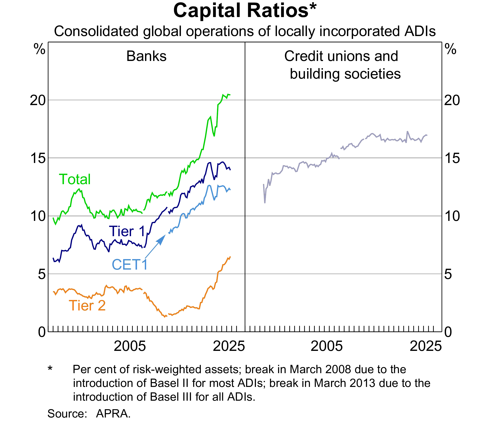
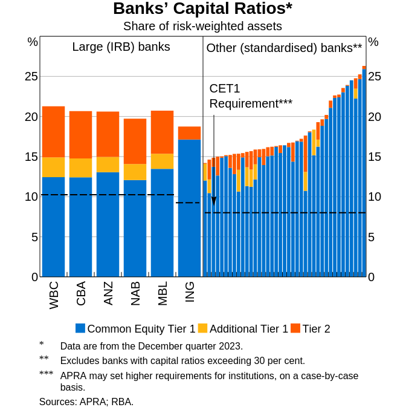

# Introduction

## Roadmap

Last week we mapped the risks of a DI. 

Day-to-day, expected losses are covered by loan pricing, provisions and earnings; capital is the buffer that absorbs the *unexpected* losses that get through.

This week we study the last line of defence against them: capital. 

1. What is capital? Economic, accounting and regulatory perspectives.
2. How capital absorbs losses: market value vs book value of equity.
3. The Basel Accords: from Basel I to Basel III.
4. **The core skill this week**: calculating risk-weighted assets (RWA) and the four capital ratios, on- and off-balance-sheet.
5. Buffers on top: capital conservation buffer, CCyB, and G-SIB surcharges.

::: {.callout-note title="Discussion"}
A bank funds itself with 95% deposits and 5% equity. A typical non-financial firm is closer to 40% debt, 60% equity. Why do banks run on so little capital, and why do regulators let them?
:::

## Defining "capital"

Understanding how _capital_ safeguards a financial institution (FI) from insolvency risk requires a clear definition of capital. However, definitions vary significantly across different perspectives:

- **Economist’s Perspective**: Economists define an FI’s capital, or owners’ equity, as the difference between the market values of its assets and liabilities, also known as __net worth__. This concept aligns with market value accounting.
- **Accounting Perspective**: Accountants typically focus on __book value__, which is the historical cost of assets minus liabilities as recorded in financial statements.
- **Regulatory Perspective**: Regulatory bodies have crafted definitions of capital that may diverge from economic net worth to prioritize financial stability. Regulatory capital requirements often rely on historical or book value accounting concepts.
    - Regulatory capital includes various tiers (e.g., Tier 1 and Tier 2) and is used to assess capital adequacy.

## Capital of financial institutions (FIs)

The major functions of capital are

- to absorb unanticipated losses to enable the FI to continue as a going-concern
- to protect uninsured depositors, bondholders and creditors in case of insolvency and liquidation
- to protect FI insurance funds and the taxpayer
- to protect the FI owners against increases in insurance premiums 
- to partially fund the FI's real investment activities

::: {.callout-note title="Why is capital important in a regulatory context? APRA's explanation of _capital_"}
From a prudential regulator’s perspective, capital is a measure of the financial cushion available to an institution to absorb any unexpected losses it experiences in running its business.
For a bank, such losses might include loans that default and are written off. Insurers might be hit by an unexpectedly high volume of claims in the wake of a major natural disaster.
:::

Sufficient capital levels

- inspire confidence in the FI
- enable the FI to continue as a going concern even in difficult times

::: {.callout-important title="The #1 misconception: capital is NOT a pile of cash"}
"Banks must *hold* more capital" sounds like money locked in a vault, sitting idle. It isn't. Capital is a funding source: the slice of the bank's assets financed by shareholders rather than by depositors and other creditors. A bank with more capital can lend just as much. It simply funds those loans with more equity and fewer IOUs. Cash is an asset; capital sits on the other side of the balance sheet. Many public arguments about capital regulation rest on getting this wrong.
:::

# Capital and insolvency risk

## Example of bank net worth (capital) absorbing losses {auto-animate=true auto-animate-easing="ease-in-out"}

The marking-to-market method allows balance sheet values to reflect current rather than historic prices.

Consider the following market value balance sheet of an FI:

::: {.r-hstack}
::: {data-id="box1"}
| Assets (\$m) | Amount | Liabilities (\$m)          | Amount |
|--------------|--------|----------------------------|--------|
| Securities   | 70     | Deposits                   | 85     |
| Loans        | 30     | Net worth                  | 15     |
| Total assets | 100    | Total liabilities + equity | 100    |

: Market-value-based balance sheet before loan losses {#tbl-mv-balance-sheet-before-loss}

:::
:::

In this example the FI is __solvent__ on a market value basis.

## Example of bank net worth (capital) absorbing losses {auto-animate=true auto-animate-easing="ease-in-out"}

The marking-to-market method allows balance sheet values to reflect current rather than historic prices.

Consider a fall in the market value of loans to \$10 (a fall of \$20m).

::: {.r-hstack}
::: {data-id="box1"}
| Assets (\$m) | Amount | Liabilities (\$m)          | Amount |
|--------------|--------|----------------------------|--------|
| Securities   | 70     | Deposits                   | 85     |
| Loans        | **10** | Net worth                  | **-5** |
| Total assets | **80** | Total liabilities + equity | **80** |

: Market-value-based balance sheet after loan losses {#tbl-mv-balance-sheet-after-loss}

:::
:::

FI is now __insolvent__, its net worth has declined from $15 to -\$5. The owners’ net worth stake has been completely wiped out.

::: {.fragment}
After the liquidation of the remaining **\$80** in assets, depositors would get only 80/85 in dollars, without deposit insurance.
:::

::: {.fragment}
The FI's capital is used to absorb (partially) the losses.
:::

::: {.fragment}
The example also shows that market valuation of the balance sheet produces an economically accurate picture of the net worth and thus the solvency position of an FI.
:::

## The book value of capital

However, the FI's balance sheet based on book value _could_ remain unchanged.

| Assets (\$m) | Amount | Liabilities (\$m)          | Amount |
|--------------|--------|----------------------------|--------|
| Securities   | 70     | Deposits                   | 85     |
| Loans        | 30     | Net worth                  | 15     |
| Total assets | 100    | Total liabilities + equity | 100    |

: Book-value-based balance sheet after loan losses {#tbl-bv-balance-sheet-after-loss}

Note that @tbl-bv-balance-sheet-after-loss looks identical to @tbl-mv-balance-sheet-before-loss. 

With book value accounting, FIs have discretion in how and when they report loan losses on their balance sheets. 

This flexibility allows them to strategically manage the recognition of these losses and their subsequent effect on capital.

::: {.fragment}
For example, the FI could just record an increase in __loan loss provisions__ to reflect their _expected loan losses_ (e.g., \$5m).

| Assets (\$m)              | Amount | Liabilities (\$m)          | Amount |
|---------------------------|--------|----------------------------|--------|
| Securities                | 70     | Deposits                   | 85     |
| Loans                     | 30     | Net worth                  | 10     |
| less loan loss provisions | (5)    |                            |        |
| Total assets              | 95     | Total liabilities + equity | 95     |

: Book-value-based balance sheet with loan loss provisions {#tbl-bv-balance-sheet-llp}

:::

## Market-value vs book-value of equity

Obviously, market-value-based view of capital allows for a more accurate and comprehensive description of FIs' financial health.

> If regulators close an FI before its market value of capital reaches zero, liability holders will not lose.

But not all assets and liabilities are valued as fair value (market value).

::: {.callout-note}
- The Financial Accounting Standards Board (FASB) sets out Financial Accounting Standards (FAS) and the Generally Accepted Accounting Principles (GAAP), adopted in the U.S.
- The International Accounting Standards Board (IASB) sets out the International Financial Reporting Standards (IFRS), adopted in many other places.
:::

All trading assets, marketable securities ("available for sale") are marked to market.

Loans and debt securities held for investment or to maturity are carried at amortized cost (book value).

::: {.callout-tip}
Recall a bank's __banking book__ and __trading book__.
:::

::: {.callout-warning title="Real-world case: Silicon Valley Bank (SVB), March 2023"}
SVB held ~$91 billion in long-dated US Treasuries and mortgage-backed securities classified as **held-to-maturity (HTM)**, so they were reported at amortised cost on the balance sheet, not market value. As interest rates surged over 2022 and 2023, the market value of those bonds fell by ~$15 billion. The book-value balance sheet showed nothing. When SVB was forced to sell some securities to raise cash, the $1.8 billion realised loss became visible and triggered a bank run. The bank collapsed in 48 hours.

Mark-to-market accounting would have signalled the problem long before the panic.
:::

## Why not market value for all?

1. Difficult to implement, especially for small banks, building societies and credit unions with large amounts of non-traded assets
2. Introduces unnecessary variability into an FI's earnings
3. FIs are less willing to take long-term asset exposures such as commercial mortgages and business loans, since long-term assets are more interest rate sensitive. 

::: {.fragment}
::: {.columns .content-hidden when-format="pdf"}
:::: {.column width="50%"}
| Assets (\$m)             | Amount | Liabilities (\$m)          | Amount |
|--------------------------|--------|----------------------------|--------|
| Cash                     | 20     | Deposits                   | 80     |
| 10-yr 5% corporate loans | 100    | Net worth                  | 40     |
| Total assets             | 120    | Total liabilities + equity | 120    |

: Example balance sheet of a bank

Change in market conditions (like yield) can cause significant variation in bank's capital value.
::::

::: {.column width="5%"}
:::

:::: {.column width="40%"}
```{ojs}
//| echo: false
 
viewof cash = Inputs.range(
    [0, 100],
    {value: 20, step: 1, label:"Cash:"}
)
viewof capital = Inputs.range(
    [0, 100],
    {value: 40, step: 1, label:"Initial capital:"}
)
d = {
  const c = 0.05, m = 10;
  const loan = 100;
  const y = 0.05;
  function pv(c, f, t, r) {
    return c * (1 - (1+r)**(-t)) / r + f / (1+r)**(t)
  }
  const prices = {"YTM": [], "Equity": []};
  let coupon = loan * c;
  let deposits = 120 - capital;
  for (let ytm = 0.01; ytm < 20; ytm++) {
    let mvloan = pv(coupon, loan, m, ytm/100);
    let dy = ytm - y*100;
    prices["YTM"].push(dy);
    prices["Equity"].push(cash + mvloan - deposits);
  }
  return prices;
}

Plot.plot({
  caption: "Assume current YTM of 5%.",
  x: {padding: 0.4, label: "Change in YTM (%)"},
  grid: true,
  marks: [
    Plot.ruleY([0]),
    Plot.ruleX([0]),
    Plot.lineY(transpose(d), {x: "YTM", y: "Equity", stroke: "blue"}),
  ]
})
```
::::
:::

As a result, market value accounting may interfere with FIs’ special functions as lenders and monitors and may even result in (or accentuate) a major credit crunch.
:::

## Capital management and regulation

In summary,

- capital is useful to absorb losses and to mitigate insolvency risk;
- regulators use book value accounting standards to determine the _adequate_ capital requirements for FIs.

As a result, FI's capital is guided by two key factors:

1. regulated capital adequacy requirements, and
2. the risk-return trade-offs.

::: {.callout-note title="Research note: is bank equity really 'expensive'?"}
Bankers argue that higher capital requirements raise funding costs and choke lending. @AdmatiHellwig2013 disagree: under @Modigliani1958 logic, more equity makes a bank safer, so shareholders should demand a lower return, and the funding mix largely shouldn't matter. On this view, "equity is expensive" mostly reflects tax advantages of debt and the implicit public subsidy of deposits, not a real social cost. The debate remains unresolved, and it sits behind every Basel number in this lecture.
:::

# Risk-based capital ratio

## Who determines the capital requirements?

Actual capital ratios applied can be country-specific, determined by national regulators. However, the __Basel Accords__ provide the global framework for these capital ratios.

::: {.callout-note title="Why does a global standard exist?"}
Before 1988, capital requirements were left entirely to national regulators, and the playing field was uneven. Japanese banks were expanding aggressively abroad while holding far less capital than US or European peers. Basel I was partly about ending that arbitrage. Each later accord followed the same pattern: a crisis exposed a gap, regulators patched it.
:::

- The Basel Committee on Banking Supervision (BCBS) of the BIS sets out the 1988 Basel Capital Accord.
- Member countries of the BIS agreed and implemented the Basel Capital Accord (__Basel I__).
  - a minimum ratio of capital to risk-weighted assets of 8%.
- A series of updates led to the Basel Accord of 2006 (__Basel II__)
- __Basel III__: responding to the 2007-09 financial crisis.

## Basel I

Two capital ratios:

1. **Tier 1 Capital Ratio**
   - Primarily composed of common equity, retained earnings, and disclosed reserves, less goodwill and other intangibles.
   - Calculation: Tier 1 Capital / Risk-Weighted Assets (RWA)
   - Minimum requirement: 4%
2. **Total Capital Ratio**
   - Minimum requirement: 8%

Features: 

- Basel I introduced the systematic measurement of capital adequacy through the use of risk-weighted assets.
- Basel I utilized RWA to account for the varying risk levels of different asset classes, including both on-balance-sheet and off-balance-sheet exposures.

Criticisms:

- **Credit Risk Focus**: Basel I primarily recognized credit risk in the calculation of risk-weighted assets. It did not initially incorporate market risk or operational risk, leading to criticisms that it did not fully address the spectrum of risks faced by banks.[^revision]

[^revision]: A 1996 amendment (effective January 1998) incorporated market risk into the framework.

## Basel II

Basel II comprised three pillars:

1. __minimum capital requirements__, which sought to develop and expand the standardised rules set out in the 1988 Accord
2. __supervisory review__ of an institution's capital adequacy and internal assessment process
3. __effective use of disclosure__ as a lever to strengthen market discipline and encourage sound banking practices

- The measurement of capital did not change markedly in Basel II.
- The measurement of risk was significantly enhanced to include operational risk, some market risks in the banking book, and risks associated with securitisation. 

Under Basel II, two options are allowed for banks to measure their credit risk:

1. __Standardized approach__. Similar to Basel I, but more risk-sensitive.
2. __Internal ratings-based (IRB) approach__. Banks can use their internal rating system or credit scoring models to assess their portfolios, subject to regulatory approval.

Three options are available for measuring operational risk:

1. basic indicator.
2. standardized approach.
3. advanced measurement approach.

## GFC and Basel 2.5

The Global Financial Crisis (GFC) in 2007-09 revealed that Basel II was flawed. For example,

- credit ratings of complex securities were conducted by private companies without regulatory supervision or review
- Basel II capital adequacy formula was procyclical, meaning that the required capital was increasing as the crisis unfolded, making it even harder for banks during crisis

In response, Basel 2.5 was agreed in 2009 (implemented from end-2011 internationally; 2013 in the US) and Basel III was passed in 2010 (phased in between 2013 and 2019).[^extension]

[^extension]: The Basel III framework was revised and finalized in 2017 with implementation set for January 1, 2022, then deferred to January 1, 2023 because of COVID-19. National implementation of these "final" reforms is still rolling out; see the "Basel 3.1" discussion in Week 2.

- Basel 2.5 updated capital requirements on market risk from banks' trading activities.

## Basel III

Basel III is broader in perspective than just a revision of capital, capital adequacy, risk measurement and supervision. It introduced __macroprudential__ measures, targeting the protection of the whole financial system.

Three pillars similar to in Basel II, but with significant enhancements.

1. Improvements to both standardized and IRB approaches in calculating adequate capital.
2. Inclusion of new __capital conservation buffer__ and __countercyclical capital buffer__ to the minimum required capital level.
3. Introduction of two minimum standards for funding liquidity: __liquidity coverage ratio__ and __net stable funding ratio__.[^liquidity_ratio]
4. Higher capital requirements for trading and derivative activities.
5. Enhanced bank governance.
6. Enhanced risk disclosure.

[^liquidity_ratio]: These liquidity ratios are discussed in Week 8 (Liquidity Risk) and Week 9 (Liability and Liquidity Management).

## Anatomy of risk-based capital ratio

Under Basel III, depository institutions (DIs) calculate and monitor four capital ratios.
Every risk-based capital ratio is the same fraction. Only the **numerator** changes, depending on which definition of capital we use. The **denominator** is always the same total RWA. 

::: {.columns}
:::: {.column width="50%"}
```{mermaid}
%%| fig-align: center
flowchart LR
    subgraph NUM ["Numerator: capital, three definitions"]
        direction LR
        CET1["CET1 capital"] --> T1["Tier 1 capital<br/>= CET1 + Additional Tier 1"]
        T1 --> TOT["Total capital<br/>= Tier 1 + Tier 2"]
    end
    subgraph DEN ["Denominator: one total RWA"]
        direction LR
        CR["RWA for credit risk<br/>"] --> TRWA["Total RWA"]
        MR["RWA for market risk<br/>"] --> TRWA
        OPR["RWA for operational risk"] --> TRWA
    end
    NUM --> RATIO["Capital / Total RWA"]
    DEN --> RATIO
    style CET1 fill:#D6D2C4,stroke:#333
    style T1 fill:#D6D2C4,stroke:#333
    style TOT fill:#D6D2C4,stroke:#333
    style TRWA fill:#D6D2C4,stroke:#333
    style RATIO fill:#A6192E,color:#fff,stroke:#333
```
::::

:::: {.column width="50%" style="font-size: 60%;"}
1. __Common equity Tier 1 (CET1) risk-based capital ratio__
$$
\text{CET1 capital ratio} = \frac{\text{CET1 capital}}{\text{Risk-weighted assets}}
$${#eq-cet1-capital-ratio}

2. __Tier 1 risk-based capital ratio__
$$
\text{Tier 1 capital ratio} = \frac{\text{Tier 1 capital}}{\text{Risk-weighted assets}}
$${#eq-tier1-capital-ratio}

3. __Total risk-based capital ratio__
$$
\text{Total capital ratio} = \frac{\text{Total capital}}{\text{Risk-weighted assets}}
$${#eq-total-capital-ratio}

4. __Tier 1 leverage ratio__
$$
\text{Tier 1 leverage ratio} = \frac{\text{Tier 1 capital}}{\text{Total exposure}}
$${#eq-tier1-leverage-ratio}
::::

:::

The one exception is the fourth ratio, the Tier 1 leverage ratio: its denominator is total *unweighted* exposure, not RWA.

## Approaches for credit risk

Since Basel II, two options are available for banks to measure credit risk for calculating capital requirements.

1. The __standardized approach__.
   - Used by smaller depository institutions.
2. The __internal ratings-based (IRB) approach__.
   - Used by large depository institutions.
     - US: about 20 of the largest banking institutions with consolidated assets of $250 billion or more.[^or-other] US regulators proposed ending the use of internal models for credit risk (the "Basel III Endgame"), but the proposal has been substantially scaled back and its final form remains uncertain as of 2026.
     - Australia: currently approved for use by 6 of the largest banks in Australia.

[^or-other]: Or with consolidated on-balance-sheet foreign exposures of $10 billion or more.

::: {.callout-note title="Scope: standardised here, IRB in your group assessment"}
Total RWA is the sum of the RWA for credit risk, market risk, and operational risk. This lecture computes only the **credit-risk** component, and only under the **standardised approach** (regulator-set risk weights). Banks with supervisory approval measure credit RWA using their own models instead, under the **internal ratings-based (IRB) approach**. Your **group assessment uses IRB**, and we will build the full IRB pipeline step by step in workshop.
:::

## Capital ratios of DIs in Australia

::: {.columns}
:::: {.column width="50%"}
{#fig-capital-ratios-australian-di fig-align="center"}
::::
:::: {.column width="50%"}
{#fig-capital-ratios-australian-di-irb-std fig-align="center"}
::::
:::

## Type of capital: CET1 Capital

CET1 is the primary or core capital of a DI.

- **Common shares**
- Share premium resulting from the issue of CET1 instruments
- **Retained earnings**
- **Accumulated and other comprehensive income (AOCI)**
- Other disclosed reserves
- Certain minority interests
- Regulatory adjustment applied in the calculation of CET1 Capital.

## Type of capital: Tier 1 Capital

Tier 1 Capital is the sum of CET1 Capital and Additional Tier 1 Capital.

Additional Tier 1 Capital:

- Instruments issued by a DI that qualify for Additional Tier 1 Capital and are not included in CET1 capital.
  - E.g., noncumulative perpetual preferred stock.
  - Certain Contingent Convertible Bonds (CoCos)
- Share premium resulting from the issue of instruments included in Additional Tier 1 Capital.[^error]
- Tier 1 minority interest not included in CET1 capital.
- Regulatory adjustments applied in the calculation of Additional Tier I Capital.

[^error]: In Table 21-3 of the textbook @saunders_financial_2023, this entry incorrectly reads “Stock surplus (share premium) resulting from the issue of instruments included in Common Equity Tier I”. See page 15 of the original BIS publication [“Basel III: A Global Regulatory Framework for More Resilient Banks and Banking Systems”](https://www.bis.org/publ/bcbs189.pdf), June 2011.

## AT1 on trial: Credit Suisse, March 2023

**How AT1 is designed to work.** AT1 instruments are meant to absorb losses while the bank is still a *going concern*:

- If the bank's CET1 ratio falls below a pre-set trigger (at least 5.125% of RWA), the instrument converts to equity or is written down, recapitalising the bank while it still operates.
- A "point of non-viability" clause additionally lets the regulator trigger the loss absorption if it judges the bank would otherwise fail.

**How it actually went.** The first full-scale test came with Credit Suisse. When UBS was orchestrated to take over the bank, Swiss regulator FINMA ordered ~CHF 16 billion (~US\$17 billion) of Credit Suisse AT1 written down to zero. Three uncomfortable facts:

1. The write-down came only at the point of failure. AT1 never absorbed a franc of losses while Credit Suisse was a going concern.
2. Equity holders, who rank *below* AT1 in the capital stack, still received ~CHF 3 billion. The creditor hierarchy was inverted.
3. It was all legal. The instruments' terms allowed exactly this in a resolution scenario; many investors discovered that clause only afterwards.

Bond markets were rattled worldwide, and regulators began asking whether AT1 delivers what it promises.

## The verdict in Australia: AT1 abolished (a world first)

APRA drew the sharpest conclusion from the episode. In December 2024 it finalised its decision to [phase AT1 out of the bank capital framework entirely](https://www.apra.gov.au/news-and-publications/apra-finalises-changes-to-phase-out-additional-tier-1-capital-instruments), the first regulator in the world to do so.

**APRA's reasoning:**

- Credit Suisse showed AT1 absorbing losses too late: in resolution, not as a going concern.
- In Australia, listed AT1 ("bank hybrids") are held substantially by retail investors. Imposing losses on households mid-crisis would be slow, contested and politically fraught, exactly when speed matters most.

**The transition:**

| Date | What happens |
|------|--------------|
| 1 January 2027 | AT1 no longer counts toward new capital requirements; the 1.5% AT1 requirement for large banks becomes 1.25% Tier 2 plus 0.25% CET1 |
| 2027 to 2032 | Existing AT1 instruments progressively lose eligibility |
| 2032 | The last AT1 recognition ends; Australian bank capital is, in effect, a two-tier system |

::: {.callout-tip}
Learn the three-tier structure anyway. It remains the global Basel standard and is what you will see in every international bank's disclosures. The Australian phase-out is the twist on top, not a replacement for the framework.
:::

## Type of capital: Total Capital

Total Capital is the sum of Tier 1 and Tier 2 capitals, where Tier 2 Capital is supplementary capital.

Tier 2 Capital:

- Instruments issued by a DI that qualify for Tier 2 Capital and are not included in Tier 1 capital.
  - Includes secondary "equity-like" capital resources, for example, loan loss reserves and some convertible and subordinated debt instruments.
- Share premium resulting from the issue of instruments included in Tier 2 Capital.[^error2]
- Tier 2 minority interest not included in Tier 1 capital.
- Certain loan loss provisions.
- Regulatory adjustments applied in the calculation of Tier 2 Capital.

[^error2]: In Table 21-3 of the textbook @saunders_financial_2023, this entry incorrectly reads "Stock surplus (share premium) resulting from the issue of instruments included in Tier I capital". See page 17 of the original BIS publication [“Basel III: A Global Regulatory Framework for More Resilient Banks and Banking Systems”](https://www.bis.org/publ/bcbs189.pdf), June 2011.

# Capital adequacy

## Capital adequacy framework

- Credit risk
  - The risk-based capital ratios as described earlier.
- Interest rate risk
  - No formal add on yet.
- Market risk
  - Additional capital charge.
- Operational risk
  - Additional capital charge.

## Minimum required capital adequacy ratios

The **Basel III minimum ratios**, the floors that every member jurisdiction agrees to impose ([BIS, RBC20](https://www.bis.org/basel_framework/chapter/RBC/20.htm)):

$$
\begin{aligned}
\text{CET1 capital ratio} &= \frac{\text{CET1 capital}}{\text{Risk-weighted assets}} \ge 4.5\% \\
\text{Tier 1 capital ratio} &= \frac{\text{Tier 1 capital}}{\text{Risk-weighted assets}} \ge 6\% \\
\text{Total capital ratio} &= \frac{\text{Total capital}}{\text{Risk-weighted assets}} \ge 8\% \\
\text{Tier 1 leverage ratio} &= \frac{\text{Tier 1 capital}}{\text{Total exposure}} \ge 3\%
\end{aligned}
$$ {#eq-min-required-capital-ratio}

These are *floors*, not the rates banks in Australia actually face. National regulators are free to set more, and APRA does. The next two slides give the Australian numbers.

## The minimums in Australia

APRA adopts the Basel minimums for the three risk-based ratios and goes further on leverage. Each number below is from the named source.

| Ratio | Basel III floor | APRA requirement today |
|-------|----------------:|------------------------|
| Minimum CET1 | 4.5% ([RBC20](https://www.bis.org/basel_framework/chapter/RBC/20.htm)) | 4.5% ([APS 110](https://handbook.apra.gov.au/standard/aps-110)) |
| Minimum Tier 1 | 6.0% ([RBC20](https://www.bis.org/basel_framework/chapter/RBC/20.htm)) | 6.0% ([APS 110](https://handbook.apra.gov.au/standard/aps-110)) |
| Minimum Total capital | 8.0% ([RBC20](https://www.bis.org/basel_framework/chapter/RBC/20.htm)) | 8.0% ([APS 110](https://handbook.apra.gov.au/standard/aps-110)) |
| Tier 1 leverage ratio | 3.0% ([LEV20](https://www.bis.org/basel_framework/chapter/LEV/20.htm)) | 3.5% for IRB ADIs; 3.0% for standardised ADIs ([APS 110](https://handbook.apra.gov.au/standard/aps-110)) |

: Basel floors vs APRA minimums {#tbl-basel-vs-apra-minimums}

So on the headline minimums, Australia matches Basel. The real Australian toughening sits in the **buffers** (capital conservation buffer of 3.75% for the majors and a 1.0% default CCyB), which we cover shortly under "unquestionably strong".

## The minimums change on 1 January 2027

The AT1 phase-out re-cuts the minimum ratios. What APRA has [announced](https://www.apra.gov.au/news-and-publications/apra-to-phase-out-at1-as-eligible-bank-capital) and [finalised](https://www.apra.gov.au/news-and-publications/apra-finalises-changes-to-phase-out-additional-tier-1-capital-instruments):

- **Large (IRB) banks**: the 1.5% AT1 requirement is replaced by **1.25% Tier 2 plus 0.25% CET1**. The overall CET1 requirement rises by 0.25 percentage points; the total amount of required capital is unchanged.
- **Smaller (standardised) banks**: AT1 is replaced **entirely with Tier 2**, with a corresponding reduction in the Tier 1 requirement.
- With AT1 gone, **Tier 1 capital equals CET1**, so the separate 6.0% Tier 1 minimum loses its meaning for Australian banks.
- The **leverage ratio** for IRB ADIs is re-set from 3.5% to **3.25%, measured on a CET1 basis**, to avoid an unintended tightening as AT1 drops out of the numerator.
- The precise re-allocation between minimums and buffers is set out in the amended [APS 110](https://handbook.apra.gov.au/standard/aps-110), which takes effect on 1 January 2027.

::: {.callout-note}
For this course, work with the current framework (the table on the previous slide). Treat this slide as the forward-looking footnote: same total capital, different labels on the layers.
:::

## Overview of capital ratios calculation

1. Calculate the amount of capital (CET1, Tier 1, Total Capital).
2. Calculate the __risk-weighted assets (RWA)__[^rwa]: sum of the amount of each asset multiplied by a risk weight specific to its riskiness.
   1. On-balance-sheet:
      1. Each asset has a risk weight
      2. Multiply the asset by the corresponding risk weight
   2. Off-balance-sheet:
      1. Convert each asset to an on-balance-sheet equivalent
      2. Multiply the equivalent exposure by the corresponding risk weight
   3. Sum the on-balance-sheet and off-balance-sheet RWA
3. Calculate the capital ratios based on the amount of capital and RWA.

[^rwa]: On- and off-balance-sheet assets whose values are adjusted for approximate credit risk.

## Capital ratios calculation: risk-weighted assets

Why weight assets at all? Because a dollar of Treasury bonds and a dollar of loans to a struggling company do not need the same equity behind them. Risk weights make the denominator reflect what could actually go wrong: the riskier the asset, the more capital it consumes.

We will use an example to showcase how to calculate risk-weighted assets.

::: {.callout-tip title="Study tip"}
This worked example (on-balance-sheet RWA, then off-balance-sheet conversions, then the ratios) is the computational workhorse of this course.
:::


::: {.panel-tabset}

### Balance sheet items
| Asset   type                                            | \$ million |
|---------------------------------------------------------|------------|
| Cash, Australian Treasury Bonds and deposits at the RBA | 20         |
| Local government bonds, S&P rating of AA-               | 10         |
| Loans to other Australian banks, S&P rating of BBB+     | 5          |
| Standard eligible residential mortgages                 | 40         |
| Corporate loans, S&P rating of BB- to BBB+              | 25         |
| Corporate loans, S&P rating of B+ or lower              | 20         |

### Off-balance-sheet items

| OBS item                                      | \$ million |
|-----------------------------------------------|------------|
| _Contingencies and guarantees_                |            |
| Two-year loan commitment                      | 80         |
| Standby letter of credit                      | 10         |
| Commercial letter of credit                   | 50         |
| _Market contracts and derivatives_            |            |
| Four-year fixed–floating interest rate   swap | 100        |
| Two-year forward foreign exchange   contract  | 40         |
:::


## Risk-weighted assets: on-balance-sheet {auto-animate=true auto-animate-easing="ease-in-out"}

Consider the following example balance sheet of a DI.

We want to calculate its on-balance-sheet RWA.

::: {data-id="tbl"}
| Asset   type                                            | \$ million |
|---------------------------------------------------------|------------|
| Cash, Australian Treasury Bonds and deposits at the RBA | 20         |
| Local government bonds, S&P rating of AA-               | 10         |
| Loans to other Australian banks, S&P rating of BBB+     | 5          |
| Standard eligible residential mortgages                 | 40         |
| Corporate loans, S&P rating of BB- to BBB+              | 25         |
| Corporate loans, S&P rating of B+ or lower              | 20         |

: Example balance sheet of a DI {#tbl-example-balance-sheet}
:::

## Risk-weighted assets: on-balance-sheet {auto-animate=true auto-animate-easing="ease-in-out"}

Now map the assets' risk weights.[^risk-weights]

[^risk-weights]: Each asset is assigned to one of several categories of credit risk exposure. The risk weight for each category is [determined in the Basel III](https://www.bis.org/bcbs/publ/d424.pdf). Note that the weights in this example follow the textbook's simplified (Basel II-era) schedule for teaching purposes. The current Basel III standardised approach is more granular. A BBB+-rated bank exposure now carries 50% rather than 100%, and residential mortgage weights vary with the loan-to-value ratio (from about 20% to over 100%) rather than a flat 35%. In Australia, the applicable weights are in [APRA's APS 112](https://www.apra.gov.au/sites/default/files/2021-11/Final%20Prudential%20Standard%20APS%20112%20-%20Capital%20Adequacy%20-%20Standardised%20Approach%20to%20Credit%20Risk.pdf). The mechanics you learn here are unchanged; only the weight schedule differs.

::: {data-id="tbl"}
| Asset   type                                            | $ million | Risk weight |
|---------------------------------------------------------|-----------|-------------|
| Cash, Australian Treasury Bonds and deposits at the RBA | 20        | 0%          |
| Local government bonds, S&P rating of AA-               | 10        | 20%         |
| Loans to other Australian banks, S&P rating of BBB+     | 5         | 100%        |
| Standard eligible residential mortgages                 | 40        | 35%         |
| Corporate loans, S&P rating of BB- to BBB+              | 25        | 100%        |
| Corporate loans, S&P rating of B+ or lower              | 20        | 150%        |

: Example balance sheet of a DI with risk weights {#tbl-example-balance-sheet-w-risk-weights}
:::

## Risk-weighted assets: on-balance-sheet {auto-animate=true auto-animate-easing="ease-in-out"}

Calculate the risk-weighted value for each asset.

::: {data-id="tbl"}
| Asset   type                                            | $ million | Risk weight | Risk-weighted value |
|---------------------------------------------------------|-----------|-------------|---------------------|
| Cash, Australian Treasury Bonds and deposits at the RBA | 20        | 0%          | 0                   |
| Local government bonds, S&P rating of AA-               | 10        | 20%         | 2                   |
| Loans to other Australian banks, S&P rating of BBB+     | 5         | 100%        | 5                   |
| Standard eligible residential mortgages                 | 40        | 35%         | 14                  |
| Corporate loans, S&P rating of BB- to BBB+              | 25        | 100%        | 25                  |
| Corporate loans, S&P rating of B+ or lower              | 20        | 150%        | 30                  |

: Example balance sheet of a DI with risk-weighted assets {#tbl-example-balance-sheet-w-risk-weighted-assets}
:::

## Risk-weighted assets: on-balance-sheet {auto-animate=true auto-animate-easing="ease-in-out"}

Calculate the total risk-weighted assets.

::: {data-id="tbl"}
| Asset   type                                            | $ million | Risk weight | Risk-weighted value |
|---------------------------------------------------------|-----------|-------------|---------------------|
| Cash, Australian Treasury Bonds and deposits at the RBA | 20        | 0%          | 0                   |
| Local government bonds, S&P rating of AA-               | 10        | 20%         | 2                   |
| Loans to other Australian banks, S&P rating of BBB+     | 5         | 100%        | 5                   |
| Standard eligible residential mortgages                 | 40        | 35%         | 14                  |
| Corporate loans, S&P rating of BB- to BBB+              | 25        | 100%        | 25                  |
| Corporate loans, S&P rating of B+ or lower              | 20        | 150%        | 30                  |
| __Total RWA__                                           |           |             | __76__              |

: Total RWA for on-balance-sheet assets {#tbl-example-balance-sheet-w-total-risk-weighted-assets}
:::

## Risk-weighted assets: off-balance-sheet (OBS)

Two-Step Process:

1. The notional amount of each OBS item is first converted into an on-balance-sheet equivalent, __credit equivalent amount (CEA)__.
   - The CEA is determined by multiplying the notional amount by a __credit conversion factor (CCF)__.
   - [CCF under Basel III](https://www.bis.org/bcbs/publ/d424.htm).
   - In Australia, CCFs are specified in [APRA’s APS 112](https://www.apra.gov.au/sites/default/files/2021-11/Final%20Prudential%20Standard%20APS%20112%20-%20Capital%20Adequacy%20-%20Standardised%20Approach%20to%20Credit%20Risk.pdf). 
2. The resulting CEA must be multiplied by the appropriate risk weight (same as those used for on-balance-sheet assets).

Treatments differ for 

- OBS guaranty-type contracts and contingent contracts, e.g., letters of credit
- derivative and market contracts, e.g., interest rate forward, option, and swap contracts

## Risk-weighted assets: OBS contingent guaranty contracts

Consider the following example off-balance-sheet items of a DI. We want to calculate its RWA.

First, convert to on-balance-sheet CEA.[^ccf]

| OBS item                    | Face value ($ million) | CCF | CEA |
|-----------------------------|------------------------|-----|-----|
| Two-year loan commitment    | 80                     | 0.4 | 32  |
| Standby letter of credit    | 10                     | 1   | 10  |
| Commercial letter of credit | 50                     | 0.2 | 10  |

[^ccf]: [CCF for OBS contingent or guaranty contracts under Basel III](https://www.bis.org/bcbs/publ/d424.htm).

Second, calculate RWA.[^risk-weight]

| OBS item                    | CEA | Risk weight | Risk-weighted value |
|-----------------------------|-----|-------------|---------------------|
| Two-year loan commitment    | 32  | 20%         | 6.4                 |
| Standby letter of credit    | 10  | 20%         | 2                   |
| Commercial letter of credit | 10  | 75%         | 7.5                 |
| __Total RWA__               |     |             | __15.9__            |

: Total RWA for OBS contingent guaranty contracts {#tbl-obs-contingencies}

[^risk-weight]: These risk weights are the same as those on-balance-sheet assets.

## Risk-weighted assets: OBS market contracts or derivative instruments

OBS market contracts and derivatives expose the DI also to _counterparty risk_.[^sa-ccr]

[^sa-ccr]: The add-on method shown here is the textbook's Current Exposure Method (CEM), which is the clearest way to learn the logic. In practice it has been replaced by the more risk-sensitive SA-CCR (Standardised Approach for Counterparty Credit Risk) since Basel III's final reforms; in Australia, see APS 180. The idea is the same, current plus potential future exposure, but the formula is more elaborate.

First, when converting to CEA, both __potential future exposure__ and __current exposure__ are considered.

- The potential future exposure reflects the risk if a counterparty defaults _in the future_.

::: {.fragment}
| Type of Contract   (remaining maturity)       | Notional Principal | × | Potential Exposure Conversion Factor | = | Potential Exposure |
|-----------------------------------------------|--------------------|---|--------------------------------------|---|--------------------|
| Four-year fixed–floating interest rate   swap | $100 m             | × | 0.005                                | = | $0.5 m             |
| Two-year forward foreign exchange   contract  | $ 40 m             | × | 0.05                                 | = | $2 m               |
:::

- The current exposure reflects the cost of replacing a contract if the counterparty defaults _today_.

::: {.fragment}
| Type of Contract   (remaining maturity)       | Replacement Cost | Current Exposure |
|-----------------------------------------------|------------------|------------------|
| Four-year fixed–floating interest rate   swap | $3 m             | $3m              |
| Two-year forward foreign exchange   contract  | –$1 m            | __$0m__          |
:::

CEA = potential future exposure + current exposure

::: {.fragment}
| Type of Contract   (remaining maturity)       | Potential Exposure | Current Exposure | CEA    |
|-----------------------------------------------|--------------------|------------------|--------|
| Four-year fixed–floating interest rate   swap | $0.5 m             | $3 m             | $3.5 m |
| Two-year forward foreign exchange   contract  | $2 m               | $0               | $2 m   |
:::

Second, calculate RWA. Under Basel III, the risk weight for OBS market contracts or derivative instruments is generally 100%.

::: {.fragment}
__Total RWA__ = $\text{CEA} \times \text{risk weight} = \text{CEA} \times 100\% = (3.5 + 2) \times 100\% = 5.5 (\text{million})$
:::

## Risk-weighted assets: on-and off-balance-sheet

Total RWA of the DI is the sum of on-balance-sheet and off-balance-sheet RWAs:

| Category                           | RWA ($ million) |
|------------------------------------|-----------------|
| On-balance-sheet                   | 76              |
| Off-balance-sheet                  |                 |
| - contingencies and guarantees     | 15.9            |
| - market contracts and derivatives | 5.5             |
| Total RWA                          | __97.4__        |

: Total RWA (on-and off-balance-sheet) {#tbl-rwa-all}

## Capital ratios

Suppose the DI's liabilities and equity are listed below:

| Liabilities/Equity                                    | Amount ($ million) | Capital class     |
|-------------------------------------------------------|--------------------|-------------------|
| Demand deposits                                       | 65                 |                   |
| Certificate of Deposits (CD)                          | 20                 |                   |
| Subordinated bonds                                    | 8                  | Tier 2            |
| Retained earnings                                     | 5                  | CET1              |
| Common stock                                          | 20                 | CET1              |
| Noncumulative perpetual preferred shares (qualifying) | 2                  | Additional Tier 1 |

The DI's capital ratios are:

$$
\begin{aligned}
\text{CET1 capital ratio} &= \frac{\text{CET1 capital}}{\text{Risk-weighted assets}}  = \frac{25}{97.4} = 25.67\% \ge 4.5\% \\
\text{Tier 1 capital ratio} &= \frac{\text{Tier 1 capital}}{\text{Risk-weighted assets}} = \frac{25+2}{97.4} = 27.72\% \ge 6\% \\
\text{Total capital ratio} &= \frac{\text{Total capital}}{\text{Risk-weighted assets}} = \frac{27+8}{97.4} = 35.93\% \ge 8\%
\end{aligned}
$$

::: {.callout-tip title="Capital ratios of Australian banks"}
@fig-capital-ratios-australian-di and @fig-capital-ratios-australian-di-irb-std show the capital ratios of Australian banks.
:::

## Capital conservation buffer and countercyclical capital buffer (CCyB)

Basel III introduced two buffers, __capital conservation buffer__ and __countercyclical capital buffer__, to the minimum required capital level.

__Capital conservation buffer__:

- 2.5% of risk weighted assets comprised of CET1 only
- DI to hold minimum of 7% common equity Tier 1 (minimum of 4.5% plus conservation buffer of 2.5%)
- If a DI's capital conservation buffer falls below 2.5%, constraints are imposed on the DI's distributions (e.g. dividends and bonuses) 

__CCyB__:

- May be declared by a country experiencing excess aggregate credit growth
- Vary between 0 and 2.5% of risk-weighted assets comprised of CET1 only
- If a DI's CCyB falls below the set level, constraints are imposed on the DI's distributions (e.g. dividends and bonuses) 

::: {.callout-note title="Example"}
Suppose that a 2.5% capital conservation buffer currently applies and CCyB is 0, then the required CET1 capital ratio becomes 4.5%+2.5% = 7%.

If a bank's CET1 capital ratio is 7.5%, it will receive no restrictions on its dividends payout, share buybacks, etc.
:::

::: {.callout-note title="Example"}
Suppose that a 2.5% capital conservation buffer and a 1.5% CCyB currently apply, then the required CET1 capital ratio becomes 4.5%+2.5%+1.5% = 8.5%.

If a bank's CET1 capital ratio is 7.5%, it will receive restrictions on its dividends payout, share buybacks, etc.
:::

## The Australian calibration: "unquestionably strong"

The Basel numbers above are the international *floor*. Since 1 January 2023, [APRA's capital framework](https://www.apra.gov.au/banking/capital-buffers-banking) sets tougher levels:

| Component | Basel baseline | APRA (major IRB banks) |
|---|---:|---:|
| Minimum CET1 | 4.5% | 4.5% |
| Capital conservation buffer | 2.5% | **3.75%** (includes the D-SIB add-on) |
| Countercyclical buffer (default) | 0% | **1.0%** |
| **Effective CET1 requirement** | **7.0%** | **9.25%** |

- The "unquestionably strong" benchmark dates from the 2014 Financial System Inquiry; APRA translated it into these calibrations.
- Look back at @fig-capital-ratios-australian-di: the majors report CET1 around 12%, comfortably above 9.25%. Breaching a buffer means dividend restrictions, and markets punish a bank well before it gets that far.

## Global Systemically Important Banks (G-SIBs)

Under Basel III, additional capital surcharge applies on Global Systemically Important Banks (G-SIBs).

- 1% to 3.5% in addition to the 7% minimum CET1 requirement (CET1 + capital conservation buffer).
- A Bucket 1 G-SIB (1% surcharge) must hold at least **8%** CET1 (= 4.5% + 2.5% + 1%) to avoid payment restrictions; higher buckets require more.

The [November 2025 G-SIB list](https://www.fsb.org/2025/11/2025-list-of-global-systemically-important-banks-g-sibs/) has 29 banks; its buffer requirements apply from 1 January 2027.

## Leverage ratio

Basel III also introduced the __Tier 1 leverage ratio__ to discourage the use of excessive leverage (recall @eq-min-required-capital-ratio).

$$
\text{Tier 1 leverage ratio} = \frac{\text{Tier 1 capital}}{\text{Total exposure (on-and off-balance-sheet)}} \ge 3\%
$$

- Total exposure is equal to the DI’s total assets plus off-balance-sheet exposure. 
- For derivative securities, off-balance-sheet exposure is current exposure plus potential future exposure as described earlier. 
- For off-balance-sheet credit (loan) commitments, a conversion factor of 100 percent is applied unless the commitments are immediately cancelable.

## Risk-based capital: beyond credit risk

So far, the capital ratios (specifically, RWA) are calculated to account for the DI's credit risk. However, a DI's insolvency risk can also manifest from interest rate risk, market risk, operational risk, and more.

In Basel III, RWA should be the sum of three components:[^rwa-interest-rate-risk]

1. RWA for credit risk (covered in this lecture)
2. RWA for market risk. Can be calculated using two approaches:[^rwa-mkt-risk]
   1. Standardized approach proposed by regulators. Revised standards (the "Fundamental Review of the Trading Book", FRTB) published in 2016 and finalised in 2019 (more in Week 5).
   2. DI's internal market risk model subject to regulator approval. Move towards expected shortfall rather than value at risk (VaR).
3. RWA for operational risk. Some complicated calculation.[^rwa-op-risk]

[^rwa-interest-rate-risk]: To date, no formal add on has been required yet (development in progress).
[^rwa-mkt-risk]: For details, see [RBC20.9](https://www.bis.org/basel_framework/chapter/RBC/20.htm?inforce=20230101&published=20201126#paragraph_RBC_20_20230101_20_9).
[^rwa-op-risk]: For details, see [RBC20.10](https://www.bis.org/basel_framework/chapter/RBC/20.htm?inforce=20230101&published=20201126#paragraph_RBC_20_20230101_20_10).

::: {.callout-important}
The RWA in the minimum capital ratios (@eq-min-required-capital-ratio) is the sum of all three RWAs.

We covered only the RWA for credit risk.
:::

## Risk-based capital: beyond credit risk

In the previous example, we have calculated that the DI's RWA (for credit risk) is $97.4 million.

Now, suppose that we have also calculated that the DI's

- RWA for market risk is $10.2 million, and 
- RWA for operational risk is $9 million.

The total RWA is $97.4 + $10.2 + $9 = $116.6 million.

The DI's capital ratios are actually:

$$
\begin{aligned}
\text{CET1 capital ratio} &= \frac{\text{CET1 capital}}{\text{Risk-weighted assets}}  = \frac{25}{116.6} = 21.44\% \ge 4.5\% \\
\text{Tier 1 capital ratio} &= \frac{\text{Tier 1 capital}}{\text{Risk-weighted assets}} = \frac{25+2}{116.6} = 23.16\% \ge 6\% \\
\text{Total capital ratio} &= \frac{\text{Total capital}}{\text{Risk-weighted assets}} = \frac{27+8}{116.6} = 30.02\% \ge 8\%
\end{aligned}
$$

::: {.callout-note}
In this course, no assessment will be on the calculation of RWA for market risk or RWA for operational risk.
:::

## RWA of Australian banks in 2023

|                          | CBA     | Westpac | NAB     | ANZ     | Macquarie |
|--------------------------|---------|---------|---------|---------|-----------|
| RWA for credit risk      | 362,869 | 339,758 | 355,554 | 349,041 |    97,485 |
| RWA for market risk      |  61,968 |  51,676 |  38,274 |  41,967 |    11,663 |
| RWA for operational risk |  43,155 |  55,175 |  41,178 |  42,319 |    15,828 |
| Other RWA                |       0 |   4,809 |       0 |       0 |         0 |
| Total RWA                | 467,992 | 451,418 | 435,006 | 433,327 |   124,976 |

: RWA of Australian banks in 2023 (source: Capital IQ) {#tbl-rwa-au-banks-2023}

## RWA of Australian banks in 2024

|                          | CBA     | Westpac | NAB     | ANZ     | Macquarie |
|--------------------------|---------|---------|---------|---------|-----------|
| RWA for credit risk      | 370,444 | 351,724 | 350,891 | 361,185 | 98,250    |
| RWA for market risk      | 52,132  | 37,510  | 26,953  | 30,875  | 14,277    |
| RWA for operational risk | 44,975  | 48,196  | 36,102  | 49,650  | 17,512    |
| Other RWA                | 0       | 0       | 0       | 4,872   | 0         |
| Total RWA                | 467,551 | 437,430 | 413,946 | 446,582 | 130,039   |

: RWA of Australian banks in 2024 (source: Capital IQ) {#tbl-rwa-au-banks-2024}

# Finally...

## Key takeaways

1. **Capital is the cushion that absorbs unexpected losses**, and it is a funding source rather than a pile of idle cash. Whether a bank looks solvent can depend on the accounting: market value reveals problems that book value hides (SVB is the cautionary tale).
2. **Basel evolution**: Basel I introduced risk-weighted capital ratios; Basel II added the three pillars; Basel III added buffers, liquidity standards and macroprudential tools.
3. **The four ratios**: CET1 ≥ 4.5%, Tier 1 ≥ 6%, Total ≥ 8% (all over RWA), and Tier 1 leverage ≥ 3% (over total exposure, unweighted).
4. **RWA is the engine**: on-balance-sheet assets × risk weights, plus off-balance-sheet items converted via CCFs (and, for derivatives, potential + current exposure).
5. **Buffers stack on top**: capital conservation buffer (2.5%), CCyB (0 to 2.5%), and G-SIB surcharges (1 to 3.5%). Breach them and distributions are restricted. APRA sets tougher levels: an effective 9.25% CET1 requirement for the majors, which is why they report about 12%.
6. **Australia is retiring AT1**: from 1 January 2027 the framework shifts to CET1 plus Tier 2. The Credit Suisse write-down showed why regulators lost faith in hybrids.
7. Total RWA also includes **market risk and operational risk** components (not assessed in this unit's calculations).

## Suggested readings

- [The Basel Committee](https://www.bis.org/bcbs/index.htm)
- [History of the Basel Committee](https://www.bis.org/bcbs/history.htm)
- ["Capital explained" by the APRA](https://www.apra.gov.au/capital-explained)
- [APRA's explainer on capital buffers in banking](https://www.apra.gov.au/banking/capital-buffers-banking)
- [APRA finalises changes to phase out Additional Tier 1 capital instruments (2025)](https://www.apra.gov.au/news-and-publications/apra-finalises-changes-to-phase-out-additional-tier-1-capital-instruments)
- [BIS - Calculation of minimum risk-based capital requirements (RBC20)](https://www.bis.org/basel_framework/chapter/RBC/20.htm?inforce=20230101&published=20201126)
- @AdmatiHellwig2013, an accessible case against the claim that bank equity is expensive

## References