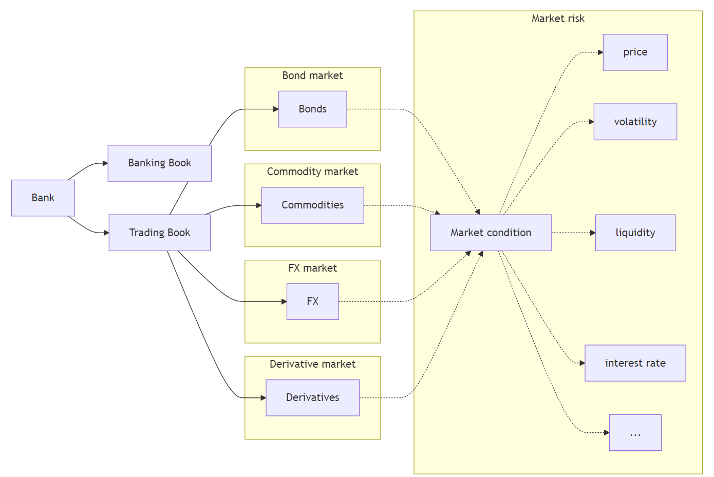

# Market risk

## The 4:15 report

::: {.callout-important title="J.P. Morgan, New York, 1990"}
Every afternoon, one page lands on the chairman's desk at 4:15pm.

Not a stack of spreadsheets. **One number.**

> "At close of business each day tell me what the market risks are across all businesses and locations."
>
> Sir Dennis Weatherstone, chairman of J.P. Morgan & Co.
:::

The problem was scale. J.P. Morgan ran **14 trading locations** with **120 independent trading units** dealing in bonds, currencies, commodities, derivatives and equities. Every desk measured its own risk, in its own units. None of it added up.

::: {.fragment}
Weatherstone wanted all of it collapsed into a single sentence a human being could act on:

> *"We are X% confident we will not lose more than \$Y by tomorrow."*

That sentence is **Value at Risk**. This lecture is about how to fill in the blanks, and about what the number still misses.
:::

::: {.fragment}
The methodology J.P. Morgan built for this became **RiskMetrics**, released publicly in **October 1994**, spun out as a separate company in 1998 and eventually bought by MSCI. The bank gave away the model that now underpins market risk regulation worldwide.
:::

## Introduction

Last week, we discussed [interest rate risk](https://mingze-gao.com/teaching/AFIN8003/2026S2/Week4/): changes in interest rates could affect an FI's income and net worth.

- Interest rate changes affect _mostly_ the __banking book__.
- The __trading book__ is exposed to __market risk__.

|                  | Assets                            | Liabilities         |
|------------------|-----------------------------------|---------------------|
| **Banking book** | Cash                              | Deposits            |
|                  | Loans                             | Other liabilities   |
|                  | Other assets                      | Capital             |
| **Trading book** | Bonds (long)                      | Bonds (short)       |
|                  | Commodities (long)                | Commodities (short) |
|                  | FX (long)                         | FX (short)          |
|                  | Equities (long)                   | Equities (short)    |
|                  | Mortgage-backed securities (long) |                     |
|                  | Derivatives[^obs] (long)          | Derivatives (short) |

[^obs]: Derivatives are off-balance-sheet.

::: {.callout-note title="Market Risk"}
__Market risk__ is uncertainty of an FI’s earnings on its trading portfolio caused by changes, particularly extreme changes, in market conditions such as the price of an asset, interest rates, market volatility, and market liquidity.
:::

## Roadmap

One question drives this lecture: *"How much could the trading book lose on a bad day?"*

1. **Value at Risk (VaR)**: what the number means, before any mathematics.
2. Three ways to compute it: RiskMetrics (variance-covariance), historic simulation, Monte Carlo.
3. Aggregating across asset classes: why correlations matter.
4. **When VaR fails**: fat tails and a short history of expensive surprises.
5. **Expected Shortfall (ES)**: what VaR misses in the tail, and why regulators switched.
6. **Backtesting**: how supervisors check whether a model is telling the truth.
7. The BIS regulatory models: standardised framework vs internal model approach (FRTB).

::: {.callout-tip title="A note on the mathematics"}
This week has more notation than any other in the unit. Do not let it intimidate you. Every formula here is doing one of two simple jobs: finding a **cut-off point** on a distribution, or taking an **average**. If you can read a weather forecast, you can read a VaR report. We will build the intuition first and add the symbols afterwards.
:::

::: {.content-hidden when-format="pdf"}
## Introduction (cont'd)
:::

The trading book holds assets, liabilities and derivatives that are **actively traded**, and are therefore exposed to whatever those markets do next.

{fig-align="center"}

The rest of the lecture answers two questions about that book:

1. **What is the worst loss we should expect not to exceed**, at a given confidence level, over a given horizon? That is **Value at Risk**.
2. **When we do exceed it, how bad is it?** That is **Expected Shortfall**.

# Value at Risk (VaR)

## VaR without the mathematics

Start with something you already read every day: the weather forecast.

> *"There is a 10% chance of rain tomorrow."*

That sentence does not promise sunshine. It says that on days that look like tomorrow, it rains about one time in ten. It is a statement about **how often**, not about **what will happen**.

::: {.fragment}
VaR is exactly the same kind of statement, about money instead of rain:

::: {.callout-note title="The one sentence to memorise"}
**"We are 99% confident we will not lose more than \$15,000 on this position tomorrow."**

Equivalently: on roughly **one trading day in a hundred**, we expect to lose *more* than \$15,000.
:::
:::

## Three ingredients, or the number is meaningless

A VaR figure is only interpretable if you know all three of these:

| Ingredient | Example | If you change it |
|---|---|---|
| **Confidence level** | 95%, 99%, 97.5% | Higher confidence pushes the cut-off further into the tail, so VaR rises |
| **Time horizon** | 1 day, 10 days | Longer horizon means more time for things to move, so VaR rises |
| **Portfolio** | which desks, which positions | Different positions, different risk |

::: {.callout-warning}
"Our VaR is \$40 million" is not a sentence. **"Our one-day 99% VaR is \$40 million"** is.

Whenever you meet a VaR number in a bank's annual report, find those three ingredients first. They are always disclosed, and they are not standard across banks, which makes naive comparisons misleading.
:::

## Check your understanding

A bank reports: **"One-day 99% VaR: A\$40 million."** Which statements are correct?

::: {.incremental}
- *"The bank will never lose more than \$40m in a day."*
  **No.** VaR is a threshold that is sometimes crossed, not a maximum.
- *"The bank expects to lose \$40m tomorrow."*
  **No.** On a typical day the outcome is a small gain or a small loss. \$40m is a rare bad case, not a forecast.
- *"On about one day in a hundred, the bank loses more than \$40m."*
  **Yes.** That is precisely the claim.
- *"On the days it does lose more than \$40m, it loses about \$40m."*
  **Unknown.** It could be \$41m. It could be \$4 billion. VaR is silent about this.
:::

::: {.fragment}
Hold on to that last one. It is the single most dangerous gap in VaR, and the reason Expected Shortfall exists. We return to it later in the lecture.
:::

## Concept of VaR

Suppose we know the distribution of an asset's returns over a specific period (in the future), then for a given confidence level $c\in[0,1]$ (e.g., $c=0.95$), we can partition the distribution into two parts: one (in red) that represents a proportion of $(1-c)$ of the distribution and the other (in blue) accounting the remaining $c$ proportion.

::: {.columns}
:::: {.column}
```{python}
# | label: fig-returns-VaR
# | fig-cap: "Distribution of expected returns and VaR"
# | fig-location: center
import numpy as np
import matplotlib.pyplot as plt

# Set seed for reproducibility
np.random.seed(42)

# Parameters
mu = 0  # Mean of returns
sigma = 0.01  # Standard deviation of returns
n = 10000  # Number of simulations
confidence_level = 0.95

# Simulate returns
returns = np.random.normal(mu, sigma, n)

# Calculate VaR
VaR = np.percentile(returns, (1 - confidence_level) * 100)

# Plot histogram with different colors for bars below and above VaR
plt.figure(figsize=(10, 6))

# Histogram data
n, bins, patches = plt.hist(returns, bins=50, alpha=0.75, edgecolor="black")

# Change color of bars
for i in range(len(patches)):
    if bins[i] < VaR:
        patches[i].set_facecolor("#A6192E")
    else:
        patches[i].set_facecolor("#D6D2C4")

# Add VaR line
plt.axvline(VaR, color="#A6192E", linestyle="dashed", linewidth=2)
plt.title("Simulated Distribution of Returns with VaR")
plt.xlabel("Return")
plt.ylabel("Frequency")
plt.legend(["VaR at 95%", "Returns"])
plt.grid(True)
plt.show()
```
::::

:::: {.column}
Therefore, the cutoff value of returns that separates the two parts defines:

- a minimum return that we are confident 95% of the time, or
- __a maximum loss that we are confident 95% of the time__.

::::
:::

## Interactive: where does the line sit? {.smaller}

Drag the confidence level and watch the cut-off move. The red region is the set of days we are choosing to call "bad".

::: {.content-visible when-format="pdf"}
*Interactive in the online slides: a confidence-level slider that moves the VaR cut-off across a simulated return distribution.*
:::

::: {.content-hidden when-format="pdf"}
::: {.columns}
:::: {.column width="32%"}
```{ojs}
//| echo: false

viewof confA = Inputs.range([0.90, 0.995], {value: 0.99, step: 0.005, label: "Confidence"})
viewof posA = Inputs.range([1, 100], {value: 10, step: 1, label: "Position ($m)"})
viewof volA = Inputs.range([0.5, 3], {value: 1.0, step: 0.1, label: "Daily vol (%)"})
```

::: {.callout-tip}
Notice: raising confidence from 95% to 99% does **not** double the VaR. The tail thins out quickly under a normal distribution.
:::
::::

:::: {.column width="68%"}
```{ojs}
//| echo: false

// A fixed sample of standard normal draws, so the picture is stable while you drag.
z0 = {
  let seed = 987654321;
  const rand = () => { seed = (1103515245 * seed + 12345) % 2147483648; return (seed + 0.5) / 2147483648; };
  const out = [];
  for (let i = 0; i < 20000; i++) {
    const u1 = rand(), u2 = rand();
    out.push(Math.sqrt(-2 * Math.log(u1)) * Math.cos(2 * Math.PI * u2));
  }
  return out;
}

// A second fixed stream of uniforms, used later for the fat-tail demo.
u0 = {
  let seed = 24680135;
  const rand = () => { seed = (1103515245 * seed + 12345) % 2147483648; return (seed + 0.5) / 2147483648; };
  return Array.from({length: 20000}, () => rand());
}

retA = z0.map(z => z * volA / 100)
sortedA = retA.slice().sort((a, b) => a - b)
varA = sortedA[Math.floor((1 - confA) * sortedA.length)]

html`<div style="font-size:1.15em; margin-bottom:6px;">
  <b>${(confA*100).toFixed(1)}%</b> one-day VaR =
  <b style="color:#A6192E">$${(-varA * posA).toFixed(2)}m</b>
  &nbsp;<span style="color:#666">(${(-varA*100).toFixed(2)}% of the position)</span>
</div>`

Plot.plot({
  width: 640, height: 300, marginLeft: 50, marginBottom: 40,
  x: {label: "Daily return (%)", domain: [-6, 6]},
  y: {label: "Number of days"},
  marks: [
    Plot.rectY(retA, Plot.binX({y: "count"},
      {x: d => d * 100, thresholds: 90,
       fill: d => d <= varA ? "#A6192E" : "#D6D2C4"})),
    Plot.ruleX([varA * 100], {stroke: "#A6192E", strokeWidth: 2}),
    Plot.ruleY([0])
  ]
})
```
::::
:::
:::

## Models for computing VaR

Over the years, many models have been developed to compute VaR.

This is because we do not have the return distribution of trading portfolio over a specific period in the future.

- If we do, then VaR is unambiguous.

Therefore, different assumptions lead to different models and approaches. We are interested in three in this course:

1. RiskMetrics (variance-covariance approach)
2. Historic or back simulation
3. Monte Carlo simulation

## VaR: RiskMetrics

Back to Weatherstone's 4:15 report. To produce that single number, J.P. Morgan needed a method that could be applied to a bond desk, an FX desk and an equity desk alike, and then aggregated. That method is **RiskMetrics**.

Its central assumption is the one that makes everything tractable:

::: {.callout-note title="The RiskMetrics assumption"}
Daily changes in market prices, yields and exchange rates are **normally distributed** with mean zero.

Once you accept that, a single number, the standard deviation $\sigma$, describes the entire distribution. The cut-off is then just a multiple of $\sigma$:

- 95% confidence: $1.65\sigma$
- 99% confidence: $2.33\sigma$
:::

::: {.fragment}
This is a genuine bargain: enormous simplification for one assumption. It is also, as the second half of this lecture shows, exactly where the model breaks.
:::

::: {.content-hidden when-format="pdf"}
## VaR: RiskMetrics (cont'd)
:::

In a nutshell, we are concerned about the market risk exposure on a daily basis. Market risk exposure over longer periods, under some assumptions, can be viewed as a simple transformation from the daily exposure.

The market risk is measured by the __daily earnings at risk (DEAR)__:
$$
\text{DEAR} = \left(\text{dollar market value of the position}\right) \times \left(\text{price sensitivity of the position}\right) \times \left(\text{potential adverse move}\right)
$$

Since price sensitivity multiplied by adverse move measures the degree of price volatility of an asset, we can write this equation as:
$$
\text{DEAR} = \left(\text{dollar market value of the position}\right) \times \left(\text{price volatility}\right)
$$

::: {.callout-tip title="Dear DEAR and VaR"}
DEAR is basically 1-day dollar VaR in the context of RiskMetrics model.
:::

::: {.fragment}
If we assume that shocks are independent, daily volatility is approximately constant, and that the FI holds this asset for $N$ number of days, then the $N$-day VaR is related to DEAR by:
$$
N\text{-day VaR} = \left(\text{DEAR}\right) \times \sqrt{N}
$$
:::

## VaR: RiskMetrics for fixed-income securities

Suppose an FI holds a \$1 million position in **7-year zero-coupon bonds** (face value \$1,631,483, yield 7.243%).

$$
\text{DEAR} = \underbrace{\text{market value}}_{\$1\text{m}} \times \underbrace{\text{price sensitivity}}_{\text{modified duration}} \times \underbrace{\text{potential adverse move}}_{\text{from the yield distribution}}
$$

::: {.fragment}
**Sensitivity.** From last week, modified duration:
$$
MD = \frac{D}{1+R} = \frac{7}{1.07243} = 6.527
$$
:::

::: {.fragment}
**Adverse move.** Bond prices fall when yields rise, so we need the largest *upward* yield move we expect at 99% confidence. Assume daily yield changes are normal with mean 0 and $\sigma = 10$ bps:
$$
2.33 \times 10\text{bps} = 23.3\text{bps} = 0.00233
$$
:::

## VaR: RiskMetrics for fixed-income securities (cont'd)

Putting the three pieces together:

$$
\begin{aligned}
\text{DEAR} &= \$1{,}000{,}000 \times 6.527 \times 0.00233 \
&= \$15{,}207.91
\end{aligned}
$$

::: {.callout-note title="Say it in words"}
"On the one day in a hundred that goes badly for us, we expect to lose about **\$15,208** on this bond position."

Note what each input did: the *duration* converted a yield move into a price move, and the *2.33* converted a confidence level into a number of standard deviations. Every DEAR calculation in this lecture has exactly this shape.
:::

::: {.fragment}
Over 10 days, assuming independent daily shocks:
$$
\text{10-day VaR} = \$15{,}207.91 \times \sqrt{10} = \$48{,}092
$$
:::

## The same recipe: FX and equities

The bond example did the hard work. FX and equities use the **identical three-step recipe**, and are actually simpler, because there is no duration to worry about: the position *is* the exposure.

::: {.columns}
:::: {.column width="50%"}
**FX: €800,000 spot euros**

At \$1.25/€, that is a \$1m position. Daily FX volatility $\sigma = 56.5$ bps.

$$
\begin{aligned}
\text{DEAR} &= \$1\text{m} \times (2.33 \times 0.00565) \
&= \$1\text{m} \times 0.013165 \
&= \$13{,}164
\end{aligned}
$$
::::

:::: {.column width="50%"}
**Equities: \$1m index portfolio**

Daily market volatility $\sigma_m = 200$ bps.

$$
\begin{aligned}
\text{DEAR} &= \$1\text{m} \times (2.33 \times 0.0200) \
&= \$1\text{m} \times 0.0466 \
&= \$46{,}600
\end{aligned}
$$
::::
:::

::: {.callout-note title="Why we can use the market's volatility for equities"}
From CAPM, a stock's total risk splits into systematic and idiosyncratic parts:
$$\sigma^2_{i} = \beta^2_{i}\sigma^2_{m} + \sigma^2_{e i}$$
In a well-diversified portfolio the idiosyncratic term washes out, leaving market risk. If the portfolio tracks the index, $\beta = 1$ and the portfolio's volatility *is* $\sigma_m$. For a portfolio with $\beta \neq 1$, scale by beta.
:::

## VaR: portfolio aggregation

We now have three separate DEARs:

| Position | DEAR |
|---|---:|
| 7-year zero-coupon bonds | \$15,207.91 |
| Euro spot | \$13,164 |
| Equities | \$46,600 |
| **Naive total** | **\$74,972** |

The manager needs *one* number. Can we simply add them?

::: {.fragment}
::: {.callout-important}
**No.** Adding DEARs assumes every position has its worst day *simultaneously*. That is not how markets behave.

This is where the other half of "variance-covariance" finally earns its name: so far we have used only the variances. The **covariances** are what stop us adding.
:::
:::

## VaR: portfolio aggregation (cont'd)

$$
\text{DEAR}_{\text{portfolio}} = \sqrt{\sum_i \text{D}_i^2 + \sum_i \sum_{j \neq i} \rho_{ij}\,\text{D}_i \text{D}_j}
$$

With the correlation matrix below:

|                | Bonds | FX | Equities |
|----------------|:-----:|:--:|:--------:|
| **Bonds**      | 1.0   | −0.2 | 0.4    |
| **FX**         |       | 1.0  | 0.1    |
| **Equities**   |       |      | 1.0    |

::: {.fragment}
$$
\begin{aligned}
&= \sqrt{15207.91^2 + 13164^2 + 46600^2 + 2(15207.91)(13164)(-0.2) + 2(15207.91)(46600)(0.4) + 2(13164)(46600)(0.1)} \
&= \$56{,}441.93
\end{aligned}
$$

**\$56,442 against a naive \$74,972.** The \$18,530 difference is the diversification benefit, and it exists only because the three markets do not all crash on the same day.
:::

## Interactive: how much does diversification buy you? {.smaller}

The three desks have DEARs of \$15,208 (bonds), \$13,164 (FX) and \$46,600 (equities). Naively added, that is **\$74,972**. Drag the correlations and watch the true aggregate move.

::: {.content-visible when-format="pdf"}
*Interactive in the online slides: three correlation sliders showing the aggregate DEAR against the naive sum of \$74,972.*
:::

::: {.content-hidden when-format="pdf"}
::: {.columns}
:::: {.column width="34%"}
```{ojs}
//| echo: false

viewof r12 = Inputs.range([-1, 1], {value: -0.2, step: 0.05, label: "ρ bonds-FX"})
viewof r13 = Inputs.range([-1, 1], {value: 0.4, step: 0.05, label: "ρ bonds-equity"})
viewof r23 = Inputs.range([-1, 1], {value: 0.1, step: 0.05, label: "ρ FX-equity"})
```

::: {.callout-tip}
Push all three to **+1** and the aggregate equals the naive sum: with everything moving together, there is no diversification left. That is precisely what happens in a crisis.
:::
::::

:::: {.column width="66%"}
```{ojs}
//| echo: false

dears = [15207.91, 13164, 46600]
naive = dears[0] + dears[1] + dears[2]

aggDear = {
  const [d1, d2, d3] = dears;
  const v = d1**2 + d2**2 + d3**2
          + 2*d1*d2*r12 + 2*d1*d3*r13 + 2*d2*d3*r23;
  return Math.sqrt(Math.max(v, 0));
}

benefit = naive - aggDear

html`<table class="table" style="font-size:1.0em;">
  <tr><td>Naive sum of DEARs</td>
      <td style="text-align:right"><b>$${naive.toLocaleString(undefined,{maximumFractionDigits:0})}</b></td></tr>
  <tr><td>Aggregate DEAR (with correlations)</td>
      <td style="text-align:right"><b style="color:#A6192E">$${aggDear.toLocaleString(undefined,{maximumFractionDigits:0})}</b></td></tr>
  <tr><td>Diversification benefit</td>
      <td style="text-align:right"><b style="color:#00AA4F">$${benefit.toLocaleString(undefined,{maximumFractionDigits:0})}</b>
      (${(100*benefit/naive).toFixed(1)}%)</td></tr>
</table>`

Plot.plot({
  width: 620, height: 190, marginLeft: 150, marginBottom: 40,
  x: {label: "Daily earnings at risk ($)", domain: [0, naive * 1.05]},
  y: {label: null},
  marks: [
    Plot.barX([
      {k: "Naive sum", v: naive},
      {k: "True aggregate", v: aggDear}
    ], {y: "k", x: "v", fill: d => d.k === "Naive sum" ? "#D6D2C4" : "#A6192E"}),
    Plot.text([
      {k: "Naive sum", v: naive},
      {k: "True aggregate", v: aggDear}
    ], {y: "k", x: "v", text: d => "$" + Math.round(d.v).toLocaleString(), dx: 40, fontWeight: "bold"}),
    Plot.ruleX([0])
  ]
})
```
::::
:::
:::

::: {.callout-important title="The lesson regulators learned the hard way"}
Diversification benefits are estimated from **historical** correlations, and historical correlations are measured mostly in calm markets. In a crisis, correlations move toward one and the benefit you were counting on evaporates at the exact moment you need it. Long-Term Capital Management, two slides from now, is the canonical illustration.
:::

## VaR: criticisms against RiskMetrics

RiskMetrics buys its simplicity with one heavy assumption, and pays for it twice.

**1. Returns are not normal.**

- Real return distributions are skewed and, above all, **fat-tailed**.
- The whole of the next section is about what this costs. Hold that thought.

**2. The covariances are a practical nightmare.**

- With $N$ assets you need $\frac{N(N-1)}{2}$ pairwise covariances.
- A 500-stock equity book alone needs **124,750** of them, before a single bond or currency is added.
- Worse, they must be *estimated* from history, and history is mostly calm periods.

::: {.callout-important}
The second problem is inconvenient. The first is dangerous: it is the reason a bank can pass every risk report and still fail.
:::

## VaR: historic or back simulation

Many FIs have developed market risk models that employed a historic or back simulation approach. 

Essential idea is to revalue current asset portfolio on basis of past actual prices (returns).

Simply put, this approach is to 

1. Collect the past 500 days' actual prices (returns).
2. Revalue the asset using the 1% worst case, i.e., the portfolio is revalued as the 5th lowest value out of 500.

The advantages of historic approach are that 

1. it is simple, 
2. it does not require that asset returns be normally distributed, and
3. it does not require that the correlations or standard deviations of asset returns be calculated.

However,

1. 500 observations is not very many from a statistical standpoint.
2. Increasing the number of observations by going back further in time is not desirable.
    - As one goes back further in time, past observations may become decreasingly relevant in predicting VaR in the future.

How to improve?

- Could weight recent observations more heavily and go further back.
- Could generate additional observations (Monte Carlo simulation)!


## VaR: Monte Carlo simulation

Historic simulation is limited to the few hundred days that actually happened. Monte Carlo removes that limit: instead of replaying history, we **manufacture** as many plausible days as we like.

Three steps:

1. **Generate scenarios.** Draw thousands of possible future returns for each asset, consistent with their volatilities *and* their correlations.
2. **Build portfolio returns.** For each scenario, combine the asset returns using the portfolio weights.
3. **Read off VaR.** Sort the simulated portfolio returns and take the relevant percentile, exactly as before.

::: {.callout-tip title="The only technical wrinkle"}
Step 1 must preserve correlations: if bonds and equities move together in reality, they must move together in the simulation. The standard trick is **Cholesky decomposition**, which factorises the covariance matrix into $\Sigma = LL'$ and uses $L$ to convert independent random draws into correlated ones.

You do not need to perform this by hand. `numpy.linalg.cholesky` is one line, and it appears in the code on the next slide. What matters is *why* it is there: without it, your simulated world would have no correlations at all, and the portfolio would look far safer than it is.
:::

## VaR: Monte Carlo simulation (example)

::: {.columns}
:::: {.column}
- Number of Assets: 3
- Mean Returns
    - Asset 1: 0.10% per period
    - Asset 2: 0.12% per period
    - Asset 3: 0.08% per period
- Covariance Matrix $\Sigma$
$$
\Sigma = \begin{bmatrix}
0.0001 & 0.00002 & 0.000015 \\
0.00002 & 0.0001 & 0.000025 \\
0.000015 & 0.000025 & 0.0001
\end{bmatrix}
$$
- Portfolio Weights:
    - Asset 1: 40%
    - Asset 2: 30%
    - Asset 3: 30%
- Simulation Parameters:
    - Number of Scenarios: 10,000
    - Confidence Level: 95%
::::

:::: {.column}
```{python}
# | label: fig-returns-monte-carlo
# | fig-cap: "Distributions of portfolio returns from Monte Carlo simulation"
# | fig-location: center
import numpy as np
import matplotlib.pyplot as plt

# Parameters
np.random.seed(42)
n_assets = 3
n_scenarios = 10000
confidence_level = 0.95

# Mean returns and covariance matrix for the assets
mean_returns = np.array([0.001, 0.0012, 0.0008])  # Example mean returns
cov_matrix = np.array(
    [
        [0.0001, 0.00002, 0.000015],
        [0.00002, 0.0001, 0.000025],
        [0.000015, 0.000025, 0.0001],
    ]
)  # Example covariance matrix

# Cholesky decomposition of the covariance matrix
L = np.linalg.cholesky(cov_matrix)

# Generate standard normal random variables
Z = np.random.normal(size=(n_scenarios, n_assets))

# Simulate asset returns
simulated_returns = Z @ L.T + mean_returns

# Given weights
weights = np.array([0.4, 0.3, 0.3])  # Example weights

# Calculate portfolio returns
portfolio_returns = simulated_returns @ weights

# Calculate VaR
VaR = np.percentile(portfolio_returns, (1 - confidence_level) * 100)

# Plotting the portfolio returns and VaR
plt.figure(figsize=(10, 6))
plt.hist(portfolio_returns, bins=50, alpha=0.75, color="#D6D2C4", edgecolor="black")
plt.axvline(VaR, color="#A6192E", linestyle="dashed", linewidth=2)
plt.title("Simulated Portfolio Returns with VaR")
plt.xlabel("Portfolio Return")
plt.ylabel("Frequency")
plt.legend(["VaR at 95%", "Portfolio Returns"])
plt.grid(True)
plt.show()
```
::::
:::

# When VaR fails

## The assumption that does the damage

Every model in the previous section needed a distribution. RiskMetrics assumed a **normal** one, because it is convenient: a single number, $\sigma$, describes the whole picture.

Real markets are not that polite. Returns have **fat tails**: extreme days happen far more often than a normal distribution allows.

How much more often? Take three real days on the S&P 500 and ask what a normal distribution with a 1% daily standard deviation would have said about them.

```{python}
#| label: fig-fat-tails
#| fig-cap: "Three real trading days, expressed in standard deviations. A normal distribution treats these as effectively impossible."
#| fig-location: center
#| echo: false
import numpy as np
import matplotlib.pyplot as plt

# Real S&P 500 single-day closing returns
events = [
    ("Black Monday\n19 Oct 1987", -20.47),
    ("COVID crash\n16 Mar 2020", -11.98),
    ("GFC\n15 Oct 2008",         -9.03),
]
sigma = 1.0  # long-run daily standard deviation of the S&P 500, roughly 1%

def log10_tail(z):
    """log10 P(Z < -z) via the asymptotic normal tail; exact enough for large z."""
    return -(z**2) / (2*np.log(10)) - np.log10(z*np.sqrt(2*np.pi))

names  = [e[0] for e in events]
moves  = [e[1] for e in events]
sigmas = [abs(m)/sigma for m in moves]
# how many years between such days, if returns really were normal (252 trading days/yr)
log_years = [-log10_tail(z) - np.log10(252) for z in sigmas]

fig, ax = plt.subplots(figsize=(11, 4.2))
bars = ax.barh(names, sigmas, color="#A6192E", height=0.55)
for b, z, ly, m in zip(bars, sigmas, log_years, moves):
    ax.text(z + 0.4, b.get_y() + b.get_height()/2,
            f"{m:.2f}%  =  {z:.1f} sigma   ->   one such day every $10^{{{ly:.0f}}}$ years",
            va="center", fontsize=11)
ax.set_xlim(0, 34)
ax.set_xlabel("Size of the move, in daily standard deviations")
ax.set_title("If returns were normal, none of these days should ever have happened")
ax.grid(axis="x", alpha=0.3)
plt.tight_layout()
plt.show()
```

The universe is about $1.4 \times 10^{10}$ years old.

::: {.callout-warning title="August 2007: the quote that says it all"}
As the first tremors of the crisis hit, Goldman Sachs CFO David Viniar explained the losses in the firm's quantitative funds to the *Financial Times*:

> "We were seeing things that were 25-standard deviation moves, several days in a row."

Read literally, that is absurd. He was not being careless: he was describing **the failure of the model, not the strangeness of the market**. When your model says the last three days were impossible, the model is what is wrong.
:::

## A short history of expensive surprises

| Year | Episode | Loss | What the risk model did not capture |
|:----:|:--------|:-----|:------------------------------------|
| 1995 | **Barings Bank** (Nick Leeson) | £827m; the bank collapsed and was sold for £1 | Unauthorised positions were hidden in an error account and never entered the risk system |
| 1998 | **Long-Term Capital Management** | US\$4.6bn; a Fed-organised rescue | Correlations converged to one; positions were far too large to exit |
| 2008 | **Société Générale** (Jérôme Kerviel) | €4.9bn | Fictitious offsetting trades made a huge directional bet look hedged |
| 2012 | **JPMorgan "London Whale"** | over US\$6bn | The VaR model itself was replaced with one that reported roughly half the risk |
| 2021 | **Archegos** | about US\$10bn across banks (Credit Suisse alone US\$5.5bn) | Concentrated, heavily leveraged single-name swap exposures, invisible across counterparties |
| 2022 | **LME nickel** | Trading suspended; executed trades cancelled | Liquidity vanished; the price ran past US\$100,000 a tonne |

::: {.callout-important title="Read the right-hand column again"}
Almost none of these were failures of *arithmetic*. They were failures of **scope**: the risk that mattered was outside the model, whether because it was concealed, because it was assumed away, or because the model was quietly changed until the answer looked acceptable.

A VaR number is only as honest as the positions and assumptions fed into it.
:::

## When the model becomes the target

The London Whale deserves a second look, because it is the cautionary tale for everyone who will ever *report* a risk number rather than compute one.

In January 2012, JPMorgan's Chief Investment Office adopted a new VaR model for its synthetic credit portfolio. The new model reported roughly **half** the risk of the old one. The reported VaR fell sharply. The positions did not change.

::: {.fragment}
Within months the same portfolio lost more than **US\$6 billion**, and the bank was later obliged to restate its figures and reinstate the earlier model.

::: {.callout-warning title="The lesson"}
A risk model is not merely a measuring instrument. It is also a **constraint** on the people being measured, and constraints create incentives to game them. Whenever a risk number falls sharply without the positions changing, the first question is not "are we safer?" but **"what changed in the model?"**
:::
:::

# Expected Shortfall (ES)

## Why VaR could be misleading

Return to the unanswered question from the start of the lecture.

VaR tells you *where* the tail begins. It says nothing about **what is inside it**.

::: {.fragment}
Two banks can report an identical 99% VaR of \$40m, while one loses \$41m on a bad day and the other loses \$400m. VaR cannot tell them apart, because it only ever looks at a single point on the distribution and ignores everything beyond.
:::

::: {.fragment}
::: {.callout-important title="The fix"}
**Expected Shortfall (ES)**, also called *conditional VaR*: instead of asking where the tail starts, ask what the **average loss is once you are in it**.

$$
\text{ES} = \text{average of all losses worse than the VaR}
$$

The GFC made this switch unavoidable. Losses fell deep into a fat tail that VaR had declared unremarkable, and regulators discovered that their measure had been describing the door while ignoring the room behind it.
:::
:::

## ES: definition

For a given confidence level $c$ and a continuous probability distribution, ES can be calculated as
$$
ES(c) = \frac{1}{1-c}\int_c^1 VaR(u)du
$$

That is, for a confidence level of, say, 95% (i.e., $c$), we measure the area under the probability distribution from the 95th to 100th percentile.

```{python}
# | label: fig-returns-ES
# | fig-cap: "Distribution of expected returns and ES"
# | fig-location: center
import numpy as np
import matplotlib.pyplot as plt

# Parameters
np.random.seed(42)
n_scenarios = 10000
confidence_level = 0.95

# Adjust Distribution: Mixture of normal distributions
mu2, sigma2 = 0, 0.01
extreme_mu, extreme_sigma = -0.05, 0.02

# Create a mixture distribution that has the desired VaR
extreme_component = np.random.normal(extreme_mu, extreme_sigma, int(n_scenarios * 0.1))
normal_component = np.random.normal(mu2, sigma2, int(n_scenarios * 0.9))
returns = np.concatenate([extreme_component, normal_component])
VaR = np.percentile(returns, (1 - confidence_level) * 100)

# Calculate ES
ES = np.mean(returns[returns <= VaR])

# Plot histogram
plt.figure(figsize=(10, 6))

# Histogram data
n, bins, patches = plt.hist(returns, bins=50, alpha=0.75, edgecolor="black")

# Highlight bars below VaR
for i in range(len(patches)):
    if bins[i] < VaR:
        patches[i].set_facecolor("#A6192E")
    else:
        patches[i].set_facecolor("#D6D2C4")

# Add VaR and ES lines
plt.axvline(VaR, color="#A6192E", linestyle="dashed", linewidth=2, label="VaR at 95%")
plt.axvline(ES, color="purple", linestyle="dashed", linewidth=2, label="ES")

plt.title("Simulated Portfolio Returns with VaR and ES")
plt.xlabel("Return")
plt.ylabel("Frequency")
plt.legend()
plt.grid(True)

plt.show()
```

## Interactive: the demonstration that matters {.smaller}

Both distributions below have **exactly the same standard deviation**. Only the shape of the tail changes. Watch what happens to VaR, and then to ES.

::: {.content-visible when-format="pdf"}
*Interactive in the online slides: a fat-tail slider holding volatility constant, so you can watch VaR barely move while ES climbs.*
:::

::: {.content-hidden when-format="pdf"}
::: {.columns}
:::: {.column width="32%"}
```{ojs}
//| echo: false

viewof fatB = Inputs.range([0, 1], {value: 0, step: 0.05, label: "Fat tails"})
viewof confB = Inputs.range([0.90, 0.995], {value: 0.99, step: 0.005, label: "Confidence"})
viewof posB = Inputs.range([1, 100], {value: 10, step: 1, label: "Position ($m)"})
```

::: {.callout-important}
Drag **fat tails** from 0 to 1.

VaR moves a little. ES climbs relentlessly.

Volatility is held constant throughout, so a risk report built on $\sigma$ alone would notice nothing at all.
:::
::::

:::: {.column width="68%"}
```{ojs}
//| echo: false

// Same volatility, different tail shape: a small share of days is drawn from a
// much wider distribution, then everything is rescaled to hold sigma fixed.
retB = {
  const pExtreme = 0.02 * fatB;
  const k = 1 + 7 * fatB;
  const scale = Math.sqrt((1 - pExtreme) + pExtreme * k * k);
  return z0.map((z, i) => 0.01 * z * (u0[i] < pExtreme ? k : 1) / scale);
}

sortedB = retB.slice().sort((a, b) => a - b)
varB = sortedB[Math.floor((1 - confB) * sortedB.length)]
esB = {
  const tail = sortedB.filter(x => x <= varB);
  return tail.reduce((a, b) => a + b, 0) / tail.length;
}
sdB = {
  const m = retB.reduce((a, b) => a + b, 0) / retB.length;
  return Math.sqrt(retB.reduce((a, b) => a + (b - m) ** 2, 0) / retB.length);
}

html`<table class="table" style="font-size:1.0em; margin-bottom:4px;">
  <tr><td>Daily volatility (held fixed)</td>
      <td style="text-align:right"><b>${(sdB*100).toFixed(2)}%</b></td></tr>
  <tr><td>${(confB*100).toFixed(1)}% VaR</td>
      <td style="text-align:right"><b style="color:#A6192E">$${(-varB*posB).toFixed(2)}m</b></td></tr>
  <tr><td>${(confB*100).toFixed(1)}% Expected Shortfall</td>
      <td style="text-align:right"><b style="color:#80225F">$${(-esB*posB).toFixed(2)}m</b></td></tr>
  <tr><td>ES as a multiple of VaR</td>
      <td style="text-align:right"><b>${(esB/varB).toFixed(2)}x</b></td></tr>
</table>`

Plot.plot({
  width: 640, height: 285, marginLeft: 50, marginBottom: 40,
  x: {label: "Daily return (%)", domain: [-8, 8]},
  y: {label: "Number of days"},
  marks: [
    Plot.rectY(retB, Plot.binX({y: "count"},
      {x: d => d * 100, thresholds: 120,
       fill: d => d <= varB ? "#A6192E" : "#D6D2C4"})),
    Plot.ruleX([varB * 100], {stroke: "#A6192E", strokeWidth: 2}),
    Plot.ruleX([esB * 100], {stroke: "#80225F", strokeWidth: 2, strokeDasharray: "5,3"}),
    Plot.ruleY([0])
  ]
})
```

Solid red line: VaR. Dashed purple line: ES, always further out.
::::
:::
:::

## ES: advantages and (potential) problems

ES is the average of losses that occur beyond the VaR level. It provides a better risk assessment by considering the tail of the loss distribution.

In addition, an important advantage of ES over VaR is that ES is __subadditive__ (a _coherent_ risk measure).

- This means that the ES of a portfolio is never greater than the sum of the individual positions' ESs, consistent with the idea that diversification does not increase risk.
- VaR lacks this property: in some cases, the VaR of a combined portfolio can *exceed* the sum of the individual VaRs, which is economically nonsensical.

Potential issues with the use of ES include:

- Estimation challenges, model dependency, computational complexity.

## Research note: what makes a risk measure "good"?

@ArtznerEtAl1999 asked a question that sounds philosophical and turned out to be worth billions: what properties *should* any sensible measure of risk satisfy? They wrote down four axioms and called a measure meeting all four **coherent**. The one that matters here is **subadditivity**:

$$
\rho(A + B) \;\le\; \rho(A) + \rho(B)
$$

In words: merging two portfolios must never produce *more* measured risk than holding them separately. Diversification may help, and it must never hurt.

::: {.fragment}
**VaR violates this axiom.** ES satisfies it.

The consequence is not academic. If a risk measure is not subadditive, a bank can lower its measured risk simply by reorganising itself on paper, splitting one desk into two. Worse, risk managers cannot safely aggregate desk-level numbers upward, which is the entire job.
:::

::: {.fragment}
::: {.callout-note title="From a maths journal to a global rulebook"}
A 1999 paper in *Mathematical Finance* is the intellectual reason the Basel Committee moved regulatory capital from VaR to Expected Shortfall. When you are asked in an interview *why* ES replaced VaR, "it captures the tail" is half the answer. "It is coherent, and VaR is not" is the other half.
:::
:::

## Why 97.5%? The number the regulators actually chose

Under FRTB the regulatory measure is **ES at 97.5%**, not VaR at 99%. That looks arbitrary. It is not.

For a **normal** distribution the two are almost the same number:

$$
\underbrace{\text{VaR}_{99\%} = \mu + 2.326\,\sigma}_{\text{the old measure}}
\qquad
\underbrace{\text{ES}_{97.5\%} = \mu + 2.338\,\sigma}_{\text{the new measure}}
$$

::: {.fragment}
So the switch was deliberately calibrated to be **roughly capital-neutral for well-behaved portfolios**. A bank holding a plain, normally distributed book sees almost no change.

The difference only appears where it should: **when the tail is fat**. Then ES rises and VaR does not. Exactly what you saw by dragging the fat-tail slider two slides ago.
:::

::: {.fragment}
::: {.callout-tip title="An elegant piece of regulatory design"}
Keep the number where it is for the safe books. Make it bite only on the dangerous ones. That is what good regulation looks like when it works.
:::
:::

## Backtesting: does the model tell the truth?

A VaR model makes a **falsifiable prediction**. At 99% confidence, losses should exceed VaR on about 1 day in 100, so roughly **2 to 3 days** in a 250-day trading year.

So supervisors simply count. Each day, compare the actual loss with yesterday's VaR forecast. A day where the loss exceeds the forecast is an **exception**.

Basel's **traffic light** framework, applied to the most recent 250 trading days:

| Zone | Exceptions | Interpretation | Capital "plus factor" |
|:---|:---:|:---|:---:|
| **Green** | 0 to 4 | Consistent with an accurate model | 0 |
| **Yellow** | 5 to 9 | Questionable; the supervisor investigates | 0.40 rising to 0.85 |
| **Red** | 10 or more | Model rejected | 1.00, and likely loss of model approval |

The plus factor is a **multiplier on required capital**. Understate your risk and the capital charge rises, which is precisely the incentive you want.

::: {.callout-note title="Two subtleties worth knowing"}
1. **A model can fail by being too conservative, too.** @BerkowitzOBrien2002 compared large US banks' VaR forecasts with their actual daily trading results and found the models were generally *too* conservative on ordinary days, yet still missed the extreme ones. Sitting in the green zone is a low bar, not a certificate of accuracy.
2. **ES is much harder to backtest than VaR.** Counting exceptions works because VaR is a threshold you either cross or you do not; ES is an average over a region you rarely observe. This is why the Basel framework still **backtests VaR** even though it now **charges capital on ES**.
:::

## Interactive: run your own backtest {.smaller}

The model assumes a certain volatility. Reality may be more volatile. Drag the ratio, press the button to draw a fresh trading year, and see which zone the bank lands in.

::: {.content-visible when-format="pdf"}
*Interactive in the online slides: a 250-day backtest simulator that counts exceptions and reports the traffic-light zone.*
:::

::: {.content-hidden when-format="pdf"}
::: {.columns}
:::: {.column width="32%"}
```{ojs}
//| echo: false

viewof volRatio = Inputs.range([0.6, 2.2], {value: 1.0, step: 0.05,
  label: "Actual vol / model vol"})
viewof reroll = Inputs.button("Draw a new year")
```

::: {.callout-tip}
At a ratio of 1.0 the model is correct, and you will usually see 0 to 5 exceptions. Nudge it to 1.5 and watch how quickly the bank turns red.

Press the button a few times at ratio 1.0: even a *perfect* model sometimes lands in the yellow zone. Supervision has to live with that noise.
:::
::::

:::: {.column width="68%"}
```{ojs}
//| echo: false

// 250 daily returns. The model's VaR line is fixed at 2.33 model-sigmas.
year = {
  reroll;                       // re-runs whenever the button is pressed
  const out = [];
  for (let i = 0; i < 250; i++) {
    const u1 = Math.random(), u2 = Math.random();
    const zz = Math.sqrt(-2 * Math.log(u1)) * Math.cos(2 * Math.PI * u2);
    out.push({day: i + 1, ret: zz * volRatio});
  }
  return out;
}

varLine = -2.33
nExc = year.filter(d => d.ret < varLine).length
zone = nExc <= 4 ? "GREEN" : (nExc <= 9 ? "YELLOW" : "RED")
zoneColour = nExc <= 4 ? "#00AA4F" : (nExc <= 9 ? "#D6A100" : "#A6192E")
plusFactor = nExc <= 4 ? "0.00"
  : (nExc <= 9 ? [0.40, 0.50, 0.65, 0.75, 0.85][nExc - 5].toFixed(2) : "1.00")

html`<div style="font-size:1.15em; margin-bottom:6px;">
  Exceptions this year: <b>${nExc}</b> &nbsp;|&nbsp;
  Zone: <b style="color:${zoneColour}">${zone}</b> &nbsp;|&nbsp;
  Plus factor: <b>${plusFactor}</b>
</div>`

Plot.plot({
  width: 640, height: 260, marginLeft: 50, marginBottom: 40,
  x: {label: "Trading day"},
  y: {label: "Daily P&L (model sigmas)", domain: [-6, 4]},
  marks: [
    Plot.ruleY([0], {stroke: "#bbb"}),
    Plot.dot(year, {x: "day", y: "ret", r: 2.6,
      fill: d => d.ret < varLine ? "#A6192E" : "#9aa"}),
    Plot.ruleY([varLine], {stroke: "#A6192E", strokeWidth: 2, strokeDasharray: "5,3"}),
    Plot.text([{x: 125, y: varLine - 0.55}],
      {x: "x", y: "y", text: ["99% VaR forecast"], fill: "#A6192E", fontWeight: "bold"})
  ]
})
```
::::
:::
:::

# BIS regulatory models

## The two regulatory approaches

Everything so far has been about *measuring* market risk. The regulatory point of measuring it is to set a **capital requirement**. Basel allows two routes.

| | **Standardised approach** | **Internal models approach (IMA)** |
|---|---|---|
| Who uses it | Smaller banks, and any desk whose model fails approval | Large banks, with supervisory approval per trading desk |
| How it works | Prescribed risk weights and formulas set by the regulator | The bank's own model (historic simulation, Monte Carlo, and so on) |
| Risk measure | Sensitivities-based method, plus a default risk charge and a residual risk add-on | **Expected Shortfall at 97.5%**, with liquidity horizons from 10 to 120 days |
| Trade-off | Simple, transparent, usually more conservative | More risk-sensitive, but costly to build and subject to backtesting |

::: {.callout-note title="One more refinement: liquidity horizons"}
FRTB does not assume every position can be exited in 10 days. Risk factors carry **liquidity horizons of 10 to 120 days**, graduated by how quickly the market can absorb a trade: major interest rates and large-cap equities at the short end, high-yield credit and volatilities at the long end.

This is a direct answer to LTCM and to the nickel market. A position you cannot exit is riskier than an identical one you can, and the capital rules now say so.
:::

::: {.callout-tip}
Detail lives in [MAR21 to MAR23](https://www.bis.org/bcbs/publ/d457.pdf) (standardised) and [MAR33](https://www.bis.org/basel_framework/chapter/MAR/33.htm) (IMA). You are not expected to reproduce either.
:::

## Basel III and its implementation

With Basel III being implemented across jurisdictions, market risk measures are shifting from VaR to ES.

The Basel Committee's original implementation target (January 2023) has been repeatedly delayed across most jurisdictions.

- **UK**: Basel 3.1 takes effect from 1 January 2027, with the internal model approach for market risk further delayed to 1 January 2028.
- **US**: The "Basel III Endgame" proposal has been substantially scaled back; the final timeline remains uncertain as of 2026.
- **Australia**: APRA has deprioritised the FRTB reforms; its policy roadmap places the market risk workstream (revisions to __APS 116 Capital Adequacy: Market Risk__) from late 2027. Australian banks using IMA still measure market risk with **VaR**.

::: {.callout-note}
So the measure you spent most of this lecture on, VaR, remains the operative regulatory measure in Australia today, while ES is the direction of travel everywhere. You need both.
:::

# Finally...

## Key takeaways

1. **A VaR number needs three ingredients**: a confidence level, a horizon and a portfolio. Without all three it means nothing.
2. **VaR is a threshold, not a maximum, and not a forecast.** It says how *often* a loss is exceeded, never how *bad* the exceedance is.
3. **DEAR** = market value × price sensitivity × potential adverse move; scale to $N$ days by $\sqrt{N}$.
4. **Never sum individual VaRs.** Aggregation requires correlations, and correlations rise toward one exactly when you need them not to.
5. **Three ways to get the distribution**: assume normality (RiskMetrics), replay history (back simulation), or simulate (Monte Carlo).
6. **Real returns have fat tails.** Days that a normal model calls impossible arrive every decade or so, and that is where banks die.
7. **ES fixes two things at once**: it looks *inside* the tail, and it is **coherent** (subadditive), which VaR is not [@ArtznerEtAl1999]. Hence FRTB's move to **ES at 97.5%**, calibrated to be close to 99% VaR for normal books.
8. **Models are checked by backtesting**, and gamed by the people they constrain. Green-zone results are a low bar; a risk number that falls without the positions changing deserves suspicion (the London Whale).
9. **Implementation is jurisdiction-specific**: UK from 2027; US scaled back; Australia deferred, so APRA-regulated banks still use VaR-based IMA.

## Suggested readings

- [BIS The market risk framework in brief](https://www.bis.org/bcbs/publ/d457_inbrief.pdf)
- [BIS Minimum capital requirements for market risk](https://www.bis.org/bcbs/publ/d457.pdf)
- [APRA Prudential Standard APS 116 Capital Adequacy: Market Risk](https://www.apra.gov.au/sites/default/files/141120-APS-116_0.pdf)
- [APRA's Policy Priorities](https://www.apra.gov.au/information-paper-apra%E2%80%99s-policy-priorities)
- [Bank of England Implementation of the Basel 3.1 standards: Market risk](https://www.bankofengland.co.uk/prudential-regulation/publication/2022/november/implementation-of-the-basel-3-1-standards/market-risk)
- @ArtznerEtAl1999, the paper that defined coherent risk measures and, in effect, retired VaR from regulation.
- @BerkowitzOBrien2002, an early and sobering empirical look at how accurate banks' own VaR models actually were.
- [BIS MAR33: Internal models approach for market risk](https://www.bis.org/basel_framework/chapter/MAR/33.htm), the source for the 97.5% ES and the liquidity horizons.

## References
