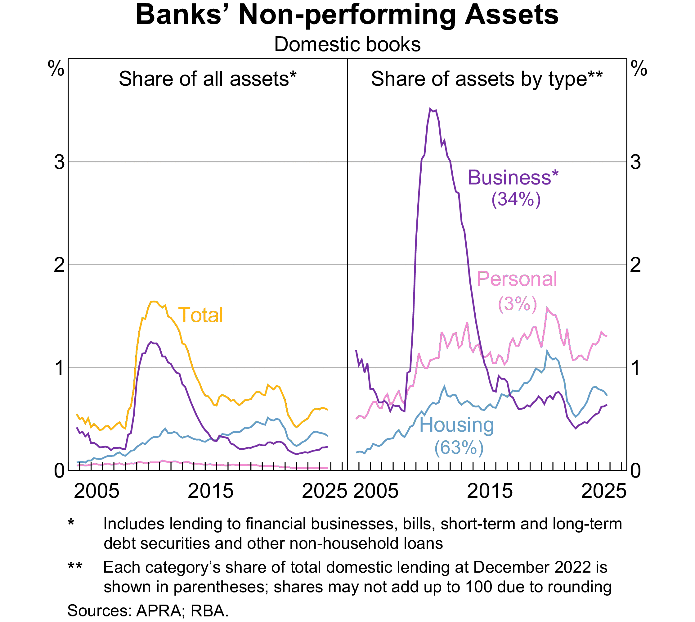

# Credit Risk I: Individual Loan Risk

## Introduction

In [Week 3](https://mingze-gao.com/teaching/AFIN8003/2026S2/Week3/), we discussed capital adequacy and the (Pillar 1 of Basel) minimum capital requirements, which involves the calculation of risk-weighted assets (RWA) that account for the various risks facing banks.

As suggested by @tbl-rwa-au-banks below, __credit risk__ is likely the most significant risk factor, the risk that the promised cash flows from loans and securities may not be paid in full (e.g., borrower defaults).

|                          | CBA     | Westpac | NAB     | ANZ     | Macquarie |
|--------------------------|---------|---------|---------|---------|-----------|
| RWA for credit risk      | 370,444 | 351,724 | 350,891 | 361,185 | 98,250    |
| RWA for market risk      | 52,132  | 37,510  | 26,953  | 30,875  | 14,277    |
| RWA for operational risk | 44,975  | 48,196  | 36,102  | 49,650  | 17,512    |
| Other RWA                | 0       | 0       | 0       | 4,872   | 0         |
| Total RWA                | 467,551 | 437,430 | 413,946 | 446,582 | 130,039   |

: RWA of Australian banks in 2024 (source: Capital IQ) {#tbl-rwa-au-banks}

- FIs (banks) transform financial claims of household savers (e.g., deposits) into claims (e.g., loans) issued to corporations, individuals and governments.
- FIs accept the credit risk on these loans in exchange for a fair return sufficient to cover the cost of funding to household savers and the credit risk involved in lending.

## Roadmap: three questions, in order

Every lending decision a bank makes answers the same three questions in the same sequence. This lecture follows that sequence, so if you ever feel lost, ask yourself which question we are on.

| | The question | What we build |
|---|---|---|
| **1** | *What do we earn if the loan performs?* | The contractually promised return $k$ |
| **2** | *What is the chance it does not perform?* | The probability of default, and $E(r)$ |
| **3** | *So do we lend, and to whom?* | Credit scoring, rationing, and pricing models |

::: {.callout-note title="Discussion: hold this question all lecture"}
Two friends each apply for a \$500,000 mortgage at the same bank. One is approved, the other rejected. Yet the approved borrower pays the *same rate* as everyone else.

Why does the bank not simply charge the riskier friend a higher rate? By the end of the lecture you will have a precise, Nobel-prize-winning answer.
:::

Getting this right matters because it determines both how a loan is **priced** and how much the bank is willing to **lend** to any one borrower.

::: {.callout-tip title="Scope"}
This week is about **one loan at a time**. Next week we ask the harder question: what happens when you hold thousands of them and they all go wrong together (concentration risk).
:::

## Why it matters: two cautionary examples

::: {.columns}
:::: {.column width="46%"}
**Subprime and the GFC, 2007-09**

Banks lent to weak borrowers during a housing boom, bundled the loans into mortgage-backed securities, and sold them on. When adjustable rates reset and defaults rose, the losses were everywhere at once.

*The lesson:* credit risk that is originated carelessly does not stay with the originator. It returns in Week 11.
::::

:::: {.column width="54%"}
**US student loans: risk in slow motion**

- About **\$1.7 trillion** owed by **42.6 million** federal borrowers.
- The COVID payment pause (Mar 2020 to Oct 2023) suspended repayments *and* delinquency reporting; collections resumed **May 2025**.
- Result: roughly **10.6%** of balances are now 90+ days delinquent, and the **US average FICO score has fallen to 714**, driven mainly by student loans returning to credit files.
::::
:::

::: {.callout-important title="The point of the second example"}
The payment pause did not change borrowers' ability to repay. It changed **whether anyone was measuring it**. Unmeasured credit risk does not disappear; it accumulates quietly and then appears all at once when measurement resumes.

Same lesson as SVB's held-to-maturity accounting in Week 3, in a different market.
:::

## Banks in Australia: non-performing assets

{#fig-bank-npa fig-align="center"}

## The lending landscape

Four broad categories, with very different risk characteristics:

| Category | Typical borrower | What drives the risk |
|---|---|---|
| **Commercial & industrial (C&I)** | Firms, from SMEs to multinationals | Business performance, industry cycle, leverage |
| **Real estate** | Households (mortgages), property developers | Property prices, LTV, interest rates, employment |
| **Consumer** | Individuals (personal, auto, credit cards) | Income stability, unemployment, behaviour |
| **Other** | Farmers, other banks, non-bank FIs, governments | Sector-specific (weather, counterparty, sovereign) |

::: {.callout-note title="Why the split matters for this lecture"}
The **assessment method** follows the category. C&I loans are analysed one by one, with financial statements and negotiated terms. Consumer loans are too small and too numerous for that, so they are scored statistically and decided by rule. Keep this distinction in mind: it returns as *retail versus wholesale* shortly.
:::

## Two features worth knowing now

Both come from C&I lending and both reappear later in the unit.

::: {.columns}
:::: {.column width="50%"}
**Syndicated loans**

A single loan provided by a *group* of FIs rather than one lender, so that no single bank carries the whole exposure.

Sets up the discussion of concentration limits in **Week 7** and loan sales in **Week 11**.
::::

:::: {.column width="50%"}
**Spot loans vs loan commitments**

- **Spot loan**: the full amount is drawn immediately.
- **Loan commitment** (line of credit): a facility with a maximum size and a window during which the borrower may draw.

A commitment is a promise to lend *later*, at terms agreed *now*. It sits off the balance sheet until drawn, which makes it a **Week 10** problem as well as a credit problem.
::::
:::

Residential mortgages, the largest category for Australian banks, vary mainly by **loan size**, **loan-to-value ratio (LTV)**, **maturity** (often 25 to 30 years) and whether the rate is **fixed or variable**. Because the loan can outlive the borrower's job, and because house prices can fall below the loan balance, mortgages combine credit risk with the interest rate risk of Week 4.

# Returns on a loan

## Contractually promised return on a loan

Pricing a loan means setting a rate that covers the bank's funding cost *and* the borrower's credit risk. We use the traditional **return on assets** approach.

Factors affecting the promised loan return:

- Loan interest rate
- Credit risk premium
- Fees
- Collateral
- Non-price terms

::: {.content-hidden when-format="pdf"}
## Contractually promised return on a loan (cont'd)
:::

::: {.columns}
:::: {.column width="42%"}
An FI makes a spot one-year \$1m loan:

$$
\begin{aligned}
\text{Base lending rate } BR &= 8\% \\
\text{+ Credit risk premium } \phi &= 2\% \\
BR + \phi &= 10\%
\end{aligned}
$$

**BR** reflects the FI's marginal cost of funds: historically LIBOR, now **SOFR** in USD (LIBOR ceased 30 June 2023) and **BBSW** in Australia. Alternatively the **prime rate**, charged to the most creditworthy corporate customers.
::::

:::: {.column width="58%"}
But the quoted rate is not the whole story. Three adjustments matter:

1. **Origination fee** ($f$): charged upfront for processing.
2. **Compensating balance** ($b$): a share of the loan the borrower must leave on deposit, usually earning nothing, while paying interest on the *full* amount.
3. **Reserve requirement** ($RR$): the fraction of that deposit the bank must hold at the central bank, so it cannot lend it on.

::: {.callout-note title="The compensating balance, concretely"}
Borrow \$100,000 with a 10% compensating balance, and you walk away with **\$90,000** while paying interest on **\$100,000**. Your effective rate is higher than the one you were quoted.
:::
::::
:::

## Putting it together: the promised return formula

$$
1+k=1+\frac{\overbrace{f+(BR+\phi)}^{\text{interest and fees earned}}}{\underbrace{1}_{\$1\text{ loan}}-[\underbrace{b}_{\text{left on deposit}}\times \underbrace{(1-RR)}_{\text{that the bank can actually use}}]}
$$

**Reading the denominator.** For every \$1 lent, the bank gets back $b$ as a compensating balance, of which it must park $RR$ at the central bank. So its true net cash outflow is $1 - b(1-RR)$, not \$1. A smaller outflow for the same income means a higher return.

::: {.fragment}
**Worked example.** $BR = 6\%$, $\phi = 4\%$, $f = 0.125\%$, $b = 8\%$, $RR = 10\%$:

$$
1+k = 1+\frac{0.00125+(0.06+0.04)}{1-[0.08(1-0.1)]} = 1 + \frac{0.10125}{0.928}
\quad\Rightarrow\quad k = 10.91\%
$$

The quoted rate was 10%. The borrower is actually paying **10.91%**.
:::

## Interactive: price the loan yourself {.smaller}

::: {.columns}
:::: {.column width="34%"}

::: {.content-visible when-format="pdf"}
*Interactive in the online slides: sliders for the base rate, risk premium, origination fee, compensating balance and reserve requirement, showing the promised return $k$ and the expected return $E(r)$.*
:::

::: {.content-hidden when-format="pdf"}
```{ojs}
//| echo: false
viewof BR = Inputs.range([0, 0.15], {value: 0.06, step: 0.0025, label: "Base rate BR"})
viewof phi = Inputs.range([0, 0.15], {value: 0.04, step: 0.0025, label: "Risk premium φ"})
viewof fee = Inputs.range([0, 0.02], {value: 0.00125, step: 0.00025, label: "Origination fee f"})
viewof bbal = Inputs.range([0, 0.30], {value: 0.08, step: 0.01, label: "Comp. balance b"})
viewof RR = Inputs.range([0, 0.20], {value: 0.10, step: 0.01, label: "Reserve req. RR"})
viewof pdef = Inputs.range([0, 0.30], {value: 0.05, step: 0.005, label: "Default prob. (1-p)"})
```
:::
::::

:::: {.column width="66%"}
::: {.content-hidden when-format="pdf"}
```{ojs}
//| echo: false
kProm = (fee + BR + phi) / (1 - bbal * (1 - RR))
eRet = (1 - pdef) * (1 + kProm) - 1
noFrills = BR + phi

html`<table class="table" style="font-size:1.05em;">
  <tr><td>Simple promised interest (BR + φ)</td>
      <td style="text-align:right"><b>${(noFrills*100).toFixed(2)}%</b></td></tr>
  <tr><td>Contractually promised gross return <b>k</b></td>
      <td style="text-align:right"><b style="color:#A6192E">${(kProm*100).toFixed(2)}%</b></td></tr>
  <tr><td>Uplift from fees and compensating balance</td>
      <td style="text-align:right">${((kProm-noFrills)*100).toFixed(2)} pp</td></tr>
  <tr><td>Expected return <b>E(r)</b> after default risk</td>
      <td style="text-align:right"><b style="color:#80225F">${(eRet*100).toFixed(2)}%</b></td></tr>
  <tr><td>Cost of default risk</td>
      <td style="text-align:right">${((kProm-eRet)*100).toFixed(2)} pp</td></tr>
</table>`

Plot.plot({
  width: 600, height: 190, marginLeft: 145, marginBottom: 40,
  x: {label: "Return (%)", domain: [Math.min(0, eRet*100) - 1, Math.max(kProm, noFrills)*100 + 2]},
  y: {label: null},
  marks: [
    Plot.barX([
      {k: "BR + φ", v: noFrills*100},
      {k: "Promised k", v: kProm*100},
      {k: "Expected E(r)", v: eRet*100}
    ], {y: "k", x: "v",
        fill: d => d.k === "Expected E(r)" ? "#80225F"
                 : (d.k === "Promised k" ? "#A6192E" : "#D6D2C4")}),
    Plot.ruleX([0])
  ]
})
```
:::

::: {.callout-tip}
Two things to try. **Push the compensating balance up**: $k$ rises even though the quoted rate never changes, which is exactly why the fine print matters. **Push the default probability to 10%**: watch $E(r)$ fall below the base rate, meaning the bank is lending at a loss without ever having changed its advertised price.
:::
::::
:::

## What actually moves the promised return today

Since **26 March 2020**, reserve requirements ($RR$) have been [eliminated for all depository institutions](https://www.federalreserve.gov/monetarypolicy/reservereq.htm) in the U.S. Australia abolished its own equivalent even earlier, in 1999.

::: {.callout-note}
Both $RR$ and the compensating balance $b$ are now largely historical. The **appendix** at the end of these slides explains where they came from, where they survive, and why the underlying mechanism still matters.
:::

Competitive lending markets have also made origination fees ($f$) and compensating balances ($b$) far less common.

::: {.callout-important}
Strip those away and the formula collapses toward $k \approx BR + \phi$. Once the base rate is set by the market, the **credit risk premium $\phi$ is the only real lever the bank controls**.

Which raises the question the rest of this lecture answers: *how big should $\phi$ be?* To know that, you need the probability of default.
:::

## Question 2: what if they do not pay?

The promised return $k$ is what the bank earns **if the loan performs**. The **expected return** accounts for the chance it does not:

$$
1+E(r) = \underbrace{p(1+k)}_{\text{repaid, probability } p} + \underbrace{(1-p)\times 0}_{\text{default, recover nothing}}
$$

[^recovery]: Assuming zero recovery keeps the algebra clean. In practice the FI recovers part of the loan, which is the *loss given default* (LGD) you will meet in Week 7.

::: {.fragment}
**Worked example.** Loan rate $k = 10\%$, default probability $(1-p) = 5\%$, no recovery:[^recovery]

$$
1+E(r) = 0.95 \times 1.10 = 1.045 \quad\Rightarrow\quad E(r) = 4.5\%
$$

A 10% loan is really a **4.5%** loan. And note the trap: a 5% default probability did not cost 5% of the return, it cost **5.5 percentage points**, because the bank loses the principal as well as the interest.
:::

::: {.fragment}
::: {.callout-warning}
Crucially, $p$ is **not independent of $k$**. Charging more can make repayment less likely, which is where the next section begins.
:::
:::

# Retail vs wholesale credit decisions

## Retail and wholesale decisions differ

A bank has **two levers**, not one: the *price* it charges, and the *quantity* it is willing to lend. Which lever dominates depends on the borrower.

::: {.columns}
:::: {.column width="48%"}
**Retail (consumers)**

Small loans, and information is expensive relative to loan size. So decisions are largely **accept or reject**, and borrowers of the same product often pay the **same** premium regardless of their individual risk.

The bank controls risk by **rationing quantity**, not by pricing.

*Example:* two mortgage borrowers with very different LTVs can pay the same advertised rate. One simply gets a smaller loan, or none.
::::

:::: {.column width="52%"}
**Wholesale (C&I)**

Loans are large enough to justify individual analysis, so FIs use **both** price and quantity. Given a high enough premium, a bank may lend to a risky firm.

But raising the rate is not a free lever: a higher required repayment makes the loan **harder to repay**, so it *raises* the probability of default.
::::
:::

::: {.callout-important title="Two forces pulling against the price lever"}
1. **Adverse selection.** At a very high rate, safe borrowers walk away. Those who remain are the ones who know they are risky, or who never expected to repay.
2. **Moral hazard.** A high required repayment pushes the borrower toward riskier projects, because only a gamble can now cover the interest.

Both mean $p$ **falls as $k$ rises**. Recall $1+E(r) = p(1+k)$: the bank is multiplying a bigger number by a smaller one.
:::

## Credit rationing, and a Nobel-winning explanation

Because expected return is hump-shaped, a profit-maximising bank will **not** simply raise the rate until the market clears. It stops at the peak and then **rations by quantity** instead: some creditworthy-looking borrowers are refused any loan, at any price they offer.

::: {.callout-note title="Research note: Stiglitz and Weiss (1981)"}
This is the central result of @StiglitzWeiss1981, one of the most cited papers in economics and part of the work for which Joseph Stiglitz shared the **2001 Nobel prize**.

Their point overturns a basic intuition. In an ordinary market, excess demand is eliminated by a higher price. In credit markets it is not, because **the price changes the quality of what you are buying**. Interest is not merely the price of the loan; it is also a *selection device* and an *incentive device*.

The equilibrium therefore features **rationing**: borrowers willing to pay more are turned away, and the bank is behaving rationally in refusing them.
:::

::: {.fragment}
This finally answers the question from the start of the lecture: your two friends were not offered different rates, because for the riskier one there may be *no* rate that makes the loan profitable. The bank's only remaining lever is **yes or no**.
:::

# Measurement of credit risk

## It is all about information

To calibrate the credit risk exposure, FIs need to estimate the borrower's default probability, which largely depends on their ability to collect and analyze information, cost-efficiently.

- At the retail level, such information may be collected internally (e.g., past banking records) or externally (e.g., credit reports from rating agencies).
    - There are two main credit reporting bodies in Australia: Equifax and Experian (which acquired illion in 2024)
- At the wholesale level, such information comes from multiple sources:
    - Large, public firms: financial statements, stock and bond prices, analysts' reports, etc.
    - Smaller, private firms: financial statements (if any)

::: {.callout-note}
Advances in technologies make it easier to collect and analyze information of smaller borrowers.
:::

## Protection against credit risk

Pricing is not the bank's only defence. **Covenants** are contract terms that restrict or require borrower actions in order to raise the probability of repayment.

- **Negative covenants** limit what the borrower may do: take on new debt, sell assets, pay dividends.
- **Financial covenants** cap ratios such as leverage or interest coverage, giving the bank an early trigger if the borrower deteriorates.

::: {.callout-note title="See one in the wild"}
The [Cincinnati Bell credit agreement (2017)](https://www.sec.gov/Archives/edgar/data/716133/000095015717001389/ex10-1.htm), arranged by Morgan Stanley, sets out Affirmative Covenants in Article VII and Negative Covenants in Article VIII. Worth two minutes of scrolling to see how specific these get.

Covenants matter again in Week 11, where **covenant-lite** leveraged loans are a central worry.
:::

# Default risk models

## Qualitative models

Banks use qualitative *and* quantitative models together; they are not mutually exclusive, and most credit decisions draw on several. We start with the judgement-based factors.

Borrower-specific factors are considered as well as market or systematic factors.

Specific factors include:

- Reputation: _implicit contract_
- Leverage (capital structure)
- Volatility of earnings
- Collateral

Market-specific factors include:

- Business cycle
- Level of interest rates

::: {.callout-note}
A LOT more factors are considered in practice than we can discuss here.
:::

## Quantitative models

__Credit scoring models__ use observed borrower characteristics to

1. either calculate a score representing the applicant's default probability, or
2. sort borrowers into different default risk classes.

::: {.columns}
:::: {.column}
Scoring models might help to:

- Establish factors that help to explain default risk
- Evaluate the relative importance of these factors
- Improve the pricing of default risk
- Sort out bad loan applicants
- More easily calculate reserve needs
::::
:::: {.column}
Three broad types

1. Linear probability models
2. Logit models
3. Linear discriminant analysis
::::
:::

## Credit scoring: linear probability models

The simplest approach: regress past repayment experience on borrower characteristics.

$$
PD_i = \sum^n_{j=1} \beta_j X_{ij} + \varepsilon_i
$$

where $X_{ij}$ are observable characteristics of borrower $i$ (leverage, profitability, size) and $\beta_j$ is the weight the data attaches to each.

::: {.fragment}
**Worked example.** Suppose past defaults are explained by leverage ($D/E$) and the sales-to-assets ratio ($S/A$), and the fitted model is

$$
PD = 0.5\times \tfrac{D}{E} - 0.0525 \times \tfrac{S}{A}
$$

For a borrower with $D/E = 0.3$ and $S/A = 2$:

$$
PD = 0.5(0.3) - 0.0525(2) = 0.045 \quad \text{(4.5\%)}
$$
:::

## Credit scoring: logit models

::: {.callout-caution title="Why the linear model is not enough"}
Nothing in a linear model stops it producing a "probability" outside $[0,1]$. Using the same estimated model as the previous slide, a borrower with $D/E = 0.1$ and $S/A = 3$ gets

$$PD = 0.5(0.1) - 0.0525(3) = -0.108$$

A **negative probability of default**. That is not a rounding problem, it is a sign the functional form is wrong.
:::

The **logit** model fixes this by construction. Rather than modelling the probability directly, it models the **log-odds** of default as a linear function of borrower characteristics:

$$
\underbrace{\ln\!\left(\frac{PD}{1-PD}\right)}_{\text{log-odds}} = \beta_1 X_1 + \beta_2 X_2 + \cdots + \beta_n X_n \;\equiv\; z
$$

Rearranging gives a probability that is *guaranteed* to sit strictly between 0 and 1, no matter what $z$ is:

$$
PD = \frac{1}{1 + e^{-z}}
$$

## Interactive: what the logistic function actually does {.smaller}

::: {.columns}
:::: {.column width="30%"}

::: {.content-visible when-format="pdf"}
*Interactive in the online slides: a slider for the linear index $z$ showing how the logistic curve maps any real number into a probability between 0 and 1.*
:::

::: {.content-hidden when-format="pdf"}
```{ojs}
//| echo: false
viewof zval = Inputs.range([-6, 6], {value: 0, step: 0.1, label: "Linear index z"})
```
:::

::: {.callout-important title="Read the axis labels carefully"}
The input is the **log-odds** $z$, which can be any number from $-\infty$ to $+\infty$. The output is a probability, squeezed into $[0,1]$.

- $z = 0$ gives $PD = 50\%$ (even odds).
- $z = -3$ gives $PD \approx 4.7\%$.
- Extreme $z$ flattens out: the curve never quite reaches 0 or 1.
:::
::::

:::: {.column width="70%"}
::: {.content-hidden when-format="pdf"}
```{ojs}
//| echo: false
logistic = z => 1 / (1 + Math.exp(-z))
curve = Array.from({length: 241}, (_, i) => {
  const z = -6 + i * 12 / 240;
  return {z: z, pd: logistic(z)};
})
pdNow = logistic(zval)

html`<div style="font-size:1.2em; margin-bottom:6px;">
  z = <b>${zval.toFixed(1)}</b> &nbsp;maps to&nbsp;
  PD = <b style="color:#A6192E">${(pdNow*100).toFixed(2)}%</b>
</div>`

Plot.plot({
  width: 620, height: 320, marginLeft: 55, marginBottom: 45,
  x: {label: "Linear index z (log-odds)", domain: [-6, 6], grid: true},
  y: {label: "Probability of default", domain: [0, 1], grid: true, percent: true},
  marks: [
    Plot.ruleY([0.5], {stroke: "#ddd", strokeDasharray: "3,3"}),
    Plot.line(curve, {x: "z", y: "pd", stroke: "#A6192E", strokeWidth: 2.5}),
    Plot.ruleX([zval], {stroke: "#999", strokeDasharray: "3,2"}),
    Plot.ruleY([pdNow], {stroke: "#999", strokeDasharray: "3,2"}),
    Plot.dot([{z: zval, pd: pdNow}], {x: "z", y: "pd", r: 6, fill: "#A6192E"})
  ]
})
```
:::
::::
:::

::: {.callout-warning title="A common and expensive misreading"}
It is tempting to take the $PD = 0.045$ from the linear model and push it through the logistic function. Do not. That gives $1/(1+e^{-0.045}) = 0.511$, reporting a **4.5% borrower as a 51% default risk**.

The two models are estimated *separately*. Logit coefficients are obtained by maximum likelihood on the log-odds scale; they are not the linear model's coefficients, and the input $z$ is an index, not a probability.
:::

- Probit is the same idea with the normal CDF in place of the logistic.

## Credit scoring: linear discriminant analysis

- Linear probability and logit models estimate a default probability (a value from 0 to 1) if a loan is made.
- Discriminant models divide borrowers into high/low default risk classes based on observed characteristics.

@Altman1968's Z-score model, fitted on US manufacturing firms:

::: {.columns}
:::: {.column}
$$
Z = 1.2 X_1 + 1.4 X_2 + 3.3 X_3 + 0.6 X_4 + 1.0 X_5
$$
where

- $X_1 = \text{Working capital / Total assets}$.
- $X_2 = \text{Retained earnings / Total assets}$.
- $X_3 = \text{Earnings before interest and taxes / Total assets}$.
- $X_4 = \text{Market value of equity / Book value of total liabilities}$.
- $X_5 = \text{Sales / Total assets}$.
::::

:::: {.column}
The classification:

- High default risk: $Z<1.81$
- Indeterminate default risk: $1.81<Z<2.99$
- Low default risk: $Z>2.99$
::::
:::

## Weaknesses of credit scoring models

- Weights in any credit scoring model unlikely to be constant over longer periods of time
- Variables in any credit scoring model unlikely to be constant over longer periods of time
- Models ignore hard-to-quantify factors such as borrower reputation
- There is no centralised database on defaulted business loans for proprietary or other reasons
- Discriminant models make broad distinction between borrower categories, that is, good and bad borrowers, yet in the real world various gradations of default exist, from non-payment or delay of interest payments (nonperforming assets) to outright default on all promised interest and principal payments
- ...

## Credit scores in practice

In practice, credit scoring is most commonly encountered through a __credit score__ assigned by credit bureaus, summarising a borrower's creditworthiness as a single number.

::: {.columns}
:::: {.column}
**FICO Score (United States)**

Developed by Fair Isaac Corporation, the FICO score (range: 300–850) is used by approximately 90% of U.S. lenders.

| Factor | Weight |
|--------|--------|
| Payment history | 35% |
| Amounts owed (utilisation) | 30% |
| Length of credit history | 15% |
| New credit inquiries | 10% |
| Credit mix | 10% |

::::
:::: {.column}
**FICO score bands:**

| Score | Rating |
|-------|--------|
| 800–850 | Exceptional |
| 740–799 | Very good |
| 670–739 | Good |
| 580–669 | Fair |
| < 580 | Poor |

::: {.callout-tip}
The average U.S. FICO score is **714** (FICO, 2026), having drifted down as student-loan delinquencies returned to credit files. A score above 670 typically qualifies a borrower for standard loan products; below 580 may mean outright rejection or very high rates.
:::
::::
:::

## Credit scoring in Australia

Australia moved to __Comprehensive Credit Reporting (CCR)__ in 2014, with mandatory participation by the four major banks from July 2019.

- **Before CCR**: only _negative_ events (defaults, bankruptcies, serious arrears) were reported to credit bureaus.
- **After CCR**: _positive_ data is also shared: repayment history, current credit limits, and open account information.

::: {.callout-note}
CCR gives lenders a fuller picture of borrower behaviour. A borrower with no defaults but a history of on-time repayments is now distinguishable from one with simply no recorded negative events. This improves pricing accuracy and can expand credit access for "thin file" borrowers.
:::

The main credit bureaus in Australia are **Equifax** and **Experian** (which acquired illion in 2024).

- Equifax score: 0–1,200 (higher is better)
- Experian score: 0–1,000 (illion scores, now under Experian, use the same range)

::: {.callout-tip}
CCR is a good example of how regulatory change can fundamentally shift the data available for credit scoring models, and therefore the accuracy of the models themselves.
:::

## Australian credit bureaus: history and ownership

::: {.columns}
:::: {.column}
**Equifax** (formerly Veda)

- **1968**: Credit Reference Association of Australia (CRAA) established by the finance industry
- **1998**: CRAA privatised, becomes Data Advantage
- **2001**: Merges with Baycorp Holdings → **Baycorp Advantage** (dual ASX/NZX listed)
- **2007**: Rebrands to **Veda** (ASX: VED)
- **2016**: Acquired by **Equifax Inc.** (NYSE: EFX) for USD 1.9 billion; now Australia's largest bureau by market share
::::
:::: {.column}
**illion** (formerly Dun & Bradstreet)

- **1986**: Dun & Bradstreet begins Australian credit bureau operations
- **2015**: D&B divests Australian/NZ operations to private equity firm **Archer Capital** (~AUD 220M)
- **2018**: Rebrands to **illion**
- **2024**: Acquired by **Experian plc** (LSE: EXPN) for AUD 820M

**Experian**

- Launched Australian credit bureau in **2011** as a joint venture with six Australian banks
- Part of **Experian plc** (LSE: EXPN), incorporated in Ireland; operations in 30+ countries
::::
:::

::: {.callout-note}
The 2024 acquisition of illion by Experian has consolidated Australia from three credit bureaus to two dominant players: **Equifax** (US-owned, NYSE: EFX) and **Experian** (Ireland-incorporated, LSE: EXPN). Both are foreign-owned, which raises questions about data sovereignty for Australian borrowers' financial information.
:::

## Machine learning in credit scoring

Traditional scoring models (linear probability, logit, discriminant analysis) have been increasingly supplemented by __machine learning (ML)__ methods.

Common approaches include:

- **Gradient boosting** (XGBoost, LightGBM): strong performance on tabular credit data, widely used in fintech lending
- **Random forests**: robust to outliers, handles non-linear interactions between variables
- **Neural networks**: used where unstructured data is available (e.g., transaction patterns, text from loan applications)

**Key challenges with ML in credit decisions:**

- **Explainability**: regulators require lenders to provide reasons for adverse credit decisions (e.g., under Australia's _National Consumer Credit Protection Act_). A "black box" model cannot easily satisfy this.
- **Fairness and bias**: ML models trained on historical data can inadvertently encode demographic discrimination if protected attributes are correlated with predictors.
- **Data and stability**: ML models need large training datasets and regular retraining as economic conditions evolve.

::: {.callout-note}
The trade-off between _predictive accuracy_ and _interpretability_ is a central tension in modern credit risk management. In practice, many banks use simpler, interpretable models for regulatory decisions and more complex ML models as a second-layer check.
:::

## Newer models of credit risk measurement and pricing

Beyond credit scoring models, researchers and practitioners have developed more sophisticated approaches to measuring and pricing credit risk on individual instruments.

| Approach | Core idea |
|----------|-----------|
| **Term structure (reduced-form)** | Extract implied default probabilities from the yield spread between risky bonds and risk-free government bonds |
| **Mortality rate** | Estimate default rates from historical cohort data, analogous to actuarial mortality tables used by insurers |
| **RAROC** | Evaluate loan profitability relative to the risk capital it consumes: $RAROC = \frac{\text{Net income on loan}}{\text{Loan risk}}$; approve if $RAROC >$ hurdle rate |
| **Option/structural models** | Treat equity as a call option on firm assets (Merton 1974); derive default probability from observable market prices. The KMV/Moody’s model uses this to compute the _expected default frequency_ (EDF) for large corporations. |

::: {.callout-note}
These models are widely used in practice by banks, credit rating agencies, and risk management firms. They are **not assessed** in this unit. The key takeaway is that modern credit risk measurement draws on both statistical and financial-theoretic tools.
:::

## Two ways to infer a default probability

Both answer the same question, from opposite directions: one looks at **prices today**, the other at **history**.

::: {.columns}
:::: {.column width="50%"}
**Term structure (forward-looking)**

A risk-neutral lender should be indifferent between a government bond and a risky loan:

$$
\underbrace{p(1+k)+(1-p)(1+k)\gamma}_{\text{expected return on the risky loan}} = \underbrace{1+i}_{\text{risk-free}}
$$

where $\gamma$ is the recovery rate. Everything except $p$ is observable, so solve for the **implied default probability** $(1-p)$.

*Strength:* uses current market prices, so it updates instantly.
*Weakness:* it is a **risk-neutral** probability, which embeds a risk premium and so overstates the true default rate.
::::

:::: {.column width="50%"}
**Mortality rates (backward-looking)**

Borrowed directly from life insurance: do not predict the individual, study the cohort.

For grade B bonds, the **marginal mortality rate** in year 1 is

$$
MMR_1 = \frac{\text{value of grade B bonds defaulting in year 1}}{\text{value of grade B bonds outstanding in year 1}}
$$

Repeat for $MMR_2, MMR_3, \ldots$ to build a curve.

*Strength:* grounded in what actually happened.
*Weakness:* backward-looking, and highly sensitive to which years you sample.
::::
:::

::: {.callout-note}
Insurers do not forecast *your* health; they price a pool of people who look like you. Mortality-rate credit analysis is the same move applied to borrowers.
:::

## RAROC

Risk-adjusted return on capital (RAROC) was pioneered by Bankers Trust (acquired by Deutsche bank in 1998).

$$
RAROC = \frac{\text{One-year net income on a loan}}{\text{Loan risk}}
$$
where
$$
\text{One-year net income on loan} = (\text{Spread} + \text{Fees}) \times \text{Dollar value of the loan outstanding}
$$
and Loan risk can be measured by, for example, _duration_.
$$
\frac{\Delta LN}{LN} = - D_{LN} \frac{\Delta R}{1+R}
$$
so that
$$
\underbrace{\Delta LN}_{\text{dollar risk exposure}} = - \underbrace{D_{LN}}_{\text{duration of loan}} \times \underbrace{LN}_{\text{loan amount}} \times \underbrace{\frac{\Delta R}{1+R}}_{\text{shock}}
$$

- Loan approval if RAROC > benchmark return on capital.
 
## Option models: default as a decision, not an accident

The models so far look at *symptoms*: ratios, scores, past defaults. @merton_pricing_1974 asks a more basic question. **When does a firm default?**

::: {.columns}
:::: {.column width="52%"}
Think about what limited liability actually gives shareholders. At the loan's maturity the firm owes $B$ and its assets are worth $A_T$:

- If $A_T > B$: repay the debt, keep the difference.
- If $A_T < B$: **walk away**, hand the assets to the lender, and lose no more.

That payoff, "keep the upside, cap the downside", is precisely a **call option on the firm's assets** with strike $B$.
::::

:::: {.column width="48%"}
Two consequences follow immediately:

1. **Default is not bad luck, it is an option being exercised.** It happens when asset value falls below what is owed.
2. Since equity is traded, the **stock market is continuously pricing that option**. We can work backwards from the share price to what the market thinks of the firm's assets and their volatility.
::::
:::

::: {.callout-tip title="Why practitioners care"}
Ratios come from financial statements, which are quarterly, backward-looking and occasionally creative. This approach uses **market prices**, which update every second. It is the reason the method was commercialised so quickly.
:::

## From asset value to a default probability

The firm defaults if assets end up below the debt. So ask: **how far is the firm from that point, measured in standard deviations?**

$$
DD = \frac{\ln(A/B) + (\mu - \tfrac{1}{2}\sigma^2)\tau}{\sigma\sqrt{\tau}}
$$

::: {.columns}
:::: {.column width="50%"}
This **distance to default** combines the three things that matter, and nothing else:

- $A/B$: how much asset cushion sits above the debt (**leverage**)
- $\sigma$: how violently assets move (**business risk**)
- $\mu, \tau$: expected drift over the horizon
::::

:::: {.column width="50%"}
Convert the distance into a probability:

$$
PD = N(-DD)
$$

A firm 4 standard deviations from its default point is far safer than one at 1, *even if their accounting ratios look identical*.
::::
:::

::: {.callout-note title="From DD to EDF"}
Moody's **KMV** commercialised exactly this, but with one pragmatic change: instead of trusting the normal distribution in the extreme tail, it maps the distance to default onto a **large historical database of actual defaults**. The result is the **Expected Default Frequency (EDF)**, an empirical default rate for firms observed at that distance.[^kmv]

EDF feeds directly into next week's portfolio models, where you will use it alongside LGD to compute expected loss.

[^kmv]: KMV was acquired by Moody's in 2002 and is now part of Moody's Analytics.
:::

## The picture behind the formula

The distribution below is the firm's **asset value at the loan's maturity**. The debt level sits in the left tail.

- The distance from today's asset value to that default point, scaled by volatility, is the **distance to default**.
- The **shaded area** is the probability of landing below it: the default probability, or empirically, the **EDF**.

Everything a bank can do to a borrower moves one of two things: it shifts the distribution right (more assets, less debt) or narrows it (less volatile business).

```{python}
# | label: fig-edf
# | fig-cap: "The default probability is the shaded area: the chance that asset value at maturity falls below the amount owed."
# | fig-location: center
import matplotlib.pyplot as plt
import numpy as np

mu = 3  # mean
sigma = 1  # standard deviation

x = np.linspace(0, 6, 300)
y = (1 / (np.sqrt(2 * np.pi) * sigma)) * np.exp(-0.5 * ((x - mu) / sigma) ** 2)

fig, ax = plt.subplots(figsize=(8, 6))

ax.plot(x, y, color='blue')

x_fill = np.linspace(0, 0.8, 100)
y_fill = (1 / (np.sqrt(2 * np.pi) * sigma)) * np.exp(-0.5 * ((x_fill - mu) / sigma) ** 2)
ax.fill_between(x_fill, y_fill, color='blue', alpha=0.3)

ax.annotate('Probability of default\n(EDF)', xy=(0.5, 0.0), xytext=(0.01, 0.1),
            arrowprops=dict(facecolor='black', arrowstyle='->'), fontsize=12)

ax.annotate('Market value at time 0', xy=(3, 0.0), xytext=(3, 0.2),
            arrowprops=dict(facecolor='black', arrowstyle='->'), fontsize=12)

# Set limits and labels
ax.set_xlim([0, 6])
ax.set_ylim([0, 0.5])
ax.set_xticklabels([])
ax.set_yticklabels([])
ax.set_xlabel('Market value of assets at loan maturity')
ax.set_ylabel('Probability')

# Show plot
plt.show()
```

# Finally...

## Key takeaways

1. **Credit risk is the biggest risk on a bank's balance sheet.** It dominates RWA for every major Australian bank.
2. **Promised ≠ expected return**: $k$ builds in the base rate, risk premium, fees and compensating balances; $E(r)$ discounts $k$ by the probability of repayment.
3. **Retail credit is rationed by quantity; wholesale credit is priced by risk**, and raising rates can *lower* expected returns via adverse selection and moral hazard [@StiglitzWeiss1981].
4. **Credit scoring** condenses borrower information into a default prediction: linear probability, logit (which models the *log-odds*, not the probability), Altman's Z, and modern ML with its explainability and fairness constraints.
5. **Market-based models** extract default probabilities from prices: yield spreads (term structure), historical cohorts (mortality rates), or equity-as-a-call-option (Merton/KMV EDF).

## Suggested readings

- [RBA Interest Rate Benchmark Reform in Australia](https://www.rba.gov.au/mkt-operations/resources/interest-rate-benchmark-reform.html).
- [Risk Management Association (RMA) content on credit risk](https://www.rmahq.org/resources-content?topic=Credit%20Risk).
    - RMA provides average balance sheet and income data for more than 400 industries, common ratios computed for each size group and industry, five-year trend data, and financial statement data for more than 100,000 commercial borrowers.

If you're into Math and would like to see some code,

- [Merton distance to default (DD)](https://mingze-gao.com/posts/merton-dd/).

## References

::: {#refs}
:::

# Appendix {.unnumbered}

## Appendix: whatever happened to reserve requirements? {.smaller}

A **reserve requirement** is a minimum fraction of deposits that a bank must hold at the central bank, earning little or nothing. It began as a *prudential* liquidity rule, became a *monetary policy* lever, and was always an implicit **tax on deposit funding**.

::: {.columns}
:::: {.column width="52%"}
| Jurisdiction | Position today |
|---|---|
| **Australia** | **None** |
| **United States** | **0%** since 26 March 2020 |
| **Canada** | Zero since 1994 |
| **United Kingdom** | No reserve-ratio system |
| **Euro area** | **1%** since 2012 |
| **China** | **~7.5%**, still actively used |
::::

:::: {.column width="48%"}
**Australia's own history**

- A **Statutory Reserve Deposit** requirement (reaching 7%) applied to trading banks for decades.
- Replaced in **September 1988** by a 1% **Non-Callable Deposit**, which reduced the incentive to raise funds offshore.
- Non-Callable Deposits were **abolished in July 1999**.

So Australia has had no reserve requirement for over 25 years.
::::
:::

::: {.callout-important title="Why the rich world let them go"}
Central banks now steer the economy through the **price** of money (the policy rate), not its **quantity**. An unremunerated requirement mostly taxed regulated banks and pushed activity toward competitors who faced no such rule.

**China is the live exception.** The PBOC still raises and cuts its ratio as an active policy instrument, which is worth remembering whenever you read that reserve requirements are obsolete. They are obsolete in the jurisdictions that stopped using them, and the euro area is currently debating a return to 2%.
:::

## Appendix: whatever happened to compensating balances? {.smaller}

A **compensating balance** requires the borrower to leave part of the loan on deposit, earning nothing, while paying interest on the full amount. Borrow \$100,000 at 10% with a 20% balance and you have \$80,000 to spend and a \$10,000 interest bill.

::: {.callout-note title="Where they came from: Regulation Q"}
From 1933 to 2011, **Regulation Q** prohibited US banks from paying interest on demand deposits (you meet it again in Week 9). A bank therefore could not compete for corporate deposits on rate.

The workaround was to attach the deposit to the loan. The borrower got credit, the bank got free funding, and the loan's effective yield rose without touching the advertised rate. That is exactly what the $b$ term does in our formula.
:::

**Why they have faded**

- **Dodd-Frank repealed Regulation Q in 2011**, so banks can now simply pay interest on business deposits.
- Competition and disclosure pushed lending toward transparent, explicit pricing.
- US commercial banking increasingly uses an **earnings credit rate** instead: balances offset service fees rather than being locked away.
- In Australia, compensating balances were never standard practice.

::: {.callout-important title="Why we still teach the formula"}
The instruments retired; the **mechanism** did not.

Anything that reduces the bank's net cash outflow while leaving its income unchanged raises the effective return. That logic now reappears as establishment fees, minimum-balance conditions, offset-account rules, cross-sell requirements and package discounts.

The practical lesson is the same one the formula teaches: **the advertised interest rate is an unreliable guide to what a loan actually costs the borrower, or earns the bank.**
:::
