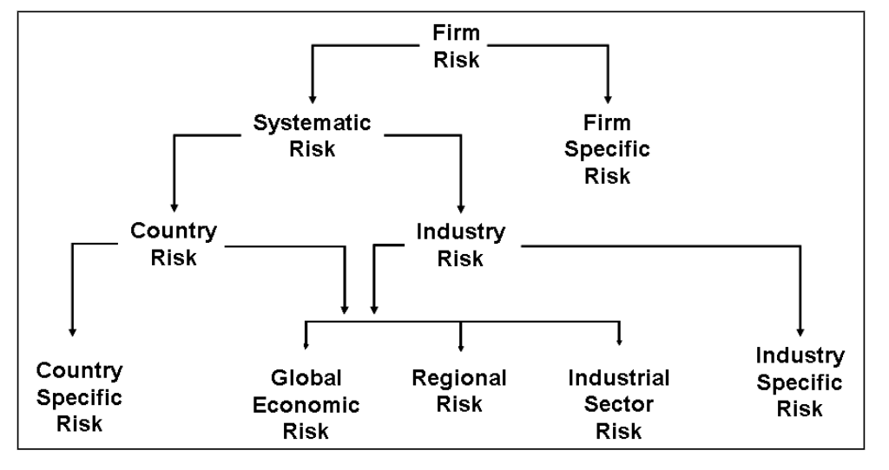
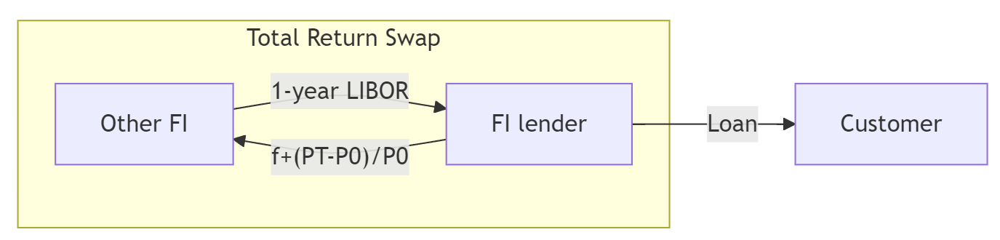
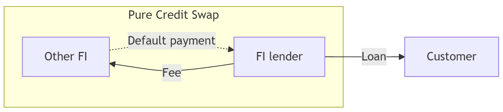

# Credit Risk II: Loan Portfolio and Concentration Risk

## Why this week matters

::: {.callout-important title="The last time Australian banks nearly failed"}
Between 1990 and 1992 Australian banks lost more than **A\$9 billion** before tax, over a third of the entire system's shareholders' funds in 1989. Non-performing loans peaked at about **6%** of all lending.

Hardly any of it was one bad borrower. It was **one sector**: commercial property. When Westpac finally revalued its property assets, they were worth about **40% less**.

Every state-owned bank in Australia was closed or broken up.[^rba]
:::

[^rba]: Figures from @GizyckiLowe2000. The State Bank of Victoria and the State Bank of South Australia each lost more than three times their 1989 shareholders' funds.

- Every one of those loans was approved by someone who had done the Week 6 analysis properly.
- The loans were fine one at a time. The **portfolio** was a single bet.
- **Portfolio risk is not the sum of loan risks.**

::: {.callout-note title="It still happens"}
March 2024: **New York Community Bancorp** took a \$1 billion rescue investment after losses on its commercial property book. Same sector, same mistake, thirty years later.
:::

## Roadmap: one question, asked three ways

In [Week 6](https://mingze-gao.com/teaching/AFIN8003/2026S2/Week6/) you priced **one** loan. This week the bank holds thousands of them, and they do not fail independently.

Everything today answers a single question: **how much of this risk can the bank actually get rid of?**

| | The question | What we build |
|---|---|---|
| **1** | Can we *see* the concentration? | Migration analysis, concentration limits |
| **2** | Can we *diversify* it away? | MPT for loans, Moody's RiskFrontier |
| **3** | Can we *sell* it? | Credit forwards, options and swaps |

::: {.callout-tip title="The answer, given away in advance"}
Question 2 has an uncomfortable answer: **only partly**. There is a floor below which diversification cannot take you, however many loans you add.

That floor is the reason question 3 exists.
:::

# Question 1: can we see the concentration?

## Simple models

::: {.callout-caution}
A large credit risk exposure to a single borrower, or to a group of borrowers exposed to the **same risk factor**, poses a potential threat to a bank's safety and soundness.
:::

::: {.callout-note title="Which side of the balance sheet?"}
Concentration can bite on either side. SVB in Week 4 was concentrated in its **depositors**. This week is about concentration in the **loan book**.
:::

- Regulations limit such exposure, so individual loans rarely cause bank failures outright.
- The real danger: pools of loans that **look different but share the same risk driver** behave identically in a downturn.
- Think of the 2008 GFC. Mortgages, CDOs, structured credit, MBS, and derivatives were marketed as _different products_ but were all bets on U.S. house prices. When the one underlying factor turned, everything turned.

::: {.callout-tip title="The hidden-correlation trap"}
Products with different names, sold by different business units, can still share the same underlying risk. A bank's "diversified" book may be one bet in disguise.
:::

Two simple models widely used to measure concentration risk:

1. Migration analysis
2. Concentration limits

## Simple model: migration analysis

- Track credit ratings of certain types of loans or certain sectors, either externally from credit rating agencies or internally. 
- If actual rating deteriorates faster than historical experience, limit lending to that loan class or sector.
- Historical credit migration measured through __loan migration matrix__ (or transition matrix).

|       | AAA-A | BBB-B | CCC-C | Default |
|-------|-------|-------|-------|---------|
| AAA-A | 0.85  | 0.10  | 0.04  | 0.01    |
| BBB-B | 0.12  | 0.83  | 0.03  | 0.02    |
| CCC-C | 0.03  | 0.13  | 0.80  | 0.04    |

: Example loan migration matrix {#tbl-migration-matrix}

@tbl-migration-matrix, for example, shows the _transition probabilities_ of loans that began the year with a certain credit rating being upgraded/downgraded to a certain rating, or default.

::: {.fragment}
- The probability of AAA-rated loan at the start of a year being downgraded to BBB to B by the year's end is 0.10.
- The probability of AAA-rated loan at the start of a year being downgraded to CCC to C by the year's end is 0.04.
- The probability of AAA-rated loan at the start of a year defaults by the year's end is 0.01.
:::

## Simple model: migration analysis (cont'd)

In practice, FIs use migration matrices with many more rating classes (S&P uses 20+).

Migration analysis is also applied to credit card and consumer loan portfolios.

::: {.callout-warning title="Where migration analysis can mislead you"}
- **Historical data only.** This is "last war" risk.[^last-war] Matrices built on 2010s data missed COVID-era dislocations.
- **Rating agencies lag.** Downgrades typically arrive _after_ trouble is visible. By the time ratings downgrade, the market has already repriced.
- **Point-in-time vs through-the-cycle.** The same rating can mean different things across agencies and time.
:::

[^last-war]: Incorrectly use strategies from a previous crisis to solve a completely new one.

::: {.callout-note title="Discussion"}
Lehman Brothers was rated A by S&P five days before its September 2008 bankruptcy. What does that tell you about relying on migration analysis alone?
:::

## Simple model: concentration limits

- Caps the maximum loan size to an individual borrower, sector, or geographic area.
- Used to reduce exposure to some industries and increase it in others.
- Aggregate limits applied to industries whose performance is highly correlated.
- **Regulatory floors:**
    - **US (OCC):** loans to a single borrower capped at 15% of bank's capital (25% if fully secured).
    - **Australia (APRA APS 221):** large exposures to a single counterparty (or group) generally capped at 25% of Tier 1 capital; a tighter 15% limit applies to a D-SIB's exposure to another systemically important bank.

$$
\text{Concentration limit} = \text{Maximum loss as a percentage of capital} \times \frac{1}{\text{Loss rate}}
$$

::: {.callout-note title="Example"}
A manager unwilling to lose more than 15% of capital, facing an estimated loss rate of 40% in an industry, sets the limit at $15\% \times \frac{1}{0.4} = 37.5\%$ of the loan portfolio.
:::

## Simple model: concentration limits (cont'd)

Let's look at a real Australian bank. Notice anything?

| Sector | \$m | % of total |
|--------------------------------|--------|------|
| Residential mortgages          | 53,351 | 74.0 |
| Property and construction      | 6,904  | 9.6  |
| Other                          | 3,485  | 4.8  |
| Healthcare                     | 2,657  | 3.7  |
| Professional services          | 1,854  | 2.6  |
| Agriculture                    | 1,466  | 2.0  |
| Transportation                 | 853    | 1.2  |
| Manufacturing and mining       | 785    | 1.1  |
| Hospitality and accommodation  | 658    | 0.9  |
| Other retail lending           | 131    | 0.2  |
| **Total**                      | **72,144** | **100.0** |

: BOQ credit exposures by industry, 31 August 2025. Source: [BOQ APRA Basel III Pillar 3 disclosures](https://www.boq.com.au/content/dam/boq/files/reports/apra-pillar/apra-basel-iii-pillar-disclosures-31-Aug-2025.pdf) {#tbl-boq-credit-exposure-by-sector}

::: {.callout-note title="Discussion"}
**74% in residential mortgages.** Is BOQ diversified across ten sectors, or is it one bet on Australian house prices wearing ten different hats? This pattern is typical of Australian banks, and it is one reason APRA stress-tests them on a property downturn.
:::

:::: {.content-hidden when-format="pdf"}
::: {.notes}
Discussion points.

1. **Count risk factors, not sector labels.** Residential mortgages plus property and construction is 60,255 of 72,144, or **83.5%**. Both lines are driven by the same thing: Australian property prices and household capacity to service debt. Push further and much of the SME lending in healthcare, professional services and hospitality is secured by the owner's home or business premises, so the true property-linked share is higher still. Ten labels, one or two risk factors.

2. **Geography does not rescue it.** Queensland 30.3%, New South Wales 29.7%, Victoria 22.0%: the top three states are 82% of the book. These are separate housing markets in a mild downturn and the same market in a severe one, because the drivers are national (the cash rate, unemployment, credit availability).

3. **The trap is that each loan looks excellent.** Australian mortgage default rates are very low, so loan-by-loan due diligence gives the all-clear. But every one of them responds to the same drivers. This is precisely the floor from the diversification slide: 53,351 mortgages are not 53,351 independent bets, and no amount of additional mortgage lending lowers the systematic component.

4. **The honest case for the strategy.** The loans are secured, Australian mortgages are full recourse, lenders mortgage insurance sits above 80% LVR, and Australia has not had a national house price collapse in the modern era. Mortgages also carry low regulatory risk weights, so this book is capital-efficient. It is a defensible business model, not a mistake.

5. **Why that case weakens exactly when you need it.** In a genuine housing downturn PD and LGD deteriorate *together*: defaults rise while collateral values fall, and recourse is worth little when borrowers' other assets are falling too. Most models treat PD and LGD as independent. Ask the room what happens to expected loss when both move at once.

6. **So why does the regulator tolerate it?** Because it cannot be diversified away. There is no domestic sector large enough to absorb that lending, and every Australian bank holds the same exposure, so there is no local counterparty to sell it to. APRA's response is therefore capital and lending standards rather than diversification: the 3 percentage point serviceability buffer, the investor and interest-only growth caps used between 2014 and 2018, and stress tests built around a property downturn.

7. **Tie it back to the three questions.** Can we see it? Yes, this table is the reporting apparatus working. Can we diversify it away? No, this *is* the floor. Can we sell it? Partly. BOQ securitises mortgages through RMBS and buys LMI, which is question 3 arriving early.
:::
::::

# Question 2: can we diversify it away?

## Modern Portfolio Theory, in plain English

::: {.callout-tip title="The one idea"}
The risk of a portfolio is **not** the average of the risks of the things inside it. It is almost always lower, because the pieces do not all move at the same time.
:::

@Markowitz1952 turned that observation into a procedure:

1. For every possible mix of assets, compute two numbers: expected return $R_p$ and risk $\sigma_p$.
2. Plot every mix as one point.
3. Discard any mix where some other mix gives **more return at the same risk**, or **the same return at less risk**.
4. What survives is the **efficient frontier**.

::: {.columns}
:::: {.column width="49%"}
**Why a bank should care**

An FI does not choose loans one at a time, it chooses a *mix*. Two loan books can earn the identical spread and carry very different risk, purely because of who the borrowers are.
::::

:::: {.column width="51%"}
**What it asks you for**

Three numbers per asset: expected return, risk, and how it co-moves with everything else. The third does most of the work, and for loans it is by far the hardest to obtain.
::::
:::


## Loan portfolio diversification and MPT

MPT can be used to measure and control an FI's aggregate credit risk exposure.

Any model that seeks to estimate an efficient frontier for loans needs to determine and measure three things:

- The expected return on individual loans
- The risk of individual loans
- The correlation of default risks between loans

Expected return $R_p$ of a portfolio of $N$ assets:

$$
R_p = \sum_{i=1}^N X_i R_i
$$

where

- $R_i$ is the expected return on the $i$th asset
- $X_i$ is the proportion of the asset portfolio invested in the $i$th asset (the desired concentration amount)

## Loan portfolio diversification and MPT (cont'd)

Variance of returns (or risk) of the portfolio $\sigma_p^2$ can be calculated as

$$
\begin{aligned}
\sigma_p^2 &= \sum_{i=1}^N X_i^2 \sigma^2_i + \sum_{i=1}^N \sum_{\substack{j=1 \\ j\neq i}}^N X_i X_j \sigma_{ij} \\
           &= \sum_{i=1}^N X_i^2 \sigma^2_i + \sum_{i=1}^N \sum_{\substack{j=1 \\ j\neq i}}^N X_i X_j \rho_{ij} \sigma_i \sigma_j
\end{aligned}
$$

where

- $\rho_{ij}$ is the correlation between the returns on the $i$th and $j$th assets
- $\sigma_i^2$ is the variance of returns on the $i$th asset
- $\sigma_{ij}$ is the covariance of returns between the $i$th asset and $j$th asset

## An illustration

::: {.columns}
:::: {.column width="33%"}

::: {.content-hidden when-format="pdf"}
```{ojs}
//| echo: false
viewof w1 = Inputs.range([0, 1], {value: 0.6, step: 0.01, label: "Weight on asset 1"})
viewof rho12 = Inputs.range([-1, 1], {value: -0.25, step: 0.05, label: "Correlation \u03C1\u2081\u2082"})
```
:::
::::

:::: {.column width="67%"}
::: {.content-hidden when-format="pdf"}
```{ojs}
//| echo: false
L = ({R1: 0.0625, s1: Math.sqrt(0.03 * 0.97) * 0.25, R2: 0.056, s2: Math.sqrt(0.02 * 0.98) * 0.20})

portOf = (x, r) => {
  const v = x ** 2 * L.s1 ** 2 + (1 - x) ** 2 * L.s2 ** 2
          + 2 * x * (1 - x) * r * L.s1 * L.s2;
  return {x: x, sd: Math.sqrt(Math.max(v, 0)) * 100, R: (x * L.R1 + (1 - x) * L.R2) * 100};
}

frontier = Array.from({length: 101}, (_, i) => portOf(i / 100, rho12))
here = portOf(w1, rho12)

html`<div style="font-size:1.05em; margin-bottom:6px;">
  R<sub>p</sub> = <b style="color:#A6192E">${here.R.toFixed(2)}%</b> &nbsp;&middot;&nbsp;
  \u03C3<sub>p</sub> = <b style="color:#A6192E">${here.sd.toFixed(2)}%</b>
</div>`

Plot.plot({
  width: 620, height: 330, marginLeft: 55, marginBottom: 45,
  x: {label: "Portfolio risk \u03C3p (%)", domain: [0, 5], grid: true},
  y: {label: "Portfolio return Rp (%)", domain: [5.4, 6.4], grid: true},
  marks: [
    Plot.line(frontier, {x: "sd", y: "R", stroke: "#A6192E", strokeWidth: 2.5}),
    Plot.dot([portOf(1, rho12), portOf(0, rho12)], {x: "sd", y: "R", r: 4, fill: "#777"}),
    Plot.text([portOf(1, rho12)], {x: "sd", y: "R", text: ["Asset 1 only"], dx: 28, fontSize: 12, fill: "#777"}),
    Plot.text([portOf(0, rho12)], {x: "sd", y: "R", text: ["Asset 2 only"], dx: 28, fontSize: 12, fill: "#777"}),
    Plot.dot([here], {x: "sd", y: "R", r: 7, fill: "#A6192E"})
  ]
})
```
:::
::::
:::


## The efficient frontier, and choosing one point on it {.smaller}

::: {.columns}
:::: {.column width="34%"}

::: {.content-visible when-format="pdf"}
*Interactive in the online slides: sliders for the correlation between two assets and the risk-free rate, drawing the frontier, the minimum-variance portfolio, and the portfolio with the highest Sharpe ratio.*
:::

::: {.content-hidden when-format="pdf"}
```{ojs}
//| echo: false
viewof rhoAB = Inputs.range([-1, 1], {value: 0.25, step: 0.05, label: "Correlation \u03C1"})
viewof rf = Inputs.range([0, 6], {value: 2, step: 0.25, label: "Risk-free rate (%)"})
```
:::

The frontier says which mixes are *worth considering*. To pick **one**, rank them by return earned per unit of risk, the **Sharpe ratio** [@Sharpe1966]:

$$S=\frac{R_p-r_f}{\sigma_p}$$

The best one is where a line from $r_f$ just touches the frontier.
::::

:::: {.column width="66%"}
::: {.content-hidden when-format="pdf"}
```{ojs}
//| echo: false
A = ({R: 4, sd: 8})
B = ({R: 10, sd: 20})

mix = (w, r) => {
  const v = w ** 2 * B.sd ** 2 + (1 - w) ** 2 * A.sd ** 2
          + 2 * w * (1 - w) * r * A.sd * B.sd;
  return {w: w, R: w * B.R + (1 - w) * A.R, sd: Math.sqrt(Math.max(v, 0))};
}

curve = Array.from({length: 201}, (_, i) => mix(i / 200, rhoAB))

gmvpW = Math.min(1, Math.max(0,
  (A.sd ** 2 - rhoAB * A.sd * B.sd) / (A.sd ** 2 + B.sd ** 2 - 2 * rhoAB * A.sd * B.sd)))
gmvp = mix(gmvpW, rhoAB)

tangency = curve.reduce((best, p) =>
  (p.sd > 0.01 && (p.R - rf) / p.sd > (best.R - rf) / best.sd) ? p : best, mix(1, rhoAB))
maxSharpe = (tangency.R - rf) / tangency.sd

efficient = curve.filter(p => p.R >= gmvp.R)
inefficient = curve.filter(p => p.R <= gmvp.R)
cal = [{sd: 0, R: rf}, {sd: 22, R: rf + maxSharpe * 22}]

html`<div style="font-size:1.05em; margin-bottom:4px;">
  Best Sharpe = <b style="color:#A6192E">${maxSharpe.toFixed(3)}</b>
  at <b>${(tangency.w * 100).toFixed(0)}%</b> in the risky asset
  (R = ${tangency.R.toFixed(2)}%, \u03C3 = ${tangency.sd.toFixed(2)}%)
</div>`

Plot.plot({
  width: 620, height: 350, marginLeft: 55, marginBottom: 45,
  x: {label: "Risk \u03C3p (%)", domain: [0, 22], grid: true},
  y: {label: "Expected return Rp (%)", domain: [0, 11], grid: true},
  marks: [
    Plot.line(cal, {x: "sd", y: "R", stroke: "#888", strokeDasharray: "5,4"}),
    Plot.line(inefficient, {x: "sd", y: "R", stroke: "#bbb", strokeWidth: 3}),
    Plot.line(efficient, {x: "sd", y: "R", stroke: "#A6192E", strokeWidth: 3}),
    Plot.dot([A, B], {x: "sd", y: "R", r: 4, fill: "#555"}),
    Plot.text([A], {x: "sd", y: "R", text: ["safe asset"], dx: 34, fontSize: 12, fill: "#555"}),
    Plot.text([B], {x: "sd", y: "R", text: ["risky asset"], dx: -34, fontSize: 12, fill: "#555"}),
    Plot.dot([gmvp], {x: "sd", y: "R", r: 6, fill: "#fff", stroke: "#A6192E", strokeWidth: 2}),
    Plot.text([gmvp], {x: "sd", y: "R", text: ["minimum variance"], dx: -6, dy: 18, fontSize: 12, fill: "#A6192E"}),
    Plot.dot([tangency], {x: "sd", y: "R", r: 7, fill: "#A6192E"}),
    Plot.text([tangency], {x: "sd", y: "R", text: ["best Sharpe"], dx: 8, dy: -14, fontSize: 12, fill: "#A6192E"}),
    Plot.dot([{sd: 0, R: rf}], {x: "sd", y: "R", r: 4, fill: "#888"})
  ]
})
```
:::
::::
:::

::: {.callout-note title="Three things to try"}
1. **Drag $\rho$ to $+1$.** The frontier straightens into a line and the grey inefficient arm disappears. At perfect correlation there is nothing to diversify.
2. **Drag $\rho$ to $-1$.** The frontier bows out until risk almost vanishes at the minimum-variance point. Same two assets, same returns, far less risk.
3. **Raise $r_f$.** The tangency point slides along the frontier: a higher risk-free rate makes you demand more from the risky mix.
:::

::: {.callout-important title="Now put loans in it"}
Nothing above is specific to shares. $R_i$ and $\sigma_i$ can also represent the expected return and risk of loans, so that the same picture prices a **loan portfolio**. That is exactly what RiskFrontier does next.
:::

## How much risk can diversification remove? {.smaller}

::: {.columns}
:::: {.column width="33%"}

::: {.content-visible when-format="pdf"}
*Interactive in the online slides: sliders for the average correlation between loans and the risk of a single loan, tracing portfolio risk as the number of loans grows.*
:::

::: {.content-hidden when-format="pdf"}
```{ojs}
//| echo: false
viewof rhoBar = Inputs.range([0, 0.6], {value: 0.2, step: 0.01, label: "Average correlation \u03C1"})
viewof sigOne = Inputs.range([1, 10], {value: 4, step: 0.5, label: "Risk of one loan \u03C3 (%)"})
```
:::

::: {.callout-important title="The floor"}
Add as many loans as you like. Portfolio risk cannot fall below

$$\sigma_{\text{floor}}=\sigma\sqrt{\rho}$$

At $\rho=0$ the floor is zero and diversification removes everything. At $\rho=0.2$ it is $0.45\sigma$, no matter how many loans you hold.
:::
::::

:::: {.column width="67%"}
::: {.content-hidden when-format="pdf"}
```{ojs}
//| echo: false
divCurve = Array.from({length: 200}, (_, i) => {
  const N = i + 1;
  const v = sigOne ** 2 * (1 / N + (1 - 1 / N) * rhoBar);
  return {N: N, sd: Math.sqrt(v)};
})
divFloor = sigOne * Math.sqrt(rhoBar)
sd200 = divCurve[199].sd

html`<div style="font-size:1.05em; margin-bottom:6px;">
  One loan alone: <b>${sigOne.toFixed(1)}%</b> &nbsp;&middot;&nbsp;
  200 loans: <b style="color:#A6192E">${sd200.toFixed(2)}%</b> &nbsp;&middot;&nbsp;
  floor: <b>${divFloor.toFixed(2)}%</b>
</div>`

Plot.plot({
  width: 620, height: 330, marginLeft: 55, marginBottom: 45,
  x: {label: "Number of equally weighted loans", domain: [1, 200], grid: true},
  y: {label: "Portfolio risk (%)", domain: [0, 10], grid: true},
  marks: [
    Plot.ruleY([divFloor], {stroke: "#A6192E", strokeDasharray: "4,3"}),
    Plot.line(divCurve, {x: "N", y: "sd", stroke: "#A6192E", strokeWidth: 2.5}),
    Plot.text([{N: 130, sd: divFloor}],
      {x: "N", y: "sd", text: ["systematic risk: cannot be diversified"], dy: -12, fill: "#A6192E", fontSize: 13})
  ]
})
```
:::
::::
:::

::: {.callout-note title="Why this is the most important slide of the week"}
Everything a bank can do about the **downward-sloping part** of that curve is diversification. Everything it can do about the **flat part** is either hold capital against it or sell it to somebody else.

Correlation is what makes the floor high. A book of 200 Australian mortgages is 200 loans and roughly one bet.
:::

## Moody's RiskFrontier: the big picture

The problem: MPT needs **three inputs**, and for a loan portfolio none of them are directly observable.

```{mermaid}
%%| fig-align: center
flowchart LR
    A[Borrower<br/>financials] --> B[<b>Credit Monitor</b><br/>estimates EDF]
    B --> C[<b>RiskFrontier</b><br/>portfolio engine]
    D[~1,000 systematic<br/>factors via <b>GCORR</b>] --> C
    E[Loan terms:<br/>spread, fees, LGD] --> C
    C --> F[Portfolio<br/>R<sub>p</sub> and σ<sub>p</sub>]
    style B fill:#D6D2C4,stroke:#333
    style C fill:#A6192E,color:#fff,stroke:#333
    style D fill:#D6D2C4,stroke:#333
```

**Two Moody's models in sequence:**

1. **Credit Monitor** → produces EDF (Expected Default Frequency) for each borrower
2. **RiskFrontier** → plugs EDFs, LGDs, and correlations into MPT to get portfolio R and σ

::: {.callout-tip title="Why not just use historical correlations?"}
Most loans never trade, so there is no price series to correlate. RiskFrontier instead computes correlations from **shared exposure to systematic factors**: GCorr distinguishes 61 countries and 49 industries, and runs to close to 1,000 factors in total.
:::

## RiskFrontier: the three MPT inputs

The whole model is just **three numbers per loan**, fed into standard MPT formulas.

:::: {.columns}

::: {.column width="55%"}
```{mermaid}
%%| fig-align: center
flowchart TB
    subgraph inputs [Inputs per loan i]
        R["<b>R<sub>i</sub></b>: Expected return<br/>= AIS<sub>i</sub> − EDF<sub>i</sub> × LGD<sub>i</sub>"]
        S["<b>σ<sub>i</sub></b>: Unexpected loss<br/>= √[EDF<sub>i</sub>(1−EDF<sub>i</sub>)] × LGD<sub>i</sub>"]
        P["<b>ρ<sub>ij</sub></b>: Default correlation<br/>from GCORR factor model"]
    end
    inputs --> MPT["Standard MPT:<br/>R<sub>p</sub> = Σ X<sub>i</sub>R<sub>i</sub><br/>σ<sub>p</sub><sup>2</sup> = ΣΣ X<sub>i</sub>X<sub>j</sub>ρ<sub>ij</sub>σ<sub>i</sub>σ<sub>j</sub>"]
```
:::

::: {.column width="45%"}
| Symbol | Meaning | Source |
|--------|---------|--------|
| **AIS** | All-in-drawn spread (loan rate − cost of funds + fees) | Loan contract |
| **EDF** | Prob. of default in the next year | Credit Monitor |
| **LGD** | Fraction lost if default occurs | Basel floors or bank estimate[^lgd] |
| **ρ** | Default correlation | GCORR factor model |
:::

::::

[^lgd]: Basel Foundation IRB (CRE32): senior unsecured exposures to corporates = **40%** (45% for banks and other financial institutions), subordinated = **75%**; lower LGDs apply to collateralised exposures (e.g., 20% for receivables or CRE/RRE collateral, 25% for other physical collateral).

## RiskFrontier: expected return and risk

**Expected return: earn the spread, lose the expected loss.**[^error]

$$
\underbrace{R_i}_{\text{net return}} = \underbrace{AIS_i}_{\text{spread + fees}} - \underbrace{EDF_i \times LGD_i}_{E(L_i),\text{ expected loss}}
$$

[^error]: In @saunders_financial_2023, this equation has a typo: $E(L_i)$ is written as $R(L_i)$.

**Unexpected loss: default is binomial, so σ has a closed form.**[^error2]

$$
\sigma_i = UL_i = \underbrace{\sqrt{EDF_i(1-EDF_i)}}_{\sigma \text{ of a 0/1 default event}} \times \underbrace{LGD_i}_{\text{loss if default}}
$$

[^error2]: In @saunders_financial_2023, this equation is incorrectly written.

::: {.callout-note title="Intuition"}
- **Expected loss** (EDF × LGD) is already _priced into_ the spread. It is the cost of doing business.
- **Unexpected loss** (σ) is what you hold capital against. It is the surprise.
:::

## RiskFrontier: where correlations come from (GCORR)

Default correlations between two loans cannot be directly observed. GCORR computes them via a **factor model**: two borrowers are correlated to the extent they share exposure to the _same underlying risk factors_.

{#fig-gcorr fig-align="center" width="85%"}

::: {.callout-tip title="Read @fig-gcorr this way"}
Each borrower's asset return = **global economy** + **region/country** + **industry** + **firm-specific noise**. Two borrowers are correlated only through the **shared** branches of the tree. A Sydney miner and a Perth miner share the "Australia + Materials" branches, so ρ is high. A Sydney miner and a Berlin software firm share almost nothing, so ρ is near zero.
:::

## Moody's Analytics RiskFrontier Model (example)

Suppose that an FI holds two loans with the following characteristics. Assume that the correlation $\rho_{12}=-0.25$, what are the return and risk of the portfolio?

| Loan $i$ | $X_i$ | Spread between loan rate and FI’s cost of funds | Fees | LGD | EDF |
|----------|-------|-------------------------------------------------|------|-----|-----|
| 1        | 0.6   | 5%                                              | 2%   | 25% | 3%  |
| 2        | 0.4   | 4.5%                                            | 1.5% | 20% | 2%  |

The return and risk on loan 1 are:

::: {.fragment}
$$
\begin{aligned}
R_1 &= (0.05+0.02) - (0.03\times0.25) = 0.0625 \\
\sigma_1 &= \sqrt{0.03\times0.97} \times 0.25 = 0.04265 
\end{aligned}
$$
:::

The return and risk on loan 2 are:

::: {.fragment}
$$
\begin{aligned}
R_2 &= (0.045+0.015) - (0.02\times0.2) = 0.056 \\
\sigma_2 &= \sqrt{0.02\times0.98} \times 0.2 = 0.028
\end{aligned}
$$
:::

The return and risk of the portfolio are then:

::: {.fragment}
$$
\begin{aligned}
R_p &= 0.6\times 0.0625 + 0.4\times 0.056 = 0.0599 \text{ or } 5.99\%  \\
\sigma_p^2 &= (0.6)^2(0.04265)^2 + (0.4)^2(0.028)^2 + 2(0.6)(0.4)(-0.25)(0.04265)(0.028) = 0.0006369 \\
\sigma_p &= \sqrt{0.0006369} = 0.0252 = 2.52\%
\end{aligned}
$$
:::

<!-- 

## Partial application of portfolio theory

1. Loan volume-based models
2. Loan loss ratio-based models

::: {.callout-note}
These are not examinable.
:::

## Partial application of portfolio theory: Loan volume-based models

Direct application of MPT is often difficult for FIs lacking information on market prices because many of the loans are not always able to be bought and sold in established markets.

Data can be gathered from:

- Reports to the central bank
- Data on shared national credit
- Commercial databases

Data provides market benchmarks against which FIs can compare their loan portfolios.

|               | (1) National | (2) Bank A | (3) Bank B |
|---------------|--------------|------------|------------|
| Real estate   | 45%          | 65%        | 10%        |
| C&I           | 30           | 20         | 25         |
| Individual    | 15           | 10         | 55         |
| Others        | 10           | 5          | 10         |
| **Total**     | **100**      | **100**    | **100**    |

: Allocation of the Loan Portfolio to Different Sectors (in percentages) {#tbl-loan-allocation}

## Partial application of portfolio theory: Loan volume-based models (cont'd)

- Deviations from the market portfolio benchmark indicate the relative degree of loan concentration.
- Relative measure of loan allocation deviation:

$$
\sigma_j = \sqrt{\frac{\sum_{i=1}^N (X_{ij}-X{i})^2}{N}}
$$

where

- $\sigma_j$ is the standard deviation of bank $j$'s asset allocation proportions from the national benchmark
- $X_i$ is the national asset allocations
- $X_{ij}$ is the asset allocation proportions of the $j$th bank
- $N$ is the number of observations or loan categories

## Partial application of portfolio theory: Loan volume-based models (cont'd)

Refer to @tbl-loan-allocation. We get the deviation of Bank A's loan portfolio allocation as follows:

$$
\begin{aligned}
(X_{1A}-X_1)^2 &= (0.65-0.45)^2 = 0.04 \\
(X_{2A}-X_2)^2 &= (0.20-0.30)^2 = 0.01 \\
(X_{3A}-X_3)^2 &= (0.10-0.15)^2 = 0.0025 \\
(X_{4A}-X_4)^2 &= (0.05-0.10)^2 = 0.0025
\end{aligned}
$$
and therefore
$$
\sigma_A = \sqrt{\frac{0.04+0.01+0.0025+0.0025}{4}} = 11.73\%
$$

## Partial application of portfolio theory: Loan loss ratio-based models

Estimates systematic loan loss risk of a particular sector or industry to the loan loss risk of an FI’s total loan portfolio

Use of time-series regression of quarterly losses:

$$
\frac{\text{Sectoral losses in the } i\text{th sector}}{\text{Loans to the } i\text{th sector}} = \alpha + \beta \frac{\text{Total loan losses}}{\text{Total loans}}
$$

where

- $\alpha$ measures the loan loss rate for a sector that has no sensitivity to losses on the aggregate loan portfolio
- $\beta$ measures the systematic loss sensitivity of the $i$th sector loans to total loan losses

The implication of this model is that sectors with lower $\beta$s could have higher concentration limits than high $\beta$ sectors, since low $\beta$ loan sector risks (loan losses) are less systematic (that is, are more diversifiable in a portfolio sense). 

-->

## Regulatory models

- **Fed's 1994 Ruling on Credit Concentration Risk**
    - Subjective approach based on examiner discretion.
    - Rejected technical models: data and methods were too undeveloped at the time.
- **2006 regulatory tightening**
    - **BIS:** 10 principles on credit risk assessment and supervisory evaluation.
    - **OCC:** guidance on sound risk management for commercial real estate (CRE) lending.
- **OCC/Fed Joint Study (April 2013).** The numbers are striking:

| Bank profile during GFC                                  | Failure rate |
|----------------------------------------------------------|--------------|
| Construction loans > 100% of capital                     | **13%**      |
| Exceeded BOTH construction AND total CRE criteria        | **23%**      |
| Did not exceed either criterion                          | 0.5%         |

::: {.callout-note title="Takeaway"}
Banks that breached both concentration criteria failed at **46 times** the rate of banks that breached neither. Concentration guidance is advisory. The statistical case for it is not.
:::

# Question 3: can we sell it?

## Credit derivatives

- Diversification is the first line of defence. Derivatives are the second.
- The key insight: **credit derivatives separate the credit risk from the lending relationship**. A bank can keep the client, service the loan, and still offload the default risk to someone else.
- Three main instruments: credit **forwards**, credit **options**, credit **swaps** (including CDS).

::: {.callout-tip title="Why this innovation matters"}
Before credit derivatives (pre-1990s), the only way a bank could reduce credit exposure to a big client was to **refuse the loan** or **sell it**, both of which damage the relationship. Credit derivatives let the bank say "yes" and still cap its downside.
:::

## Credit forward contracts and credit risk hedging

- A credit forward is a forward agreement that hedges against an increase in default risk of a firm (borrower).[^note-on-credit-spread-forwards]
- Specifies a credit spread on a benchmark bond issued by the borrower.
- Used to **hedge against credit deterioration** (spread widening)  
- Spread is measured vs. a risk-free Treasury  
- Example: BBB bond trades at 2% spread over Treasury  

[^note-on-credit-spread-forwards]: See [A Note on Credit Spread Forwards](https://papers.ssrn.com/sol3/papers.cfm?abstract_id=2596878) for some discussion on the potential confusion due to different definitions.

## Credit forward contracts and credit risk hedging (cont'd)

| Market outcome                    | Long position (hedger)                | Short position                      |
|-----------------------------------|---------------------------------------|-------------------------------------|
| Spread widens → credit quality worsens | Gains (receives payment)              | Loses (makes payment)               |
| Spread tightens → credit quality improves | Loses (makes payment)                 | Gains (receives payment)            |

- If $\phi_T > \phi_F$: Long receives $(\phi_T - \phi_F) \times MD \times A$  
- If $\phi_T < \phi_F$: Long pays $(\phi_F - \phi_T) \times MD \times A$  

where  

- $\phi_F$ is the credit spread on which the credit forward contract is written
- $\phi_T$ is the actual credit spread on the bond when the credit forward matures
- $MD$ is the modified duration on the benchmark bond
- $A$ is the principal amount of the forward agreement

- **Long position** protects against borrower credit quality getting worse  
- **Short position** benefits if borrower credit improves  
- Acts like a **put-style hedge** for lenders  


## Credit options

Credit options are a small corner of the market. Credit default swaps make up the large majority of US bank credit-derivative notional (78% in the first quarter of 2026), with total return swaps and credit options sharing the remainder.

- A __credit spread call option__ is a call option whose payoff increases as the (default) risk premium or yield spread on a specified benchmark bond of the borrower increases above some exercise spread.
- A __digital default option__ is an option that pays a stated amount in the event of a loan default (the extreme case of increased credit risk).

## Credit (default) swaps (CDS)

The most important, and most controversial, credit derivative.

**Explosive growth, then regulatory pushback:**

| Date | US bank credit-derivative notional | Note |
|----------------|------------------------|-----------------------------------|
| 2000           | \$0.43 trillion        | Market in its infancy             |
| March 2008     | \$16.44 trillion       | Pre-GFC peak                      |
| September 2011 | \$15.66 trillion       | Still near the peak               |
| September 2021 | \$3.9 trillion         | Post-Dodd-Frank trough            |
| **March 2026** | **\$6.7 trillion**     | CDS \$5.2tn, 78% of the total     |

: US commercial bank credit-derivative notional. Source: [OCC Quarterly Report on Bank Trading and Derivatives Activities](https://www.occ.gov/publications-and-resources/publications/quarterly-report-on-bank-trading-and-derivatives-activities/index-quarterly-report-on-bank-trading-and-derivatives-activities.html) {#tbl-cds-notional}

::: {.callout-important title="Down 75%, then back up"}
Dodd-Frank (2010) pushed standardised CDS onto **central clearinghouses**, with margin requirements that made speculative positions far more expensive. Bilateral dealer books shrank by roughly three quarters from the 2008 peak.

Note the last row. The market has been **growing again** since. Central clearing did not kill CDS, it changed who bears the counterparty risk.
:::

Why CDS exist:

1. Credit risk is still the leading cause of FI failure, ahead of interest-rate or FX risk.
2. CDS let FIs keep **long-term customer relationships** while offloading default risk.

## Basics of CDS

- **CDS Payments**: The buyer makes periodic payments to the seller (quarterly, semi-annually, or annually) until the end of the swap or a credit event (e.g., default) occurs.
- **Settlement**: Upon default, settlement involves either physical delivery of bonds (loans) or a cash payment.
    - The protection buyer receives a payment upon the occurrence of a credit event trigger, but the swap “expires worthless” if no trigger occurs.
- No requirement that the CDS buyer actually owns the underlying reference securities.
- The CDS buyer hedges its exposure to default risk, but there is still counterparty credit risk in the event that the seller fails to perform their obligations under the terms of the contract.[^AIG]

We examine two types of credit swaps:

1. total return swap
2. pure credit swap

[^AIG]: **AIG** had written hundreds of billions of dollars of CDS protection, much of it on subprime mortgage exposures, without posting collateral against it. When spreads widened in 2008 it faced margin calls it could not meet, and the US government committed up to **\$182 billion** in rescue financing. The lesson: protection is only as good as the counterparty who sold it. This is why **central clearing** is now standard for CDS.

## Credit swaps: total return swaps

A __total return swap__ involves _swapping_ an obligation to pay interest at a specified fixed or floating rate _for_ payments representing the total return on a loan or a bond (interest and principal value changes) of a specified amount.

The figure below illustrates a total return swap.[^error3]

[^error3]: In the textbook @saunders_financial_2023, Figure 25-4 incorrectly has $f-\frac{P_t-P_0}{P_0}$.

{fig-align="center"}

The FI lender pays a fixed annual rate $f$ plus changes in the market value of the loan and receives a variable rate payment (historically **1-year LIBOR**; post-2023 **SOFR** in USD, **AONIA/BBSW** in AUD since LIBOR's cessation in June 2023).

- Interest rate risk remains. The TRS transfers credit _and_ market risk of the asset, but the fixed vs floating mismatch is still an interest-rate exposure.

## Credit swaps: total return swaps (cont'd)

```{python}
# | label: fig-trs
# | fig-cap: "Total Return Swap Payments Example"
# | fig-location: center
import numpy as np
import matplotlib.pyplot as plt

np.random.seed(8003)
# Parameters for the TRS
notional = 1_000_000  # Notional amount (1 million)
fixed_rate = 0.03  # Fixed annual rate paid by the TRS receiver (3%)
asset_volatility = 0.1  # Volatility of the asset's return (10%)
years = 5  # Time period of the TRS (5 years)
periods_per_year = 4  # Payments per year (quarterly)


# Generate the timeline for TRS payments
def generate_trs_timeline(
    notional, fixed_rate, asset_volatility, years, periods_per_year=4
):
    # Set up the timeline with quarterly periods
    total_periods = periods_per_year * years
    time_points = np.arange(1, total_periods + 1) / periods_per_year

    # Calculate the periodic fixed payment amount (quarterly)
    periodic_fixed_payment = (
        -notional * fixed_rate / periods_per_year
    )  # Fixed payment made by TRS receiver

    # Simulate random returns on the asset
    asset_returns = np.random.normal(loc=0, scale=asset_volatility, size=total_periods)

    # Initialize lists to store the results
    total_returns = np.zeros(total_periods)
    payments = np.zeros(total_periods)

    for period in range(total_periods):
        # Total return on the asset (positive or negative)
        total_return = notional * asset_returns[period]
        total_returns[period] = total_return

        # Net payment for the TRS receiver (positive if receiving total return, minus fixed payment)
        payments[period] = total_return + periodic_fixed_payment

    return time_points, payments, total_returns


# Simulate TRS payments with different asset volatilities
volatilities = [0.05]  # Different volatilities to simulate
simulations = {}

for vol in volatilities:
    timeline, payments, total_returns = generate_trs_timeline(
        notional, fixed_rate, vol, years, periods_per_year
    )
    simulations[vol] = payments

# Plot the timelines as bar charts
plt.figure(figsize=(12, 8))
bar_width = 0.2  # Width of each bar

# Generate bar charts for each volatility
for idx, (vol, payments) in enumerate(simulations.items()):
    plt.bar(
        timeline + idx * bar_width * 0.1,
        payments,
        width=bar_width,
        color="#A6192E",
        label=f"Volatility: {vol*100:.0f}%",
    )

# Customize the plot
plt.title(f"{years}-Year Total Return Swap Payments Example")
plt.xlabel("Time (Years)")
plt.ylabel("Net Payment Amount ($)")
plt.axhline(0, color="black", linewidth=1)
plt.grid(True)
plt.legend()

# Show the plot
plt.show()

```

## Credit swaps: pure credit swaps

Interest-rate sensitive element stripped out leaving only the credit risk.

Similar to buying an insurance:

- If default, the counterparty makes the default payment
- If not default, the FI receives nothing from the counterparty.

{fig-align="center"}

## Credit swaps: pure credit swaps (cont'd)

```{python}
# | label: fig-pure-cds
# | fig-cap: "Pure CDS Payments Example"
# | fig-location: center
import numpy as np
import matplotlib.pyplot as plt

np.random.seed(8003)
# Parameters for the CDS
notional = 1_000_000  # Notional amount (1 million)
cds_spread = 0.02  # Annual CDS spread (2%)
recovery_rate = 0.9  # Recovery rate in case of default (90%)
years = 5  # Time period of the CDS (5 years)
periods_per_year = 4  # Payments per year (quarterly)


# Generate the timeline for CDS payments
def generate_cds_timeline(
    notional, cds_spread, default_probability, recovery_rate, years, periods_per_year=4
):
    # Set up the timeline with quarterly periods
    total_periods = periods_per_year * years
    time_points = np.arange(1, total_periods + 1) / periods_per_year

    # Calculate the periodic payment amount (quarterly)
    periodic_payment = (
        -notional * cds_spread / periods_per_year
    )  # Negative for payments

    # Initialize lists to store the results
    payments = np.zeros(total_periods)

    # Simulate payments and default events
    for period in range(total_periods):
        if np.random.rand() < default_probability / periods_per_year:
            # Default occurs at this period
            default_loss = notional * (
                1 - recovery_rate
            )  # Positive for the payment received on default
            payments[period] = default_loss
            payments[period + 1 :] = 0  # No more payments after default
            break
        else:
            # Regular payment
            payments[period] = periodic_payment

    return time_points, payments


# Simulate multiple series with different default probabilities
default_probabilities = [0.02, 0.1]  # Different default probabilities
colors = ["#D6D2C4", "#A6192E"]

simulations = {}

# Generate timelines for each default probability
for prob in default_probabilities:
    timeline, payments = generate_cds_timeline(
        notional, cds_spread, prob, recovery_rate, years, periods_per_year
    )
    simulations[prob] = payments

# Plot the timelines as bar charts
plt.figure(figsize=(12, 8))
bar_width = 0.2  # Width of each bar

# Generate bar charts for each probability
for idx, (prob, payments) in enumerate(simulations.items()):
    plt.bar(
        timeline + idx * bar_width * 0.1,
        payments,
        width=bar_width,
        color=colors[idx],
        label=f"Default Probability: {prob*100:.0f}%",
    )

plt.title(f"{years}-Year Pure CDS Payments Example")
plt.xlabel("Time (Years)")
plt.ylabel("Payment Amount ($)")
plt.axhline(0, color="black", linewidth=1)
plt.grid(True)
plt.legend()
plt.show()
```

# Finally...

## Key takeaways

1. **Concentration, not individual default, is the usual killer.** Loans that "look different" often share one risk factor.
2. **Migration analysis** is useful but backward-looking. Rating agencies lag reality.
3. **MPT applies to loans**, with adaptations (RiskFrontier): expected loss = EDF × LGD, risk = √(EDF(1-EDF)) × LGD, correlations come from factor models (GCORR), not history.
4. **Derivatives separate credit risk from the lending relationship.** TRS transfers total return; pure CDS transfers only default risk.
5. **Counterparty risk is real.** AIG 2008 is the cautionary tale. Central clearing is the post-GFC response.

## Suggested readings

- [Moody's Analytics: An Overview of Modelling Credit Portfolios](https://www.moodys.com/web/en/us/insights/resources/overview-of-modeling-credit-portfolios.pdf)
- [BIS CRE32: IRB approach and risk components](https://www.bis.org/basel_framework/chapter/CRE/32.htm) (for the LGD floors)
- [OCC Quarterly Report on Bank Trading and Derivatives Activities](https://www.occ.gov/publications-and-resources/publications/quarterly-report-on-bank-trading-and-derivatives-activities/index-quarterly-report-on-bank-trading-and-derivatives-activities.html) (for current credit-derivative notionals)

## References
