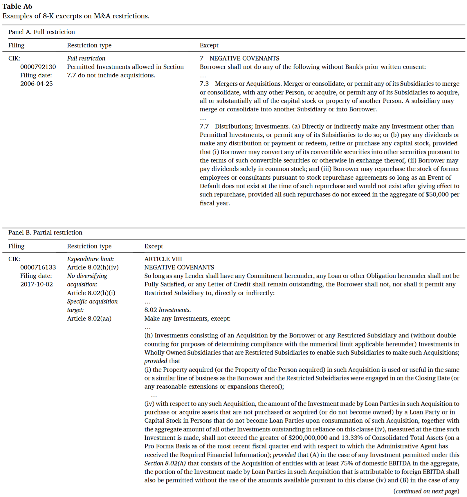

```{python}
#| label: setup
#| include: false
import sqlite3
import matplotlib.pyplot as plt
from matplotlib import cycler
import pandas as pd

DB_PATH = r"C:/Users/Adrian Gao/Downloads/edgar-idx.sqlite3"
conn = sqlite3.connect(DB_PATH)

# Macquarie University brand palette — shared across all charts in the deck.
MQ = {
    "red":        "#A6192E",
    "purple":     "#80225F",
    "deep_red":   "#76232F",
    "magenta":    "#C6007E",
    "charcoal":   "#373A36",
    "bright_red": "#D6001C",
    "sand":       "#D6D2C4",
    "green":      "#00AA4F",
}
MQ_CYCLE = [MQ["red"], MQ["charcoal"], MQ["green"], MQ["purple"],
            MQ["deep_red"], MQ["magenta"], MQ["bright_red"], MQ["sand"]]

plt.rcParams.update({
    "font.family":        "Arial",
    "font.size":          13,
    "axes.edgecolor":     MQ["charcoal"],
    "axes.labelcolor":    MQ["charcoal"],
    "axes.titlecolor":    MQ["charcoal"],
    "axes.titleweight":   "bold",
    "axes.titlepad":      12,
    "axes.spines.top":    False,
    "axes.spines.right":  False,
    "axes.grid":          True,
    "axes.axisbelow":     True,
    "grid.color":         MQ["sand"],
    "grid.linestyle":     "-",
    "grid.linewidth":     0.6,
    "grid.alpha":         0.6,
    "xtick.color":        MQ["charcoal"],
    "ytick.color":        MQ["charcoal"],
    "text.color":         MQ["charcoal"],
    "figure.facecolor":   "white",
    "axes.facecolor":     "white",
    "axes.prop_cycle":    cycler(color=MQ_CYCLE),
})
```

# Why filings

## A public archive of firm behaviour for every field

A single filing is at once a legal document, a financial report, a strategy narrative, and a text corpus. It speaks to every field.

::: {.columns}
:::: {.column width="33%"}
<div style="background:#F7F5F2; border-top:4px solid #A6192E; padding:14px 14px; margin-bottom:10px; height:100%;">
<span style="font-weight:700; color:#A6192E; text-transform:uppercase; font-size:0.8em; letter-spacing:0.04em;">Accounting &amp; Governance</span><br/>
<span style="font-size:0.9em; color:#373A36;">Footnotes, estimates, proxy disclosures, board structure, SOX 404, CD&A.</span>
</div>

<div style="background:#F7F5F2; border-top:4px solid #76232F; padding:14px 14px; margin-bottom:10px; height:100%;">
<span style="font-weight:700; color:#76232F; text-transform:uppercase; font-size:0.8em; letter-spacing:0.04em;">Actuarial &amp; Analytics</span><br/>
<span style="font-size:0.9em; color:#373A36;">XBRL facts, risk disclosures, insurance and fund filings, text-based analytics.</span>
</div>
::::

:::: {.column width="33%"}
<div style="background:#F7F5F2; border-top:4px solid #80225F; padding:14px 14px; margin-bottom:10px; height:100%;">
<span style="font-weight:700; color:#80225F; text-transform:uppercase; font-size:0.8em; letter-spacing:0.04em;">Applied Finance</span><br/>
<span style="font-size:0.9em; color:#373A36;">Capital raising, contracts, ownership, event studies, insider trading, M&A.</span>
</div>

<div style="background:#F7F5F2; border-top:4px solid #C6007E; padding:14px 14px; margin-bottom:10px; height:100%;">
<span style="font-weight:700; color:#C6007E; text-transform:uppercase; font-size:0.8em; letter-spacing:0.04em;">Economics</span><br/>
<span style="font-size:0.9em; color:#373A36;">Regulation as natural experiment, rule changes, industry dynamics, political economy.</span>
</div>
::::

:::: {.column width="33%"}
<div style="background:#F7F5F2; border-top:4px solid #00AA4F; padding:14px 14px; margin-bottom:10px; height:100%;">
<span style="font-weight:700; color:#00AA4F; text-transform:uppercase; font-size:0.8em; letter-spacing:0.04em;">Management</span><br/>
<span style="font-size:0.9em; color:#373A36;">Strategy narratives, restructuring, leadership turnover, executive incentives.</span>
</div>

<div style="background:#F7F5F2; border-top:4px solid #D6001C; padding:14px 14px; margin-bottom:10px; height:100%;">
<span style="font-weight:700; color:#D6001C; text-transform:uppercase; font-size:0.8em; letter-spacing:0.04em;">Marketing</span><br/>
<span style="font-size:0.9em; color:#373A36;">Customer concentration, product risk, brand incidents, consumer-facing language.</span>
</div>
::::
:::

## Three decades of growth

::: {.columns}

:::: {.column width="55%"}
```{python}
#| label: fig-filings-per-year
#| fig-cap: "Filings received on EDGAR per calendar year, 1994–2025. Source: SEC EDGAR full-index."
#| fig-align: center
#| cache: true
per_year = pd.read_sql_query(
    """
    SELECT CAST(strftime('%Y', date) AS INTEGER) AS year,
           COUNT(*) AS n
    FROM edgar_idx
    WHERE date BETWEEN '1994-01-01' AND '2025-12-31'
    GROUP BY year
    ORDER BY year
    """,
    conn,
)

plt.rcParams.update({"font.size": 14})

fig, ax = plt.subplots(figsize=(13, 6))
ax.bar(per_year["year"], per_year["n"] / 1_000_000, color="#A6192E", width=0.82)

ax.set_ylabel("Filings received (millions)", fontsize=14)
ax.set_title("EDGAR filings per year, 1994–2025", fontsize=17, pad=12)
ax.spines[["top", "right"]].set_visible(False)
ax.set_xticks([y for y in per_year["year"] if y % 3 == 0] + [2025])

peak = per_year.loc[per_year["n"].idxmax()]
ax.annotate(
    f"Peak {int(peak['year'])}\n{peak['n'] / 1_000_000:.2f}M filings",
    xy=(peak["year"], peak["n"] / 1_000_000),
    xytext=(peak["year"] - 8, peak["n"] / 1_000_000 + 0.35),
    arrowprops=dict(arrowstyle="->", color=MQ["charcoal"], lw=1.5),
    fontsize=13,
    ha="left",
)

plt.tight_layout()
plt.show()
```
::::

:::: {.column width="45%"}
<div style="background:#F7F5F2; padding:14px 16px; border-left:4px solid #A6192E; margin-bottom:10px;">
<span style="font-size:1.8em; font-weight:700; color:#373A36;">49.7M+</span><br/>
<span style="color:#373A36;">filings, 1994–2025</span>
</div>

<div style="background:#F7F5F2; padding:14px 16px; border-left:4px solid #00AA4F; margin-bottom:10px;">
<span style="font-size:1.8em; font-weight:700; color:#373A36;">~2M / year</span><br/>
<span style="color:#373A36;">since 2004</span>
</div>

<div style="background:#F7F5F2; padding:14px 16px; border-left:4px solid #76232F; margin-bottom:10px;">
<span style="font-size:1.8em; font-weight:700; color:#373A36;">~8,000 / day</span><br/>
<span style="color:#373A36;">new filings on a typical business day</span>
</div>

<div style="background:#F9F3E8; padding:12px 14px; border-left:4px solid #C6007E; font-size:0.95em;">
<b>Regulation leaves fingerprints.</b> The 2003–2004 step-up reflects expanded 8-K triggers and ownership-reporting rules.
</div>
::::
:::

## Top forms by filing count

```{python}
#| label: fig-top-forms
#| fig-cap: "Top 15 form types on EDGAR by filing count, 1994–2025. Source: SEC EDGAR full-index."
#| fig-align: center
#| cache: true
top_forms = pd.read_sql_query(
    """
    SELECT file_type, COUNT(*) AS n
    FROM edgar_idx
    WHERE date BETWEEN '1994-01-01' AND '2025-12-31'
    GROUP BY file_type
    ORDER BY n DESC
    LIMIT 15
    """,
    conn,
)

label_map = {
    "4": "Form 4  (insider trades)",
    "3": "Form 3  (insider initial)",
    "5": "Form 5  (insider annual)",
    "4/A": "Form 4/A  (insider amd.)",
    "8-K": "8-K  (material events)",
    "10-Q": "10-Q  (quarterly)",
    "10-K": "10-K  (annual)",
    "6-K": "6-K  (foreign issuers)",
    "13F-HR": "13F-HR  (institutional)",
    "SC 13G": "SC 13G  (5%+ owner)",
    "SC 13G/A": "SC 13G/A  (5%+ amd.)",
    "SC 13D/A": "SC 13D/A  (activist amd.)",
    "DEF 14A": "DEF 14A  (proxy)",
    "424B2": "424B2  (offering supp.)",
    "424B3": "424B3  (offering supp.)",
    "497": "497  (fund supplement)",
    "497K": "497K  (fund summary)",
    "D": "Form D  (Reg D offering)",
    "D/A": "Form D/A  (Reg D amd.)",
    "FWP": "FWP  (free writing prosp.)",
    "NPORT-P": "NPORT-P  (fund holdings)",
    "CORRESP": "CORRESP  (SEC correspondence)",
    "UPLOAD": "UPLOAD  (SEC staff letter)",
    "485BPOS": "485BPOS  (fund annual upd.)",
    "24F-2NT": "24F-2NT  (fund reg filings)",
}

famous = {"10-K", "10-Q", "8-K", "13F-HR"}
top_forms["label"] = top_forms["file_type"].map(lambda x: label_map.get(x, x))
colors = ["#A6192E" if f in famous else "#D6D2C4" for f in top_forms["file_type"]]

plt.rcParams.update({"font.size": 13})

fig, ax = plt.subplots(figsize=(13, 7))
ax.barh(top_forms["label"][::-1], top_forms["n"][::-1] / 1_000_000,
        color=colors[::-1])

for i, v in enumerate(top_forms["n"][::-1] / 1_000_000):
    ax.text(v + 0.15, i, f"{v:.2f}M", va="center", fontsize=11)

ax.set_xlabel("Filings (millions)", fontsize=14)
ax.set_title("Top 15 form types on EDGAR, 1994–2025", fontsize=17, pad=12)
ax.spines[["top", "right"]].set_visible(False)
ax.set_xlim(0, top_forms["n"].max() / 1_000_000 * 1.15)

ax.legend(
    handles=[
        plt.Rectangle((0, 0), 1, 1, color="#A6192E",
                      label="Some more `famous` forms"),
        plt.Rectangle((0, 0), 1, 1, color="#D6D2C4", label="Everything else"),
    ],
    loc="lower right", frameon=False, fontsize=12,
)

plt.tight_layout()
plt.show()
```

## The most-filed form you probably haven't heard of

:::: {.columns}

::: {.column width="42%"}
__Form 4__ is a one-page filing that an officer, director, or 10% shareholder submits within two business days of trading their company's shares.

- __17.9 million__ Form 4 filings since 1994.
- More than 10-K, 10-Q, and 8-K combined.
- Each filing reveals who traded, how much, at what price, when.

::: {.callout-note title="Research idea"}
Do insiders sell systematically before negative news? Do director purchases signal board confidence? Form 4 gives you the raw material.
:::
:::

::: {.column width="58%"}
```{python}
#| label: fig-insider-vs-others
#| fig-cap: "Insider forms (3, 4, 5, amendments) vs. common research forms combined, 1994–2025."
#| fig-align: center
#| cache: true
counts = pd.read_sql_query(
    """
    SELECT file_type, COUNT(*) AS n
    FROM edgar_idx
    WHERE date BETWEEN '1994-01-01' AND '2025-12-31'
      AND file_type IN ('3','4','5','3/A','4/A','5/A',
                        '10-K','10-K/A','10-Q','10-Q/A',
                        '8-K','8-K/A','DEF 14A','13F-HR',
                        'S-1','S-1/A','20-F','6-K')
    GROUP BY file_type
    """,
    conn,
)

insider_types = {"3", "4", "5", "3/A", "4/A", "5/A"}
insider = counts.loc[counts["file_type"].isin(insider_types), "n"].sum()
others = counts.loc[~counts["file_type"].isin(insider_types), "n"].sum()

groups = pd.Series(
    {
        "Insider forms\n(3, 4, 5, amd.)": insider / 1_000_000,
        "10-K, 10-Q, 8-K,\nDEF 14A, 13F-HR,\nS-1, 20-F, 6-K\ncombined": others
        / 1_000_000,
    }
)

plt.rcParams.update({"font.size": 14})

fig, ax = plt.subplots(figsize=(9, 7))
colors_2 = ["#A6192E", "#D6D2C4"]
bars = ax.bar(groups.index, groups.values, color=colors_2, width=0.6)
for bar, v in zip(bars, groups.values):
    ax.text(
        bar.get_x() + bar.get_width() / 2,
        v + 0.4,
        f"{v:.1f}M",
        ha="center",
        fontsize=16,
        fontweight="bold",
    )
ax.set_ylabel("Filings (millions)", fontsize=14)
ax.set_title("Insider forms dominate raw volume", fontsize=16, pad=12)
ax.spines[["top", "right"]].set_visible(False)
ax.set_ylim(0, max(groups.values) * 1.18)

plt.tight_layout()
plt.show()
```
:::

::::

## Who files the most? (not who you think)

```{python}
#| label: fig-top-filers
#| fig-cap: "Top 15 filers on EDGAR by filing count, 1994–2025 (by CIK)."
#| fig-align: center
#| cache: true
tops = pd.read_sql_query(
    """
    SELECT firm_name, COUNT(*) AS n
    FROM edgar_idx
    WHERE date BETWEEN '1994-01-01' AND '2025-12-31'
    GROUP BY cik
    ORDER BY n DESC
    LIMIT 15
    """,
    conn,
)

def pretty(name):
    out = name.title()
    replacements = [
        ("Llc", "LLC"), (" Ag", " AG"), ("Plc", "PLC"),
        ("Corp /De/", "Corp"), ("/De/", ""),
        ("Jpmorgan", "JPMorgan"), ("Ubs", "UBS"),
        ("Gs Finance", "GS Finance"), ("Fmr LLC", "FMR LLC (Fidelity)"),
        ("Blackrock", "BlackRock"),
        ("  ", " "),
    ]
    for a, b in replacements:
        out = out.replace(a, b)
    return out.strip()

tops["pretty"] = tops["firm_name"].map(pretty)

plt.rcParams.update({"font.size": 13})

fig, ax = plt.subplots(figsize=(13, 7))
ax.barh(tops["pretty"][::-1], tops["n"][::-1] / 1000, color="#00AA4F")
for i, v in enumerate(tops["n"][::-1] / 1000):
    ax.text(v + 3, i, f"{v:.0f}k", va="center", fontsize=11)
ax.set_xlabel("Filings (thousands)", fontsize=14)
ax.set_title("The 15 most prolific filers on EDGAR", fontsize=17, pad=12)
ax.spines[["top", "right"]].set_visible(False)
ax.set_xlim(0, tops["n"].max() / 1000 * 1.17)

plt.tight_layout()
plt.show()
```

::: {.callout-important}
Not Apple. Not Tesla. The most prolific filers are __investment banks, asset managers, and their structured-product issuing vehicles__ submitting thousands of offering supplements and ownership reports. The "firm" in your data is not always the "firm" in your theory.
:::


## What makes filings distinctive

::: {.columns}
:::: {.column width="50%"}
__Breadth__

One archive covers listings, ownership, governance, material events, capital raising, deals, and contracts.

__Longitudinal depth__

Many firms have decades of filings, enabling within-firm designs.
::::
:::: {.column width="50%"}
__Granularity__

Items, sections, tables, XBRL tags, exhibits, signatures. Each layer supports a different empirical question.

__Accountability__

Disclosures are legally consequential. This is why they are often more careful, more consistent, and more comparable than press releases or pitch decks.
::::
:::

::: {.callout-note}
Filings are imperfect, strategic, and sometimes boilerplate. But those features can themselves become research objects.
:::

# 1. The filing ecosystem

## EDGAR in one slide

__EDGAR__: **E**lectronic **D**ata **G**athering, **A**nalysis, and **R**etrieval.

- SEC's primary electronic submission and public access system.
- Includes company filings, individual ownership filings, fund filings, exhibits, and metadata.
- Public access through web search, company pages, full-text search, and APIs.

::: {.content-hidden when-format="pdf"}
```{mermaid}
flowchart LR
    F[Filers] --> E[EDGAR]
    E --> R[Researchers]
    E --> I[Investors]
    E --> G[Regulators]
    E --> J[Journalists]
```
:::

## A map of the filing universe

Stop thinking in form codes. Think in __research use__.

::: {.columns}
:::: {.column width="50%"}
__Periodic reporting__

- 10-K, 10-Q, 20-F, 40-F

__Event disclosure__

- 8-K, 6-K

__Ownership and trading__

- 13D, 13G, 13F, Forms 3, 4, 5

__Governance and shareholder process__

- DEF 14A, DEFA14A, PRE 14A
::::
:::: {.column width="50%"}
__Capital raising and listing__

- S-1, F-1, S-3, prospectuses

__Deals and restructuring__

- S-4, merger proxy, tender offers

__Exhibits__

- EX-10 credit agreements, EX-2 merger agreements, employment contracts, charters, bylaws
::::
:::

## Filings grouped by research use

```{python}
#| label: fig-category-share
#| fig-cap: "Filing volume by research-use category, 1994–2023. Mapping is illustrative, not official."
#| fig-align: center
#| cache: true
categories = {
    "Ownership & insiders":
        ["3", "4", "5", "3/A", "4/A", "5/A",
         "SC 13G", "SC 13G/A", "SC 13D", "SC 13D/A",
         "13F-HR", "13F-HR/A", "13F-NT", "13F-NT/A"],
    "Periodic reporting":
        ["10-K", "10-K/A", "10-Q", "10-Q/A", "20-F", "20-F/A", "40-F", "40-F/A"],
    "Event disclosure":
        ["8-K", "8-K/A", "6-K", "6-K/A"],
    "Proxy & governance":
        ["DEF 14A", "DEFA14A", "PRE 14A", "DEFM14A", "PREM14A", "DEF 14C", "PRE 14C"],
    "Capital raising & offerings":
        ["S-1", "S-1/A", "S-3", "S-3/A", "F-1", "F-1/A", "F-3", "F-3/A",
         "424B1", "424B2", "424B3", "424B4", "424B5", "424B7", "FWP", "D", "D/A"],
    "Funds":
        ["497", "497K", "485BPOS", "485APOS", "N-CSR", "N-CSRS",
         "NPORT-P", "NPORT-EX", "24F-2NT"],
    "Deals & restructuring":
        ["S-4", "S-4/A", "F-4", "F-4/A", "SC TO-I", "SC TO-T", "SC 14D9"],
}

placeholders = ",".join(["?"] * sum(len(v) for v in categories.values()))
all_forms = [f for forms in categories.values() for f in forms]

df = pd.read_sql_query(
    f"""
    SELECT file_type, COUNT(*) AS n
    FROM edgar_idx
    WHERE date BETWEEN '1994-01-01' AND '2023-12-31'
      AND file_type IN ({placeholders})
    GROUP BY file_type
    """,
    conn,
    params=all_forms,
)

form_to_cat = {f: c for c, forms in categories.items() for f in forms}
df["category"] = df["file_type"].map(form_to_cat)
cat_totals = (
    df.groupby("category")["n"].sum().sort_values(ascending=True) / 1_000_000
)

palette = {
    "Ownership & insiders": "#A6192E",
    "Funds": "#80225F",
    "Capital raising & offerings": "#00AA4F",
    "Event disclosure": "#76232F",
    "Periodic reporting": "#D6001C",
    "Proxy & governance": "#C6007E",
    "Deals & restructuring": "#373A36",
}
colors = [palette[c] for c in cat_totals.index]

plt.rcParams.update({"font.size": 14})

fig, ax = plt.subplots(figsize=(13, 6))
ax.barh(cat_totals.index, cat_totals.values, color=colors)
for i, v in enumerate(cat_totals.values):
    ax.text(v + 0.3, i, f"{v:.1f}M", va="center", fontsize=13, fontweight="bold")
ax.set_xlabel("Filings (millions), 1994–2025", fontsize=14)
ax.set_title("Where EDGAR volume lives, grouped by research use", fontsize=17, pad=12)
ax.spines[["top", "right"]].set_visible(False)
ax.set_xlim(0, max(cat_totals.values) * 1.22)

plt.tight_layout()
plt.show()
```

## Periodic reports

The recurring narrative of the firm.

:::: {.columns}

::: {.column width="48%"}
__10-K__ (annual):

- Business description, risk factors, MD&A.
- Audited financial statements and footnotes.
- Segment and geographic discussion.
- Controls, legal proceedings, management certification.

__10-Q__ (quarterly):

- Condensed financials and MD&A update.
- Updated risk factors and legal proceedings.
- Interim-period events between 10-Ks.

Things researchers have measured from 10-K / 10-Q:

- Cybersecurity and AI risk language.
- Customer concentration and supply-chain exposure.
- Climate disclosures and accounting estimates.
- Year-on-year and quarter-on-quarter text changes.
:::

::: {.column width="52%"}
```{python}
#| label: fig-10k-seasonality
#| fig-cap: "When 10-Ks land: monthly 10-K filings, 1994–2025."
#| fig-align: center
#| cache: true
seas = pd.read_sql_query(
    """
    SELECT CAST(strftime('%m', date) AS INTEGER) AS month,
           COUNT(*) AS n
    FROM edgar_idx
    WHERE file_type = '10-K'
      AND date BETWEEN '1994-01-01' AND '2025-12-31'
    GROUP BY month
    ORDER BY month
    """,
    conn,
)

month_names = ["Jan", "Feb", "Mar", "Apr", "May", "Jun",
               "Jul", "Aug", "Sep", "Oct", "Nov", "Dec"]

plt.rcParams.update({"font.size": 13})

fig, ax = plt.subplots(figsize=(9, 6))
colors_m = ["#A6192E" if m == 3 else "#D6D2C4" for m in seas["month"]]
ax.bar([month_names[m - 1] for m in seas["month"]],
       seas["n"] / 1000, color=colors_m)
for i, v in enumerate(seas["n"] / 1000):
    ax.text(i, v + 4, f"{v:.0f}k", ha="center", fontsize=11)
ax.set_ylabel("10-K filings (thousands)", fontsize=13)
ax.set_title("One month handles more than half of all 10-Ks", fontsize=14, pad=10)
ax.spines[["top", "right"]].set_visible(False)

plt.tight_layout()
plt.show()
```
:::

::::

::: {.callout-tip}
Most U.S. firms have a December fiscal year-end. Large filers must submit their 10-K within __60 days__, others within __75–90 days__. The calendar shapes the data.
:::

## Event-driven filings

When something material happens.

:::: {.columns}

::: {.column width="46%"}
__8-K__ can report:

- Material agreements, impairments, restatements.
- Leadership changes, auditor changes.
- Results announcements, financing events, acquisitions.

__6-K__ transmits material information disclosed by foreign issuers abroad.

::: {.callout-note title="Research idea"}
Event filings give you both the __event__ and a __dated disclosure text__ around it. Natural fit for event studies, difference-in-differences, and text-based treatment measures. See @lerman2010new8k for the 2004 8-K rule change and @florackis2023cyber for a modern cyber-risk example.
:::
:::

::: {.column width="54%"}
```{python}
#| label: fig-8k-rule-change
#| fig-cap: "8-K filings per year. The 2004 rule change expanded the set of events requiring disclosure."
#| fig-align: center
#| cache: true
s8k = pd.read_sql_query(
    """
    SELECT CAST(strftime('%Y', date) AS INTEGER) AS year,
           COUNT(*) AS n
    FROM edgar_idx
    WHERE file_type IN ('8-K', '8-K/A')
      AND date BETWEEN '1996-01-01' AND '2023-12-31'
    GROUP BY year
    ORDER BY year
    """,
    conn,
)

plt.rcParams.update({"font.size": 13})

fig, ax = plt.subplots(figsize=(10, 6))
ax.fill_between(s8k["year"], 0, s8k["n"] / 1000,
                color="#A6192E", alpha=0.20)
ax.plot(s8k["year"], s8k["n"] / 1000, color="#A6192E", lw=2.2)

ax.axvline(2004, color="#373A36", lw=1.5, ls="--")
ax.text(2004.2, s8k["n"].max() / 1000 * 0.92,
        "Aug 2004:\nexpanded 8-K\ntriggers",
        fontsize=12, color="#373A36", va="top")

ax.set_ylabel("8-K filings (thousands)", fontsize=13)
ax.set_title("How regulation rewrites the data", fontsize=15, pad=10)
ax.spines[["top", "right"]].set_visible(False)

plt.tight_layout()
plt.show()
```
:::

::::

## Ownership, trading, and influence

- __13F__: institutional holdings (quarterly).
- __13D / 13G__: beneficial ownership, activism, large stakes.
- __Forms 3, 4, 5__: insider holdings and transactions.

Used to study:

- Governance and monitoring.
- Informed trading and insider behaviour.
- Activism and investor coalitions.

::: {.callout-warning}
13F has reporting thresholds and covers only certain managers and securities. Do not treat it as the complete institutional portfolio.
:::

## Proxies: boards, pay, voting

__DEF 14A__ is a dense data source in itself.

Three panels inside one proxy:

1. __People__: director background, independence, tenure.
2. __Pay__: executive compensation tables and CD&A.
3. __Votes__: proposals, say-on-pay, shareholder proposals.

::: {.callout-note title="Research idea"}
A single DEF 14A can yield director-level, executive-level, and proposal-level panels. Link these to outcomes in periodic filings to study governance mechanisms. The entire E-index literature [@bebchuk2009gov] started from proxy reading.
:::

## Registration statements

Firms telling their story to investors.

:::: {.columns}

::: {.column width="44%"}
- __S-1, F-1__: IPOs and foreign issuers.
- __S-3__ and prospectuses: seasoned offerings.

Why this matters for research:

- Rich textual information exists __before__ public trading history.
- Founder control, lock-ups, and risk narratives are disclosed here.
- Useful for entrepreneurship, innovation, and capital-market research.
:::

::: {.column width="56%"}
```{python}
#| label: fig-ipo-waves
#| fig-cap: "S-1 registration statements per year, 1995–2023. Each spike marks a capital-markets wave."
#| fig-align: center
#| cache: true
s1 = pd.read_sql_query(
    """
    SELECT CAST(strftime('%Y', date) AS INTEGER) AS year,
           COUNT(*) AS n
    FROM edgar_idx
    WHERE file_type IN ('S-1', 'S-1/A')
      AND date BETWEEN '1995-01-01' AND '2023-12-31'
    GROUP BY year
    ORDER BY year
    """,
    conn,
)

plt.rcParams.update({"font.size": 13})

fig, ax = plt.subplots(figsize=(10, 6))
ax.bar(s1["year"], s1["n"] / 1000, color="#00AA4F", width=0.82)

annotations = {
    1999: "Dot-com boom",
    2008: "Crisis hangover",
    2021: "SPAC + IPO\nsurge",
}
ymax = s1["n"].max() / 1000
for y, label in annotations.items():
    row = s1.loc[s1["year"] == y]
    if not row.empty:
        v = row["n"].iloc[0] / 1000
        ax.annotate(label, xy=(y, v), xytext=(y, v + ymax * 0.08),
                    ha="center", fontsize=11,
                    arrowprops=dict(arrowstyle="->", color=MQ["charcoal"]))

ax.set_ylabel("S-1 filings (thousands)", fontsize=13)
ax.set_title("IPO waves are visible in the filings data", fontsize=15, pad=10)
ax.spines[["top", "right"]].set_visible(False)
ax.set_ylim(0, ymax * 1.25)

plt.tight_layout()
plt.show()
```
:::

::::

::: {.callout-note}
Market history is written in these filings. Dot-com (1999–2000), the post-crisis freeze (2008–2009), and the 2021 SPAC / IPO wave all show up as bumps in the S-1 series.
:::

## Exhibits are the hidden goldmine

Most students stop at the main filing. Much of the richest data is attached.

Exhibits can contain:

- __Credit agreements__ (EX-10) with covenants, pricing, collateral.
- __Acquisition agreements__ (EX-2) with representations and break fees.
- __Employment contracts__ with pay and severance structures.
- __Charters, bylaws, underwriting agreements, supply contracts__.

::: {.callout-important}
For many research questions, the exhibit __is__ the dataset.
:::

# 2. What research can filings enable

## Wave I: text as data

From readability to sentiment to firm networks.

:::: {.columns}

::: {.column width="45%"}
::: {.callout-note title="Research ideas across MQBS departments"}
- __MGMT__ (10-K business sections): how do firms describe competitors, strategy, capabilities?
- __ASBA__ (10-K risk factors): turn risk-factor text into firm-level analytics and risk measures.
- __MKTG__ (MD&A): how do firms describe customers, channels, brand risk?
- __AFIN__ (S-1): how do IPO firms frame their story before trading history exists?
:::
:::

::: {.column width="55%"}
__Example literature__

- @li2008readability: __harder-to-read 10-Ks__ predict lower earnings persistence. One variable from text, one result.
- @loughran2011liability built __finance-tuned sentiment dictionaries__ after showing off-the-shelf tools misread filings. Now standard.
- @hoberg2016tnic constructed __text-based industry networks__ from 10-K product descriptions. Strategy, built entirely from filings.
- @cohen2020lazy showed firms that __change their 10-K language__ earn measurably different future returns.
- @loughran2016survey surveys the whole field.
:::

::::

## Wave II: events as treatments

Dated disclosures support clean empirical designs.

:::: {.columns}

::: {.column width="45%"}
::: {.callout-note title="Research ideas across MQBS departments"}
- __ACG__ (8-K item 4.02): do restatement announcements propagate to peers' reporting choices?
- __AFIN__ (Form 4): do insider trades cluster before 8-K material events?
- __ECON__ (rule changes): how do firms respond when a new disclosure rule (climate, cyber, AI, human-capital) forces new language?
- __MGMT__ (S-1 / S-1/A amendments): how do founders rewrite strategy and risk language between filing and pricing?
:::
:::

::: {.column width="55%"}
__Example literature__

- @lerman2010new8k: the SEC's __2004 expansion of 8-K triggers__ changed what firms disclose and how markets respond. Rule change as natural experiment.
- @amir2018cyber used disclosure gaps to ask whether firms __underreport cyber-attacks__. Absence of disclosure is itself a variable.
- @florackis2023cyber built a __firm-level cyber-risk measure__ from 10-K risk factors and linked it to returns.
- @brav2008activism used the __Schedule 13D filing__ as the event stamp for hedge-fund activism.
:::

::::

## Wave III: ownership and influence

Who holds, who trades, who votes.

:::: {.columns}

::: {.column width="45%"}
::: {.callout-note title="Research ideas across MQBS departments"}
- __MGMT__ (13F holdings): how do institutional holders shape operating and HR decisions?
- __AFIN__ (SC 13D activism): how does activist pressure change acquisitions and divestitures?
- __ACG__ (Forms 3/4/5): do director purchases signal board confidence? Do officer sales precede bad news?
- __ASBA__ (post-IPO Forms 4 + S-1 lock-ups): model how founder and VC stakes evolve after listing.
:::
:::

::: {.column width="55%"}
__Example literature__

- @brav2008activism: hedge-fund activism via 13D filings shifts governance and performance.
- @bebchuk2009gov: six governance provisions (E-index) extracted from proxies predict firm value.
- @edmans2013liquidity: stock liquidity shapes blockholder governance, measured from 13D-to-13G switches.
- @edmans2014blockholders and @yermack2010voting survey the field.
:::

::::

## Wave IV: new measures from filing text

Purpose-built firm-level variables that did not exist ten years ago.

:::: {.columns}

::: {.column width="45%"}
::: {.callout-note title="Research ideas across MQBS departments"}
- __ECON__ (10-K risk factors): build firm-level geopolitical or sanctions-exposure measures.
- __MKTG__ (10-K Item 1 customer disclosures): turn customer concentration into a strategic-dependence variable.
- __ACG / AFIN__ (10-K, DEF 14A): construct transition-risk and physical-climate-risk indices.
- __MGMT__ (10-K human-capital disclosures, post-2020 rule): build a workforce-composition or turnover measure.
:::
:::

::: {.column width="55%"}
__Example literature__

- @hassan2019political built __firm-level political risk__ from earnings-call and filing text. Now used across economics, political economy, and strategy.
- @sautner2023climate built __firm-level climate-change exposure__ measures, widely adopted in sustainability and finance research.
- @babina2024ai measured __AI investment__ from filings and links to firm growth and product innovation.
- @matsumura2014carbon showed __carbon disclosures__ change firm value.
- @patatoukas2012customer turned __customer-concentration disclosures__ into a marketing / strategy variable.
:::

::::

::: {.callout-important}
Each of these measures __did not exist__ before someone went into filings and built it. The next firm-level measure is waiting for someone in your cohort to construct it.
:::

## Case study: loan contracts in 8-K filings

::: {.columns}
:::: {.column width="55%"}
- @gao2026loancontracts studies __how lenders restrict borrower M&A__ through covenants in syndicated loan contracts.
- To examine the question, we need __clause-level covenant data__ — the specific restrictions and exceptions that actually bind borrowers.
- But this is __not available__ anywhere. DealScan, WRDS, and Compustat record deal pricing and financial covenants, not acquisition-restriction clauses.
- So we go __to the raw filings__: credit agreements are disclosed as __EX-10 exhibits__ attached to 8-Ks, 10-Ks, and 10-Qs.
- We hand-collect the exhibits from EDGAR, code acquisition-restriction covenants, and link to DealScan and SDC M&A deals.[^hand-collect]
- __Contribution__: prior work gave us a __theory__ of lender screening and monitoring. We document the __contractual mechanism__ — which clauses are written, when they bind, and how they change the M&A a borrower can pursue.[^contracts-lit]

[^contracts-lit]: Part of the broader exhibit-driven contracts literature: @chava2008covenants, @roberts2009controlrights, @nini2009creditor, @nini2012creditor.
[^hand-collect]: The project was started in 2018, before LLMs.
::::
:::: {.column width="45%"}
{fig-align="center" .lightbox}
::::
:::

# 3. From idea to data

## The practical workflow

```{mermaid}
%%| fig-width: 14
%%{init: {'theme':'base', 'themeVariables': {
  'primaryColor':'#F7F5F2',
  'primaryBorderColor':'#A6192E',
  'primaryTextColor':'#373A36',
  'lineColor':'#A6192E',
  'fontSize':'16px',
  'fontFamily':'Arial'
}}}%%
flowchart LR
    A[1. Define<br/>construct] --> B[2. Identify<br/>filing family]
    B --> C[3. Manually<br/>inspect] --> D[4. Extraction<br/>protocol]
    D --> E[5. Pilot &<br/>validate] --> F[6. Scale<br/>download]
    F --> G[7. Link to<br/>outcomes] --> H[8. Document<br/>decisions]
```

::: {.columns}
:::: {.column width="50%"}
::: {.callout-important}
Do not automate before you understand what the relevant disclosure actually looks like.
:::
::::
:::: {.column width="50%"}
::: {.callout-tip}
The point of the pilot is not to build the final dataset. It is to prove that the signal exists and that you can recognise it reliably.
:::
::::
:::

## Filings have evolved: from plain text to structured data

The machine-readability of a filing depends heavily on __when__ it was filed.

```{=html}
<div style="position:relative; padding:30px 8px 10px 8px;">
<div style="position:absolute; left:2%; right:2%; top:56px; height:3px; background:linear-gradient(90deg,#D6D2C4 0%,#A6192E 100%);"></div>
<div style="display:flex; justify-content:space-between; gap:4px; position:relative; z-index:1;">
<div style="flex:1; text-align:center;"><div style="display:inline-block; width:18px; height:18px; border-radius:50%; background:#A6192E; border:3px solid #FFFFFF; box-shadow:0 0 0 2px #A6192E;"></div><div style="font-weight:700; color:#A6192E; margin-top:8px; font-size:0.95em;">1993</div><div style="font-size:0.72em; color:#373A36; margin-top:4px; line-height:1.35;"><b>EDGAR pilot</b><br/>plain-text <code style="color:#A6192E; background:none; padding:0;">.txt</code></div></div>
<div style="flex:1; text-align:center;"><div style="display:inline-block; width:18px; height:18px; border-radius:50%; background:#A6192E; border:3px solid #FFFFFF; box-shadow:0 0 0 2px #A6192E;"></div><div style="font-weight:700; color:#A6192E; margin-top:8px; font-size:0.95em;">1996</div><div style="font-size:0.72em; color:#373A36; margin-top:4px; line-height:1.35;"><b>EDGAR mandatory</b><br/>all public U.S. issuers</div></div>
<div style="flex:1; text-align:center;"><div style="display:inline-block; width:18px; height:18px; border-radius:50%; background:#76232F; border:3px solid #FFFFFF; box-shadow:0 0 0 2px #76232F;"></div><div style="font-weight:700; color:#76232F; margin-top:8px; font-size:0.95em;">2001</div><div style="font-size:0.72em; color:#373A36; margin-top:4px; line-height:1.35;"><b>HTML permitted</b><br/>formatting, tables</div></div>
<div style="flex:1; text-align:center;"><div style="display:inline-block; width:18px; height:18px; border-radius:50%; background:#80225F; border:3px solid #FFFFFF; box-shadow:0 0 0 2px #80225F;"></div><div style="font-weight:700; color:#80225F; margin-top:8px; font-size:0.95em;">2005</div><div style="font-size:0.72em; color:#373A36; margin-top:4px; line-height:1.35;"><b>Voluntary XBRL</b><br/>structured tags</div></div>
<div style="flex:1; text-align:center;"><div style="display:inline-block; width:18px; height:18px; border-radius:50%; background:#80225F; border:3px solid #FFFFFF; box-shadow:0 0 0 2px #80225F;"></div><div style="font-weight:700; color:#80225F; margin-top:8px; font-size:0.95em;">2009</div><div style="font-size:0.72em; color:#373A36; margin-top:4px; line-height:1.35;"><b>XBRL mandated</b><br/>large filers first</div></div>
<div style="flex:1; text-align:center;"><div style="display:inline-block; width:18px; height:18px; border-radius:50%; background:#C6007E; border:3px solid #FFFFFF; box-shadow:0 0 0 2px #C6007E;"></div><div style="font-weight:700; color:#C6007E; margin-top:8px; font-size:0.95em;">2011</div><div style="font-size:0.72em; color:#373A36; margin-top:4px; line-height:1.35;"><b>All GAAP filers</b><br/>XBRL required</div></div>
<div style="flex:1; text-align:center;"><div style="display:inline-block; width:18px; height:18px; border-radius:50%; background:#00AA4F; border:3px solid #FFFFFF; box-shadow:0 0 0 2px #00AA4F;"></div><div style="font-weight:700; color:#00AA4F; margin-top:8px; font-size:0.95em;">2019</div><div style="font-size:0.72em; color:#373A36; margin-top:4px; line-height:1.35;"><b>Inline XBRL</b><br/>10-K / 10-Q</div></div>
<div style="flex:1; text-align:center;"><div style="display:inline-block; width:18px; height:18px; border-radius:50%; background:#00AA4F; border:3px solid #FFFFFF; box-shadow:0 0 0 2px #00AA4F;"></div><div style="font-weight:700; color:#00AA4F; margin-top:8px; font-size:0.95em;">2022</div><div style="font-size:0.72em; color:#373A36; margin-top:4px; line-height:1.35;"><b>iXBRL extended</b><br/>funds &amp; more forms</div></div>
</div>
</div>
```

__See the evolution in an Apple 10-K:__

- [Plain-text era](https://www.sec.gov/cgi-bin/browse-edgar?action=getcompany&CIK=0000320193&type=10-K&dateb=19991231) — pre-2000 10-Ks as `.txt`: no tables, no styling, just ASCII.
- [HTML era](https://www.sec.gov/cgi-bin/browse-edgar?action=getcompany&CIK=0000320193&type=10-K&dateb=20041231) — pick a 2003–2008 10-K: real tables, still unstructured text.
- [Inline XBRL today](https://www.sec.gov/ix?doc=/Archives/edgar/data/320193/000032019324000123/aapl-20240928.htm) — Apple's 2024 10-K; hover any number to reveal its XBRL tag.

## Why the format evolution matters for research

::: {.columns}
:::: {.column width="50%"}
__Data you can extract depends on the era__

- Pre-2001: text analytics only. Layout is lost; tables are hard.
- 2001–2009: HTML parsing, table extraction.
- 2009+: XBRL gives you firm-quarter-concept facts directly.
- 2019+: iXBRL lets you pull the exact number that also appears on screen.

__Coverage breaks at format boundaries__

- Long panels that cross 1996, 2009, or 2019 will have __different measurement noise__ before and after each cutover.
- Text-similarity papers often start their sample at 1996 for a reason.
::::
:::: {.column width="50%"}
__Useful live resources__

- EDGAR full-text search (2001+):\
  [efts.sec.gov/LATEST/search-index](https://efts.sec.gov/LATEST/search-index?q=&forms=10-K)
- EDGAR XBRL Financial Viewer:\
  [www.sec.gov/cgi-bin/viewer](https://www.sec.gov/cgi-bin/viewer?action=view&cik=320193&type=10-K)
- SEC Structured Disclosure / XBRL:\
  [www.sec.gov/structureddata](https://www.sec.gov/structureddata)
- Financial Statement Data Sets (CSV):\
  [www.sec.gov/dera/data/financial-statement-data-sets](https://www.sec.gov/dera/data/financial-statement-data-sets)
- EDGAR APIs (submissions, companyfacts, frames):\
  [www.sec.gov/search-filings/edgar-application-programming-interfaces](https://www.sec.gov/search-filings/edgar-application-programming-interfaces)

::: {.callout-warning}
Full-text search covers only 2001 onward. For 1994–2000, you need to download and parse the raw text files.
:::
::::
:::

## Match the tool to the stage

Before any code, __search with your eyes__. Then scale with the right tool.

| Stage | Tool | Why |
|---|---|---|
| Browse, learn the form | [__EDGAR web__](https://www.sec.gov/edgar/search/) | Official, free, shows the actual layout |
| No-code pilot across many filings | __SeekEdgar__ | Searches items, footnotes, MD&A, CD&A, SOX 404 — exports tables without writing code |
| Reproducible bulk download | [__SEC APIs__](https://www.sec.gov/search-filings/edgar-application-programming-interfaces) | Submissions, companyfacts, XBRL frames — all JSON |
| Custom parsing at scale | __Python / R__ | Full control, best when the construct is new or section-specific |

::: {.callout-note}
Exploration and production are different jobs. Almost every filing project uses EDGAR + SeekEdgar for the pilot, then the APIs or Python for the final dataset.
:::

## Try it live: EDGAR full-text search

The same endpoint that powers EDGAR's search box returns __JSON__ you can use directly.[^cors]

[^cors]: The in-slide widget routes through a small Cloudflare Worker because `efts.sec.gov` does not send CORS headers to browsers. The Worker forwards the request with a proper SEC `User-Agent`. If the widget ever fails, use the __open raw JSON__ link — that's a direct top-level call to the SEC. In Python or R you call the SEC endpoint directly, no proxy needed.

```{=html}
<style>
  .mq-edgar { border:1px solid #D6D2C4; border-radius:6px; overflow:hidden;
              box-shadow:0 2px 10px rgba(55,58,54,0.06); background:#FFFFFF;
              font-family:Arial, sans-serif; }
  .mq-edgar .hdr { background:#A6192E; color:#FFFFFF; padding:8px 14px;
                   display:flex; align-items:center; gap:10px; font-size:0.85em;
                   letter-spacing:0.03em; text-transform:uppercase; font-weight:700; }
  .mq-edgar .hdr .dot { width:10px; height:10px; border-radius:50%; background:#D6D2C4;
                        display:inline-block; opacity:0.85; }
  .mq-edgar .hdr .url { margin-left:auto; font-family:monospace; text-transform:none;
                        font-weight:400; opacity:0.85; font-size:0.85em; }
  .mq-edgar .body { padding:14px 16px; background:#FAFAF8; }
  .mq-edgar .ctrls { display:flex; gap:8px; flex-wrap:wrap; align-items:center; margin-bottom:10px; }
  .mq-edgar input { padding:8px 12px; font-size:0.9em; background:#FFFFFF;
                    border:1px solid #D6D2C4; border-radius:999px;
                    color:#373A36; outline:none; transition:border-color 0.15s, box-shadow 0.15s; }
  .mq-edgar input:focus { border-color:#A6192E; box-shadow:0 0 0 2px rgba(166,25,46,0.15); }
  .mq-edgar #edgar-q { flex:1; min-width:260px; }
  .mq-edgar #edgar-forms { width:160px; }
  .mq-edgar button { padding:8px 20px; font-size:0.9em; font-weight:700;
                     background:#A6192E; color:#FFFFFF; border:none;
                     border-radius:999px; cursor:pointer; letter-spacing:0.03em;
                     text-transform:uppercase; transition:background 0.15s; }
  .mq-edgar button:hover { background:#76232F; }
  .mq-edgar .chips { display:flex; gap:6px; flex-wrap:wrap; margin-bottom:10px; }
  .mq-edgar .chip { font-size:0.78em; padding:3px 10px; border-radius:999px;
                    background:#F7F5F2; color:#373A36; border:1px solid #D6D2C4;
                    cursor:pointer; transition:background 0.15s, color 0.15s; }
  .mq-edgar .chip:hover { background:#A6192E; color:#FFFFFF; border-color:#A6192E; }
  .mq-edgar .bar { display:flex; justify-content:space-between; align-items:center;
                   font-size:0.8em; color:#6B6E6A; margin-bottom:8px; }
  .mq-edgar .bar a { color:#A6192E; text-decoration:none; font-weight:700; }
  .mq-edgar .bar a:hover { text-decoration:underline; }
  .mq-edgar .results { max-height:300px; overflow:auto; border:1px solid #D6D2C4;
                       border-radius:4px; background:#FFFFFF; font-size:0.82em; }
  .mq-edgar .hit { padding:10px 12px; border-left:3px solid #D6D2C4;
                   border-bottom:1px solid #F7F5F2; transition:border-color 0.15s, background 0.15s; }
  .mq-edgar .hit:hover { border-left-color:#A6192E; background:#F7F5F2; }
  .mq-edgar .hit .meta { font-size:0.78em; color:#6B6E6A; margin-bottom:2px; }
  .mq-edgar .hit .form { display:inline-block; padding:1px 8px; border-radius:3px;
                         background:#A6192E; color:#FFFFFF; font-size:0.75em;
                         font-weight:700; margin-right:6px; letter-spacing:0.03em; }
  .mq-edgar .hit .name { font-weight:700; color:#373A36; }
  .mq-edgar .hit a { color:#A6192E; font-family:monospace; font-size:0.82em;
                     text-decoration:none; }
  .mq-edgar .hit a:hover { text-decoration:underline; }
  .mq-edgar .empty { padding:14px; color:#6B6E6A; font-style:italic; }
</style>
<div class="mq-edgar">
  <div class="hdr"><span class="dot"></span><span class="dot"></span><span class="dot"></span>
    EDGAR full-text search<span class="url">efts.sec.gov/LATEST/search-index</span></div>
  <div class="body">
    <div class="ctrls">
      <input id="edgar-q" type="text" value="cybersecurity incident" placeholder="phrase, e.g. &quot;material adverse change&quot;" />
      <input id="edgar-forms" type="text" value="8-K" placeholder="form(s), e.g. 10-K,8-K" />
      <button id="edgar-go">Search</button>
    </div>
    <div class="chips">
      <span class="chip" data-q="cybersecurity incident" data-f="8-K">cybersecurity incident &middot; 8-K</span>
      <span class="chip" data-q="going concern" data-f="10-K">going concern &middot; 10-K</span>
      <span class="chip" data-q="artificial intelligence" data-f="10-K">artificial intelligence &middot; 10-K</span>
      <span class="chip" data-q="material weakness" data-f="">material weakness &middot; any</span>
      <span class="chip" data-q="credit agreement" data-f="8-K">credit agreement &middot; 8-K</span>
    </div>
    <div class="bar">
      <span id="edgar-summary">Click <b>Search</b> to call the EDGAR API.</span>
      <a id="edgar-raw" href="#" target="_blank" rel="noopener">open raw JSON &rarr;</a>
    </div>
    <div id="edgar-results" class="results">
      <div class="empty">Results will appear here.</div>
    </div>
  </div>
</div>

<script>
(function() {
  const q        = document.getElementById('edgar-q');
  const forms    = document.getElementById('edgar-forms');
  const btn      = document.getElementById('edgar-go');
  const raw      = document.getElementById('edgar-raw');
  const summary  = document.getElementById('edgar-summary');
  const results  = document.getElementById('edgar-results');
  const chips    = document.querySelectorAll('.mq-edgar .chip');

  function buildUrl() {
    const params = new URLSearchParams();
    params.set('q', '"' + q.value.trim() + '"');
    if (forms.value.trim()) params.set('forms', forms.value.trim());
    return 'https://efts.sec.gov/LATEST/search-index?' + params.toString();
  }

  // efts.sec.gov does not send CORS headers, so the call is routed through a
  // dedicated Cloudflare Worker that forwards the request with a proper SEC
  // User-Agent and adds permissive CORS headers on the response. The raw-JSON
  // link bypasses CORS entirely (top-level navigation) as a fallback.
  const WORKER = 'https://sec.mingtse-gao.workers.dev/';
  async function fetchEdgar(url) {
    const r = await fetch(WORKER + '?u=' + encodeURIComponent(url));
    if (!r.ok) throw new Error('HTTP ' + r.status);
    return r.json();
  }

  function updateRawLink() { raw.href = buildUrl(); }
  q.addEventListener('input', updateRawLink);
  forms.addEventListener('input', updateRawLink);
  updateRawLink();

  chips.forEach(c => c.addEventListener('click', () => {
    q.value = c.getAttribute('data-q');
    forms.value = c.getAttribute('data-f');
    updateRawLink();
    btn.click();
  }));

  btn.addEventListener('click', async () => {
    results.innerHTML = '<div class="empty">Fetching&hellip;</div>';
    summary.textContent = '';
    try {
      const data = await fetchEdgar(buildUrl());
      const hits = (data.hits && data.hits.hits) || [];
      const total = (data.hits && data.hits.total && data.hits.total.value) || 0;
      summary.innerHTML = '<b>' + total.toLocaleString() + '</b> filings match &middot; showing first ' +
        Math.min(hits.length, 10) + '.';
      if (!hits.length) { results.innerHTML = '<div class="empty">No hits.</div>'; return; }
      results.innerHTML = hits.slice(0, 10).map(h => {
        const s = h._source || {};
        const acc = (h._id || '').split(':')[0];
        const doc = (h._id || '').split(':')[1] || '';
        const cik = (s.ciks && s.ciks[0]) || '';
        const url = 'https://www.sec.gov/Archives/edgar/data/' +
          parseInt(cik, 10) + '/' + acc.replace(/-/g, '') + '/' + doc;
        const names = (s.display_names || []).join('; ');
        return '<div class="hit">' +
          '<span class="form">' + (s.form || '') + '</span>' +
          '<span class="name">' + names + '</span>' +
          '<div class="meta">' + (s.file_date || '') + ' &middot; ' +
          '<a href="' + url + '" target="_blank" rel="noopener">' + acc + '/' + doc + '</a>' +
          '</div></div>';
      }).join('');
    } catch (e) {
      results.innerHTML = '<div class="empty" style="color:#76232F;">' +
        'Fetch failed (' + e.message + '). Use the ' +
        '<a href="' + buildUrl() + '" target="_blank" rel="noopener" ' +
        'style="color:#A6192E; font-weight:700;">raw JSON &rarr;</a> link above ' +
        'to query EDGAR directly.</div>';
    }
  });
})();
</script>
```


## SeekEdgar: a no-code layer on top of EDGAR

After the initial EDGAR full-text search, __SeekEdgar__ helps you get a feel for the filings — section-aware search, snippet context, one-click export — without writing code.

- __Open the platform__: [seekedgar.com](https://www.seekedgar.com/).
- Restrict search to a specific __section__: 10-K risk factors, MD&A, DEF 14A CD&A, SOX 404, audit reports, footnotes.
- Read ~20 snippets in context, refine keywords, then export to CSV / Excel for hand-validation.

## Programmatic download, parsing, and analysis

When the pilot confirms the signal, move from clicks to code — SEC APIs for metadata and XBRL, plus raw filing downloads for narrative text.

- __Full walkthrough__ with runnable code:
  [mingze-gao.com/posts/textual-analysis-on-sec-filings](https://mingze-gao.com/posts/textual-analysis-on-sec-filings/index.html).
- Covers: identifying filings via the SEC submissions API, building archive URLs, downloading primary documents, parsing sections, and basic textual analysis.
- Works with Python; the same ideas port to R.

## Start with a research question, not a form

- What do firms do that is hard to observe elsewhere?
- Which disclosure would be __required__ to reveal it?
- Can you validate the signal in twenty filings?
- Can you scale it responsibly?

::: {.callout-important}
Corporate filings are not just documents to read. They are empirical traces of firm behaviour.
:::

## Takeaway

::: {.columns}
:::: {.column width="33%"}
<div style="background:#A6192E; color:#FFFFFF; padding:22px 18px; border-radius:4px; height:100%;">
<span style="font-size:0.85em; color:#D6D2C4;">1</span>
<h3 style="color:#FFFFFF; margin-top:6px; text-transform:uppercase; font-size:1.1em;">Broader than you thought</h3>
<p style="font-size:0.9em; color:#F7F5F2;">EDGAR is a universe of disclosure — not a 10-K repository.</p>
</div>
::::
:::: {.column width="33%"}
<div style="background:#76232F; color:#FFFFFF; padding:22px 18px; border-radius:4px; height:100%;">
<span style="font-size:0.85em; color:#D6D2C4;">2</span>
<h3 style="color:#FFFFFF; margin-top:6px; text-transform:uppercase; font-size:1.1em;">Actually usable</h3>
<p style="font-size:0.9em; color:#F7F5F2;">Web search, APIs, and SeekEdgar lower the entry cost substantially.</p>
</div>
::::
:::: {.column width="33%"}
<div style="background:#373A36; color:#FFFFFF; padding:22px 18px; border-radius:4px; height:100%;">
<span style="font-size:0.85em; color:#D6D2C4;">3</span>
<h3 style="color:#FFFFFF; margin-top:6px; text-transform:uppercase; font-size:1.1em;">Idea &rarr; dataset</h3>
<p style="font-size:0.9em; color:#F7F5F2;">A construct, a filing family, twenty filings, a validated protocol.</p>
</div>
::::
:::

# Appendix

## A1. Links and resources

- SEC EDGAR full-text search: [sec.gov/edgar/search](https://www.sec.gov/edgar/search/)
- SEC company browsing: [sec.gov/edgar/browse](https://www.sec.gov/edgar/browse/)
- SEC developer resources: [sec.gov/about/developer-resources](https://www.sec.gov/about/developer-resources)
- SEC EDGAR APIs: [sec.gov/search-filings/edgar-application-programming-interfaces](https://www.sec.gov/search-filings/edgar-application-programming-interfaces)
- Accessing EDGAR data: [sec.gov/search-filings/edgar-search-assistance/accessing-edgar-data](https://www.sec.gov/search-filings/edgar-search-assistance/accessing-edgar-data)
- Presenter's note on SEC textual analysis: [mingze-gao.com/posts/textual-analysis-on-sec-filings](https://mingze-gao.com/posts/textual-analysis-on-sec-filings/)
- SeekEdgar: [seekedgar.com](https://www.seekedgar.com/)

## A2. Common filing families

| Family | Examples | Typical research use |
|---|---|---|
| Periodic reports | 10-K, 10-Q, 20-F, 40-F | Business, risks, financials, MD&A |
| Current reports | 8-K, 6-K | Events, agreements, management changes |
| Ownership | 13D, 13G, 13F, Forms 3/4/5 | Ownership, activism, insider trades |
| Proxy | DEF 14A, PRE 14A | Boards, pay, votes, proposals |
| Registration | S-1, F-1, S-3 | IPOs, offerings, narratives |
| Deals | S-4, merger proxy, tender offers | M&A, restructuring, control |
| Exhibits | EX-2, EX-3, EX-10 | Contracts, charters, material agreements |

## A3. A starter reading list

For students who want entry points into the literatures referenced in this talk.

:::: {.columns}

::: {.column width="50%"}
__Surveys (start here)__

- @loughran2016survey on textual analysis.
- @edmans2014blockholders on blockholders.
- @yermack2010voting on shareholder voting.

__Text as data__

- @li2008readability, @loughran2011liability, @hoberg2016tnic, @cohen2020lazy.

__Events and disclosure__

- @lerman2010new8k, @amir2018cyber, @florackis2023cyber.
:::

::: {.column width="50%"}
__Ownership and governance__

- @brav2008activism, @bebchuk2009gov, @edmans2013liquidity.

__Firm-level text measures__

- @hassan2019political, @sautner2023climate, @babina2024ai, @matsumura2014carbon.

__Contracts and exhibits__

- @chava2008covenants, @roberts2009controlrights, @nini2009creditor, @nini2012creditor, @gao2026loancontracts.

__Cross-discipline__

- @patatoukas2012customer (marketing / strategy), @bernstein2015going (entrepreneurship).
:::

::::

## References

