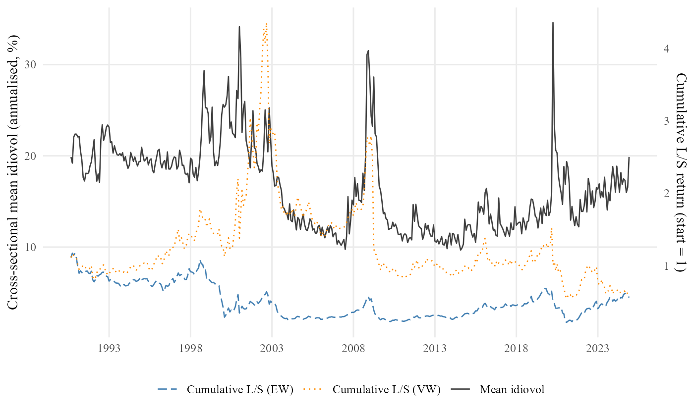

## What this 15-min talk is about

::: {.callout-tip icon=false title="Goals"}
- Make the AI building blocks (Skills and Agents) concrete enough that you can decide whether to use them.
- Walk through **one** end-to-end empirical project produced this way.
- Be honest about where the framework helps and where the human is still indispensable.
:::

::: {.callout-warning icon=false title="Non-goals"}
- Not a tutorial. You will not learn to write skills today.
- Not a sales pitch for any specific framework.
- Not a claim that AI replaces research judgement.
:::

## The premise

Empirical research has a **boring middle**. We spend weeks on the parts that do not differentiate us from each other:

::: {.incremental}

- Reading the same dozen papers.
- Building the same merged Compustat–CRSP panel.
- Writing the same boilerplate Introduction and Data section.
- Compiling LaTeX. Twice. Three times. Fixing one missing bracket.
- Re-running everything because a referee asked for one new column.

:::

. . .

What if all of that collapsed — and only the **interesting** parts of research were left for you?

# Claude Code primitives — skills and agents

## What is Claude Code?

A coding assistant that lives **inside a project folder** — reads files, edits them, runs commands, remembers your conventions. Not a chatbot in a separate window.

|                                  | Chatbot<br>*Claude.ai · ChatGPT* | Autocomplete<br>*GitHub Copilot* | IDE chat<br>*Cursor* | **Claude Code**<br>*(this talk)* |
|----------------------------------|:--------------------------------:|:--------------------------------:|:--------------------:|:--------------------------------:|
| Sees every file in your repo     |                —                 |             partial              |          ✓           |              **✓**               |
| Edits files directly             |                —                 |        inline suggestions        |          ✓           |              **✓**               |
| Runs commands (R, LaTeX, git, …) |                —                 |                —                 |       limited        |              **✓**               |
| Custom **skills** + **agents**   |                —                 |                —                 |       partial        |              **✓**               |
| Where it runs                    |             Browser              |               IDE                |         IDE          |       CLI · IDE · Desktop        |

::: aside
Other tools in the same *agentic* category: **OpenAI Codex CLI**, **Cursor's agent mode**, **Aider**, **Gemini CLI**, **Cline**. The skill-and-agent pattern transfers across most of them — written workflows are not locked to one vendor.
:::

## What is a "Skill"?

Claude Code ships with the *concept* of skills.

::: {.columns}

::: {.column}
A **skill** is a plain-text written workflow, a short document that tells Claude *how to perform a recurring task properly*.
:::

::: {.column}
::: {.callout-tip icon=false title="Analogy"}
A skill is like a **standard operating procedure** you would hand a new research assistant on their first day. It says: "When I ask you to do a literature review, here is what good looks like. These are the journals to check. These are the buckets the papers fall into. Report back in this format."

Claude follows the skill the same way a careful assistant would.
:::
:::

:::


::: {.columns}

::: {.column}

We can share, version control skills.


:::

::: {.column}

::: {.callout-tip icon=false title="Example"}
Skills we use today:

- [`discover`](https://github.com/mgao6767/mingze-gao/blob/master/teaching/talks/writing-a-paper-in-15min/claude-code-walkthrough/.claude/skills/discover/SKILL.md) — literature + data check
- [`strategize`](https://github.com/mgao6767/mingze-gao/blob/master/teaching/talks/writing-a-paper-in-15min/claude-code-walkthrough/.claude/skills/strategize/SKILL.md) — hypotheses + identification
- [`analyze`](https://github.com/mgao6767/mingze-gao/blob/master/teaching/talks/writing-a-paper-in-15min/claude-code-walkthrough/.claude/skills/analyze/SKILL.md) — code + results + review
- [`write`](https://github.com/mgao6767/mingze-gao/blob/master/teaching/talks/writing-a-paper-in-15min/claude-code-walkthrough/.claude/skills/write/SKILL.md) — paper drafting
:::

:::

:::


## What is an "agent"?

Inside a skill, Claude can call on smaller specialists — **agents**.

::: {.columns}

::: {.column}
An **agent** is a plain-text contract that gives one specialist a narrow job, a defined output, and the tools it is allowed to use.
:::

::: {.column}
::: {.callout-tip icon=false title="Analogy"}
An agent is like a **member of a research team** — the literature reviewer, the data engineer, the methodologist. Each reads a narrower brief than "do the whole paper", which is why each does its job better.

Smaller jobs, better work.
:::
:::

:::


::: {.columns}

::: {.column}

A skill can dispatch many agents; agents can also dispatch other agents.

:::

::: {.column}

::: {.callout-tip icon=false title="Example"}
Agents we use today:

- [`librarian`](https://github.com/mgao6767/mingze-gao/blob/master/teaching/talks/writing-a-paper-in-15min/claude-code-walkthrough/.claude/agents/librarian.md) — searches the literature
- [`explorer`](https://github.com/mgao6767/mingze-gao/blob/master/teaching/talks/writing-a-paper-in-15min/claude-code-walkthrough/.claude/agents/explorer.md) — documents each dataset
- [`strategist`](https://github.com/mgao6767/mingze-gao/blob/master/teaching/talks/writing-a-paper-in-15min/claude-code-walkthrough/.claude/agents/strategist.md) — designs hypotheses & identification
- [`coder`](https://github.com/mgao6767/mingze-gao/blob/master/teaching/talks/writing-a-paper-in-15min/claude-code-walkthrough/.claude/agents/coder.md) — writes the R script
- [`writer`](https://github.com/mgao6767/mingze-gao/blob/master/teaching/talks/writing-a-paper-in-15min/claude-code-walkthrough/.claude/agents/writer.md) — drafts the manuscript
:::

:::

:::

::: aside
**Skills** and **agents** are the two Claude Code primitives we will use today. Everything beyond that is design choices you make.
:::

# A framework on top of the primitives

## How I wired it together

Around Claude Code's skills and agents, I added:

- **Paired reviewers** for every creator agent
- **Written rules** the reviewers enforce
- **Quality gates** before each step advances

. . .

::: {.callout-warning icon=false}
This is one design choice, not part of Claude Code. Pick what fits your work.
:::

## The recipe {.smaller}

```{mermaid}
flowchart LR
  Q[A research<br/>question] --> R{Claude Code}
  R --> L[Literature]
  R --> D[Data check]
  R --> S[Strategy]
  R --> C[Code &<br/>results]
  R --> W[Manuscript]
  L --> R
  D --> R
  S --> R
  C --> R
  W --> R

  L -.review.-> CR[Reviewer<br/>agents]
  D -.review.-> CR
  S -.review.-> CR
  C -.review.-> CR
  W -.review.-> CR
  CR -. ≥ 80/100 .-> OK[Pass]

  classDef step fill:#FBF8F4,stroke:#A6192E,stroke-width:2px,color:#373A36;
  classDef start fill:#fff,stroke:#666,stroke-width:1px,color:#373A36;
  class Q,R,OK start;
  class L,D,S,C,W,CR step;
```

::: aside
The human writes the question and the rules. Claude runs the loop. The reviewer agents enforce the rules. The human reviews the final output.
:::

# A simple demo

## Today's experiment

We hand Claude three things:

::: {.callout-note icon=false title="A question"}
*Does the well-known "idiosyncratic-volatility puzzle" (Ang, Hodrick, Xing, Zhang 2006) still hold in the modern US stock market, 1990–2024?*
:::

::: {.callout-note icon=false title="Some data"}
Four standard WRDS extracts — daily stock prices, monthly accounting fundamentals, and the link between them.

About 580 MB. 67 million daily observations.
:::

::: {.callout-note icon=false title="The rules"}
- Working-paper LaTeX format
- No causal language in a descriptive paper
- Every table needs notes
- Every figure caption says what to look at
:::

## Five steps, automated end-to-end

::: {.columns}

::: {.column width="55%"}

**1 · Literature** — a 23-paper annotated bibliography in four buckets *(AHXZ 2006, Fu 2009, Bali–Cakici–Whitelaw 2011, Hou–Loh 2016, …)*.

**2 · Strategy** — three pre-specified hypotheses + nine robustness checks. *E.g. H1 — low-volatility stocks earn higher next-month returns.*

**3 · Code** — a 1,295-line R script that runs end-to-end in **1 min 36 s**.

**4 · Analysis** — 1.6 M stock-months · 15,030 firms · 6 tables · 2 figures.

**5 · Writing** — a 35-page paper · 30 references · numbers tied to the tables.

:::

::: {.column width="45%"}



:::

:::

::: {.callout-note icon=false appearance="minimal"}
**All five steps run hands-off.** Human-in-the-loop steering is possible at every step — review the literature, reject a strategy, ask for an extra robustness — but not required.
:::

## The compiled paper

Thirty-five pages. References, tables, figures, appendix, replication note. Compiles cleanly. [Open the PDF in a new tab.](claude-code-walkthrough/paper/main.pdf)

<iframe src="claude-code-walkthrough/paper/main.pdf" width="100%" height="70%" style="border:1px solid #D6D2C4; border-radius:4px;"></iframe>

## The headline finding

The puzzle, viewed three ways on 1990–2024 data:

::: {.callout-warning icon=false appearance="minimal"}

- **Unconditional:** average low-volatility return minus high-volatility return is $+0.16\%$ per month, $t = 0.41$ — *the puzzle has weakened*.
- **After standard risk adjustment (FF3):** $+0.76\%$ per month, $t = 2.96$ — *the puzzle reappears*.
- **After also controlling for momentum (Carhart):** $+0.12\%$ per month, $t = 0.61$ — *the puzzle is absorbed*.

:::

In the modern sample, what looked like a stand-alone anomaly is largely **the momentum factor in disguise**.

- This is the kind of nuanced empirical conclusion that took the literature twenty years to converge on.
- We arrive at one consistent telling of it in one session.

# Reflection

## The reviewer pattern in action

The paired reviewers are not theatre. Three real catches from this paper:

::: {.incremental}

- **A fabricated citation.** The first literature-review draft cited "Jegadeesh et al., 2023, *JFE*." The reviewer flagged it. There is no such paper. The 2019 version of the same author group exists; the system substituted it.
- **A causal verb in a descriptive paper.** The first manuscript draft wrote "the CAPM alphas are positive and significant, **driven by** size exposure." The writing reviewer caught the verb "driven" and rejected the paragraph until it was rewritten.
- **A wrong rounded number.** The body text said $t = -6.07$. The table said $-6.06$. The reviewer compared them and demanded the body match the table.

:::

. . .

None of these mistakes is fatal. All of them get past a tired human reader. None of them got past the reviewer.

## The role of the human

The plumbing got automated. The judgement did not.

::: {.columns}
::: {.column width="50%"}

::: {.callout-note icon=false title="Delegate to AI"}
- Searching and summarising the literature.
- Building and cleaning the data.
- Writing and running the code.
- Drafting the manuscript.
:::

:::
::: {.column width="50%"}

::: {.callout-tip icon=false title="Keep for yourself"}
- Picking the **question** worth asking.
- Choosing **methods** that will hold up.
- Reading what the **result** actually says.
- Owning the **claim**.
:::

:::
:::
